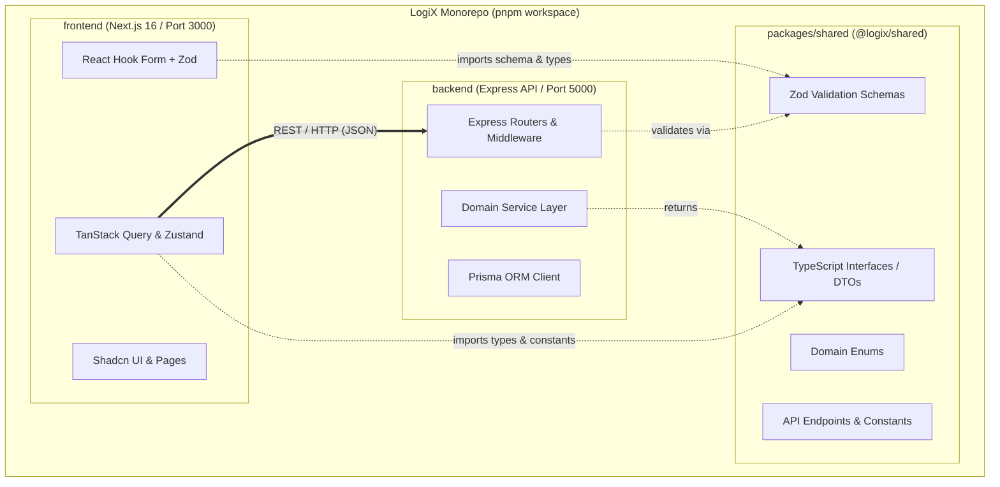

# 🏛️ KẾ HOẠCH TỐI ƯU HÓA KIẾN TRÚC LOGIX (ARCHITECTURAL ROADMAP)

> **Dự án:** Hệ thống Quản trị & Đào tạo Doanh nghiệp LogiX LMS (Phân hệ Ba Hưng F&B)  
> **Người lập:** Software Architect Agent & Ba Hưng  
> **Ngày phê duyệt:** 14/08/2026  
> **Phiên bản:** 1.0.0  

---

## 📌 1. TỔNG QUAN KIẾN TRÚC & ĐỊNH HƯỚNG TIẾN HÓA

Hệ thống LogiX được thiết kế theo mô hình **Decoupled Monorepo** (Repository đơn với các dịch vụ phân tách độc lập), bao gồm:
* **Frontend:** Next.js 16 (React 19, Tailwind CSS v4, TanStack Query v5, Zustand, Shadcn UI).
* **Backend:** Modular Monolith RESTful API (Express, TypeScript, Prisma ORM, Swagger OpenAPI 3.0).
* **Shared Layer:** `@logix/shared` tập trung hóa Schemas, DTOs, Enums và API Contracts dùng chung.

---

## 🗺️ 2. LỘ TRÌNH THỰC THI KIẾN TRÚC (4 GIAI ĐOẠN)

### 🚀 Giai đoạn 1: Tối ưu Monorepo & Type Safety (Ngắn hạn - Triển khai ngay)
* [x] Cấu hình Monorepo Workspace mở rộng (`pnpm-workspace.yaml`) hỗ trợ `packages/*`.
* [x] Xây dựng package `@logix/shared`:
  * **Enums:** `HttpStatus`, `RoleCode`, `CourseStatus`, `EmploymentStatus`, `QuizType`, `LessonType`...
  * **DTOs & Interfaces:** `ApiResponse<T>`, `PaginatedResponse<T>`, `AuthDTO`, `UserDTO`, `CourseDTO`, `QuizDTO`...
  * **Zod Validation Schemas:** Schemas cho Auth, User, Course, Lesson, Quiz dùng chung cho cả Form frontend và Middleware backend.
  * **Constants:** Hằng số cấu hình API Route, phân trang, cookies.
* [x] Cài đặt workspace dependency `@logix/shared: "workspace:*"` cho cả `backend` và `frontend`.
* [x] Cấu hình Orchestration Pipeline với **Turborepo (`turbo.json`)** tối ưu cache build, dev, lint.

---

### 📡 Giai đoạn 2: Tự động hóa API Contracts & Code Generation (Trung hạn)
* [ ] Thiết lập công cụ tự động sinh client: Sử dụng `orval` hoặc `openapi-typescript` để sinh mã nguồn tự động từ Swagger/OpenAPI của Backend.
* [ ] Đồng bộ React Query Hooks: Tự động tạo custom hooks `useGetCourses()`, `useCreateCourse()` từ backend spec.
* [ ] Kiểm thử tính tương thích Contract (Breaking Change Detection) trước mỗi đợt release.

---

### 🧪 Giai đoạn 3: Chiến lược Kiểm thử & Phân rã Module (Trung - Dài hạn)
* [ ] **Backend Testing:** Viết Unit tests & Integration tests cho Service Layer bằng `vitest` và mock Prisma.
* [ ] **Frontend Testing:** Viết Component test cho các luồng cốt lõi (Auth, Quiz, Lesson Player) bằng `React Testing Library`.
* [ ] **Worker / Async Queue:** Khi tải hệ thống tăng (video processing, chấm điểm quiz hàng loạt), tích hợp Redis + BullMQ để xử lý background jobs.

---

### 📦 Giai đoạn 4: Container hóa & CI/CD Production (Dài hạn)
* [ ] Docker hóa Backend (`Dockerfile.backend`) tối ưu kích thước đa tầng (Multi-stage build).
* [ ] Docker hóa Frontend Next.js (`Dockerfile.frontend`) chế độ standalone.
* [ ] Thiết lập GitHub Actions CI/CD tự động chạy typecheck, lint, build test và deploy lên Cloud Run / Vercel.

---

## 🎯 3. NGUYÊN TẮC THIẾT KẾ BẮT BUỘC (ARCHITECTURAL PRINCIPLES)

1. **Single Source of Truth cho Types & Validation:**
   * Mọi định nghĩa dữ liệu (DTO, Zod schema) truyền qua ranh giới Client-Server **bắt buộc** phải nằm trong `@logix/shared`. Không khai báo duplicate ở riêng FE hoặc BE.
2. **Layered Separation & Thin Controllers:**
   * Backend Controller chỉ nhận Request, validate qua Zod schema, gọi Service và trả về `ApiResponse`. Không viết business logic trong controller.
3. **Decoupled State Management:**
   * Dữ liệu từ Server được quản lý 100% bằng **TanStack Query** (caching, invalidation).
   * Zustand chỉ dùng để quản lý Client UI State (Drawer open/close, active theme, filter tạm thời).
