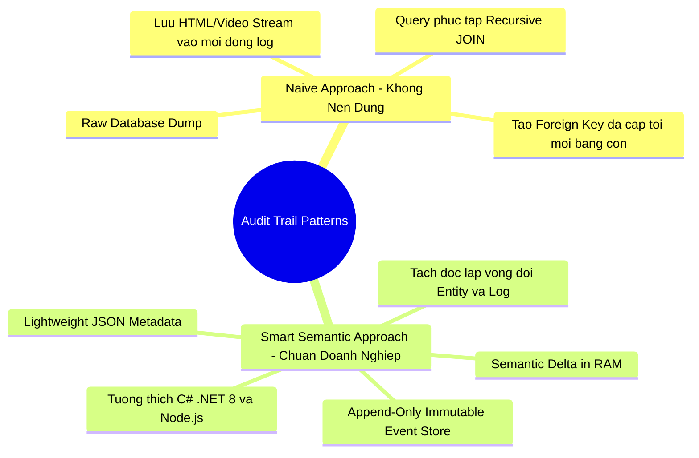
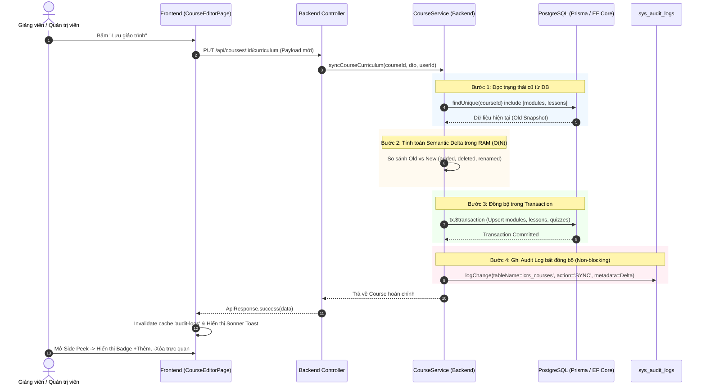

# 📘 Kiến Trúc Hệ Thống Audit Log & Semantic Changelog Tracking (Senior Guide)

> **Mã tài liệu**: `ARCH-AUDIT-001`  
> **Phân loại**: System Architecture / Database & Data Modeling / UI-UX Engineering  
> **Liên kết nội bộ**: [[Database_Design_Document]], [[Backend_Setup_Guide]], [[DDD_Architecture_Design]]  
> **Tương thích**: PostgreSQL 16, Prisma ORM, Next.js 16 (React 19), C# .NET 8 (EF Core)

---

## 1. 🎯 Tổng quan & Bài toán Thực tế

Khi xây dựng các hệ thống Enterprise (ERP, LMS, CRM), yêu cầu **theo dõi lịch sử thay đổi (Audit Trail / Activity Log)** là một nghiệp vụ cốt lõi. Tuy nhiên, cách giải quyết giữa cấp độ cơ bản (Junior) và cấp độ kiến trúc sư (Senior/Principal) có sự khác biệt rất lớn:



---

## 2. 🌍 Benchmark Thế giới: Excel, Figma, Canva, Odoo & Coursera lưu Log như thế nào?

| Nền tảng | Kỹ thuật cốt lõi (Core Pattern) | Ưu điểm kiến trúc |
| :--- | :--- | :--- |
| **Excel Online / Google Sheets** | **Cell-level Operational Transformation (OT)** / Change List: Chỉ lưu tọa độ ô và giá trị thay đổi `(A1: 10 -> 20)`, không lưu lại cả bảng tính triệu dòng. | Tốc độ realtime, kích thước log cực nhỏ (~100 bytes). |
| **Canva / Figma** | **Vector Tree Delta**: Chỉ lưu các node được thêm (`addedNodes`), xóa (`deletedNodes`), hoặc dịch chuyển tọa độ (`transform`), không render lại toàn bộ canvas. | Hoàn tác (Undo/Redo) tức thì, tiết kiệm 99% RAM và Network. |
| **Odoo ERP** *(Chatter / Mail Tracking)* | **In-memory Model Diff**: Khi `write()` 1 bản ghi có One2Many lines (Order line, Course module), Odoo so sánh ID cũ/mới trong RAM và ghi 1 dòng tóm tắt `Thêm: [Tên]`, `Xóa: [Tên]`. | Không tạo FK tới dòng con bị xóa, DB không bao giờ phình to. |
| **Coursera / Canvas LMS** | **2-Tier Tracking (Changelog + Release Snapshot)**: Các thao tác soạn thảo ngày thường chỉ lưu Changelog tóm tắt. Khi xuất bản (Publish) mới tạo 1 bản Snapshot Version. | Giảng viên dễ xem lịch sử soạn bài, hệ thống chạy mượt mà. |

---

## 3. 📐 Kiến trúc Dữ liệu & Quy tắc "Vàng" trong Thiết kế Database

### 3.1 Quy tắc 1: Audit Log phải là Append-Only Immutable Event Store
> **Nguyên tắc**: Bảng log **chỉ được phép INSERT**, tuyệt đối **không UPDATE, không DELETE**.
> **Ràng buộc quan hệ (FK)**: Tuyệt đối **KHÔNG TẠO FOREIGN KEY** từ `AuditLog` trỏ tới các bảng con (`crs_lessons`, `crs_quizzes`).  
> *Lý do*: Khi một bài học bị xóa vĩnh viễn khỏi hệ thống (`DELETE FROM crs_lessons`), nếu có FK thì hoặc DB sẽ báo lỗi `FK Constraint Violation`, hoặc nếu dùng `ON DELETE CASCADE` thì bản ghi lịch sử cũng bị xóa mất $\rightarrow$ Phá vỡ tính toàn vẹn của kiểm toán.

### 3.2 Quy tắc 2: Semantic Delta (Chênh lệch ngữ nghĩa) thay vì Raw DB Snapshot
Thay vì lưu toàn bộ object 100KB, ta so sánh mảng trong RAM và chỉ lưu cấu trúc Delta tinh gọn:

```json
{
  "moduleCount": 2,
  "lessonCount": 5,
  "addedLessons": ["Kỹ thuật đánh bọt sữa Cappuccino", "Vệ sinh máy pha cafe espresso"],
  "deletedLessons": ["Bài học thử nghiệm cũ"],
  "renamedLessons": [
    { "from": "Chương 1", "to": "Chương 1: Kiến thức nền tảng" }
  ]
}
```
*Dung lượng thực tế: ~400 bytes. 10.000 lần lưu giáo trình chỉ tiêu tốn 4MB dung lượng DB.*

---

## 4. 🔄 Luồng xử lý chi tiết (Execution Flow)



---

## 5. 💻 Mã nguồn Mẫu Tương lai cho C# .NET 8 (`erp-corporation-api-v2`)

Khi refactor sang Backend C# .NET 8 EF Core, logic này được viết vô cùng trong sáng bằng LINQ:

```csharp
// CourseService.cs (.NET 8 Clean Architecture)
public async Task<CourseDto> SyncCurriculumAsync(Guid courseId, SyncCurriculumRequest request, Guid currentUserId)
{
    var course = await _context.Courses
        .Include(c => c.Modules)
            .ThenInclude(m => m.Lessons)
        .FirstOrDefaultAsync(c => c.Id == courseId && c.IsActive);

    if (course == null) throw new NotFoundException("Khóa học không tồn tại");

    // 1. Tính toán Semantic Delta bằng LINQ
    var oldLessons = course.Modules.SelectMany(m => m.Lessons).ToList();
    var newLessons = request.Modules.SelectMany(m => m.Lessons).ToList();

    var addedLessonTitles = newLessons
        .Where(nl => nl.Id == null || !oldLessons.Any(ol => ol.Id == nl.Id))
        .Select(nl => nl.Title)
        .ToList();

    var deletedLessonTitles = oldLessons
        .Where(ol => !newLessons.Any(nl => nl.Id == ol.Id))
        .Select(ol => ol.Title)
        .ToList();

    // 2. Cập nhật dữ liệu DB
    // ... Thực hiện mapping & Update EF Core ...
    await _context.SaveChangesAsync();

    // 3. Ghi Audit Log vào sys_audit_logs
    var auditLog = new AuditLog
    {
        Id = Guid.NewGuid(),
        TableName = "crs_courses",
        EntityId = courseId.ToString(),
        Action = "SYNC",
        FieldName = "Cập nhật toàn bộ giáo trình",
        NewValue = $"+ Thêm {addedLessonTitles.Count} bài • - Xóa {deletedLessonTitles.Count} bài",
        UserId = currentUserId,
        Metadata = JsonSerializer.Serialize(new
        {
            addedLessons = addedLessonTitles,
            deletedLessons = deletedLessonTitles,
            moduleCount = request.Modules.Count,
            lessonCount = newLessons.Count
        }),
        CreatedAt = DateTime.UtcNow
    };

    _context.AuditLogs.Add(auditLog);
    await _context.SaveChangesAsync();

    return _mapper.Map<CourseDto>(course);
}
```

---

## 6. 🎨 Trải nghiệm Người dùng (Frontend UI/UX)

Tại component `EntityAuditSidePeek.tsx`:
1. **Header Thông minh**: Hiển thị tổng số sự kiện và ô tìm kiếm tức thì.
2. **Filter Tabs**: `[Tất cả]`, `[Nội dung]`, `[Trạng thái]`, `[Giáo trình]`.
3. **Visual Changelog Badges**:
   - 🟢 `+ Thêm 2 bài học mới`: Hiển thị chip màu ngọc lục bảo kèm icon video.
   - 🔴 `- Đã xóa 1 bài học`: Hiển thị chip màu đỏ gạch có gạch ngang tên bài cũ.
   - 🔵 `~ Đổi tên bài học/chương`: Hiển thị mũi tên `Tên cũ → Tên mới`.
4. **Zero Layout Shift (CLS)**: Skeleton loading khớp 100% kích thước card timeline.

---

*Tài liệu được biên soạn và đồng bộ tự động bởi Doc-Agent.*
