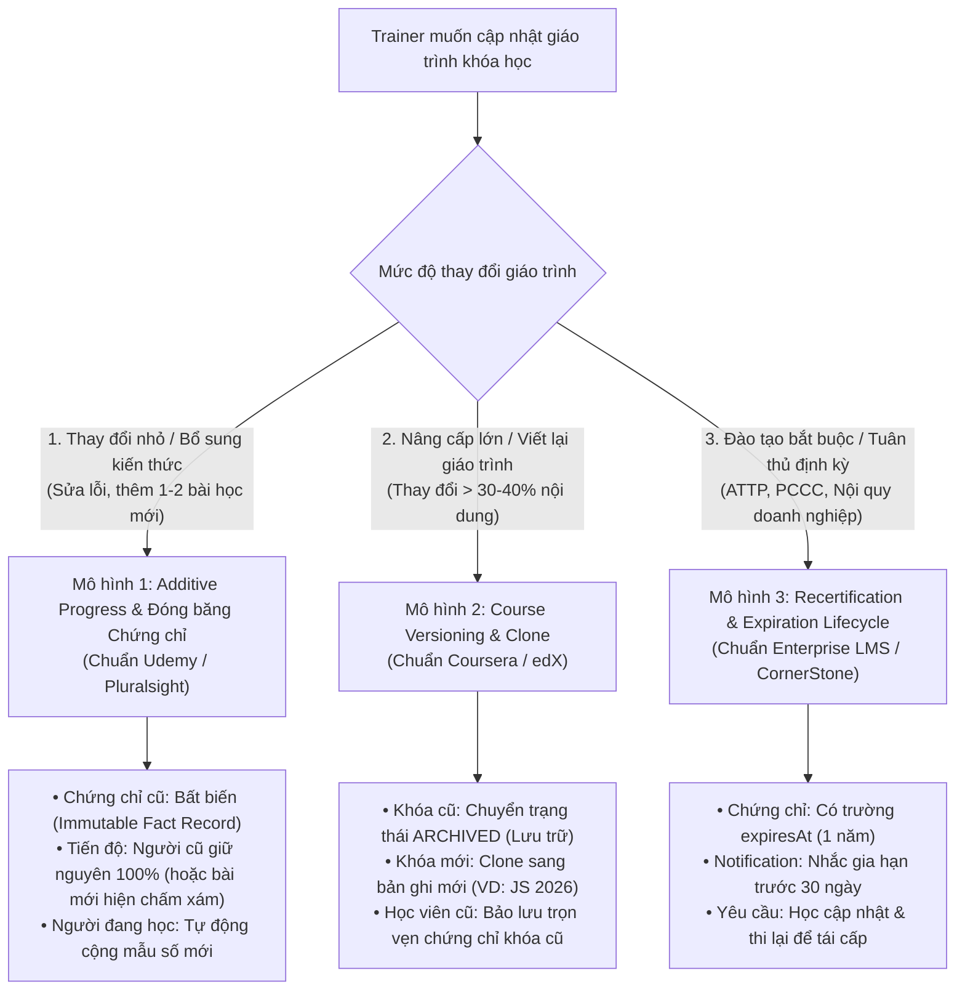

# Kiến Trúc Quản Lý Phiên Bản Khóa Học & Bảo Toàn Giá Trị Chứng Chỉ (LMS Course Versioning & Certificate Integrity)

## 1. Bài Toán Nghiệp Vụ Thực Tế (Core Dilemma)

Trong thực tế triển khai LMS cho doanh nghiệp (F&B / Bán lẻ / Công nghệ), một tình huống tất yếu diễn ra:
1. Giảng viên/Trainer tạo khóa học (ví dụ: *Lập trình JavaScript* hoặc *Quy trình Vận hành Bếp & ATTP*).
2. Hàng trăm học viên đã học xong 100%, vượt qua bài kiểm tra Quiz cuối khóa và **đã nhận Chứng chỉ điện tử (Digital Certificate)**.
3. Trong tương lai, giảng viên cần:
   - **Thêm bài học mới / chương mới** (nâng cấp công nghệ, bổ sung quy chuẩn mới).
   - **Xóa / Ẩn các bài học lỗi thời**.
   - **Thay đổi bài kiểm tra trắc nghiệm**.

> **Câu hỏi kiến trúc:**  
> *Những học viên đã hoàn thành và nhận chứng chỉ trước đó sẽ như thế nào? Liệu chứng chỉ của họ có bị thu hồi hay tụt % tiến độ không? Các nền tảng EdTech lớn (Coursera, Udemy, LinkedIn Learning) và các hệ thống Enterprise LMS (CornerStone OnDemand, Degreed) xử lý việc này ra sao?*

---

## 2. Việc Cập Nhật Khóa Học Có Diễn Ra Thường Xuyên Không?

👉 **CỰC KỲ THƯỜNG XUYÊN — GẦN NHƯ LÀ BẮT BUỘC.**

Không một khóa học nào đạt 100% hoàn hảo ngay từ phiên bản đầu tiên:
* **Kiến thức thay đổi:** Ngôn ngữ lập trình nâng version (ES2024, React 19), luật an toàn thực phẩm hoặc quy trình SOP cập nhật định kỳ.
* **Vòng lặp phản hồi (Feedback Loop):** Sau 100 học viên đầu tiên, trainer nhận thấy bài học số 3 khó hiểu cần chia tách làm 2 bài, bài số 5 video bị rè tiếng cần thay thế, hoặc cần bổ sung tài liệu thực hành.

---

## 3. Ba Mô Hình Kiến Trúc Chuẩn Trong Ngành (Industry Architectural Patterns)

---

### 3.1. Mô Hình 1: Additive Progress & Đóng Băng Chứng Chỉ (Chuẩn Udemy / Pluralsight)
> **Phù hợp nhất:** Các khóa học kỹ năng, lập trình, nghiệp vụ mềm, phát triển bản thân.

* **Đối với người đã nhận Chứng chỉ (`status = COMPLETED`, `isPassed = true`):**
  - **Chứng chỉ là một Sự Kiện Pháp Lý Bất Biến (Immutable Fact Event):** Một khi đã được phát hành với mã định danh (Certificate Code, ngày cấp, điểm số lúc đỗ), chứng chỉ đó **VĨNH VIỄN KHÔNG BỊ THU HỒI hay làm tụt trạng thái đã đỗ**.
  - **Trải nghiệm trên UI:** Trên Dashboard học viên, khóa học vẫn hiển thị trạng thái `Đã hoàn thành`. Khi học viên mở lại cây mục lục bài học, các bài học mới được thêm vào sẽ hiển thị nhãn `Mới (New)` hoặc chấm xám `Chưa học`. Học viên có thể tự do bấm vào học bổ sung kiến thức bất kỳ lúc nào mà không chịu áp lực mất chứng chỉ.
* **Đối với người đang học dở (`status = IN_PROGRESS`, ví dụ: đang học 8/10 bài = 80%):**
  - Khi trainer thêm 2 bài mới (tổng 12 bài) $\rightarrow$ Tiến độ tự động tính lại `8/12 = 66.7%`. Điều này phản ánh chính xác thực tế vì người này thực sự chưa hoàn thành khóa học.

---

### 3.2. Mô Hình 2: Course Versioning & Clone (Chuẩn Coursera / edX / Viện Đào Tạo)
> **Phù hợp nhất:** Các đợt cải tổ lớn (Major Revamp > 30-40% nội dung), thay đổi toàn bộ khung chương trình.

1. **Tuyệt đối không sửa đè lên khóa học cũ:** Vì việc sửa đè sẽ làm sai lệch toàn bộ dữ liệu báo cáo đào tạo, audit logs và chứng chỉ của hàng nghìn nhân sự các năm trước.
2. **Quy trình Versioning qua cơ chế Clone:**
   - Trainer bấm nút **Sao chép khóa học (Clone)** trên bảng Admin $\rightarrow$ Hệ thống tạo một bản ghi mới, ví dụ: `Lập trình JavaScript (Phiên bản 2026)`.
   - Khóa học cũ được chuyển trạng thái sang **`ARCHIVED` (Lưu trữ)**: Khóa cũ đóng ghi danh mới, nhưng học viên cũ vẫn xem lại được giáo trình và chứng chỉ lịch sử của họ.
   - Nhân viên mới hoặc các khóa đào tạo đợt sau sẽ ghi danh vào phiên bản 2026.

---

### 3.3. Mô Hình 3: Recertification & Thời Hạn Chứng Chỉ (Chuẩn Chuỗi F&B / Doanh Nghiệp Bắt Buộc)
> **Phù hợp nhất:** An toàn vệ sinh thực phẩm (ATTP), Phòng cháy chữa cháy (PCCC), Tiêu chuẩn dịch vụ mới.

* Chứng chỉ luôn có trường thời hạn: `expiresAt: DateTime` (thường là 12 tháng kể từ ngày cấp).
* Khi doanh nghiệp cập nhật quy trình SOP mới:
  - Hệ thống tự động kích hoạt tiến trình định kỳ (Cron / Schedule).
  - Trước khi chứng chỉ hết hạn 30 ngày, học viên nhận thông báo: *"Chứng chỉ ATTP của bạn sắp hết hạn vào ngày DD/MM/YYYY. Khóa học đã cập nhật giáo trình mới, vui lòng hoàn thành bài kiểm tra để gia hạn chứng chỉ."*

---

## 4. Bảng Ma Trận Tác Động Khi Sửa Dữ Liệu (Change Impact Matrix)

| Loại thay đổi của Trainer | Người đã xong (Completed) | Người đang học (In Progress) | Giải pháp kỹ thuật chuẩn |
| :--- | :--- | :--- | :--- |
| **1. Minor: Sửa chính tả, thay video lỗi** | Không ảnh hưởng gì | Không ảnh hưởng gì | Sửa trực tiếp record `Lesson` (`bodyHtml`, `videoUrl`). |
| **2. Additive: Thêm bài học mới** | Giữ nguyên chứng chỉ & trạng thái `COMPLETED`. | Tiến độ % tự động điều chỉnh theo mẫu số mới. | Thêm `Lesson` vào `CourseModule`. Không can thiệp vào các bản ghi `CourseEnrollment` đã hoàn thành. |
| **3. Destructive: Xóa bài học cũ** | Không ảnh hưởng chứng chỉ cũ. | Tiến độ % tự động tăng do mẫu số giảm. | **KHÔNG DÙNG Hard Delete.** Luôn dùng **Soft Delete / Ẩn (`isVisible: false`)** để tránh mồ côi `LessonProgress` cũ. |
| **4. Quiz Update: Thay đổi bài kiểm tra** | Không bị bắt thi lại. | Phải làm đề thi mới khi tới bài. | Cập nhật câu hỏi trong `QuizQuestion`. Điểm thi cũ trong `QuizAttempt` vẫn lưu độc lập. |
| **5. Major Revamp: Đổi cấu trúc giáo trình** | Giữ nguyên chứng chỉ bản cũ. | Học viên dở dang được thông báo chuyển khóa. | Dùng tính năng **Clone Course** $\rightarrow$ Archive bản cũ. |

---

## 5. Nền Tảng Thiết Kế Sẵn Có Trong LogiX Monorepo

Kiến trúc hiện tại của dự án LogiX đã tuân thủ chặt chẽ các nguyên tắc trên:

1. **Bảng `UserCertificate` độc lập hoàn toàn:**  
   Chứng chỉ được lưu trữ riêng với `certificateCode`, `issuedAt`, `expiresAt`, `templateId` và snapshot thông tin tại thời điểm cấp. Dù khóa học có thêm/bớt bài học, bản ghi chứng chỉ vẫn được bảo toàn nguyên vẹn.
2. **Cột mốc ghi nhận `CourseEnrollment`:**  
   Bản ghi ghi danh có `status = 'COMPLETED'` và `isPassed = true`. Logic tính toán chỉ kiểm tra cấp chứng chỉ khi trạng thái thay đổi sang hoàn thành; không có logic nào tự động hạ cấp hay thu hồi chứng chỉ khi thêm bài mới.
3. **Sẵn sàng tính năng Clone & Archive trên Admin UI:**  
   Giao diện `CoursesAdminPage` đã có sẵn 2 nút:
   - **Sao chép khóa học (`onRequestClone` / API `POST /courses/:id/clone`)**
   - **Đổi trạng thái sang Lưu trữ (`onRequestStatusChange` $\rightarrow$ `ARCHIVED`)**

---

## 6. Lộ Trình Mở Rộng Tương Lai (Next Milestones)

1. **Gợi ý học bài mới (Course Content Updates Notification):**  
   Khi khóa học có bài học mới (`Lesson.createdAt > CourseEnrollment.completedAt`), hiển thị thông báo nhẹ nhàng cho học viên đã tốt nghiệp: *"Khóa học bạn đã hoàn thành vừa có thêm bài mới. Bấm vào đây để cập nhật kiến thức!"*
2. **Tự động gia hạn chứng chỉ (Automated Recertification Engine):**  
   Kết nối Cronjob hàng tuần quét các `UserCertificate` sắp hết hạn trong 30 ngày để tự động gửi thông báo và tạo đợt ghi danh mới (`ENROLLED`) cho kỳ tái chứng nhận.
