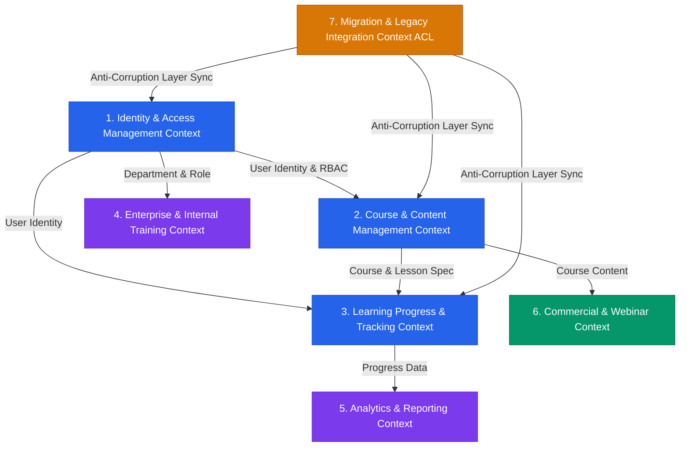

# 🏗️ THIẾT KẾ KIẾN TRÚC DOMAIN-DRIVEN DESIGN (DDD) TỔNG QUAN - LOGIX LMS

> **Mục đích:** Quy hoạch kiến trúc domain enterprise cho toàn bộ 61 chức năng của hệ thống LogiX LMS, chuẩn hóa Bounded Contexts, Aggregates, Entities, Value Objects và Domain Events làm tiền đề thiết kế API và triển khai code theo từng Sprint.  
> **Tài liệu liên quan:** [[List Function]] | [[Checklist_Implementation_Phases]] | [[be_integration_idea]]

---

## 🗺️ 1. BẢN ĐỒ BOUNDED CONTEXT (CONTEXT MAP)



---

## 🏛️ 2. TỔNG QUAN 7 BOUNDED CONTEXTS & CHỨC NĂNG BAO PHỦ

| STT | Bounded Context | Mã Chức Năng Bao Phủ (61 CN) | Trách Nhiệm Nghiệp Vụ Cốt Lõi |
|:---:|---|---|---|
| **1** | **Identity & Access Management (IAM)** | LMS-001, LMS-015, LMS-016, LMS-018, LMS-039, LMS-040, LMS-041, LMS-042 | Quản lý người dùng, đăng nhập JWT/Session, phân quyền RBAC theo vị trí/phòng ban, khóa/mở tài khoản. |
| **2** | **Course & Content Management (CCM)** | LMS-002, LMS-003, LMS-005, LMS-006, LMS-007, LMS-008, LMS-009, LMS-010, LMS-011, LMS-012, LMS-024 | Quản lý danh mục, khóa học, bài học, upload/embed video, mã hóa chống tải xuống & chất lượng video. |
| **3** | **Learning Progress & Tracking (LPT)** | LMS-004, LMS-027, LMS-028, LMS-029, LMS-030, LMS-031, LMS-032, LMS-033, LMS-034 | Theo dõi % hoàn thành, vị trí tạm dừng video, cảnh báo chậm tiến độ, chống tua video. |
| **4** | **Enterprise & Internal Training (EIT)** | LMS-017, LMS-019, LMS-020, LMS-021, LMS-022, LMS-023, LMS-025, LMS-026 | Lộ trình Onboarding nhân viên mới, tích hợp HRM, đánh giá năng lực, cấp chứng chỉ khách hàng & khảo sát. |
| **5** | **Analytics & Reporting (ANA)** | LMS-035, LMS-036, LMS-037, LMS-038 | Thống kê tỷ lệ Pass/Fail, phân bổ điểm số trung bình, phân tích câu hỏi thi khó & tổng hợp feedback. |
| **6** | **Commercial & Webinar (COM)** | LMS-013, LMS-014, LMS-043, LMS-044, LMS-045, LMS-046 | Quản lý giá khóa học, mã giảm giá, cổng thanh toán (VNPay/Momo), báo cáo doanh thu & phòng học Zoom/Meet. |
| **7** | **Migration & Legacy Integration (MIG - ACL)** | LMS-047 -> LMS-061 (15 CN) | Trục kết nối ngầm (Anti-Corruption Layer), làm sạch dữ liệu cũ, bảo toàn tiến độ học tập & Portal báo lỗi cho Admin. |

---

## 🔍 3. CHI TIẾT CẤU TRÚC DOMAIN THÀNH PHẦN (AGGREGATES & ENTITIES)

### 1️⃣ Bounded Context: Identity & Access Management (IAM)
- **Aggregate Root:** `User`
- **Entities:** `Role`, `Permission`, `Department`, `JobTitle`
- **Value Objects:** `UserId`, `Email`, `HashedPassword`, `UserRoleEnum (ADMIN, TRAINER, STUDENT, SYSTEM)`
- **Domain Events:**
  - `UserRegisteredEvent`
  - `UserLoggedInEvent`
  - `UserRoleAssignedEvent`
  - `UserAccountStatusChangedEvent`
- **Chức năng phụ trách:** LMS-001, LMS-015, LMS-016, LMS-018, LMS-039..LMS-042.

---

### 2️⃣ Bounded Context: Course & Content Management (CCM)
- **Aggregate Root:** `Course`
- **Entities:** `Category`, `Module`, `Lesson`, `VideoAsset`
- **Value Objects:** `CourseId`, `LessonId`, `VideoUrl`, `VideoResolutionEnum`, `EncryptionKey`
- **Domain Events:**
  - `CourseCreatedEvent`
  - `CourseUpdatedEvent`
  - `CoursePublishedEvent`
  - `VideoUploadedEvent`
  - `VideoTranscodedEvent`
- **Chức năng phụ trách:** LMS-002, LMS-003, LMS-005..LMS-012, LMS-024.

---

### 3️⃣ Bounded Context: Learning Progress & Tracking (LPT)
- **Aggregate Root:** `EnrollmentProgress`
- **Entities:** `LessonProgress`, `VideoWatchRecord`
- **Value Objects:** `ProgressPercentage`, `LastWatchedPosition (Seconds)`, `IsCompleted (Boolean)`
- **Domain Events:**
  - `LessonStartedEvent`
  - `VideoPlaybackRecordedEvent`
  - `LessonCompletedEvent`
  - `CourseCompletedEvent`
  - `StudentProgressLaggedWarningEvent`
- **Chức năng phụ trách:** LMS-004, LMS-027..LMS-034.

---

### 4️⃣ Bounded Context: Enterprise & Internal Training (EIT)
- **Aggregate Root:** `LearningPath` & `Certificate`
- **Entities:** `EmployeeAssessment`, `OnboardingProgram`, `FeedbackSurvey`
- **Value Objects:** `AssessmentScore`, `CertificateCode`, `SurveyRating`
- **Domain Events:**
  - `LearningPathAssignedEvent`
  - `AssessmentSubmittedEvent`
  - `CertificateIssuedEvent`
  - `FeedbackSubmittedEvent`
- **Chức năng phụ trách:** LMS-017, LMS-019..LMS-023, LMS-025, LMS-026.

---

### 5️⃣ Bounded Context: Analytics & Reporting (ANA)
- **Aggregate Root:** `CourseAnalyticsReport`
- **Entities:** `QuizAnalytics`, `QuestionDifficultyMetric`
- **Value Objects:** `CompletionRate`, `AverageScore`, `FailureRate`
- **Domain Events:**
  - `AnalyticsReportGeneratedEvent`
  - `HardQuestionFlaggedEvent`
- **Chức năng phụ trách:** LMS-035..LMS-038.

---

### 6️⃣ Bounded Context: Commercial & Webinar (COM)
- **Aggregate Root:** `Order` & `WebinarSession`
- **Entities:** `Coupon`, `PaymentTransaction`, `WebinarAttendee`
- **Value Objects:** `Money (Amount, Currency)`, `PaymentStatusEnum (PENDING, PAID, FAILED)`, `MeetingLink`
- **Domain Events:**
  - `OrderCreatedEvent`
  - `PaymentCompletedEvent`
  - `WebinarRoomCreatedEvent`
- **Chức năng phụ trách:** LMS-013, LMS-014, LMS-043..LMS-046.

---

### 7️⃣ Bounded Context: Migration & Legacy Integration (MIG - ACL)
- **Aggregate Root:** `MigrationBatch`
- **Entities:** `LegacyDataRecord`, `MigrationErrorLog`, `SyncPipeline`
- **Value Objects:** `SyncStatusEnum (IDLE, RUNNING, COMPLETED, FAILED)`, `ErrorReason`
- **Domain Events:**
  - `MigrationStartedEvent`
  - `LegacyUserSyncedEvent`
  - `ProgressPreservedEvent`
  - `MigrationErrorLoggedEvent`
- **Chức năng phụ trách:** LMS-047..LMS-061 (Toàn bộ 15 CN Migration).

---

## ⚙️ 4. KIẾN TRÚC NỘI BỘ MỖI BOUNDED CONTEXT (HEXAGONAL / CLEAN ARCHITECTURE)

Mỗi Bounded Context trong hệ thống LogiX Backend được tổ chức theo cấu trúc 4 lớp chuẩn Enterprise:

```
src/modules/<context-name>/
├── domain/                  # 1. Domain Layer (Pure Business Logic - No external dependencies)
│   ├── entities/            # Entities & Aggregates
│   ├── value-objects/       # Immutable Value Objects
│   ├── events/              # Domain Events
│   └── repositories/        # Repository Interfaces
├── application/             # 2. Application Layer (Use Cases & Orchestration)
│   ├── use-cases/           # Command & Query Handlers (CQRS ready)
│   ├── dtos/                # Data Transfer Objects
│   └── services/            # Domain Services
├── infrastructure/          # 3. Infrastructure Layer (Database, External APIs, Queue)
│   ├── persistence/         # Prisma Repositories & Database Schemas
│   ├── adapters/            # Zoom/Meet API, VNPay/Momo, Video Transcoder
│   └── messaging/           # Event Bus / Message Broker
└── presentation/            # 4. Presentation Layer (Controllers / API Endpoints)
    ├── http/                # Express Controllers & Route Definitions
    └── validators/          # Zod Validation Schemas
```

---

## 📌 BƯỚC TIẾP THEO

1. **Review DDD Tổng Quan:** Doanh nghiệp & Team dev duyệt khung Bounded Context & Aggregates ở trên.
2. **Thiết kế API Specification (JSON Schema / OpenAPI):** Quy hoạch danh sách Endpoint API theo từng Bounded Context.
3. **Theo dõi Sprint:** Sử dụng bảng theo dõi tại [[Sprint_Tracking_Board]] để thi công từng Chức năng.
