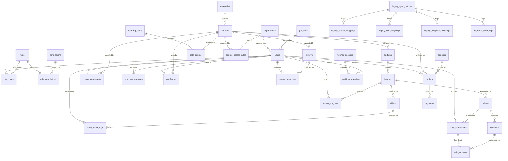

# 🗄️ DATABASE DESIGN DOCUMENT (DDD) — LOGIX LMS ENTERPRISE

> **Phiên bản:** v1.0.0 | **Cập nhật lần cuối:** 2026-08-06  
> **Phạm vi bao phủ:** 61 Chức năng · 17 Module Nghiệp vụ · 7 Nhóm Bảng · **37 Bảng Database**  
> **Database Engine:** PostgreSQL (production) / SQLite (development)  
> **ORM:** Prisma Client v5  
> **Tham chiếu:** [[List Function]] · [[Checklist_Implementation_Phases]] · [[Sprint_Tracking_Board]] · [[Auth_Permission_System_Design]] · [[Backend_Setup_Guide]] · [[TechStack_Learning_Roadmap]] · [[BE_Organization_Permission_Analysis]] · [[FE_Organization_Permission_Analysis]] · [[Supabase_Database_Analysis]] · [[DB_Deployment_Options]]

---

## 📐 MỤC LỤC

1. [Sơ đồ ERD Tổng quan](#erd-overview)
2. [Mapping 17 Module → 37 Bảng](#module-mapping)
3. [Chi tiết Schema từng Nhóm](#schema-detail)
4. [Mô tả Quan hệ giữa các Bảng](#relationships)
5. [Conventions & Naming Rules](#conventions)

---

## 📊 1. SƠ ĐỒ THỰC THỂ MỐI QUAN HỆ — ERD OVERVIEW

---

## 🗺️ 2. MAPPING 17 MODULE NGHIỆP VỤ → 37 BẢNG DATABASE

| # | Module Nghiệp Vụ | Chức Năng | Bảng Database Phụ Trách |
|:---:|---|---|---|
| **M01** | Hệ thống học trực tuyến | LMS-001..004 | `users`, `categories`, `courses`, `course_enrollments` |
| **M02** | Quản lý khóa học | LMS-005..008 | `courses`, `sections`, `lessons`, `categories` |
| **M03** | Quản lý video đào tạo | LMS-009..012 | `videos` (native + YouTube, HLS, DRM) |
| **M04** | Webinar | LMS-013..014 | `webinar_sessions`, `webinar_attendees` |
| **M05** | Học theo phân quyền | LMS-015..018 | `roles`, `permissions`, `role_permissions`, `user_roles`, `departments`, `job_titles`, `course_access_rules` |
| **M06** | Đào tạo nội bộ | LMS-019..022 | `hrm_sync_config`, `learning_paths`, `path_courses`, `quizzes`, `quiz_submissions` |
| **M07** | Đào tạo khách hàng | LMS-023..026 | `users` (role=CUSTOMER), `certificates`, `surveys`, `survey_responses` |
| **M08** | Theo dõi tiến độ học tập | LMS-027..030 | `course_enrollments`, `lesson_progress`, `progress_warnings` |
| **M09** | Theo dõi video đã xem | LMS-031..034 | `lesson_progress`, `video_watch_logs` |
| **M10** | Phân tích hiệu quả nội dung | LMS-035..038 | `quiz_submissions`, `quiz_answers`, `questions`, `surveys`, `survey_responses` |
| **M11** | Quản lý học viên | LMS-039..042 | `users`, `user_roles`, `user_import_batches` |
| **M12** | Bán khóa học | LMS-043..046 | `orders`, `payments`, `coupons`, `revenue_reports` |
| **M13** | Kết nối & Xử lý Dữ liệu Cũ | LMS-047..049 | `legacy_sync_batches` |
| **M14** | Đồng bộ Khóa học & Bài tập | LMS-050..052 | `legacy_course_mappings` |
| **M15** | Đồng bộ Học viên & Tài khoản | LMS-053..055 | `legacy_user_mappings` |
| **M16** | Bảo toàn Tiến độ Học viên | LMS-056..058 | `legacy_progress_mappings` |
| **M17** | Portal Quản lý & Báo lỗi | LMS-059..061 | `legacy_sync_batches`, `migration_error_logs` |

---

## 🗂️ 3. CHI TIẾT SCHEMA TỪNG NHÓM

### 🔴 NHÓM 1: USER & RBAC (7 Bảng)

#### `users`
| Cột             | Kiểu         | Ràng buộc           | Ghi chú           |          |           |
| --------------- | ------------ | ------------------- | ----------------- | -------- | --------- |
| `id`            | UUID         | PK, DEFAULT uuid()  |                   |          |           |
| `email`         | VARCHAR(255) | UNIQUE, NOT NULL    |                   |          |           |
| `password_hash` | VARCHAR(255) | NOT NULL            | Bcrypt / Argon2id |          |           |
| `full_name`     | VARCHAR(100) | NOT NULL            |                   |          |           |
| `avatar_url`    | TEXT         | NULLABLE            |                   |          |           |
| `phone_number`  | VARCHAR(20)  | NULLABLE            |                   |          |           |
| `status`        | ENUM         | NOT NULL            | `ACTIVE`          | `LOCKED` | `PENDING` |
| `department_id` | UUID         | FK → departments.id | NULLABLE          |          |           |
| `job_title_id`  | UUID         | FK → job_titles.id  | NULLABLE          |          |           |
| `created_at`    | TIMESTAMPTZ  | DEFAULT NOW()       |                   |          |           |
| `updated_at`    | TIMESTAMPTZ  | DEFAULT NOW()       |                   |          |           |

#### `roles`
| Cột | Kiểu | Ràng buộc | Ghi chú |
|---|---|---|---|
| `id` | UUID | PK | |
| `code` | VARCHAR(50) | UNIQUE, NOT NULL | ADMIN | TRAINER | STUDENT | CUSTOMER | SYSTEM |
| `name` | VARCHAR(100) | NOT NULL | |
| `description` | TEXT | NULLABLE | |

#### `permissions`
| Cột | Kiểu | Ràng buộc | Ghi chú |
|---|---|---|---|
| `id` | UUID | PK | |
| `code` | VARCHAR(100) | UNIQUE | Ví dụ: `course.create`, `user.lock` |
| `module` | VARCHAR(50) | NOT NULL | Ví dụ: COURSE, USER, ANALYTICS |
| `description` | TEXT | NULLABLE | |

#### `role_permissions` (Bảng trung gian)
- `role_id (UUID FK)`, `permission_id (UUID FK)`, PK: (`role_id`, `permission_id`)

#### `user_roles` (Bảng trung gian)
- `user_id (UUID FK)`, `role_id (UUID FK)`, `assigned_at (TIMESTAMPTZ)`

#### `departments`
- `id (UUID PK)`, `code (VARCHAR UNIQUE)`, `name (VARCHAR)`, `parent_id (UUID NULLABLE FK → self)`

#### `job_titles`
- `id (UUID PK)`, `code (VARCHAR UNIQUE)`, `title (VARCHAR)`, `level (INT)`

---

### 🔵 NHÓM 2: COURSE & CONTENT (5 Bảng)

#### `categories`
- `id (UUID PK)`, `name (VARCHAR UNIQUE)`, `slug (VARCHAR UNIQUE)`, `icon (TEXT NULLABLE)`

#### `courses`
| Cột | Kiểu | Ràng buộc | Ghi chú |
|---|---|---|---|
| `id` | UUID | PK | |
| `category_id` | UUID | FK → categories.id | |
| `title` | VARCHAR(255) | NOT NULL | |
| `slug` | VARCHAR(255) | UNIQUE, NOT NULL | SEO-friendly URL |
| `description` | TEXT | NULLABLE | |
| `thumbnail_url` | TEXT | NULLABLE | |
| `price` | DECIMAL(12,2) | DEFAULT 0.00 | |
| `status` | ENUM | NOT NULL | `DRAFT` | `PUBLISHED` | `HIDDEN` |
| `created_by` | UUID | FK → users.id | |
| `created_at` | TIMESTAMPTZ | DEFAULT NOW() | |

#### `sections`
- `id (UUID PK)`, `course_id (UUID FK)`, `title (VARCHAR)`, `order (INT NOT NULL)`

#### `lessons`
| Cột | Kiểu | Ràng buộc | Ghi chú |
|---|---|---|---|
| `id` | UUID | PK | |
| `section_id` | UUID | FK → sections.id | CASCADE DELETE |
| `title` | VARCHAR(255) | NOT NULL | |
| `type` | ENUM | NOT NULL | `VIDEO` | `DOCUMENT` | `QUIZ` |
| `content_html` | TEXT | NULLABLE | Dùng khi type=DOCUMENT |
| `duration_seconds` | INT | DEFAULT 0 | |
| `order` | INT | NOT NULL | |
| `is_free_preview` | BOOLEAN | DEFAULT FALSE | |

#### `videos`
| Cột | Kiểu | Ràng buộc | Ghi chú |
|---|---|---|---|
| `id` | UUID | PK | |
| `lesson_id` | UUID | FK → lessons.id | 1-1 |
| `provider` | ENUM | NOT NULL | `NATIVE` | `YOUTUBE` | `VIMEO` |
| `source_url` | TEXT | NULLABLE | URL gốc / YouTube embed |
| `hls_1080p_url` | TEXT | NULLABLE | Sau khi transcode (LMS-011) |
| `hls_720p_url` | TEXT | NULLABLE | |
| `hls_480p_url` | TEXT | NULLABLE | |
| `is_drm_protected` | BOOLEAN | DEFAULT TRUE | Chống tải xuống (LMS-012) |
| `drm_token_key` | TEXT | NULLABLE | AES-128 / Widevine key |
| `duration_seconds` | INT | DEFAULT 0 | |

---

### 🟢 NHÓM 3: LEARNING PATH & ACCESS CONTROL (4 Bảng)

#### `learning_paths`
- `id (UUID PK)`, `title (VARCHAR)`, `target_job_title_id (UUID FK NULLABLE)`, `target_department_id (UUID FK NULLABLE)`, `type (ENUM: ONBOARDING | UPSKILL)`

#### `path_courses` (Bảng trung gian)
- `path_id (UUID FK)`, `course_id (UUID FK)`, `order (INT)`, PK: (`path_id`, `course_id`)

#### `course_access_rules`
| Cột | Kiểu | Ghi chú |
|---|---|---|
| `id` | UUID PK | |
| `course_id` | UUID FK → courses.id | |
| `rule_type` | ENUM | `DEPARTMENT` | `JOB_TITLE` | `ROLE` |
| `rule_value_id` | UUID | ID của department / job_title / role được phép truy cập |

#### `hrm_sync_config`
- `id (UUID PK)`, `hrm_provider (VARCHAR)`, `base_url (TEXT)`, `api_token (TEXT ENCRYPTED)`, `last_synced_at (TIMESTAMPTZ)`, `status (ENUM: ACTIVE | DISABLED)`

---

### 🟣 NHÓM 4: ENROLLMENT & PROGRESS (4 Bảng)

#### `course_enrollments`
| Cột | Kiểu | Ghi chú |
|---|---|---|
| `id` | UUID PK | |
| `user_id` | UUID FK → users.id | |
| `course_id` | UUID FK → courses.id | |
| `progress_pct` | FLOAT | 0.0 → 100.0 (%) |
| `enrolled_at` | TIMESTAMPTZ | |
| `completed_at` | TIMESTAMPTZ NULLABLE | |
| UNIQUE | (`user_id`, `course_id`) | |

#### `lesson_progress`
| Cột | Kiểu | Ghi chú |
|---|---|---|
| `id` | UUID PK | |
| `user_id` | UUID FK | |
| `lesson_id` | UUID FK | |
| `is_completed` | BOOLEAN | DEFAULT FALSE |
| `last_position_sec` | INT | Giây cuối đã xem (LMS-028, LMS-034) |
| `completed_at` | TIMESTAMPTZ NULLABLE | |
| UNIQUE | (`user_id`, `lesson_id`) | |

#### `video_watch_logs`
| Cột | Kiểu | Ghi chú |
|---|---|---|
| `id` | UUID PK | |
| `user_id` | UUID FK | |
| `video_id` | UUID FK | |
| `total_watched_sec` | INT | Tổng giây đã xem thực (LMS-033) |
| `max_reached_sec` | INT | Giây cao nhất đã xem liên tục - dùng chống tua (LMS-032) |
| `skip_attempt_count` | INT DEFAULT 0 | Số lần cố tua vượt (LMS-032) |
| `last_watched_at` | TIMESTAMPTZ | |

#### `progress_warnings`
- `id (UUID PK)`, `user_id (UUID FK)`, `course_id (UUID FK)`, `warning_type (ENUM: LAG | DEADLINE)`, `sent_at (TIMESTAMPTZ)`, `is_read (BOOLEAN)`

---

### 🟠 NHÓM 5: EVALUATION, CERTIFICATES & SURVEYS (7 Bảng)

#### `quizzes`
- `id (UUID PK)`, `lesson_id (UUID FK)`, `title (VARCHAR)`, `passing_score (FLOAT DEFAULT 80)`, `time_limit_sec (INT NULLABLE)`

#### `questions`
- `id (UUID PK)`, `quiz_id (UUID FK)`, `text (TEXT)`, `options_json (JSON)`, `correct_answer_index (INT)`, `difficulty_level (INT 1-5)`, `order (INT)`

#### `quiz_submissions`
| Cột | Kiểu | Ghi chú |
|---|---|---|
| `id` | UUID PK | |
| `user_id` | UUID FK | |
| `quiz_id` | UUID FK | |
| `score` | FLOAT | Điểm đạt được |
| `is_passed` | BOOLEAN | |
| `submitted_at` | TIMESTAMPTZ | |
| `attempt_number` | INT DEFAULT 1 | Lần nộp thứ mấy |

#### `quiz_answers`
- `id (UUID PK)`, `submission_id (UUID FK)`, `question_id (UUID FK)`, `selected_index (INT)`, `is_correct (BOOLEAN)`

#### `certificates`
| Cột | Kiểu | Ghi chú |
|---|---|---|
| `id` | UUID PK | |
| `user_id` | UUID FK | |
| `course_id` | UUID FK | |
| `cert_code` | VARCHAR UNIQUE | Mã chứng chỉ xác thực (LMS-025) |
| `issued_at` | TIMESTAMPTZ | |
| `pdf_url` | TEXT NULLABLE | Link file PDF chứng chỉ |

#### `surveys`
- `id (UUID PK)`, `course_id (UUID FK)`, `title (VARCHAR)`, `questions_json (JSON)`, `is_active (BOOLEAN)`

#### `survey_responses`
- `id (UUID PK)`, `survey_id (UUID FK)`, `user_id (UUID FK)`, `rating (INT 1-5)`, `answers_json (JSON)`, `submitted_at (TIMESTAMPTZ)`

---

### 🟤 NHÓM 6: COMMERCIAL & WEBINAR (6 Bảng)

#### `coupons`
| Cột | Kiểu | Ghi chú |
|---|---|---|
| `id` | UUID PK | |
| `code` | VARCHAR(50) UNIQUE | |
| `discount_type` | ENUM | `PERCENT` | `FIXED` |
| `discount_value` | DECIMAL(10,2) | |
| `max_uses` | INT NULLABLE | |
| `used_count` | INT DEFAULT 0 | |
| `expires_at` | TIMESTAMPTZ NULLABLE | |
| `is_active` | BOOLEAN DEFAULT TRUE | |

#### `orders`
| Cột | Kiểu | Ghi chú |
|---|---|---|
| `id` | UUID PK | |
| `user_id` | UUID FK | |
| `course_id` | UUID FK | |
| `coupon_id` | UUID FK NULLABLE | |
| `original_price` | DECIMAL(12,2) | |
| `final_price` | DECIMAL(12,2) | Sau khi áp mã giảm giá |
| `status` | ENUM | `PENDING` | `PAID` | `FAILED` | `REFUNDED` |
| `created_at` | TIMESTAMPTZ | |

#### `payments`
- `id (UUID PK)`, `order_id (UUID FK)`, `provider (ENUM: VNPAY | MOMO | BANK_TRANSFER)`, `transaction_id (VARCHAR UNIQUE)`, `amount (DECIMAL)`, `status (ENUM: SUCCESS | FAILED)`, `paid_at (TIMESTAMPTZ)`

#### `revenue_reports` (View / Materialized)
- Bảng tổng hợp doanh thu theo tháng/quý — được tính từ bảng `payments` (LMS-046).

#### `webinar_sessions`
| Cột | Kiểu | Ghi chú |
|---|---|---|
| `id` | UUID PK | |
| `course_id` | UUID FK NULLABLE | |
| `title` | VARCHAR | |
| `provider` | ENUM | `ZOOM` | `GOOGLE_MEET` |
| `meeting_id` | VARCHAR | ID phòng từ API bên ngoài |
| `join_url` | TEXT | Link tham gia |
| `host_url` | TEXT | Link host (dành cho Trainer) |
| `starts_at` | TIMESTAMPTZ | |
| `ends_at` | TIMESTAMPTZ | |
| `status` | ENUM | `SCHEDULED` | `LIVE` | `ENDED` |

#### `webinar_attendees`
- `id (UUID PK)`, `session_id (UUID FK)`, `user_id (UUID FK)`, `status (ENUM: INVITED | CONFIRMED | ATTENDED | ABSENT)`, UNIQUE (`session_id`, `user_id`)

---

### ⚪ NHÓM 7: MIGRATION & LEGACY DATA PIPELINE (5 Bảng — LMS-047→061)

#### `legacy_sync_batches`
| Cột | Kiểu | Ghi chú |
|---|---|---|
| `id` | UUID PK | |
| `batch_code` | VARCHAR UNIQUE | Ví dụ: MIGRATE_2026_08_BATCH_1 |
| `total_records` | INT DEFAULT 0 | |
| `synced_count` | INT DEFAULT 0 | |
| `error_count` | INT DEFAULT 0 | |
| `progress_pct` | FLOAT DEFAULT 0.0 | Tiến trình % (LMS-059) |
| `status` | ENUM | `IDLE` | `RUNNING` | `COMPLETED` | `FAILED` |
| `started_at` | TIMESTAMPTZ NULLABLE | |
| `completed_at` | TIMESTAMPTZ NULLABLE | |

#### `legacy_course_mappings`
- `id (UUID PK)`, `batch_id (UUID FK)`, `legacy_course_id (VARCHAR)`, `new_course_id (UUID FK)`, `is_verified (BOOLEAN DEFAULT FALSE)`

#### `legacy_user_mappings`
- `id (UUID PK)`, `batch_id (UUID FK)`, `legacy_user_id (VARCHAR)`, `new_user_id (UUID FK)`, `old_login_hash (TEXT)`, `is_login_migrated (BOOLEAN DEFAULT FALSE)`

#### `legacy_progress_mappings`
- `id (UUID PK)`, `batch_id (UUID FK)`, `new_user_id (UUID FK)`, `new_lesson_id (UUID FK)`, `legacy_completion_flag (BOOLEAN)`, `is_applied (BOOLEAN DEFAULT FALSE)`

#### `migration_error_logs`
| Cột | Kiểu | Ghi chú |
|---|---|---|
| `id` | UUID PK | |
| `batch_id` | UUID FK | |
| `entity_type` | ENUM | `USER` | `COURSE` | `PROGRESS` |
| `legacy_raw_data` | JSONB | Toàn bộ bản ghi nguồn bị lỗi |
| `error_message` | TEXT NOT NULL | Nguyên nhân lỗi |
| `is_resolved` | BOOLEAN DEFAULT FALSE | Admin đã xử lý chưa (LMS-061) |
| `resolved_by` | UUID FK NULLABLE | User admin xử lý |
| `resolved_at` | TIMESTAMPTZ NULLABLE | |

---

## 🔗 4. TÓM TẮT QUAN HỆ CHÍNH

| Quan hệ | Kiểu | Ghi chú |
|---|---|---|
| User ↔ Role | N-N | Qua `user_roles` |
| Course ↔ Department/JobTitle | N-N | Qua `course_access_rules` |
| Learning Path ↔ Course | N-N | Qua `path_courses` |
| User ↔ Course | N-N | Qua `course_enrollments` |
| Lesson ↔ Video | 1-1 | `videos.lesson_id` |
| Quiz ↔ QuizSubmission ↔ QuizAnswer | 1-N-N | Cascade |
| LegacySyncBatch ↔ ErrorLog | 1-N | |

---

## 📋 5. CONVENTIONS & NAMING RULES

| Quy tắc | Áp dụng |
|---|---|
| Tất cả bảng viết **snake_case** | `user_roles`, `quiz_submissions` |
| Khóa chính luôn là **UUID v4** | `id UUID DEFAULT uuid_generate_v4()` |
| Timestamps dùng **TIMESTAMPTZ** | Lưu múi giờ UTC chuẩn |
| ENUM dùng **string literals** | `'ACTIVE'`, `'LOCKED'`, không dùng số |
| Soft delete **không áp dụng** | Dùng ENUM status thay vì `deleted_at` |
| Cột JSON dùng **JSONB** (PostgreSQL) | Hỗ trợ index & query |
| Foreign key luôn có **onDelete** | CASCADE hoặc RESTRICT tùy nghiệp vụ |

---

*Tài liệu này là cơ sở để tạo file `backend/prisma/schema.prisma` đầy đủ chuẩn production cho LogiX LMS.*
