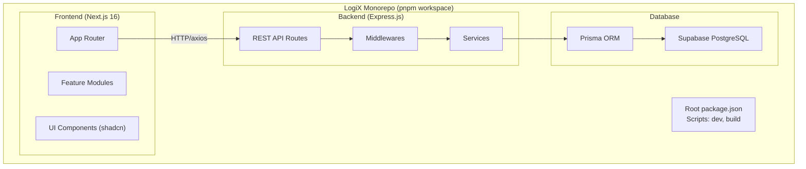
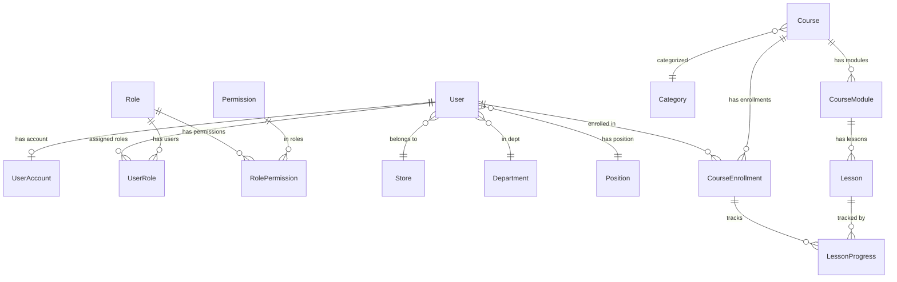
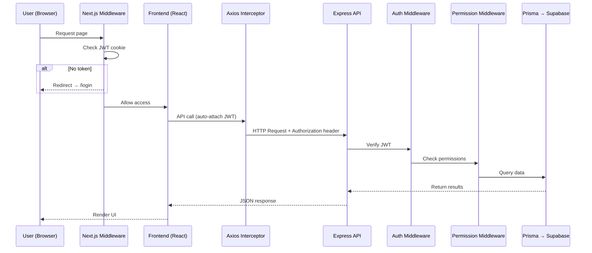
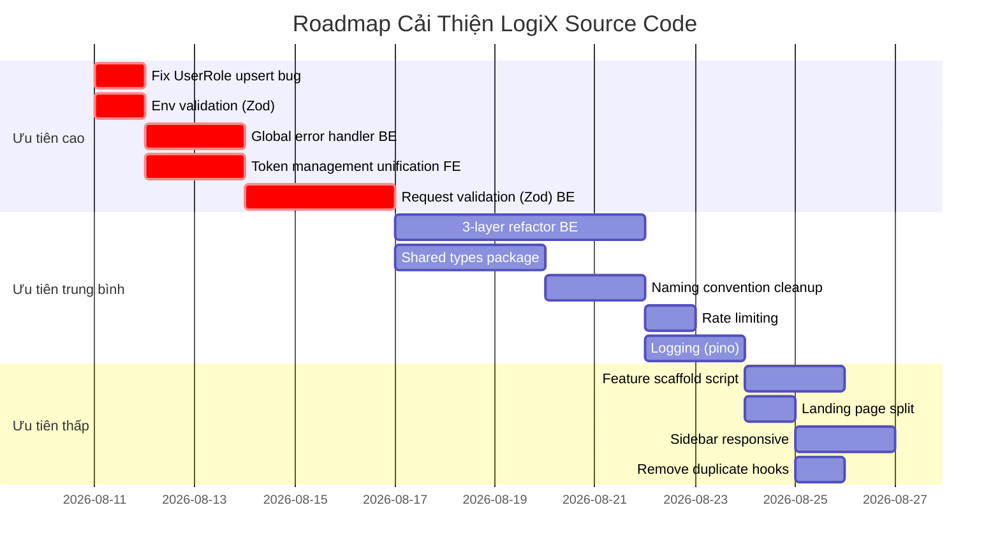
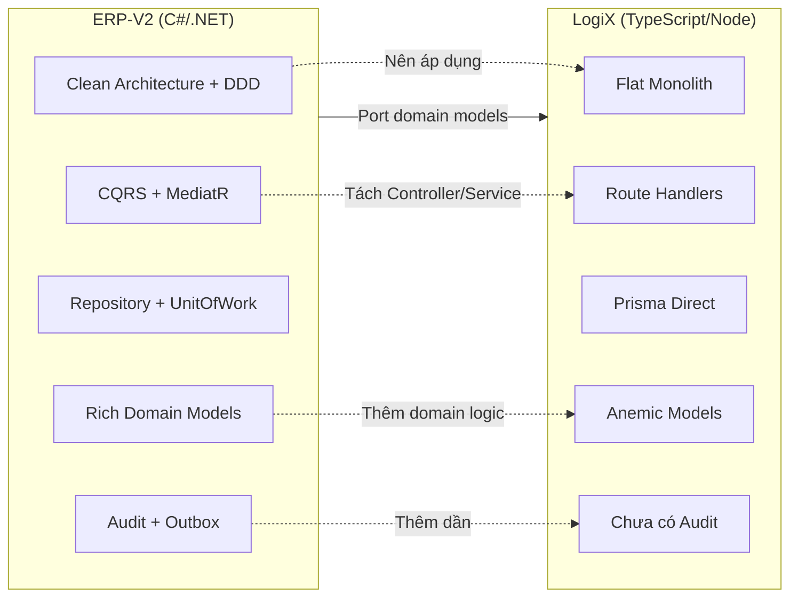

# 🏗️ LogiX — Phân Tích Folder Structure & Gợi Ý Cải Thiện

> **Ngày phân tích**: 2026-08-10  
> **Phiên bản**: 1.0  
> **Tác giả**: AI Assistant

---

## Mục Lục

1. [Tổng Quan Kiến Trúc](#1-tổng-quan-kiến-trúc)
2. [Root Level — Monorepo](#2-root-level--cấu-trúc-monorepo)
3. [Backend — Express.js REST API](#3-backend--expressjs-rest-api)
4. [Frontend — Next.js 16 App Router](#4-frontend--nextjs-16-app-router)
5. [Documentation](#5-documentation)
6. [Data Flow — Luồng dữ liệu End-to-End](#6-data-flow--luồng-dữ-liệu-end-to-end)
7. [Tổng Kết](#7-tổng-kết)
8. [🔧 Gợi Ý Cải Thiện Source Code](#8--gợi-ý-cải-thiện-source-code)

---

## 1. Tổng Quan Kiến Trúc

**LogiX** là một hệ thống **LMS (Learning Management System)** xây dựng theo kiến trúc **Monorepo** sử dụng **pnpm workspaces**, tách biệt rõ ràng giữa Frontend và Backend.

> **QUAN TRỌNG:**  
> Đây **KHÔNG** phải kiến trúc Microservices. LogiX là một **Monolith modular** (monorepo chứa 2 package riêng biệt: `frontend` và `backend`), giao tiếp qua REST API.

### Kiến trúc tổng thể



---

## 2. Root Level — Cấu trúc Monorepo

```
LogiX/
├── 📦 package.json              ← Root workspace scripts
├── 📦 pnpm-workspace.yaml       ← Khai báo 2 packages: frontend, backend
├── 📦 pnpm-lock.yaml            ← Lock file chung
├── 📂 backend/                  ← Express.js API Server
├── 📂 frontend/                 ← Next.js 16 App
├── 📂 doc/                      ← Tài liệu dự án (Obsidian)
└── 📂 .obsidian/                ← Obsidian config
```

### Root Scripts (`package.json`)

| Script | Mô tả |
|--------|--------|
| `dev` | Chạy đồng thời FE (port 3000) + BE bằng `concurrently` |
| `dev:fe` | Chỉ chạy Frontend |
| `dev:be` | Chỉ chạy Backend |
| `build` | Build cả BE rồi FE |

---

## 3. Backend — Express.js REST API

### Tech Stack Backend

| Công nghệ | Phiên bản | Vai trò |
|-----------|-----------|---------|
| **Express.js** | 4.x | Web framework |
| **Prisma** | 5.10 | ORM → Supabase PostgreSQL |
| **bcryptjs** | 2.x | Hash mật khẩu |
| **jsonwebtoken** | 9.x | JWT auth (access + refresh token) |
| **cors** | 2.x | Cross-origin |
| **ts-node-dev** | 2.x | Dev server hot-reload |
| **TypeScript** | 5.x | Type safety |

### Cấu trúc Backend

```
backend/
├── 📦 package.json
├── 📦 tsconfig.json
├── 🔒 .env                         ← DATABASE_URL, DIRECT_URL, JWT secrets
├── 📂 prisma/
│   ├── 📄 schema.prisma            ← Database schema (302 dòng, 13 models)
│   ├── 📂 migrations/              ← Prisma migration files
│   └── 💾 dev.db                   ← SQLite local backup (98KB)
└── 📂 src/
    ├── 📄 index.ts                  ← Entry point, Express app setup
    ├── 📄 seed.ts                   ← Database seeding script
    ├── 📄 test-connection.ts        ← DB connection test utility
    ├── 📂 config/
    │   └── 📄 prisma.ts             ← Prisma client singleton
    ├── 📂 middlewares/
    │   ├── 📄 auth.middleware.ts     ← JWT verification middleware
    │   └── 📄 permission.middleware.ts ← RBAC permission check
    ├── 📂 routes/                   ← 11 route files
    │   ├── 📄 auth.ts               ← Login, register, refresh token
    │   ├── 📄 role.routes.ts        ← CRUD roles + assign permissions
    │   ├── 📄 permission.routes.ts  ← Permission management
    │   ├── 📄 department.routes.ts  ← Department CRUD
    │   ├── 📄 user.routes.ts        ← User management
    │   ├── 📄 job-level.routes.ts   ← Job level/position CRUD
    │   ├── 📄 custom-field.routes.ts← Dynamic custom fields
    │   ├── 📄 courses.ts            ← Course CRUD
    │   ├── 📄 lessons.ts            ← Lesson management
    │   ├── 📄 quizzes.ts            ← Quiz endpoints
    │   └── 📄 progress.ts           ← Enrollment & progress tracking
    └── 📂 services/
        └── 📄 permission.service.ts ← Permission business logic + in-memory cache
```

### API Routes Map (`src/index.ts`)

| Route | Module | Mô tả |
|-------|--------|--------|
| `/api/auth` | Auth | Login, Register, Refresh, Logout, /me |
| `/api/roles` | RBAC | Role CRUD + assign permissions/users |
| `/api/admin/roles` | RBAC | Alias cho roles (duplicate mount) |
| `/api/permissions` | RBAC | Permission definitions |
| `/api/departments` | Org | Department CRUD |
| `/api/users` | Admin | User management |
| `/api/job-levels` | Org | Position/level CRUD |
| `/api/custom-field-definitions` | Admin | Dynamic fields |
| `/api/courses` | LMS | Course CRUD + Enroll |
| `/api/lessons` | LMS | Lesson content |
| `/api/quizzes` | LMS | Quizzes |
| `/api/progress` | LMS | Enrollment & tracking |
| `/api/health` | System | Health check |

### Database Schema (`prisma/schema.prisma`) — 4 Domain Modules, 13 Models



| Module | Models | Table prefix |
|--------|--------|-------------|
| **1. Auth & RBAC** | `User`, `UserAccount`, `Role`, `Permission`, `UserRole`, `RolePermission` | `auth_` |
| **2. Org Structure** | `Store`, `Department`, `Position` | `org_` |
| **3. Course & Curriculum** | `Category`, `Course`, `CourseModule`, `Lesson` | `crs_` |
| **4. Enrollment & Progress** | `CourseEnrollment`, `LessonProgress` | `enr_` |

---

## 4. Frontend — Next.js 16 App Router

### Tech Stack Frontend

| Công nghệ | Phiên bản | Vai trò |
|-----------|-----------|---------|
| **Next.js** | 16.2 | React framework (App Router) |
| **React** | 19.2 | UI library |
| **TypeScript** | 6.x | Type safety |
| **TailwindCSS** | 4.x | Styling |
| **shadcn/ui** | 4.x | UI component library (57 components) |
| **Radix UI** | 1.x | Headless UI primitives |
| **TanStack Query** | 5.x | Server state management |
| **TanStack Table** | 8.x | Data tables |
| **Zustand** | 5.x | Client state management |
| **React Hook Form** | 7.x | Form handling |
| **Zod** | 4.x | Schema validation |
| **Axios** | 1.x | HTTP client |
| **Lucide React** | 1.x | Icons |
| **Recharts** | 3.x | Charts/visualizations |
| **Tiptap** | 3.x | Rich text editor |
| **dnd-kit** | 6.x | Drag and drop |
| **i18next** | 26.x | Internationalization (vi/en) |
| **jose + jwt-decode** | — | JWT handling client-side |
| **next-themes** | 0.4 | Dark/light mode |
| **Sonner** | 2.x | Toast notifications |

### Cấu trúc Frontend

```
frontend/
├── 📦 package.json
├── 📦 components.json              ← shadcn/ui config
├── 📦 next.config.ts
├── 📦 tsconfig.json
├── 📦 eslint.config.mjs
├── 📦 postcss.config.mjs
├── 📄 middleware.ts                 ← Auth route protection (JWT cookie check)
├── 📂 public/                       ← Static assets
└── 📂 src/
    ├── 📂 app/                      ← Next.js App Router (pages + layouts)
    ├── 📂 components/               ← Reusable UI components
    ├── 📂 features/                 ← Feature-based modules (core logic)
    ├── 📂 config/                   ← Route config & API routes
    ├── 📂 lib/                      ← Utilities, providers, axios setup
    ├── 📂 stores/                   ← Zustand global stores
    ├── 📂 hooks/                    ← Shared custom hooks
    └── 📂 types/                    ← Shared TypeScript types
```

### 4.1 `src/app/` — Routing (Next.js App Router)

```
src/app/
├── 📄 layout.tsx                    ← Root layout (providers, fonts, theme)
├── 📄 page.tsx                      ← Landing page (18KB)
├── 📄 index.css                     ← Global styles + CSS variables
├── 📂 (auth)/                       ← Auth route group (no layout nesting)
│   └── 📂 login/                    ← Login page
├── 📂 (protected)/                  ← Protected route group
│   ├── 📄 layout.tsx                ← Sidebar + Header layout
│   ├── 📂 admin/                    ← Admin section
│   │   ├── 📄 page.tsx              ← Admin dashboard
│   │   ├── 📂 custom-fields/       ← Custom fields management
│   │   ├── 📂 departments/         ← Department management
│   │   ├── 📂 employees/           ← Employee management
│   │   ├── 📂 job-levels/          ← Job level management
│   │   ├── 📂 permissions/         ← Permission management
│   │   ├── 📂 role-hierarchy/      ← Role hierarchy view
│   │   └── 📂 roles/               ← Role management
│   └── 📂 lms/                      ← LMS section
│       ├── 📂 courses/              ← Course list/detail
│       ├── 📂 dashboard/            ← LMS dashboard
│       ├── 📂 lessons/              ← Lesson viewer
│       ├── 📂 progress/             ← Progress tracking
│       ├── 📂 quizzes/              ← Quiz system
│       └── 📂 reports/              ← Reports & analytics
├── 📂 onboarding/                   ← Onboarding flow
└── 📂 forbidden/                    ← 403 Forbidden page
```

### 4.2 `src/components/` — UI Components

```
src/components/
├── 📂 ui/                           ← 57 shadcn/ui components
│   ├── button.tsx, input.tsx, dialog.tsx, table.tsx, ...
│   ├── sidebar.tsx (21KB)           ← Complex sidebar component
│   ├── combobox.tsx, command.tsx     ← Search/command palette
│   ├── chart.tsx (10KB)             ← Chart wrappers
│   └── ... (57 total)
├── 📂 shared/                       ← App-wide shared components
│   ├── AppSidebar.tsx (18KB)        ← Main navigation sidebar
│   ├── Header.tsx (14KB)            ← Top navigation header
│   └── Logo.tsx                     ← App logo
├── 📂 common/                       ← Reusable utility components
│   ├── PageFallback.tsx             ← Loading fallback
│   └── custom-form-field.tsx        ← Reusable form field
└── 📂 auth/
    └── PermissionGuard.tsx          ← RBAC permission wrapper
```

### 4.3 `src/features/` — Feature Modules (Core Pattern) ⭐

> **GHI CHÚ:**  
> Đây là pattern chính của dự án: **Feature-based Architecture**. Mỗi feature module tự chứa đầy đủ components, hooks, services, types, schemas.

```
src/features/
├── 📂 admin/                        ← Admin module (đầy đủ nhất) ✅
│   ├── 📂 components/               ← UI components theo từng page
│   │   ├── CustomFieldsPage/
│   │   ├── DepartmentsPage/
│   │   ├── EmployeesPage/
│   │   ├── JobLevelsPage/
│   │   ├── RoleHierarchyPage/
│   │   └── RolesPage/
│   ├── 📂 pages/                    ← Page-level components (7 files)
│   │   ├── CustomFieldsPage.tsx
│   │   ├── DepartmentsPage.tsx
│   │   ├── EmployeesPage.tsx
│   │   ├── JobLevelsPage.tsx
│   │   ├── PermissionsPage.tsx
│   │   ├── RoleHierarchyPage.tsx
│   │   └── RolesPage.tsx
│   ├── 📂 hooks/                    ← TanStack Query hooks (7 files)
│   │   ├── use-custom-fields.ts
│   │   ├── use-departments.ts
│   │   ├── use-employees.ts
│   │   ├── use-job-levels.ts
│   │   ├── use-permissions.ts
│   │   ├── use-roles.ts
│   │   └── use-debounce.ts
│   ├── 📂 services/                 ← API call functions (7 files)
│   │   ├── custom-fields.service.ts
│   │   ├── departments.service.ts
│   │   ├── employees.service.ts
│   │   ├── job-levels.service.ts
│   │   ├── permissions.service.ts
│   │   ├── roles.service.ts
│   │   └── users.service.ts
│   ├── 📂 types/
│   │   └── admin.types.ts           ← All admin type definitions
│   └── 📂 schemas/
│       └── admin.schemas.ts         ← Zod validation schemas
│
├── 📂 auth/                         ← Auth module ✅
│   ├── 📄 auth.utils.ts             ← Token utilities
│   ├── 📂 components/               ← Login form, etc.
│   ├── 📂 hooks/                    ← useAuth, useLogin, etc.
│   ├── 📂 pages/                    ← Auth page components
│   ├── 📂 services/                 ← Auth API calls
│   ├── 📂 types/                    ← Auth type definitions
│   └── 📂 schemas/                  ← Auth validation schemas
│
├── 📂 hr/                           ← HR module (chỉ có components) ⚠️
│   └── 📂 components/
│
├── 📂 lms/                          ← LMS module (đang phát triển) 🔨
│   ├── 📂 components/               ← LMS UI components
│   ├── 📂 mocks/                    ← Mock data for development
│   ├── 📂 pages/                    ← LMS page components
│   └── 📂 types/                    ← LMS type definitions
│
└── 📂 users/                        ← Users module (mới bắt đầu) ⚠️
    └── 📂 pages/
```

### 4.4 `src/lib/` — Shared Utilities

```
src/lib/
├── 📄 axios.ts                      ← Axios instance + interceptors (auto-attach JWT, refresh token)
├── 📄 api.ts                        ← Base API helper functions
├── 📄 providers.tsx                 ← QueryClientProvider, ThemeProvider wrapper
├── 📄 query-client.ts              ← TanStack Query client config
├── 📄 i18n.ts                       ← i18next setup
├── 📄 utils.ts                      ← cn() utility (clsx + tailwind-merge)
└── 📄 dnd-modifiers.ts             ← Drag-and-drop custom modifiers
```

### 4.5 `src/config/` — Configuration

```
src/config/
├── 📄 api-routes.ts                 ← Backend API endpoint constants
├── 📄 route-path.ts                 ← Frontend route path constants
└── 📂 routes/
    ├── 📄 index.ts                  ← Main route config (sidebar items, etc.)
    ├── 📄 admin.routes.ts           ← Admin section route definitions
    └── 📄 user.routes.ts            ← User section route definitions
```

### 4.6 `src/stores/`, `src/hooks/`, `src/types/`

```
src/stores/
└── 📄 auth.store.ts                 ← Zustand auth state (user, token, permissions)

src/hooks/
├── 📄 use-debounce.ts               ← Debounce hook
└── 📄 use-mobile.ts                 ← Responsive breakpoint hook

src/types/
└── 📄 api.ts                        ← Shared API response types
```

---

## 5. Documentation

```
doc/
├── 📂 00-overview/                  ← Project overview, README, onboarding
├── 📂 01-architecture/              ← Architecture docs (DDD, DB design, deployment)
├── 📂 02-modules/                   ← Module-specific docs (Auth, Permission)
├── 📂 03-tech-stack/                ← Technology choices
├── 📂 04-tracking-sprints/          ← Sprint tracking
├── 📂 05-troubleshooting-bugs/      ← Known issues & fixes
├── 📂 06-database/                  ← Database documentation
└── 📂 07-workflow/                  ← Workflow guides (Auth/RBAC, Supabase)
```

---

## 6. Data Flow — Luồng dữ liệu End-to-End



---

## 7. Tổng Kết

| Đặc điểm | Chi tiết |
|-----------|----------|
| **Kiến trúc** | Monorepo (pnpm workspace), **KHÔNG phải microservices** |
| **Backend** | Express.js monolith REST API, Prisma ORM |
| **Frontend** | Next.js 16 App Router, Feature-based architecture |
| **Database** | Supabase PostgreSQL (13 models, 4 domain modules) |
| **Auth** | JWT (access + refresh token), cookie-based, RBAC |
| **State mgmt** | Zustand (client) + TanStack Query (server) |
| **UI** | shadcn/ui (57 components) + TailwindCSS 4 |
| **Validation** | Zod schemas + React Hook Form |
| **Feature pattern** | `features/{module}/` → components, hooks, services, types, schemas |
| **Docs** | Obsidian-based, organized theo numbered folders |

> **GHI CHÚ:**  
> Module **HR** và **Users** trong frontend đang ở giai đoạn sơ khai (chỉ có thư mục components/pages rỗng hoặc rất ít file). Module **Admin** và **Auth** đã phát triển đầy đủ nhất.

---

## 8. 🔧 Gợi Ý Cải Thiện Source Code

### 8.1 Backend — Vấn đề kiến trúc

#### 🔴 Nghiêm trọng (Ưu tiên cao)

##### 8.1.1 Tách business logic ra khỏi Route files

**Hiện tại:** Toàn bộ business logic nằm trực tiếp trong route handlers. File `auth.ts` (262 dòng) và `role.routes.ts` (248 dòng) chứa cả validation, DB query, và response formatting — vi phạm **Single Responsibility Principle**.

**Vấn đề:**
- Không thể reuse business logic (ví dụ: logic login cần dùng ở chỗ khác)
- Không thể unit test business logic tách biệt khỏi HTTP layer
- Route files ngày càng phình to, khó maintain

**Gợi ý:** Áp dụng **3-layer architecture**: `Route → Controller → Service`

```
src/
├── routes/           ← Chỉ khai báo endpoints + gắn middleware
├── controllers/      ← [MỚI] Parse request, gọi service, format response
├── services/         ← [MỞ RỘNG] Toàn bộ business logic + DB queries
├── repositories/     ← [MỚI] (tùy chọn) Prisma queries thuần túy
└── middlewares/
```

**Ví dụ refactor `auth.ts`:**

```typescript
// routes/auth.routes.ts — chỉ khai báo route
router.post('/login', authController.login)
router.post('/refresh', authController.refreshToken)
router.get('/me', authenticateToken, authController.getProfile)
router.post('/logout', authenticateToken, authController.logout)

// controllers/auth.controller.ts — parse request/response
export const login = async (req: Request, res: Response) => {
  const { loginEmail, email, password } = req.body
  const result = await authService.login(loginEmail || email, password)
  res.json(result)
}

// services/auth.service.ts — business logic thuần túy
export const login = async (email: string, password: string) => {
  // Tất cả logic: verify password, check lock, generate token...
}
```

---

##### 8.1.2 Thiếu Error Handling tập trung

**Hiện tại:** Mỗi route handler đều có `try/catch` riêng, trả về `error.message` raw — dễ leak thông tin nhạy cảm.

```typescript
// Pattern lặp lại ở TOÀN BỘ 11 route files
catch (error: any) {
  res.status(500).json({ error: error.message })  // ← Leak Prisma error details!
}
```

**Gợi ý:** Thêm **global error handler middleware** + custom error classes:

```typescript
// middlewares/error.middleware.ts
export const errorHandler = (err: AppError, req, res, next) => {
  const status = err.statusCode || 500
  const message = err.isOperational ? err.message : 'Internal Server Error'
  
  if (!err.isOperational) {
    console.error('Unexpected error:', err)  // Log nhưng không trả về client
  }
  
  res.status(status).json({ error: message, code: err.code })
}

// errors/app-error.ts
export class AppError extends Error {
  constructor(
    public statusCode: number,
    message: string,
    public code?: string,
    public isOperational = true
  ) { super(message) }
}

export class NotFoundError extends AppError {
  constructor(resource: string) {
    super(404, `${resource} không tồn tại`, 'NOT_FOUND')
  }
}

export class UnauthorizedError extends AppError {
  constructor(message = 'Unauthorized') {
    super(401, message, 'UNAUTHORIZED')
  }
}
```

---

##### 8.1.3 Thiếu Request Validation

**Hiện tại:** Validation thủ công, không nhất quán:

```typescript
// auth.ts — validation thủ công
if (!targetEmail || !password) {
  return res.status(400).json({ error: '...' })
}

// courses.ts — validation thủ công
if (!code || !title || !slug || !categoryId) {
  return res.status(400).json({ error: 'Missing required...' })
}
```

**Gợi ý:** Dùng **Zod** (đã có ở frontend) + validation middleware:

```typescript
// schemas/auth.schema.ts
import { z } from 'zod'
export const loginSchema = z.object({
  body: z.object({
    loginEmail: z.string().email().optional(),
    email: z.string().email().optional(),
    password: z.string().min(6),
  }).refine(data => data.loginEmail || data.email, {
    message: 'Email là bắt buộc'
  })
})

// middlewares/validate.middleware.ts
export const validate = (schema: z.ZodSchema) => (req, res, next) => {
  const result = schema.safeParse({ body: req.body, query: req.query, params: req.params })
  if (!result.success) {
    return res.status(400).json({ errors: result.error.flatten() })
  }
  next()
}

// routes/auth.routes.ts
router.post('/login', validate(loginSchema), authController.login)
```

---

##### 8.1.4 Prisma Client Singleton chưa tối ưu cho Development

**Hiện tại** (`config/prisma.ts`):
```typescript
const prisma = new PrismaClient()
export default prisma
```

**Vấn đề:** `ts-node-dev --respawn` mỗi lần reload tạo thêm PrismaClient mới → connection leak.

**Gợi ý:**
```typescript
import { PrismaClient } from '@prisma/client'

const globalForPrisma = globalThis as unknown as { prisma: PrismaClient }

const prisma = globalForPrisma.prisma ?? new PrismaClient({
  log: process.env.NODE_ENV === 'development' ? ['query', 'warn', 'error'] : ['error'],
})

if (process.env.NODE_ENV !== 'production') {
  globalForPrisma.prisma = prisma
}

export default prisma
```

---

#### 🟡 Quan trọng (Ưu tiên trung bình)

##### 8.1.5 Thiếu Rate Limiting

Không có rate limiting cho `/api/auth/login` — dễ bị brute force attack (mặc dù có lock sau 5 lần sai, nhưng attacker có thể lock hàng loạt accounts).

```typescript
// Thêm express-rate-limit
import rateLimit from 'express-rate-limit'
const loginLimiter = rateLimit({ windowMs: 15 * 60 * 1000, max: 10 })
app.use('/api/auth/login', loginLimiter)
```

##### 8.1.6 Thiếu Logging

Không có logging framework. Chỉ dùng `console.log` cho server startup.

**Gợi ý:** Thêm `pino` hoặc `winston`:
```
npm install pino pino-pretty
```

##### 8.1.7 Bug: UserRole upsert sử dụng sai unique key

File `role.routes.ts` dòng 222-236:
```typescript
await prisma.userRole.upsert({
  where: {
    id: `${userId}_${roleId}`,  // ← SAI! id là UUID auto-generated, không phải composite key
  },
  // ...
})
```

`UserRole.id` là `@default(uuid())`, giá trị `${userId}_${roleId}` sẽ **không bao giờ match** → luôn tạo mới thay vì update. Cần thêm `@@unique([userId, roleId])` vào schema hoặc dùng `findFirst` + `create/update`.

##### 8.1.8 Duplicate Route Mount

```typescript
// index.ts
app.use('/api/roles', roleRouter)
app.use('/api/admin/roles', roleRouter)  // ← Duplicate! Cùng 1 router mount 2 paths
```

Nên chọn một path duy nhất hoặc tách riêng admin-specific logic.

---

### 8.2 Frontend — Vấn đề kiến trúc

#### 🔴 Nghiêm trọng (Ưu tiên cao)

##### 8.2.1 Mâu thuẫn Token Storage: localStorage vs Cookie

**Hiện tại có 3 nơi quản lý token:**

| Nơi | File | Cách lưu |
|-----|------|----------|
| `axios.ts` | `lib/axios.ts` | `localStorage.getItem('access_token')` |
| `auth.store.ts` | `stores/auth.store.ts` | `localStorage + cookie (document.cookie)` |
| `middleware.ts` | `frontend/middleware.ts` | `request.cookies.get('access_token')` |

**Vấn đề:**
- Token lưu ở 3 nơi, logic sync phân tán
- Refresh token flow trong `axios.ts` gửi `refresh_token` nhưng backend nhận `refreshToken` (key name mismatch)
- `middleware.ts` (server-side) chỉ check cookie, nhưng `axios.ts` (client-side) đọc từ localStorage

**Gợi ý:** Tạo **một module token duy nhất** (`lib/token.ts`):

```typescript
// lib/token.ts — Single source of truth
export const tokenManager = {
  getAccessToken: () => {
    if (typeof window === 'undefined') return null
    return localStorage.getItem('access_token')
  },
  
  setTokens: (accessToken: string, refreshToken?: string) => {
    localStorage.setItem('access_token', accessToken)
    if (refreshToken) localStorage.setItem('refresh_token', refreshToken)
    // Sync to cookie for middleware
    document.cookie = `access_token=${accessToken}; path=/; max-age=${7 * 24 * 3600}; SameSite=Strict`
  },
  
  clearTokens: () => {
    localStorage.removeItem('access_token')
    localStorage.removeItem('refresh_token')
    document.cookie = 'access_token=; path=/; max-age=0'
  },
}
```

---

##### 8.2.2 Trùng lặp `use-debounce.ts`

Có **2 file `use-debounce.ts`** giống hệt nhau:
- `src/hooks/use-debounce.ts`
- `src/features/admin/hooks/use-debounce.ts`

**Gợi ý:** Xóa bản trong `features/admin/hooks/`, import từ `@/hooks/use-debounce`.

---

#### 🟡 Quan trọng (Ưu tiên trung bình)

##### 8.2.3 Landing page quá lớn (18KB) — Nên tách components

File `src/app/page.tsx` có 18KB — rất có thể chứa toàn bộ landing page UI trong 1 file. Nên tách thành các sections riêng biệt:

```
src/app/
├── page.tsx                    ← Chỉ compose sections
└── _components/                ← Page-specific components (Next.js convention)
    ├── HeroSection.tsx
    ├── FeaturesSection.tsx
    ├── PricingSection.tsx
    └── FooterSection.tsx
```

##### 8.2.4 Sidebar hardcode `ml-[240px]`

File `(protected)/layout.tsx`:
```tsx
<div className="ml-[240px] flex h-full ...">
```

**Vấn đề:** Hardcode sidebar width → không responsive, không hỗ trợ collapse/expand sidebar.

**Gợi ý:** Dùng shadcn's `SidebarProvider` pattern hoặc CSS variable:
```tsx
<div className="ml-[var(--sidebar-width)] transition-[margin] duration-200">
```

##### 8.2.5 Feature modules không đồng nhất

| Feature | components | hooks | services | types | schemas | Trạng thái |
|---------|-----------|-------|----------|-------|---------|-----------|
| `admin` | ✅ 6 dirs | ✅ 7 files | ✅ 7 files | ✅ | ✅ | Đầy đủ |
| `auth` | ✅ | ✅ | ✅ | ✅ | ✅ | Đầy đủ |
| `lms` | ✅ | ❌ | ❌ | ✅ | ❌ | Thiếu hooks/services |
| `hr` | 📂 rỗng | ❌ | ❌ | ❌ | ❌ | Chưa phát triển |
| `users` | ❌ | ❌ | ❌ | ❌ | ❌ | Chỉ có pages |

**Gợi ý:** Tạo template/scaffold script cho feature mới:
```
scripts/create-feature.sh <feature-name>
```
Tự động tạo đủ các sub-folders cần thiết.

---

### 8.3 Cả Backend + Frontend — Vấn đề chung

#### 🔴 Nghiêm trọng

##### 8.3.1 Không share types giữa BE và FE

**Hiện tại:** Backend và Frontend định nghĩa types riêng → dễ bị out-of-sync.

**Gợi ý:** Tạo shared package trong monorepo:

```
LogiX/
├── shared/                      ← [MỚI] Shared types package
│   ├── package.json
│   └── src/
│       ├── api-types.ts         ← Request/Response types
│       ├── enums.ts             ← UserStatus, CourseType, etc.
│       └── dto.ts               ← Data Transfer Objects
├── backend/
└── frontend/
```

Cập nhật `pnpm-workspace.yaml`:
```yaml
packages:
  - 'frontend'
  - 'backend'
  - 'shared'
```

---

##### 8.3.2 Hardcode enum values bằng string

Cả BE và FE đều dùng string literal cho enums:

```typescript
// Backend Prisma schema
status String @default("ACTIVE")  // 'ACTIVE', 'LOCKED', 'PENDING'
userType String @default("EMPLOYEE")  // 'EMPLOYEE', 'CUSTOMER', 'SYSTEM_ADMIN'

// Frontend - scattered across files
if (status === 'ACTIVE') { ... }
```

**Gợi ý:** Tạo enum constants tập trung (trong shared package):

```typescript
// shared/src/enums.ts
export const UserStatus = {
  ACTIVE: 'ACTIVE',
  LOCKED: 'LOCKED', 
  PENDING: 'PENDING',
} as const
export type UserStatus = typeof UserStatus[keyof typeof UserStatus]

export const CourseStatus = {
  DRAFT: 'DRAFT',
  PUBLISHED: 'PUBLISHED',
  ARCHIVED: 'ARCHIVED',
} as const
```

---

#### 🟡 Quan trọng

##### 8.3.3 Thiếu Environment Variable Validation

Cả BE và FE đều fallback silently khi thiếu env vars:

```typescript
// Backend
const JWT_SECRET = process.env.JWT_SECRET || 'super_secret_key'  // ← NGUY HIỂM trong production!

// Frontend
const API_BASE_URL = process.env.NEXT_PUBLIC_API_URL ?? '/api'
```

**Gợi ý:** Validate env vars khi startup:

```typescript
// backend/src/config/env.ts
import { z } from 'zod'

const envSchema = z.object({
  DATABASE_URL: z.string().url(),
  DIRECT_URL: z.string().url(),
  JWT_SECRET: z.string().min(32),
  REFRESH_SECRET: z.string().min(32),
  PORT: z.coerce.number().default(5000),
  NODE_ENV: z.enum(['development', 'production', 'test']).default('development'),
})

export const env = envSchema.parse(process.env)
// → Sẽ throw error ngay lập tức nếu thiếu biến bắt buộc
```

##### 8.3.4 Naming Convention không nhất quán

| Pattern | Files sử dụng |
|---------|---------------|
| `auth.ts` | Route files ban đầu |
| `role.routes.ts` | Route files mới hơn |
| `custom-field.routes.ts` | Dùng kebab-case |
| `courses.ts` | Không có suffix `.routes` |

**Gợi ý:** Thống nhất naming convention:
- Routes: `<entity>.routes.ts` (kebab-case)
- Services: `<entity>.service.ts`
- Controllers: `<entity>.controller.ts`

---

### 8.4 Roadmap cải thiện theo độ ưu tiên



---

### 8.5 Tóm tắt Gợi Ý

| # | Vấn đề | Mức độ | Nơi | Giải pháp |
|---|--------|--------|-----|-----------|
| 1 | Business logic trong routes | 🔴 | BE | Tách Controller + Service layer |
| 2 | Thiếu error handling tập trung | 🔴 | BE | Global error middleware + AppError class |
| 3 | Thiếu request validation | 🔴 | BE | Zod validation middleware |
| 4 | Prisma client connection leak | 🔴 | BE | Global singleton pattern |
| 5 | Token storage phân tán | 🔴 | FE | Tạo token manager module duy nhất |
| 6 | Không share types BE↔FE | 🔴 | Cả hai | Tạo shared package |
| 7 | Hardcode enum strings | 🟡 | Cả hai | Enum constants tập trung |
| 8 | Thiếu env validation | 🟡 | Cả hai | Zod env schema |
| 9 | Thiếu rate limiting | 🟡 | BE | express-rate-limit |
| 10 | Thiếu logging | 🟡 | BE | pino / winston |
| 11 | UserRole upsert bug | 🔴 | BE | Fix unique constraint |
| 12 | Duplicate route mount | 🟡 | BE | Xóa duplicate `/api/admin/roles` |
| 13 | Trùng lặp use-debounce | 🟢 | FE | Xóa bản duplicate |
| 14 | Landing page 18KB | 🟢 | FE | Tách sections components |
| 15 | Sidebar hardcode width | 🟢 | FE | CSS variable / SidebarProvider |
| 16 | Naming convention | 🟢 | BE | Thống nhất `*.routes.ts` |

---

## 9. 🔄 So Sánh với ERP-Corporation-API-V2 (Dự Án Gốc)

> **GHI CHÚ:**  
> LogiX được xây dựng dựa trên domain models của dự án **ERP-Corporation-API-V2** (`DigiFnb/BAHUNG_PROJECTS/GD3/`). Các entity, table naming, và RBAC flow được "port" từ C#/.NET sang TypeScript/Node.js. Phần này so sánh 2 dự án để hiểu rõ nguồn gốc và khoảng cách kiến trúc.

### 9.1 Tổng Quan 2 Dự Án

| Đặc điểm | ERP-V2 (Gốc) | LogiX (Practice) |
|-----------|---------------|-------------------|
| **Ngôn ngữ** | C# / .NET 8 | TypeScript / Node.js |
| **Kiến trúc** | Clean Architecture (DDD) | Monolith (flat route-based) |
| **Backend** | ASP.NET Core Web API | Express.js |
| **ORM** | Entity Framework Core | Prisma |
| **Database** | Supabase PostgreSQL | Supabase PostgreSQL |
| **Frontend** | Vite + React (SPA) | Next.js 16 (App Router) |
| **UI Library** | shadcn/ui | shadcn/ui |
| **Pattern** | CQRS + MediatR | Direct route handlers |
| **Auth** | JWT (access + refresh) | JWT (access + refresh) |
| **RBAC** | Permission-based | Permission-based |

### 9.2 Domain Models — So Sánh Entity-by-Entity

#### Entities được port 1-to-1 từ ERP-V2 sang LogiX:

| ERP-V2 Entity (C#) | LogiX Model (Prisma) | Table ERP-V2 | Table LogiX | Ghi chú |
|---------------------|---------------------|-------------|-------------|---------|
| `User` | `User` | `Users` | `auth_users` | LogiX thêm `userType`, `employmentStatus`, bỏ `ManagerId` |
| `UserAccount` | `UserAccount` | `UserAccounts` | `auth_user_accounts` | Gần như giống 100%, LogiX bỏ `EmailVerified` |
| `UserRole` | `UserRole` | `UserRoles` | `auth_user_roles` | Giống 100% (AssignedAt, ExpiresAt, RevokedAt, IsActive) |
| `Role` | `Role` | `Roles` | `auth_roles` | Giống (RoleName, DisplayName, IsSystemRole, BypassDataScope) |
| `Permission` | `Permission` | `Permissions` | `auth_permissions` | LogiX dùng string cho Module/Action thay vì enum |
| `RolePermission` | `RolePermission` | `RolePermissions` | `auth_role_permissions` | Giống 100% |
| `Department` | `Department` | `Departments` | `org_departments` | LogiX bỏ tree structure (ParentDept), bỏ SoftDelete |
| `JobLevel` | `Position` | `JobLevels` | `org_positions` | LogiX đổi tên, bỏ Salary range, bỏ SoftDelete |

#### Entities chỉ có trong ERP-V2 (chưa port sang LogiX):

| Entity | Module | Mô tả |
|--------|--------|--------|
| `UserDepartment` | Users | User có thể thuộc nhiều department (M:N) |
| `TaskItem`, `TaskAssignee`, `TaskFollower`, `TaskComment`, ... | Tasks | Task management module (12 entities) |
| `Conversation`, `Message`, `MessageReaction`, ... | Chat | Real-time chat system (8 entities) |
| `NotificationEventType`, `NotificationTemplate`, ... | Notifications | Notification system (4 entities) |
| `AuditLog` | Audit | Activity audit trail |
| `OutboxMessage` | Outbox | Transactional outbox pattern |

#### Entities chỉ có trong LogiX (mới thêm — module LMS):

| Entity | Module | Mô tả |
|--------|--------|--------|
| `Store` | Org Structure | Cửa hàng/chi nhánh |
| `Category` | Course | Danh mục khóa học |
| `Course` | Course | Khóa học |
| `CourseModule` | Course | Module trong khóa học |
| `Lesson` | Course | Bài học |
| `CourseEnrollment` | Enrollment | Ghi danh khóa học |
| `LessonProgress` | Enrollment | Tiến độ bài học |

### 9.3 Table Naming Convention — Khác Biệt Quan Trọng

```
ERP-V2 (Entity Framework):         LogiX (Prisma):
────────────────────────           ────────────────────
Users                              auth_users
UserAccounts                       auth_user_accounts
UserRoles                          auth_user_roles
Roles                              auth_roles
Permissions                        auth_permissions
RolePermissions                    auth_role_permissions
Departments                        org_departments
JobLevels                          org_positions
                                   crs_categories     (mới)
                                   crs_courses         (mới)
                                   crs_modules         (mới)
                                   crs_lessons         (mới)
                                   enr_course_enrollments (mới)
                                   enr_lesson_progress    (mới)
```

**Nhận xét:**
- **ERP-V2** dùng **PascalCase không prefix** (`Users`, `Roles`, `Departments`) — convention mặc định của Entity Framework
- **LogiX** thêm **module prefix** (`auth_`, `org_`, `crs_`, `enr_`) — giúp nhóm tables theo domain module, tốt cho hệ thống lớn khi một DB chứa nhiều module
- Convention prefix của LogiX tốt hơn cho việc quản lý khi scale — nên áp dụng ngược lại cho ERP-V2 nếu có refactor

### 9.4 Kiến Trúc Backend — Khoảng Cách Lớn Nhất

ERP-V2 áp dụng **Clean Architecture + CQRS** đầy đủ với 5 layers:

```
ERP-V2 (Clean Architecture):          LogiX (Flat):
────────────────────────────           ──────────────
src/                                   src/
├── API/                               ├── routes/        ← Gộp tất cả
│   ├── Controllers/                   │   ├── auth.ts       (262 dòng!)
│   └── Middlewares/                   │   └── role.routes.ts (248 dòng!)
├── Application/                       ├── middlewares/
│   ├── Features/                      ├── services/      ← Chỉ 1 file
│   │   ├── Auth/                      └── config/
│   │   │   ├── Login/
│   │   │   │   ├── LoginCommand.cs
│   │   │   │   ├── LoginCommandHandler.cs
│   │   │   │   └── LoginCommandValidator.cs
│   │   │   ├── Logout/
│   │   │   ├── RefreshToken/
│   │   │   └── GetProfile/
│   │   └── RBAC/
│   ├── Behaviors/       ← Cross-cutting (validation, logging)
│   └── Interfaces/
├── Contract/
│   ├── Responses/
│   ├── Exceptions/
│   └── Settings/
├── Domain/
│   ├── Entities/
│   ├── Enums/
│   └── Abstractions/
└── Infrastructure/
    ├── Data/
    │   ├── ApplicationDbContext.cs
    │   ├── Configurations/     ← EF Fluent API configs
    │   └── SeedData/
    ├── Persistence/
    │   ├── GenericRepository.cs
    │   └── UnitOfWork.cs
    └── Authorization/
```

#### Điểm mạnh ERP-V2 mà LogiX nên học:

| Kỹ thuật ERP-V2 | LogiX hiện tại | Gợi ý cho LogiX |
|------------------|----------------|-----------------|
| **CQRS (Command/Query separation)** | Gộp hết trong route handler | Tách read/write operations |
| **MediatR pipeline** | Không có | Không cần MediatR, nhưng nên tách Controller → Service |
| **Validation Behaviors** | Validation thủ công | Dùng Zod middleware (đã đề xuất mục 8.1.3) |
| **Domain Entities có behavior** | Prisma models chỉ là data | Thêm domain logic functions |
| **Typed Enums** | String literals | Dùng enum constants (đã đề xuất mục 8.3.2) |
| **Repository + UnitOfWork** | Gọi Prisma trực tiếp | Tùy chọn — Prisma đã đủ tốt |
| **Soft Delete (`ISoftDeletable`)** | Không có | Thêm soft delete cho entities quan trọng |
| **Audit Trail (`AuditLog`)** | Không có | Thêm audit logging |
| **Outbox Pattern** | Không có | Chưa cần ở scale hiện tại |
| **Domain Events** | Không có | Chưa cần ở scale hiện tại |

### 9.5 Frontend — So Sánh Tương Đối

| Đặc điểm | ERP-V2 FE | LogiX FE |
|-----------|-----------|----------|
| **Framework** | Vite + React (SPA) | Next.js 16 (SSR/App Router) |
| **UI** | shadcn/ui | shadcn/ui |
| **State** | Zustand + TanStack Query | Zustand + TanStack Query |
| **Routing** | React Router | Next.js App Router |
| **Styling** | TailwindCSS | TailwindCSS 4 |
| **Validation** | Zod + React Hook Form | Zod + React Hook Form |

> Frontend stack gần như giống nhau — LogiX đã "upgrade" lên Next.js App Router thay vì Vite SPA. Đây là bước tiến tốt cho SEO và performance.

### 9.6 Kết Luận So Sánh



**Tóm lại:** LogiX đã port thành công các **domain models cốt lõi** (User, Role, Permission, Department) từ ERP-V2 và mở rộng thêm **LMS module** riêng. Tuy nhiên, phần **kiến trúc backend** của LogiX còn thiếu sự tổ chức so với ERP-V2. Nếu LogiX định scale lên, nên áp dụng dần các pattern từ ERP-V2: tách layers, typed enums, validation pipeline, và audit trail.
