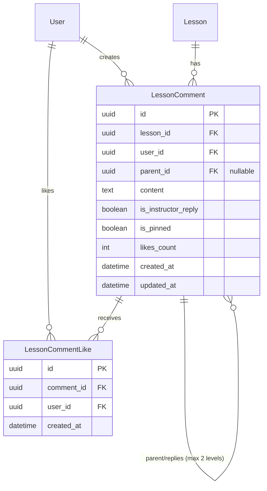
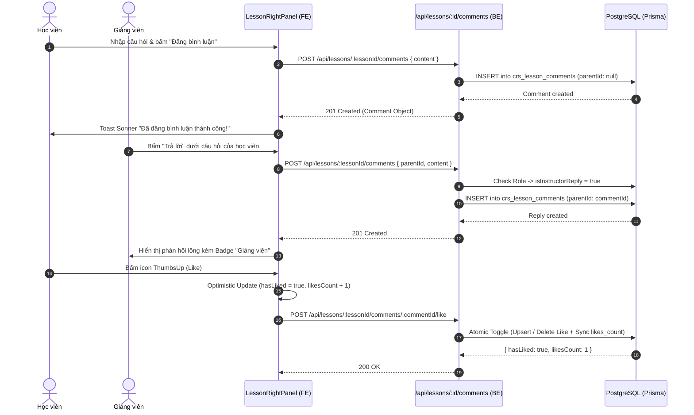

# 💬 Kiến Trúc Module Thảo Luận & Hỏi Đáp Bài Học (Lesson Discussion & Q&A)

> **Module:** LMS Social Learning & Interactive Discussion Thread  
> **Author:** `[Doc-Agent]` (System Architect)  
> **Collaborators:** `[BE-Agent]`, `[FE-Agent]`, `[QA-QC-Agent]`  
> **Status:** ✅ Production Ready  
> **Obsidian Links:** [[LMS_Granular_Update_Backlog]], [[Sprint_Tracking_Board]], [[BaHung-DB-Design]]  

---

## 1. Tổng quan & Bối cảnh Nghiệp vụ

Trong hệ thống LMS chuẩn doanh nghiệp F&B (tương tự mô hình Odoo eLearning & Udemy Enterprise), quá trình học tập lý thuyết hoặc quy chuẩn vận hành (SOP) luôn nảy sinh thắc mắc từ phía học viên tại các chi nhánh. Module **Thảo luận & Hỏi đáp Bài học (Lesson Q&A)** cung cấp không gian tương tác trực tiếp ngay bên trong màn hình phát bài học (`LessonPlayerPage`), giúp:

1. **Học viên:** Đặt câu hỏi thắc mắc ngay khi đang xem video hoặc đọc tài liệu SOP.
2. **Giảng viên / Quản trị viên:** Phản hồi với huy hiệu chuyên môn (`Giảng viên`), ghim các câu hỏi/câu trả lời mẫu mực lên đầu danh sách (`Đã ghim`).
3. **Đồng nghiệp:** Thả tim (Like), trao đổi và học hỏi kinh nghiệm lẫn nhau theo cấu trúc phân cấp 2 tầng (`Top-level Comment` $\rightarrow$ `Replies`).

---

## 2. Thiết kế Cơ sở Dữ liệu & Mô hình ERD

Hệ thống sử dụng PostgreSQL thông qua Prisma ORM với 2 bảng dữ liệu chuyên biệt:

### Chi tiết Trường dữ liệu:

1. **`crs_lesson_comments`**:
   - `id`: UUID khóa chính.
   - `lesson_id`: Khóa ngoại tham chiếu đến bài học (`crs_lessons`). Xóa bài học sẽ tự động xóa toàn bộ thảo luận (`onDelete: Cascade`).
   - `user_id`: Khóa ngoại tham chiếu người bình luận (`auth_users`).
   - `parent_id`: Khóa ngoại tự tham chiếu (`self-relation`), `null` với bình luận cấp 1. Nếu có giá trị, định danh bình luận cấp 1 làm cha. Hệ thống tự động làm phẳng (flatten) về cấp cha gốc nếu người dùng trả lời vào một reply con, đảm bảo cấu trúc giao diện luôn gọn gàng (2 cấp độ) trong thanh trượt 320px.
   - `content`: Nội dung bình luận (tối đa 2.000 ký tự).
   - `is_instructor_reply`: Cờ đánh dấu phản hồi từ Giảng viên/Admin (`roleName` thuộc `ADMIN`, `TRAINER`, `INSTRUCTOR` hoặc `userType = ADMIN`).
   - `is_pinned`: Cờ đánh dấu ghim bình luận quan trọng lên đầu danh sách.
   - `likes_count`: Bộ đếm số lượt thích được đồng bộ qua database transaction.
   - `@@index([lesson_id, parent_id])`: Tối ưu hóa truy vấn cây thảo luận.

2. **`crs_lesson_comment_likes`**:
   - `@@unique([comment_id, user_id])`: Đảm bảo mỗi tài khoản chỉ có thể thích một bình luận tối đa 1 lần.

---

## 3. Luồng Hoạt động & Sequence Diagram

---

## 4. Đặc tả API RESTful Contracts

Tất cả các endpoint đều được nhóm chuẩn RESTful dưới URI gốc `/api/lessons/:lessonId/comments`:

| Phương thức | Đường dẫn | Xác thực | Mô tả chức năng |
| :--- | :--- | :--- | :--- |
| `GET` | `/:lessonId/comments` | Tùy chọn (`optionalAuth`) | Lấy danh sách bình luận kèm cây phản hồi 2 cấp, sắp xếp ghim trước và mới nhất trước. Nếu có Token, trả về cờ `hasLiked`. |
| `POST` | `/:lessonId/comments` | Bắt buộc (`Auth`) | Đăng bình luận mới (`parentId = null`) hoặc trả lời câu hỏi (`parentId = uuid`). Tự phát hiện quyền Giảng viên để cấp badge. |
| `PUT` | `/:lessonId/comments/:commentId` | Bắt buộc (`Auth`) | Cập nhật nội dung bình luận (Chỉ tác giả sở hữu). |
| `DELETE` | `/:lessonId/comments/:commentId` | Bắt buộc (`Auth`) | Xóa bình luận. Tác giả hoặc Giảng viên/Admin có quyền xóa. Xóa kèm toàn bộ phản hồi và likes liên quan. |
| `POST` | `/:lessonId/comments/:commentId/like` | Bắt buộc (`Auth`) | Bật / tắt thích bình luận theo nguyên lý đảo trạng thái nguyên tử (Atomic Toggle). |
| `POST` | `/:lessonId/comments/:commentId/pin` | Bắt buộc (`Admin/Trainer`) | Ghim hoặc bỏ ghim bình luận lên vị trí ưu tiên đầu danh sách. |

---

## 5. Kiến Trúc Frontend & Trải nghiệm Người Dùng (UI/UX)

Tuân thủ nghiêm ngặt quy tắc `.agents/rules/fe-agent.md`:

1. **Phân tách 3 tầng (3-Tier Separation):**
   - `frontend/src/features/lms/comments/types/`: Kiểu dữ liệu chặt chẽ DTO, tuyệt đối không dùng `any`.
   - `frontend/src/features/lms/comments/services/`: Client Axios thuần trả về dữ liệu chuẩn.
   - `frontend/src/features/lms/comments/hooks/`: TanStack Query v5 với Query Key Factory (`commentKeys.lesson(id)`).
   - `frontend/src/features/lms/comments/components/`: Component giao diện cô đọng (`LessonCommentsList`, `LessonCommentItem`).

2. **Cơ chế Phản hồi Tức thì (Optimistic Updates):**
   - Khi bấm Like, TanStack Query lập tức cập nhật bộ nhớ đệm (Cache) trong 0ms giúp giao diện phản hồi mượt mà không có độ trễ mạng. Nếu xảy ra sự cố mạng, cache tự động khôi phục dữ liệu ban đầu kèm thông báo lỗi.

3. **An toàn Thao tác Phá hủy (Safety Guard):**
   - Bắt buộc kích hoạt `<AlertDialog>` xác nhận trước khi thực hiện xóa bình luận, hiển thị cảnh báo không thể hoàn tác.

4. **Trạng thái Giao diện Hoàn chỉnh:**
   - **Skeleton Loading:** 3 khung xương đại diện với cấu trúc avatar, tên và nội dung giả lập để ngăn ngừa hiện tượng giật giật giao diện (Cumulative Layout Shift - CLS).
   - **Empty State:** Minh họa trực quan khi chưa có bình luận nào với thông điệp khuyến khích học viên tương tác.
   - **Error State:** Hộp cảnh báo kèm nút bấm "Thử lại" (`refetch()`).

---

## 6. Kết quả Kiểm thử & Nghiệm thu (QA-QC Matrix)

| STT | Kịch bản kiểm thử | Kết quả mong đợi | Trạng thái |
| :---: | :--- | :--- | :---: |
| 1 | `tsc --noEmit` Backend & Frontend | Biên dịch thành công 100%, 0 cảnh báo, 0 lỗi kiểu | ✅ Đạt |
| 2 | Đăng bình luận cấp 1 | Tạo mới thành công bản ghi trong DB, xuất hiện ngay trên UI | ✅ Đạt |
| 3 | Trả lời lồng cấp 2 | Phản hồi nằm thụt lề dưới bình luận cha, hiển thị đúng người trả lời | ✅ Đạt |
| 4 | Phản hồi của Giảng viên/Admin | Tự động hiển thị huy hiệu `Giảng viên` viền cam nổi bật | ✅ Đạt |
| 5 | Toggle Like bình luận | Tăng/giảm số lượng thích nguyên tử, ngăn chặn like trùng lặp qua Unique constraint | ✅ Đạt |
| 6 | Ghim bình luận quan trọng | Bình luận được ghim tự động nhảy lên đầu trang kèm badge `Đã ghim` | ✅ Đạt |
| 7 | Xóa bình luận cấp cha | Khung xác nhận xuất hiện; xóa sạch cả bình luận con và lượt like liên quan | ✅ Đạt |
