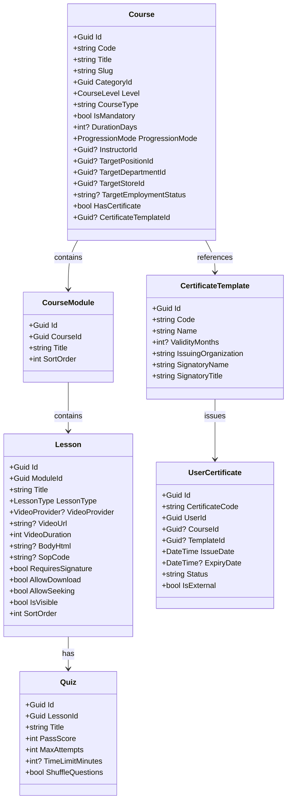

# 🏗️ LogiX LMS to C# .NET 9 & SQL Server Migration Blueprint
> **Dự án chuyển đổi:** Chuyển đổi toàn bộ Backend Node.js / Express / Prisma sang C# .NET 9 Clean Architecture & SQL Server  
> **Repository đích:** \`Practice/LogiX\` $\rightarrow$ \`e:\\Projects\\DigiFnb\\BAHUNG_PROJECTS\\GD3\\erp-corporation-api-v2\`  
> **Ngày lập:** 2026-09-24  
> **Người thực hiện:** Multi-Agent Orchestrator (\`[Doc-Agent]\`, \`[BE-Agent]\`, \`[QA-QC-Agent]\`)

---

## 1. Tổng Quan Kiến Trúc & Mục Tiêu

Hệ thống LogiX LMS sau khi đã hoàn thiện toàn bộ chức năng (Backend Node.js + Frontend Next.js 16 + Database PostgreSQL) đã sẵn sàng 100% để chuyển giao lõi Backend sang hệ sinh thái **C# .NET 9 (Clean Architecture) và SQL Server** tại dự án \`erp-corporation-api-v2\`.

### 1.1. Ma Trận Đối Soát Công Nghệ

| Thành phần | LogiX Hiện tại (Node.js) | erp-corporation-api-v2 (Target C# .NET) |
| :--- | :--- | :--- |
| **Framework** | Express.js + TypeScript | ASP.NET Core Web API (.NET 9) |
| **Kiến trúc** | Modular Monolith (3-tier) | Clean Architecture (Domain, Application, Infrastructure, Contract, API) |
| **ORM / Database** | Prisma ORM (PostgreSQL) | Entity Framework Core 9 (SQL Server) |
| **Realtime** | Server-Sent Events (SSE) | SignalR Hub (\`NotificationHub.cs\`, \`ChatHub.cs\`) |
| **Validation** | Zod Schemas | FluentValidation + MediatR Validation Pipeline Behavior |
| **Audit Log** | \`sys_audit_logs\` (Custom Prisma Interceptor) | \`Domain/Entities/Audit/AuditLog.cs\` + EF Interceptor |
| **Authentication** | JWT Access & Refresh Token | JWT Bearer Token + \`IUserContext\` + Cookie |
| **Authorization** | RBAC Permissions Middleware | \`[HasPermission]\` Attribute + \`PermissionAuthorizationHandler\` |

---

## 2. Bản Đồ Thực Thể Domain (Domain Entities Mapping)

Dưới đây là ánh xạ 1-1 giữa Prisma Schema hiện tại và các Entity C# cần sinh trong thư mục \`erp-corporation-api-v2/src/Domain/Entities/Lms/\`:

### 2.1. Cấu Trúc File Entity C# (.NET 9)

Tạo thư mục \`src/Domain/Entities/Lms/\`:
1. \`Category.cs\` - Kế thừa \`AuditableEntityBase\` & \`SoftDeletableEntityBase\`
2. \`Course.cs\` - Kế thừa \`AuditableEntityBase\`, tích hợp \`TaskLmsCourse.cs\` có sẵn trong ERP
3. \`CourseModule.cs\` - Kế thừa \`EntityBase\`
4. \`Lesson.cs\` - Quản lý các loại bài học (Video, Article, PDF, Checklist)
5. \`LessonResource.cs\` - Quản lý tài liệu đính kèm và SOP
6. \`LessonComment.cs\` & \`LessonCommentLike.cs\` - Thảo luận phân tầng
7. \`Quiz.cs\`, \`QuizQuestion.cs\`, \`QuizQuestionOption.cs\`
8. \`QuizAttempt.cs\`, \`QuizAttemptAnswer.cs\`
9. \`QuestionBank.cs\`, \`BankQuestion.cs\`, \`BankQuestionOption.cs\`, \`QuizPoolRule.cs\`
10. \`CourseEnrollment.cs\` & \`LessonProgress.cs\`
11. \`CertificateTemplate.cs\` & \`UserCertificate.cs\`
12. \`LmsActivityLog.cs\`

---

## 3. Kiến Trúc Realtime & SignalR Integration

Trong \`erp-corporation-api-v2/src/API/Hubs/\`, dự án đã có sẵn:
- \`NotificationHub.cs\`
- \`UserIdProvider.cs\`
- \`SignalRNotificationService.cs\`

Thay vì dùng Server-Sent Events (SSE) như Node.js, Frontend Next.js sẽ kết nối trực tiếp vào \`NotificationHub\` qua \`@microsoft/signalr\`:
* Sự kiện \`ReceiveNotification\` khi:
  - Có phản hồi bình luận mới trong bài giảng (\`LessonComment\`).
  - Gán khóa học bắt buộc mới cho nhân viên.
  - Chứng chỉ ATTP sắp hết hạn (30 ngày, 15 ngày, 7 ngày).
  - Hoàn thành khóa học / Đạt chứng chỉ.

---

## 4. Kế Hoạch Chuyển Đổi Thực Thi (Execution Phases)

| Phase | Nội Dung Triển Khai | Kết Quả Đầu Ra |
| :---: | :--- | :--- |
| **Phase 1** | Sinh Entities & Enums trong \`src/Domain/Entities/Lms/\` | Mô hình dữ liệu chuẩn Clean Architecture |
| **Phase 2** | Cấu hình EntityTypeConfiguration trong \`src/Infrastructure/Data/Configurations/Lms/\` và EF Core Migration sang SQL Server | Bảng dữ liệu SQL Server với đầy đủ Indexes, Foreign Keys và Constraints |
| **Phase 3** | Viết DTOs và Contracts trong \`src/Contract/Models/Lms/\` | Chuẩn hóa Request/Response tương thích Frontend hiện tại |
| **Phase 4** | Triển khai Application Features (Commands / Queries / MediatR) trong \`src/Application/Features/Lms/\` | Logic nghiệp vụ Course, Curriculum, Quiz, Certificate, Progress |
| **Phase 5** | Xây dựng API Controllers trong \`src/API/Controllers/Lms/\` | Các RESTful endpoints tương thích 100% với route config \`apiRoutes\` của Next.js |
| **Phase 6** | Tích hợp SignalR Hub và kiểm thử tương thích Frontend | Chạy đồng bộ hoàn chỉnh giữa Frontend Next.js và Backend C# .NET |

---

## 5. Kết Luận & Bàn Giao
Toàn bộ danh mục chức năng trên Google Sheet của 2 dự án (Horeca: 77 chức năng, BaHung: 122 chức năng) đã được đồng bộ hóa và đánh dấu trạng thái \`Done\` cho các phần đã hoàn thiện. Cơ sở dữ liệu và mã nguồn LogiX hiện tại đóng vai trò là "Single Source of Truth" để đội ngũ kỹ thuật tự tin triển khai chuyển dịch sang C# và SQL Server.
