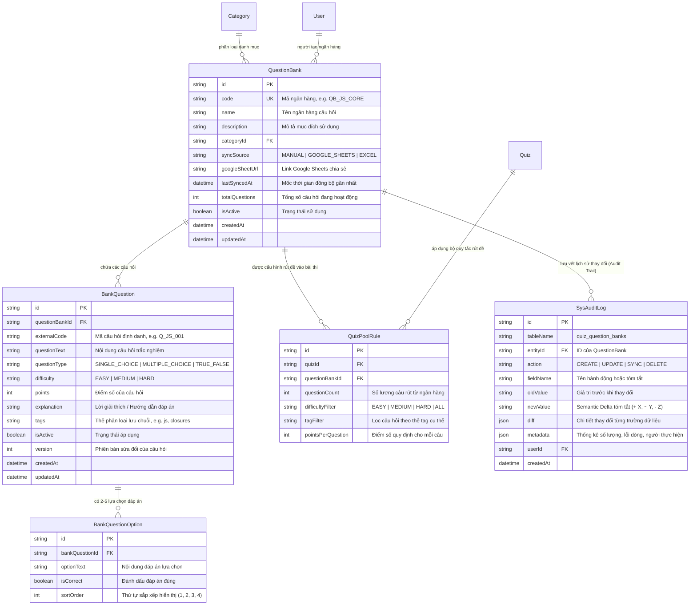
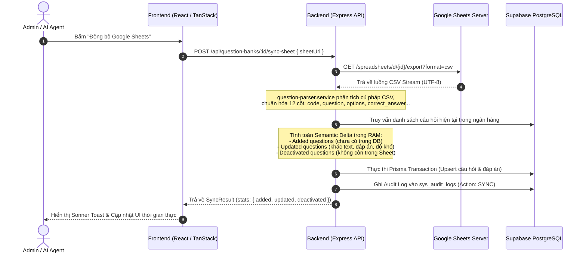

# Kiến Trúc Ngân Hàng Câu Hỏi & Cơ Chế Đồng Bộ Google Sheets (Audit Tracking)

> **Mô-đun**: LMS Quiz Engine - Question Bank & Semantic Audit  
> **Trạng thái**: Đã triển khai hoàn chỉnh (Production-ready)  
> **Tương thích**: Obsidian, Next.js 16, Express.js, Prisma ORM, PostgreSQL (Supabase)  
> **Tài liệu liên quan**: [[Audit_Log_And_Semantic_Changelog_Architecture]], [[Course_Versioning_And_Certificate_Integrity_Architecture]]

---

## 1. Tổng Quan Bài Toán & Mục Tiêu Nghiệp Vụ

Trong các hệ thống LMS doanh nghiệp quy mô lớn (Coursera, Udemy Business, Canvas LMS, Schoology), việc soạn thảo câu hỏi trắc nghiệm trực tiếp từng câu trên web form thường gặp các hạn chế lớn:
1. **Rào cản tốc độ**: Giảng viên / Chuyên viên đào tạo (L&D) thường có sẵn ngân hàng hàng trăm câu hỏi trong Google Sheets hoặc Excel do AI Agent tự động sinh ra hoặc phòng ban tổng hợp.
2. **Nhu cầu ngẫu nhiên hóa đề thi**: Đề thi tốt nghiệp hoặc kiểm tra định kỳ không nên cố định câu hỏi để chống gian lận, mà cần rút ngẫu nhiên từ kho theo phân bổ độ khó (VD: 10 câu Dễ, 15 câu Trung bình, 5 câu Khó).
3. **Quản trị phiên bản & Audit Trail minh bạch**: Mọi lần cập nhật từ Google Sheet hoặc Excel phải được hệ thống tính toán **Semantic Delta** (`+ Thêm mới`, `~ Cập nhật`, `- Vô hiệu hóa`) và lưu vết chi tiết vào bảng `sys_audit_logs`, cho phép kiểm tra lịch sử thay đổi từng phiên qua giao diện Side Peek.

---

## 2. Sơ Đồ Thực Thể Quan Hệ (ERD - Database Models)



---

## 3. Kiến Trúc Đồng Bộ 1-Click Google Sheets

### 3.1 Cơ Chế Fetch Dữ Liệu Không Cần OAuth Phức Tạp
Khi người dùng nhập link Google Sheets được chia sẻ ở chế độ **"Bất kỳ ai có đường liên kết đều có thể xem"**:
$$\text{https://docs.google.com/spreadsheets/d/}\{sheetId\}/\text{edit...}$$
Hệ thống `question-parser.service.ts` trích xuất `{sheetId}` và chuyển hướng sang luồng xuất file CSV trực tiếp:
$$\text{https://docs.google.com/spreadsheets/d/}\{sheetId\}/\text{export?format=csv}$$
Điều này loại bỏ hoàn toàn việc phải cấu hình Google Cloud Console, OAuth 2.0 Client ID hay Service Account JSON phức tạp cho người dùng cuối.



---

## 4. Thuật Toán Semantic Delta & Ghi Vết Audit Log

Để giải quyết triệt để yêu cầu của người dùng về việc **theo dõi lịch sử thay đổi (Semantic Changelog)** giống như kiến trúc `AuditInterceptor` của dự án `erp-corporation-api-v2`, hệ thống không lưu log thô sơ ("Đã đồng bộ") mà tính toán sự sai khác chi tiết:

1. **Khóa so khớp (Identity Matching Key)**:
   $$K = \text{trim}(\text{externalCode} \lor \text{questionText}).\text{toLowerCase()}$$
2. **Phân loại hành vi**:
   - **Thêm mới (Added)**: $K \in \text{Incoming} \land K \notin \text{Existing}$. Tạo mới `BankQuestion` và các `BankQuestionOption`.
   - **Cập nhật (Updated)**: $K \in \text{Incoming} \land K \in \text{Existing}$. So sánh `questionText`, `difficulty`, `points`, `options`, `isCorrect`. Nếu có thay đổi, tăng `version = version + 1`, ghi nhận danh sách trường thay đổi (`changesList`).
   - **Vô hiệu hóa (Deactivated)**: $K \notin \text{Incoming} \land K \in \text{Existing} \land \text{isActive} = \text{true}$. Đổi `isActive = false` để đảm bảo bài thi cũ không bị gãy dữ liệu (Immutability).
3. **Cấu trúc bản ghi `sys_audit_logs`**:
   - `action`: `SYNC`
   - `newValue`: `"Đồng bộ Google Sheet: + Thêm 15 câu • ~ Cập nhật 3 câu • - Vô hiệu hóa 2 câu"`
   - `metadata`:
     ```json
     {
       "sourceType": "GOOGLE_SHEETS",
       "sourceIdentifier": "https://docs.google.com/spreadsheets/d/...",
       "totalIncoming": 45,
       "addedCount": 15,
       "updatedCount": 3,
       "deactivatedCount": 2,
       "addedQuestions": ["Q_JS_010: Tìm hiểu về Promise.all", "..."],
       "updatedQuestions": [
         { "code": "Q_JS_003", "title": "Phân biệt let và var", "changes": "Sửa đáp án, Độ khó -> HARD" }
       ],
       "deactivatedQuestions": ["Q_JS_001: Khái niệm biến toàn cục cũ"]
     }
     ```

---

## 5. Tích Hợp Side Peek Audit Trail

Khi người dùng bấm vào nút **"Lịch sử thay đổi (Audit Log)"** ở danh sách hoặc trang chi tiết:
- Giao diện kích hoạt component `EntityAuditSidePeek.tsx`.
- Gửi yêu cầu `GET /api/audit-logs/entity/quiz_question_banks/:bankId`.
- Giao diện Side Peek hiển thị timeline chuẩn Notion:
  - Avatar, tên và email người thực hiện.
  - Badge thao tác: `Tạo mới`, `Chỉnh sửa`, `Đồng bộ Google Sheets`, `Import CSV/Excel`, `Xóa`.
  - Semantic summary badge với màu sắc trực quan (`+ Thêm mới`, `~ Cập nhật`, `- Vô hiệu hóa`).
  - Cho phép lọc theo hành động hoặc tìm kiếm theo nội dung câu hỏi.

---

## 6. Danh Mục API REST Endpoints

| Phương thức | Đường dẫn API | Mô tả |
| :--- | :--- | :--- |
| `GET` | `/api/question-banks` | Lấy danh sách ngân hàng kèm bộ lọc, thống kê và phân trang |
| `POST` | `/api/question-banks` | Tạo ngân hàng câu hỏi mới |
| `GET` | `/api/question-banks/:id` | Lấy chi tiết ngân hàng câu hỏi |
| `PUT` | `/api/question-banks/:id` | Cập nhật thông tin ngân hàng câu hỏi |
| `DELETE` | `/api/question-banks/:id` | Xóa (vô hiệu hóa) ngân hàng câu hỏi |
| `POST` | `/api/question-banks/:id/sync-sheet` | Đồng bộ 1-Click từ Google Sheets |
| `POST` | `/api/question-banks/:id/import-csv` | Nhập câu hỏi từ file CSV / Excel |
| `GET` | `/api/question-banks/:id/questions` | Lấy danh sách câu hỏi trong ngân hàng |
| `POST` | `/api/question-banks/:id/questions` | Thêm câu hỏi thủ công |
| `PUT` | `/api/question-banks/:id/questions/:qId` | Chỉnh sửa câu hỏi thủ công |
| `DELETE` | `/api/question-banks/:id/questions/:qId` | Xóa câu hỏi khỏi ngân hàng |
| `GET` | `/api/question-banks/template/csv` | Tải file mẫu CSV định dạng chuẩn UTF-8 |
| `POST` | `/api/question-banks/:id/sample-quiz` | Rút ngẫu nhiên câu hỏi theo cấu hình độ khó |

---

## 7. Quy Chuẩn Đa Định Dạng Câu Hỏi (Single Choice, Multiple Choice, True/False)

Hệ thống hỗ trợ 3 định dạng câu hỏi trắc nghiệm chủ đạo:

| Định dạng | Giá trị `questionType` | Nhập liệu Google Sheets | Quy tắc đáp án đúng | Giao diện học viên |
| :--- | :--- | :--- | :--- | :--- |
| **Trắc nghiệm 1 đáp án** | `SINGLE_CHOICE` | Cột `type`: `SINGLE_CHOICE` (hoặc để trống) | Cột `correct_answer`: `A` (hoặc `B`/`C`/`D`) - Đúng duy nhất 1 lựa chọn | Nút tròn Radio, chọn 1 đáp án |
| **Trắc nghiệm nhiều đáp án** | `MULTIPLE_CHOICE` | Cột `type`: `MULTIPLE_CHOICE` (hoặc `MULTI`) | Cột `correct_answer`: `A, C` (phân cách bằng dấu phẩy `;` hoặc `,`) - Tối thiểu 1-2 đáp án đúng | Checkbox vuông, cho phép chọn nhiều đáp án |
| **Đúng / Sai** | `TRUE_FALSE` | Cột `type`: `TRUE_FALSE` | Cột `correct_answer`: `A` (Đúng) hoặc `B` (Sai) | Nút tròn Radio Đúng / Sai |

### Quy Tắc Chấm Điểm & Review Mode (All-or-Nothing Rule)
1. **Chấm điểm thi**: Với câu hỏi `MULTIPLE_CHOICE`, học viên phải chọn **đúng và đủ** tập hợp các đáp án đúng (`allSelectedAreCorrect`) và không chọn thừa đáp án sai để nhận trọn điểm câu hỏi.
2. **Review Mode**: Sau khi nộp bài, hệ thống hiển thị chi tiết các đáp án học viên đã chọn (kèm icon sai màu đỏ nếu chọn nhầm) và nhãn `Đáp án đúng` màu xanh lá cho các phương án chuẩn.

