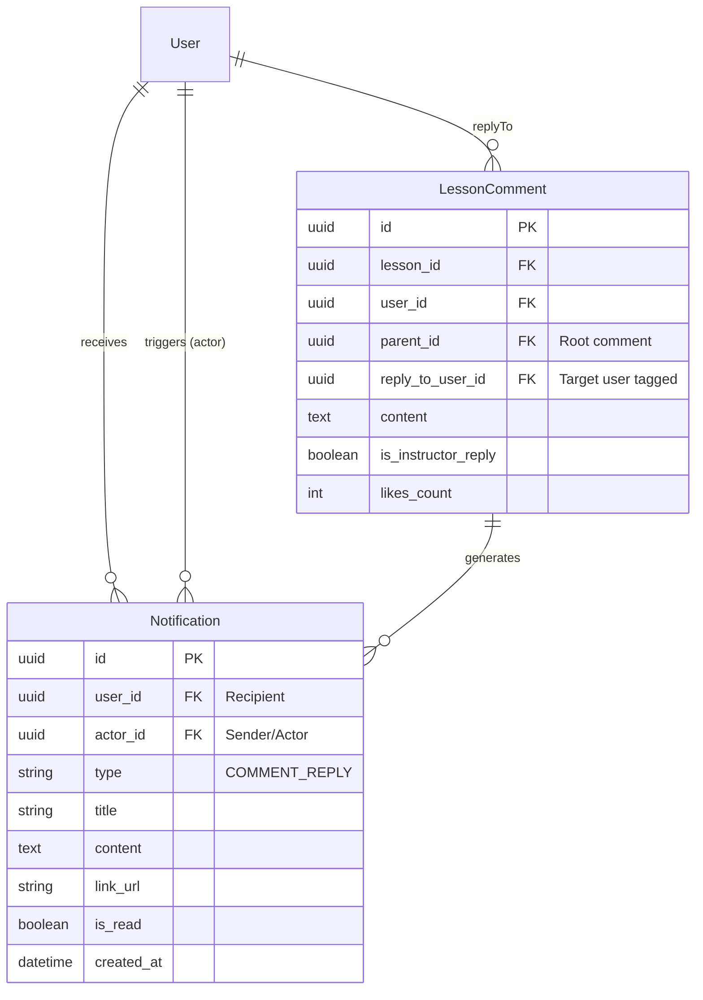
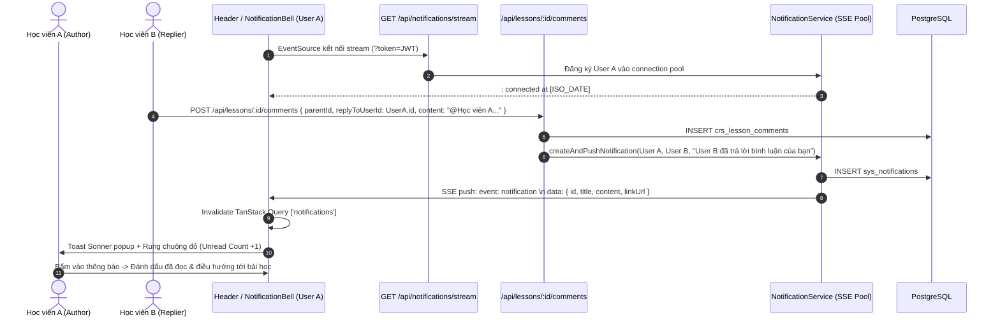

# 🔔 Kiến Trúc Hệ Thống Thông Báo Thời Gian Thực (SSE) & Thảo Luận Đa Cấp (YouTube-Style)

> **Module:** LMS Realtime Notifications & YouTube-Style Multi-level Comment Threading  
> **Author:** `[Doc-Agent]` (System Architect)  
> **Collaborators:** `[BE-Agent]`, `[FE-Agent]`, `[QA-QC-Agent]`  
> **Status:** ✅ Production Ready  
> **Obsidian Links:** [[Lesson_Discussion_And_QA_Architecture]], [[LMS_Granular_Update_Backlog]], [[BaHung-DB-Design]]  

---

## 1. Bối Cảnh Nghiệp Vụ & Quyết Định Thiết Kế (Architectural Decisions)

### 1.1 Vấn đề Realtime & Chiến lược Di chuyển sang C# (.NET SignalR)
* **Vấn đề**: Hệ thống hiện chạy trên Node.js (Express) nhưng đã có kế hoạch tái cấu trúc (refactor) sang **C# (.NET 8/9)** trong tương lai.
* **Quyết định**: Áp dụng **Server-Sent Events (SSE)** thay vì `Socket.io`:
  1. **Zero Vendor Lock-in**: SSE là chuẩn mở của HTML5 (`EventSource`), không sử dụng giao thức độc quyền của Socket.io.
  2. **100% Khả chuyển sang C#**: Sau này khi viết lại backend bằng ASP.NET Core, endpoint SSE trả về `text/event-stream` hoạt động tự nhiên với `IAsyncEnumerable<T>` hoặc `Response.WriteAsync()`. **Toàn bộ mã nguồn Frontend (React hook, Header chuông, Popover) giữ nguyên 100% không cần chỉnh sửa!**
  3. **Tiết kiệm tài nguyên**: Thông báo bản chất là luồng dữ liệu 1 chiều (Server $\rightarrow$ Client). SSE tiêu thụ ít RAM hơn WebSocket, tự động phục hồi kết nối (auto-reconnect) khi rớt mạng, và tương thích hoàn hảo qua các Reverse Proxy / Load Balancers (Nginx / Cloudflare).

### 1.2 Cấu trúc Bình luận Đa cấp: Mô hình YouTube / Facebook
* **Vấn đề**: Thụt lề vô hạn (Infinite staircase) như Reddit sẽ phá vỡ hoàn toàn layout trong các thanh bên 320px (`LessonRightPanel`) hoặc trên màn hình di động.
* **Giải pháp**: Áp dụng **mô hình 2 cấp trực quan + Tag `@NgườiNhận`** của YouTube/Facebook:
  - Tất cả câu trả lời (kể cả trả lời cho một reply con) đều nằm chung một khối thụt lề dưới bình luận gốc.
  - Người dùng có thể click "Trả lời" vào bất kỳ ai trong nhánh thảo luận.
  - Hệ thống tự động điền `@TênHọcViên` và lưu `replyToUserId`.
  - Người được nhắc tên nhận ngay thông báo thời gian thực.

---

## 2. Mô hình Dữ liệu (Database Schema)

---

## 3. Biểu đồ Trình tự Hoạt động Thời gian thực (Sequence Diagram)

---

## 4. Danh mục API Endpoints

### 4.1 Notifications API (`/api/notifications`)
| Method | Endpoint | Xác thực | Mô tả chức năng |
| :--- | :--- | :--- | :--- |
| `GET` | `/stream` | Query Token / Bearer | Kết nối luồng Server-Sent Events (SSE) thời gian thực. Hỗ trợ keep-alive 25s. |
| `GET` | `/` | Bearer Token | Lấy danh sách thông báo kèm phân trang (`limit`, `offset`, `isRead`). |
| `GET` | `/unread-count` | Bearer Token | Đếm số lượng thông báo chưa đọc (hiển thị trên Badge chuông). |
| `PATCH` | `/:id/read` | Bearer Token | Đánh dấu một thông báo cụ thể là đã đọc. |
| `PATCH` | `/read-all` | Bearer Token | Đánh dấu toàn bộ thông báo của người dùng là đã đọc. |

### 4.2 Lesson Comments API (`/api/lessons/:lessonId/comments`)
| Method | Endpoint | Xác thực | Mô tả chức năng |
| :--- | :--- | :--- | :--- |
| `POST` | `/` | Bearer Token | Tạo bình luận/trả lời. Nhận thêm `replyToUserId` để kích hoạt thông báo Realtime SSE cho người được tag. |
| `GET` | `/` | Optional Bearer | Lấy cây thảo luận 2 cấp kèm thông tin `replyToUser` (`{ id, fullName }`). |

---

## 5. Danh mục File Mã Nguồn Đã Triển Khai

| Tầng | Đường dẫn file | Vai trò |
| :--- | :--- | :--- |
| **Database** | [backend/prisma/schema.prisma](file:///e:/Projects/DigiFnb/Practice/LogiX/backend/prisma/schema.prisma) | Model `Notification` & trường `replyToUserId` trong `LessonComment`. |
| **BE Service** | [notification.service.ts](file:///e:/Projects/DigiFnb/Practice/LogiX/backend/src/modules/notifications/notification.service.ts) | Quản lý kết nối SSE client pool, heartbeat keep-alive, CRUD notification. |
| **BE Controller** | [notification.controller.ts](file:///e:/Projects/DigiFnb/Practice/LogiX/backend/src/modules/notifications/notification.controller.ts) | Stream headers (`text/event-stream`, `X-Accel-Buffering: no`) & REST handlers. |
| **BE Routes** | [notification.routes.ts](file:///e:/Projects/DigiFnb/Practice/LogiX/backend/src/modules/notifications/notification.routes.ts) | Định tuyến các endpoint thông báo. |
| **BE Hook** | [lesson-comment.service.ts](file:///e:/Projects/DigiFnb/Practice/LogiX/backend/src/modules/lesson-comments/lesson-comment.service.ts) | Kích hoạt `createAndPushNotification` khi có phản hồi. |
| **FE Types** | [notification.types.ts](file:///e:/Projects/DigiFnb/Practice/LogiX/frontend/src/features/notifications/types/notification.types.ts) | Kiểu dữ liệu TypeScript nghiêm ngặt (no `any`). |
| **FE Client** | [notification.service.ts](file:///e:/Projects/DigiFnb/Practice/LogiX/frontend/src/features/notifications/services/notification.service.ts) | Axios calls cho các tác vụ thông báo. |
| **FE SSE Hook** | [use-notification-sse.ts](file:///e:/Projects/DigiFnb/Practice/LogiX/frontend/src/features/notifications/hooks/use-notification-sse.ts) | Lắng nghe luồng SSE, kích hoạt Sonner toast và invalidate React Query cache. |
| **FE Query Hook**| [use-notifications.ts](file:///e:/Projects/DigiFnb/Practice/LogiX/frontend/src/features/notifications/hooks/use-notifications.ts) | TanStack Query v5 hooks cho danh sách và số đếm chưa đọc. |
| **FE Component** | [NotificationBell.tsx](file:///e:/Projects/DigiFnb/Practice/LogiX/frontend/src/features/notifications/components/NotificationBell.tsx) | Icon chuông, popover danh sách, filter chưa đọc, nút đọc tất cả. |
| **FE Header** | [Header.tsx](file:///e:/Projects/DigiFnb/Practice/LogiX/frontend/src/components/shared/Header.tsx) | Nhúng chuông thông báo cạnh avatar người dùng. |
| **FE Comment** | [LessonCommentItem.tsx](file:///e:/Projects/DigiFnb/Practice/LogiX/frontend/src/features/lms/comments/components/LessonCommentItem.tsx) | Tag mention `@TênNgườiNhận` và nút trả lời tại mọi cấp con. |
