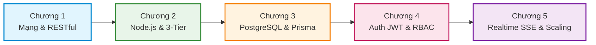

# Lộ Trình & Khung Đào Tạo: Lập Trình Backend Chuyên Nghiệp (Node.js, Express, PostgreSQL & Clean Architecture)

> **Mã khóa học:** `CRS-BE-01`  
> **Danh mục:** `TECH_BE` - Kỹ Thuật Phần Mềm & Backend  
> **Thời lượng ước tính:** 45 ngày (Tự do tiến độ / Self-paced)  
> **Đối tượng:** Software Engineers, Backend Developers, Full-stack Developers muốn làm chủ kiến trúc hệ thống cấp doanh nghiệp.  
> **Trạng thái:** `PUBLISHED` (Đang hoạt động trên hệ sinh thái LogiX LMS)

---

## 1. Tổng Quan Khóa Học & Mục Tiêu Đào Tạo

Khóa học được thiết kế bám sát thực tiễn phát triển phần mềm doanh nghiệp, lấy chính kiến trúc monolithic mở rộng của hệ thống **LogiX LMS** làm đồ án tham chiếu thực nghiệm. Học viên không chỉ học cú pháp code mà được trang bị tư duy kiến trúc, bảo mật, tối ưu hóa cơ sở dữ liệu và khả năng chuyển đổi công nghệ linh hoạt (từ Node.js sang C# .NET/Go).

---

## 2. Chi Tiết Lộ Trình 5 Chương (16 Bài Học Chuyên Sâu)

### Chương 1: Nền Tảng Mạng Máy Tính & Kiến Trúc Web Service
*Mục tiêu:* Nắm vững cách thức dữ liệu di chuyển trên Internet, giao thức HTTP/HTTPS, chu trình bắt tay TCP và chuẩn mực thiết kế REST API tiêu chuẩn quốc tế.

| STT | Tên bài học | Phân loại | Định dạng | Điểm nhấn nội dung |
| :--- | :--- | :--- | :--- | :--- |
| **1.1** | Tổng quan Kiến trúc Client - Server & Giao thức HTTP/HTTPS | Bài giảng | **Video** (12 phút) | Mô hình Client-Server, OSI 7 tầng, DNS resolution, TLS/SSL handshake. |
| **1.2** | Giải phẫu Vòng đời HTTP Request & Chuẩn Thiết kế RESTful API | Bài đọc | **Article** (15 phút) | Anatomy của gói tin HTTP, Idempotency, chuẩn đặt tên Endpoint số nhiều, Response Envelope chuẩn. |
| **1.3** | Bài kiểm tra: Nền tảng Mạng & Chuẩn RESTful API | Đánh giá | **Quiz** (15 phút) | 4 câu hỏi trắc nghiệm (Single/Multiple choice) có giải thích chi tiết, điểm đạt 80%. |

---

### Chương 2: Node.js Core, Express.js & Kiến Trúc Phân Tầng Thực Chiến
*Mục tiêu:* Làm chủ cơ chế bất đồng bộ, Event Loop, Libuv trong Node.js; xây dựng Web API với Express.js theo kiến trúc 3 tầng (Controller - Service - Repository) độc lập, dễ kiểm thử.

| STT | Tên bài học | Phân loại | Định dạng | Điểm nhấn nội dung |
| :--- | :--- | :--- | :--- | :--- |
| **2.1** | Kiến trúc Node.js: V8 Engine, Libuv & Event Loop vận hành ra sao? | Bài giảng | **Video** (18 phút) | Single thread non-blocking I/O, Call Stack, Task Queue, Microtask Queue. |
| **2.2** | Xây dựng RESTful API với Express.js & Phân Tầng Kiến Trúc (3-Tier Architecture) | Bài đọc | **Article** (20 phút) | Tách bạch Controller, Service, DTO, Repository; nguyên tắc Dependency Inversion. |
| **2.3** | Middleware & Xử lý Ngoại lệ Tập trung (Global Error Handler) | Bài đọc | **Article** (12 phút) | Middleware pipeline, AsyncHandler wrapper, chuẩn hóa AppError & HTTP Status Codes. |
| **2.4** | Bài kiểm tra: Node.js Internals & Express Framework | Đánh giá | **Quiz** (15 phút) | 4 câu hỏi kiểm tra tư duy Event Loop, Middleware next() và cấu trúc 3 tầng. |

---

### Chương 3: Cơ Sở Dữ Liệu Quan Hệ (PostgreSQL) & Prisma ORM
*Mục tiêu:* Thiết kế lược đồ cơ sở dữ liệu quan hệ chuẩn 3NF, thành thạo mô hình hóa dữ liệu và truy vấn hiệu năng cao với Prisma ORM, kỹ thuật index và transaction.

| STT | Tên bài học | Phân loại | Định dạng | Điểm nhấn nội dung |
| :--- | :--- | :--- | :--- | :--- |
| **3.1** | Thiết kế Cơ sở dữ liệu Quan hệ & Chuẩn hóa 3NF | Bài giảng | **Video** (15 phút) | Mô hình hóa thực thể ERD, khóa chính UUID v4, khóa ngoại, quan hệ 1-N, N-N. |
| **3.2** | Prisma ORM Toàn Tập: Schema Migration, Querying & Database Indexing | Bài đọc | **Article** (20 phút) | Prisma schema definition, relations, B-tree indexes, composite indexes, transaction `prisma.$transaction`. |
| **3.3** | Bài kiểm tra: Database Modeling, Indexing & Prisma ORM | Đánh giá | **Quiz** (15 phút) | 4 câu hỏi về Indexing, Transaction ACID, N+1 query problem và Cascade delete. |

---

### Chương 4: Xác Thực (Authentication), Phân Quyền (RBAC) & Bảo Mật Web
*Mục tiêu:* Xây dựng hệ thống bảo mật không kẽ hở với JWT (Access Token + Refresh Token), phân quyền dựa trên vai trò (Role-Based Access Control) và phòng chống lỗ hổng OWASP Top 10.

| STT | Tên bài học | Phân loại | Định dạng | Điểm nhấn nội dung |
| :--- | :--- | :--- | :--- | :--- |
| **4.1** | Bản chất Xác thực: Session Cookies vs JWT (JSON Web Tokens) | Bài giảng | **Video** (14 phút) | So sánh Stateful Session và Stateless Token, cấu trúc JWT (Header, Payload, Signature). |
| **4.2** | Thiết kế Hệ thống Phân Quyền Đa Cấp (RBAC) & Phòng Chống Lỗ Hổng Bảo Mật OWASP | Bài đọc | **Article** (20 phút) | RBAC matrix (User - Role - Permission), SQL Injection, XSS, CSRF, Rate Limiting, Helmet. |
| **4.3** | Bài kiểm tra: Xác thực JWT, Phân quyền RBAC & An toàn Thông tin | Đánh giá | **Quiz** (15 phút) | 4 câu hỏi thực chiến về Refresh Token rotation, Rainbow table attack với Salt/Bcrypt, RBAC middleware. |

---

### Chương 5: Giao Tiếp Thời Gian Thực (Realtime SSE) & Tư Duy Mở Rộng Hệ Thống
*Mục tiêu:* Nắm vững giải pháp truyền tin thời gian thực nhẹ nhàng qua Server-Sent Events (SSE), kỹ thuật pub/sub in-memory, và tư duy kiến trúc mở rộng khi chuyển dịch sang các nền tảng hiệu năng cao như C# .NET.

| STT | Tên bài học | Phân loại | Định dạng | Điểm nhấn nội dung |
| :--- | :--- | :--- | :--- | :--- |
| **5.1** | Realtime Communication: Server-Sent Events (SSE) vs WebSockets | Bài đọc | **Article** (18 phút) | Cơ chế luồng đơn chiều qua HTTP `text/event-stream`, tự động reconnect, so sánh chi phí với WebSocket. |
| **5.2** | Tư duy Thiết kế Hệ thống Mở rộng (System Design & Scalability) | Bài đọc | **Article** (25 phút) | Caching layer (Redis), Connection Pooling, Read/Write Replica, chiến lược chuyển đổi công nghệ Clean Architecture. |
| **5.3** | Bài kiểm tra Tốt nghiệp: Tổng hợp Kiến trúc Backend & Realtime System | Đánh giá | **Quiz** (20 phút) | 5 câu hỏi Capstone tổng hợp kiến trúc phân tầng, SSE headers, high concurrency và fault tolerance. |

---

## 3. Liên Kết Thực Nghiệm Với Mã Nguồn LogiX

Khóa học này được đồng bộ 1:1 với cấu trúc mã nguồn thực tế của dự án LogiX:

| Khái niệm trong khóa học | File / Module mã nguồn tương ứng trong LogiX |
| :--- | :--- |
| **3-Tier Architecture** | `backend/src/modules/courses/` (`course.controller.ts`, `course.service.ts`, `course.repository.ts`, `course.dto.ts`) |
| **Global Error Handler** | `backend/src/common/middlewares/error.middleware.ts` & `backend/src/common/utils/async-handler.ts` |
| **Prisma ORM & Schema** | `backend/prisma/schema.prisma` & `backend/src/config/prisma.ts` |
| **Authentication & RBAC** | `backend/src/middlewares/auth.middleware.ts` & `backend/src/middlewares/permission.middleware.ts` |
| **Realtime SSE Notifications** | `backend/src/modules/notifications/notification.service.ts` & `frontend/src/hooks/useRealtimeNotification.ts` |
| **Validation Schemas (Zod)** | `packages/shared/src/schemas/` & `backend/src/modules/*/dto.ts` |

---

## 4. Đường Dẫn Trực Tiếp Trải Nghiệm Khóa Học

- **Giao diện Quản trị viên (Admin LMS):** `http://localhost:3000/lms/admin/courses`
- **Giao diện Học tập (Course Player):** `http://localhost:3000/lms/demo-ui/course/khoa-hoc-lap-trinh-backend-chuyen-nghiep`
