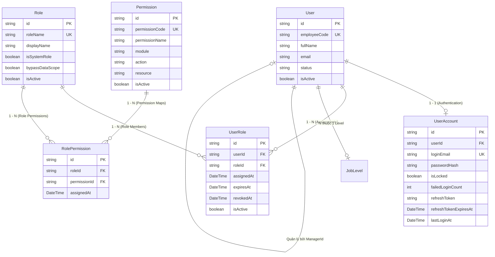
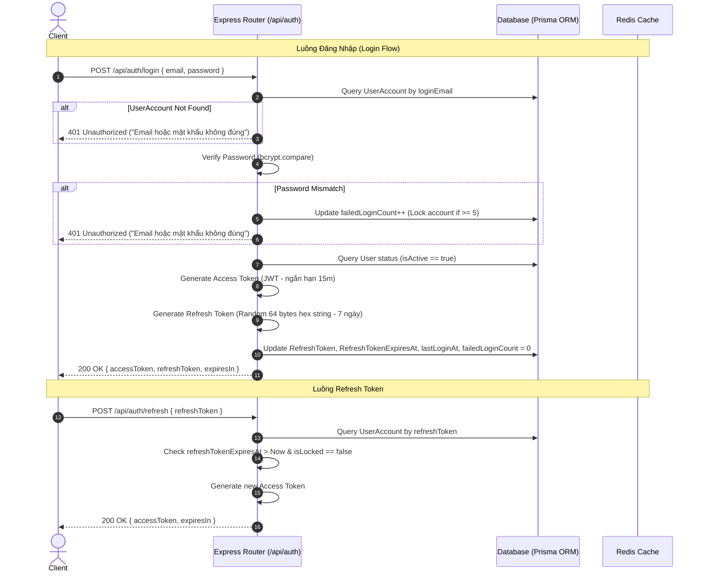
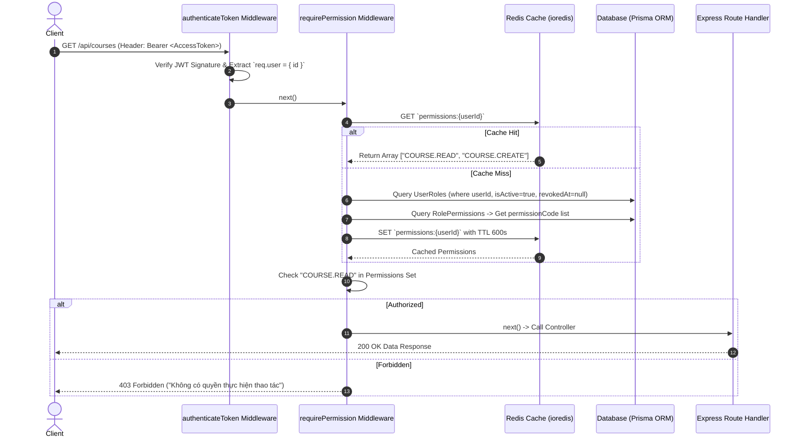

# Phân Tích Luồng Authenticate, Permission System & Database Design
> **Nguồn tham khảo:** Dự án `erp-corporation-api-v2` (C# .NET Clean Architecture)  
> **Mục tiêu:** Chuyển đổi kiến trúc sang **Node.js (Express.js / TypeScript / Prisma / Redis)** cho dự án **LogiX**  
> **Ngày cập nhật:** 07/08/2026

---

## 1. Tổng Quan Kiến Trúc (Architecture Overview)

Hệ thống Quản trị & Phân quyền trong `erp-corporation-api-v2` được thiết kế theo mô hình **RBAC (Role-Based Access Control) mở rộng** tích hợp **Dynamic Permission Caching với Redis**.

### Các điểm sáng kiến trúc cần kế thừa sang Node.js (Express.js):
1. **Tách biệt User & UserAccount**: Tách thông tin hồ sơ nhân sự (`User`) và thông tin đăng nhập/bảo mật (`UserAccount`).
2. **Quản lý Role linh hoạt theo thời gian**: `UserRole` hỗ trợ thời hạn hết hiệu lực (`ExpiresAt`), thu quyền (`RevokedAt`), và trạng thái kích hoạt (`IsActive`).
3. **Cơ chế Redis Cache 2 lớp**: Cache danh sách `PermissionCode` của từng `UserId` với TTL 10 phút. Hỗ trợ Invalidation tức thì khi Role bị thay đổi.
4. **Middleware Phân quyền Hạt mịn (`requirePermission`)**: Xử lý kiểm tra quyền động qua Middleware hàm cao cấp (Higher-Order Function) trong Express.js.

---

## 2. Database Design & Entity Relationships (ERD)

### 2.1. Sơ đồ Quan hệ Thực thể (Mermaid ERD)



---

### 2.2. Bảng Chi Tiết Cấu Trúc Dữ Liệu (Schema Details)

#### A. Bảng `UserAccount` (Tài khoản đăng nhập)
| Trường | Kiểu dữ liệu | Mô tả / Ràng buộc |
| :--- | :--- | :--- |
| `id` | `String (UUID)` | Primary Key |
| `userId` | `String (UUID)` | Foreign Key $\rightarrow$ `User.id` (Unique 1-1) |
| `loginEmail` | `String` | Email đăng nhập (Unique) |
| `passwordHash` | `String` | Chuỗi băm mật khẩu (BCrypt / Argon2) |
| `isLocked` | `Boolean` | Khóa tài khoản khi đăng nhập sai quá số lần quy định |
| `failedLoginCount` | `Int` | Đếm số lần đăng nhập thất bại liên tiếp |
| `refreshToken` | `String?` | Token làm mới phiên đăng nhập |
| `refreshTokenExpiresAt` | `DateTime?` | Thời điểm hết hạn của Refresh Token |
| `lastLoginAt` | `DateTime?` | Thời điểm đăng nhập thành công gần nhất |

#### B. Bảng `Role` (Vai trò)
| Trường | Kiểu dữ liệu | Mô tả / Ràng buộc |
| :--- | :--- | :--- |
| `id` | `String (UUID)` | Primary Key |
| `roleName` | `String` | Mã vai trò (VD: `ADMIN`, `INSTRUCTOR`, `STUDENT`) |
| `displayName` | `String` | Tên hiển thị giao diện |
| `isSystemRole` | `Boolean` | True nếu là vai trò hệ thống không được xóa |
| `bypassDataScope` | `Boolean` | Quyền bỏ qua phạm vi dữ liệu phòng ban |
| `isActive` | `Boolean` | Trạng thái kích hoạt |

#### C. Bảng `Permission` (Danh mục quyền)
| Trường | Kiểu dữ liệu | Mô tả / Ràng buộc |
| :--- | :--- | :--- |
| `id` | `String (UUID)` | Primary Key |
| `permissionCode` | `String` | Mã quyền duy nhất (VD: `USER.READ`, `COURSE.CREATE`, `PAYROLL.APPROVE`) |
| `permissionName` | `String` | Tên mô tả quyền |
| `module` | `String` | Thuộc Module (HRM, LMS, Payroll, Task, System...) |
| `action` | `String` | Hành động (Create, Read, Update, Delete, Approve...) |
| `resource` | `String` | Tài nguyên tác động |
| `isActive` | `Boolean` | Trạng thái hoạt động |

#### D. Bảng `UserRole` (Bảng trung gian N-N giữa User và Role)
| Trường | Kiểu dữ liệu | Mô tả / Ràng buộc |
| :--- | :--- | :--- |
| `id` | `String (UUID)` | Primary Key |
| `userId` | `String (UUID)` | Foreign Key $\rightarrow$ `User.id` |
| `roleId` | `String (UUID)` | Foreign Key $\rightarrow$ `Role.id` |
| `assignedAt` | `DateTime` | Thời điểm phân quyền |
| `expiresAt` | `DateTime?` | Thời điểm hết hạn vai trò (Null = Vĩnh viễn) |
| `revokedAt` | `DateTime?` | Thời điểm bị thu hồi vai trò |
| `isActive` | `Boolean` | Trạng thái kích hoạt |

---

## 3. Phân Tích Luồng Xác Thực (Authentication Flow)



---

## 4. Phân Tích Luồng Phân Quyền (Authorization Flow trong Express.js)



---

## 5. Triển Khai Kiến Trúc Thuần Node.js (Express.js / TypeScript / Prisma / Redis)

### 5.1. Structuring Folder chuẩn Express + TypeScript

```text
backend/
├── prisma/
│   └── schema.prisma         # Prisma Data Models (User, UserAccount, Role, Permission...)
├── src/
│   ├── config/
│   │   ├── env.ts            # Environment Variables loader & validator
│   │   ├── prisma.ts         # Prisma Client Instance Singleton
│   │   └── redis.ts          # Redis Client Instance Singleton (ioredis)
│   ├── middlewares/
│   │   ├── auth.middleware.ts       # JWT Access Token Verifier
│   │   ├── permission.middleware.ts # Dynamic Permission Middleware
│   │   └── error.middleware.ts      # Global Error Handler
│   ├── services/
│   │   ├── auth.service.ts          # Business logic Login, Refresh, Password Hashing
│   │   └── permission.service.ts    # Logic Cache Redis & Query DB Permissions
│   ├── controllers/
│   │   └── auth.controller.ts
│   ├── routes/
│   │   ├── auth.routes.ts
│   │   └── course.routes.ts
│   └── index.ts              # Express App Entrypoint
```

---

### 5.2. Code Mẫu Triển Khai (Express + TypeScript)

#### A. Permission Service (`src/services/permission.service.ts`)
```typescript
import prisma from '../config/prisma';
import redis from '../config/redis';

const CACHE_TTL_SECONDS = 600; // 10 minutes

export const getUserPermissions = async (userId: string): Promise<Set<string>> => {
  const cacheKey = `permissions:${userId}`;

  // 1. Tra cứu Redis Cache
  const cached = await redis.get(cacheKey);
  if (cached) {
    return new Set(JSON.parse(cached));
  }

  // 2. Query DB nếu Cache Miss
  const now = new Date();
  const userRoles = await prisma.userRole.findMany({
    where: {
      userId,
      isActive: true,
      revokedAt: null,
      OR: [{ expiresAt: null }, { expiresAt: { gt: now } }],
    },
    select: { roleId: true },
  });

  const roleIds = userRoles.map((ur) => ur.roleId);
  if (roleIds.length === 0) {
    return new Set();
  }

  const rolePermissions = await prisma.rolePermission.findMany({
    where: { roleId: { in: roleIds } },
    select: { permission: { select: { permissionCode: true } } },
  });

  const permissionCodes = Array.from(
    new Set(rolePermissions.map((rp) => rp.permission.permissionCode))
  );

  // 3. Ghi vào Redis Cache
  await redis.set(cacheKey, JSON.stringify(permissionCodes), 'EX', CACHE_TTL_SECONDS);

  return new Set(permissionCodes);
};

export const invalidatePermissionCacheForRole = async (roleId: string): Promise<void> => {
  const userRoles = await prisma.userRole.findMany({
    where: { roleId, isActive: true },
    select: { userId: true },
  });

  const keys = userRoles.map((ur) => `permissions:${ur.userId}`);
  if (keys.length > 0) {
    await redis.del(...keys);
  }
};
```

#### B. Permission Middleware (`src/middlewares/permission.middleware.ts`)
```typescript
import { Request, Response, NextFunction } from 'express';
import { getUserPermissions } from '../services/permission.service';

export const requirePermission = (permissionCode: string) => {
  return async (req: Request, res: Response, next: NextFunction) => {
    try {
      const userId = req.user?.id;
      if (!userId) {
        return res.status(401).json({ error: 'Unauthorized: Bạn cần đăng nhập trước' });
      }

      const userPermissions = await getUserPermissions(userId);

      if (!userPermissions.has(permissionCode)) {
        return res.status(403).json({
          error: `Forbidden: Bạn không có quyền [${permissionCode}] để thực hiện hành động này.`,
        });
      }

      next();
    } catch (error) {
      next(error);
    }
  };
};
```

#### C. Áp dụng vào Router Express (`src/routes/course.routes.ts`)
```typescript
import { Router } from 'express';
import { authenticateToken } from '../middlewares/auth.middleware';
import { requirePermission } from '../middlewares/permission.middleware';

const router = Router();

// Yêu cầu Đăng nhập + Có quyền xem khóa học
router.get('/', authenticateToken, requirePermission('COURSE.READ'), async (req, res) => {
  res.json({ message: 'Danh sách khóa học' });
});

// Yêu cầu Đăng nhập + Có quyền tạo khóa học
router.post('/', authenticateToken, requirePermission('COURSE.CREATE'), async (req, res) => {
  res.json({ message: 'Tạo mới khóa học thành công' });
});

export default router;
```

---

## 6. Tổng Kết

Kiến trúc này giúp dự án **LogiX Backend (Express.js)** đạt được:
1. **Kiến trúc rõ ràng, dễ bảo trì**: Phân tách Layer rõ ràng (Routes $\rightarrow$ Middlewares $\rightarrow$ Controllers $\rightarrow$ Services $\rightarrow$ Prisma/Redis).
2. **Hiệu năng vượt trội**: Phân quyền phản hồi $< 2ms$ nhờ Redis Cache.
3. **Linh hoạt nâng cấp**: Dễ dàng thêm Permission hay Module mới chỉ bằng việc insert thêm dữ liệu mã quyền vào bảng `Permission`.
