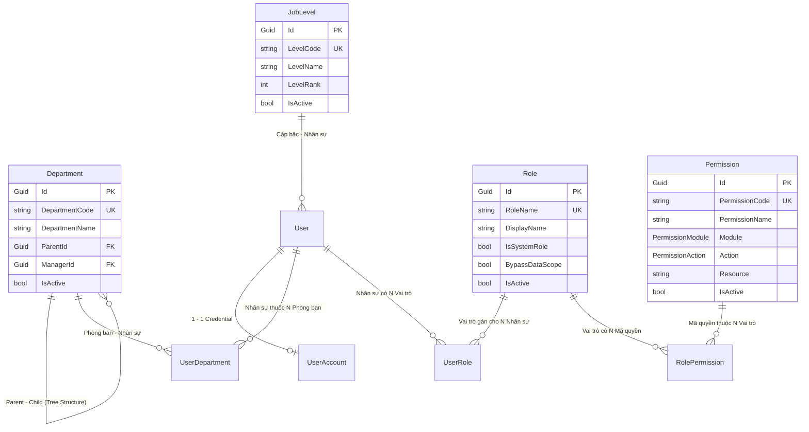

# 🔍 PHÂN TÍCH MODULE "TỔ CHỨC & PHÂN QUYỀN" — BACKEND (BE)

> **Dự án tham chiếu:** `erp-corporation-api-v2` (C# .NET Clean Architecture)  
> **Phạm vi phân tích:** Hệ thống Cơ cấu Tổ chức (Phòng ban, Cấp bậc) và Hệ thống Phân quyền Hạt mịn (RBAC)  
> **Đường dẫn lưu:** `doc/module/BE_Organization_Permission_Analysis.md`

---

## 1. TỔNG QUAN MODULE BACKEND

Module **Tổ chức & Phân quyền** trong Backend giữ vai trò cốt lõi định hình toàn bộ cấu trúc dữ liệu doanh nghiệp và kiểm soát an ninh cho tất cả các API Endpoint của hệ thống.

### 1.1. Các Sub-modules chính:
1. **Quản lý Phân quyền Hạt mịn (RBAC System)**: `Role`, `Permission`, `UserRole`, `RolePermission`.
2. **Quản lý Cơ cấu Tổ chức (Organization Hierarchy)**: `Department`, `UserDepartment`.
3. **Quản lý Cấp bậc Công việc (Job Level System)**: `JobLevel`.
4. **Quản lý Tài khoản & Nhân sự (User & Authentication)**: `User`, `UserAccount`.

---

## 2. KIẾN TRÚC & PHÂN TẦNG (CLEAN ARCHITECTURE)

```text
src/
├── Domain/
│   ├── Entities/
│   │   ├── Roles/          # Permission.cs, Role.cs, RolePermission.cs
│   │   ├── Users/          # User.cs, UserAccount.cs, UserRole.cs, UserDepartment.cs
│   │   ├── Departments/    # Department.cs
│   │   └── JobLevels/      # JobLevel.cs
│   └── Enums/
│       └── Roles/          # PermissionAction.cs, PermissionModule.cs
├── Application/
│   ├── Features/
│   │   ├── Auth/           # LoginCommandHandler, RefreshTokenCommandHandler...
│   │   └── RBAC/           # AssignPermissions, GetPermissions, GetRoles...
│   └── Interfaces/         # IPermissionService.cs, IJwtTokensService.cs
├── Infrastructure/
│   ├── Authorization/      # PermissionAuthorizationHandler.cs, PermissionService.cs, HasPermissionAttribute.cs
│   └── Data/
│       ├── Configurations/ # EF Core Table Mappings
│       └── SeedData/       # AppData.cs (Auto Permission Sync & Seed Data)
└── API/
    └── Controllers/        # AuthController.cs, RolesController.cs, PermissionsController.cs
```

---

## 3. PHÂN TÍCH CHI TIẾT DỮ LIỆU & QUAN HỆ (SCHEMA & ENTITIES)



---

## 4. CÁC LUỒNG XỬ LÝ QUAN TRỌNG (BUSINESS FLOWS)

### 4.1. Luồng Tự Động Đồng Bộ Mã Quyền (Auto Permission Discovery)
Trong file `Infrastructure/Data/SeedData/AppData.cs`:
1. Khi Server khởi động, hệ thống sử dụng Reflection để quét toàn bộ Controller tìm các Attribute `[HasPermission("CODE")]`.
2. Tự động so sánh với DB, nếu có mã quyền mới sẽ tự động Insert vào bảng `Permission`.
3. Tự động gán mã quyền mới này cho Vai trò `Admin`.

### 4.2. Luồng Kiểm Tra Quyền (Authorization Check & Caching)
Trong file `Infrastructure/Authorization/PermissionService.cs`:
1. Khi có HTTP Request gửi lên, `PermissionAuthorizationHandler` lấy `userId` từ JWT Token.
2. Gọi `permissionService.GetPermissionsAsync(userId)`.
3. Tra cứu Redis Key `permissions:{userId}` (Cache TTL 10 phút).
4. Nếu Cache Hit: Trả về tập danh sách mã quyền trong $1ms$.
5. Nếu Cache Miss: Query DB (`UserRole` active $\rightarrow$ `RolePermission` $\rightarrow$ `PermissionCode`), ghi vào Redis rồi trả về.

### 4.3. Luồng Thu Hồi / Cập Nhật Cache Khi Admin Sửa Role
1. Khi Admin sửa danh sách Permission của một `RoleId` hoặc phân `Role` mới cho `UserId`.
2. Gọi `permissionService.InvalidateCacheAsync(roleId)`.
3. Tìm tất cả `UserId` thuộc `RoleId` đó và thực hiện xóa Key trên Redis (`DEL permissions:{userId}`).

---

## 5. ĐỀ XUẤT MAPPING SANG LOGIX BACKEND (NODE.JS / EXPRESS / PRISMA)

| Thành phần C# (`erp-corporation-api-v2`) | Tương đương Node.js (LogiX Backend) |
| :--- | :--- |
| **`[HasPermission("USER.READ")]`** | Middleware `requirePermission('USER.READ')` |
| **`PermissionAuthorizationHandler`** | Express Middleware `permission.middleware.ts` |
| **`PermissionService` (Redis)** | `services/permission.service.ts` dùng `ioredis` |
| **EF Core Entities** | Model Prisma trong `prisma/schema.prisma` |
| **`AppData.SyncPermissionsAsync`** | Script Seed `src/seed.ts` tự động nạp danh sách mã quyền |
