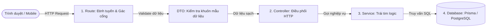
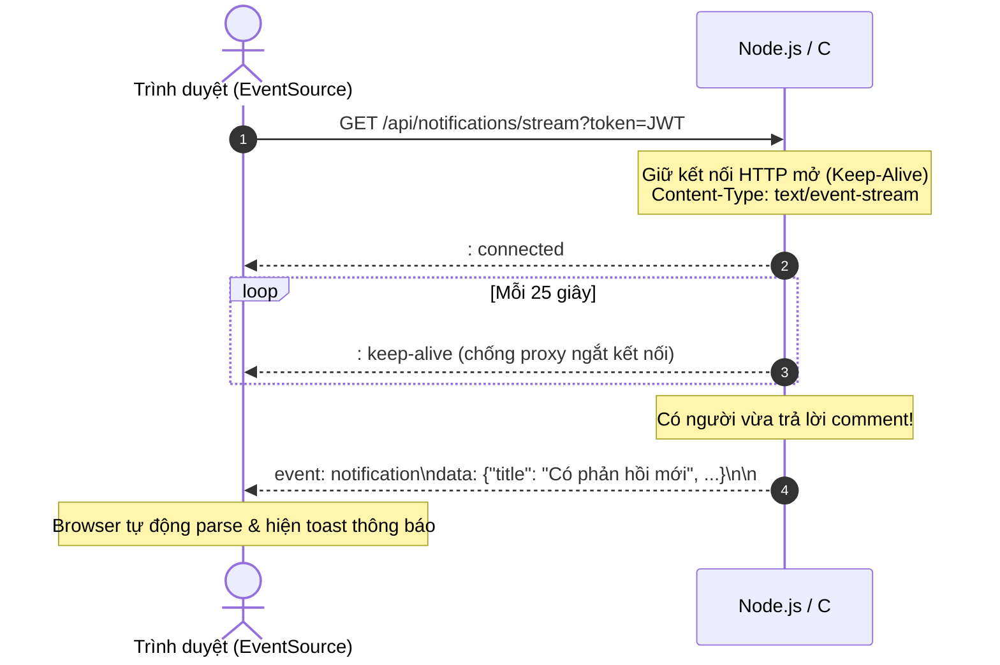
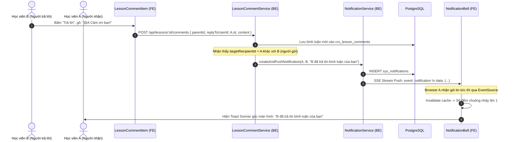

# 📚 Sổ Tay Kiến Trúc & Ôn Tập Nghiệp Vụ: Lesson Comments & Realtime SSE

> **Mục tiêu tài liệu:** Đào sâu bản chất kiến trúc, giải thích chi tiết vai trò và trách nhiệm của từng file code trong chuỗi tính năng **Thảo luận Bài học (Lesson Comments)** và **Thông báo Thời gian thực (Realtime Notifications qua SSE)**.  
> **Dành cho:** Nhà phát triển ôn tập kiến trúc hệ thống, chuẩn bị tư duy mở rộng và refactor sang C# (.NET).  
> **Tương thích:** Obsidian Markdown · Mermaid.js · LogiX Monorepo  

---

## 🧭 MỤC LỤC
1. [Khái Niệm Nền Tảng: DTO, Controller, Service, Route là gì?](#1-khái-niệm-nền-tảng-dto-controller-service-route-là-gì)
2. [Cơ Chế Realtime: Tại sao SSE lại vượt trội cho tính năng Thông Báo?](#2-cơ-chế-realtime-tại-sao-sse-lại-vượt-trội-cho-tính-năng-thông-báo)
3. [Tư Duy UX: Mô Hình Thảo Luận Đa Cấp Kiểu YouTube / Facebook](#3-tư-duy-ux-mô-hình-thảo-luận-đa-cấp-kiểu-youtube--facebook)
4. [Bóc Tách Chi Tiết Toàn Bộ Danh Sách Files Đã Thay Đổi](#4-bóc-tách-chi-tiết-toàn-bộ-danh-sách-files-đã-thay-đổi)
   - [Nhóm I: Cơ Sở Dữ Liệu & Core Backend (Prisma & Entrypoint)](#nhóm-i-cơ-sở-dữ-liệu--core-backend)
   - [Nhóm II: Module Backend Thảo Luận Bài Học (Lesson Comments)](#nhóm-ii-module-backend-thảo-luận-bài-học)
   - [Nhóm III: Module Backend Thông Báo Thời Gian Thực (Notifications & SSE)](#nhóm-iii-module-backend-thông-báo-thời-gian-thực)
   - [Nhóm IV: Module Frontend Thảo Luận Bài Học (`features/lms/comments/`)](#nhóm-iv-module-frontend-thảo-luận-bài-học)
   - [Nhóm V: Module Frontend Thông Báo Thời Gian Thực (`features/notifications/`)](#nhóm-v-module-frontend-thông-báo-thời-gian-thực)
   - [Nhóm VI: Tích Hợp UI Màn Hình Lớn (Header & LessonPlayerPage)](#nhóm-vi-tích-hợp-ui-màn-hình-lớn)
5. [Bảng Tổng Hợp Trách Nhiệm & Luồng Chạy Dữ Liệu (Data Flow)](#5-bảng-tổng-hợp-trách-nhiệm--luồng-chạy-dữ-liệu-data-flow)

---

## 1. KHÁI NIỆM NỀN TẢNG: DTO, CONTROLLER, SERVICE, ROUTE LÀ GÌ?

Trong kiến trúc phần mềm chuyên nghiệp (Clean / Layered Architecture), mã nguồn được chia thành các tầng độc lập để dễ bảo trì, dễ kiểm thử và tránh "spaghetti code".



### 1.1 DTO là gì? (Data Transfer Object)
* **Khái niệm**: Là đối tượng dùng để **đóng gói và vận chuyển dữ liệu** giữa Client và Server hoặc giữa các tầng trong ứng dụng. DTO không chứa logic nghiệp vụ, nó chỉ định nghĩa **dữ liệu được phép có hình thù như thế nào**.
* **Tại sao không truyền trực tiếp object tùy tiện mà phải dùng DTO?**
  1. **Bảo mật (Chống lỗi Mass Assignment Vulnerability)**: Giả sử hacker gửi thêm trường `isInstructorReply: true` hoặc `role: "ADMIN"`. Nếu không có DTO lọc lại, kẻ xấu có thể tự phong quyền cho mình. DTO chỉ nhận đúng các trường được phép (`content`, `parentId`, `replyToUserId`).
  2. **Xác thực dữ liệu tại cửa ngõ (Data Validation)**: DTO dùng Zod kiểm tra ngay độ dài chữ (1 - 2.000 ký tự), định dạng UUID hợp lệ trước khi dữ liệu đi sâu vào server.
  3. **Đồng bộ Kiểu dữ liệu (Type Safety)**: Nhờ `z.infer<typeof schema>`, ta vừa có validator ở Runtime (khi chạy thật), vừa có kiểu TypeScript ở Compile-time (khi viết code) mà không phải viết lại 2 lần.

### 1.2 Route chịu trách nhiệm gì?
* **Vai trò**: Là **"người gác cổng" (Bouncer)** tại cửa ngõ ứng dụng.
* **Nhiệm vụ**:
  - Khớp đường dẫn URL (VD: `POST /api/lessons/:lessonId/comments`).
  - Chạy các Middleware bảo mật: `authenticateToken` (xác minh danh tính), `requirePermission` (kiểm tra quyền), `validateRequest(DTO)` (kiểm tra dữ liệu).
  - Nếu tất cả vượt qua, chuyển giao tiếp cho Controller xử lý.

### 1.3 Controller chịu trách nhiệm gì?
* **Vai trò**: Là **"người điều phối viên" (Dispatcher)** của giao thức HTTP.
* **Nhiệm vụ**:
  - Nhận HTTP Request: Trích xuất tham số từ `req.body`, `req.params`, `req.query`, `req.user`.
  - Gọi Service tương ứng để thực thi nghiệp vụ: `const result = await lessonCommentService.createComment(...)`.
  - Trả về HTTP Response: Định hình mã trạng thái (`200 OK`, `201 Created`, `401 Unauthorized`) và bọc dữ liệu trong khuôn chuẩn `ApiResponse.success(data, message)`.
  - **Quy tắc vàng**: Controller **KHÔNG BAO GIỜ** được viết câu lệnh truy vấn Database trực tiếp.

### 1.4 Service chịu trách nhiệm gì?
* **Vai trò**: Là **"bộ não" (Business Logic Core)** của hệ thống.
* **Nhiệm vụ**:
  - Nơi tập trung toàn bộ quy tắc nghiệp vụ: *Bài học có tồn tại không? User này có phải giảng viên không để cấp badge? Nếu reply vào một reply con thì có cần làm phẳng về root comment không? Có cần gửi thông báo cho tác giả gốc không?*
  - Giao tiếp trực tiếp với Database thông qua Prisma ORM (`prisma.lessonComment.create()`, `prisma.$transaction()`).
  - Độc lập với giao thức mạng: Service không hề biết về `req` hay `res` của Express. Do đó, logic này có thể tái sử dụng cho Cron Job, Queue Worker hay gRPC mà không cần viết lại.

---

## 2. CƠ CHẾ REALTIME: TẠI SAO SSE LẠI VƯỢT TRỘI CHO TÍNH NĂNG THÔNG BÁO?

### 2.1 Bản chất của Server-Sent Events (SSE)
* SSE là chuẩn mở của HTML5 cho phép **Server chủ động đẩy dữ liệu 1 chiều (Server-to-Client Push)** xuống trình duyệt thông qua một kết nối HTTP duy nhất giữ mở (`text/event-stream`).



### 2.2 So sánh SSE với WebSocket / Socket.io:
| Tiêu chí | Server-Sent Events (SSE) | WebSocket / Socket.io |
| :--- | :--- | :--- |
| **Chiều truyền tin** | **1 chiều (Server $\rightarrow$ Client)** | 2 chiều (Bidirectional) |
| **Giao thức** | **HTTP / HTTP/2 thuần túy** | Giao thức riêng (ws:// hoặc Socket.io framing) |
| **Độ phức tạp** | **Cực thấp** (Trình duyệt có sẵn `new EventSource()`) | Cao (Cần thư viện client/server tương thích) |
| **Tự động kết nối lại** | **Có sẵn trong Browser** (Native Auto-reconnect) | Phải tự code hoặc dựa vào Socket.io |
| **Tương thích Reverse Proxy** | Dễ dàng qua Nginx, Cloudflare, Traefik | Cần cấu hình `Upgrade: websocket` |
| **Khả năng chuyển đổi sang C#** | **100% Hoàn hảo**: Frontend không cần sửa dòng code nào | Rủi ro cao: `socket.io-client` không nối được SignalR |

> [!TIP]
> **Quy tắc thực chiến:** 
> - Nếu làm **Notification chuông, Live Stock Price, ChatGPT Streaming**: Chọn **SSE**.
> - Nếu làm **Game nhiều người chơi, Bảng vẽ tương tác nhiều người (Figma), Chat 2 chiều tốc độ cao**: Chọn **WebSocket / SignalR**.

---

## 3. TƯ DUY UX: MÔ HÌNH THẢO LUẬN ĐA CẤP KIỂU YOUTUBE / FACEBOOK

Nhiều người lầm tưởng Facebook và YouTube cho phép thụt lề vô tận (Infinite recursive tree). Nhưng nếu xem kỹ:

1. **Vấn đề của Thụt lề vô hạn (Staircase of Doom - Reddit style)**:
   - Trong thanh trượt bên phải của LMS (`width: 320px`), mỗi cấp thụt lề mất khoảng 24px (`ml-6`).
   - Nếu A hỏi $\rightarrow$ B đáp $\rightarrow$ C cãi B $\rightarrow$ D trả lời C $\rightarrow$ E giải thích cho D:
   - Thụt lề cấp 5 sẽ chiếm mất $24 \times 5 = 120\text{px}$. Khung chữ chỉ còn lại $200\text{px}$, chữ bị bẻ dòng liên tục, co rúm và vỡ vụn giao diện trên điện thoại di động!

2. **Cách YouTube & Facebook giải quyết (Visual Flatting + Mentions)**:
   - **Giao diện chỉ hiển thị đúng 2 cấp**: Cấp 1 (Bình luận gốc) và Cấp 2 (Danh sách phản hồi).
   - Khi bạn bấm "Trả lời" vào C (một reply con), câu trả lời của bạn **vẫn nằm ở Cấp 2**, nhưng ô nhập liệu tự động chèn `@C` vào đầu câu.
   - Hệ thống lưu `replyToUserId = C.id` để gửi thông báo trực tiếp cho C, đồng thời hiển thị huy hiệu `@C` màu cam nổi bật.
   - **Kết quả**: Giao diện luôn thẳng thớm, đẹp mắt, không bao giờ vỡ khung 320px, nhưng mối quan hệ ai trả lời ai vẫn chính xác 100%!

---

## 4. BÓC TÁCH CHI TIẾT TOÀN BỘ DANH SÁCH FILES ĐÃ THAY ĐỔI

Dưới đây là bảng giải trình chi tiết từng file trong tổng số các file thay đổi/tạo mới:

---

### NHÓM I: CƠ SỞ DỮ LIỆU & CORE BACKEND

#### 1. [backend/prisma/schema.prisma](file:///e:/Projects/DigiFnb/Practice/LogiX/backend/prisma/schema.prisma)
* **Loại thay đổi**: `MODIFY`
* **Trách nhiệm & Nghiệp vụ**:
  - Định nghĩa 2 thực thể mới: `model LessonComment` và `model LessonCommentLike`.
  - Bổ sung `model Notification` với các trường: `userId` (người nhận), `actorId` (người tạo hành động), `type`, `title`, `content`, `linkUrl`, `isRead`.
  - Tạo trường `replyToUserId` và quan hệ `replyToUser` trong `LessonComment` (cho phép tag đích danh học viên).
  - Khai báo quan hệ tự tham chiếu (Self-relation) `parentId` để hình thành cây phân cấp.
  - Cấu hình `onDelete: Cascade` (xóa bài học $\rightarrow$ tự xóa comment; xóa comment $\rightarrow$ tự xóa reply và like; xóa user $\rightarrow$ tự xóa thông báo).

#### 2. [backend/src/middlewares/auth.middleware.ts](file:///e:/Projects/DigiFnb/Practice/LogiX/backend/src/middlewares/auth.middleware.ts)
* **Loại thay đổi**: `MODIFY`
* **Trách nhiệm & Nghiệp vụ**:
  - Xuất thêm middleware `optionalAuthenticateToken`.
  - Khác với `authenticateToken` (chặn đứng 401 nếu thiếu token), `optionalAuthenticateToken` sẽ kiểm tra nếu có token hợp lệ thì gắn `req.user`, nếu không có token thì vẫn cho qua (`next()`).
  - Nhờ vậy, học viên vãng lai vẫn đọc được bình luận bài học, còn học viên đã đăng nhập thì hệ thống nhận diện được để tính toán cờ `hasLiked: true/false`.

#### 3. [backend/src/index.ts](file:///e:/Projects/DigiFnb/Practice/LogiX/backend/src/index.ts)
* **Loại thay đổi**: `MODIFY`
* **Trách nhiệm & Nghiệp vụ**:
  - Nhập khẩu `notificationRouter` và đăng ký tuyến đường toàn cục: `app.use('/api/notifications', notificationRouter)`.

---

### NHÓM II: MODULE BACKEND THẢO LUẬN BÀI HỌC

#### 4. [backend/src/modules/lessons/lesson.routes.ts](file:///e:/Projects/DigiFnb/Practice/LogiX/backend/src/modules/lessons/lesson.routes.ts)
* **Loại thay đổi**: `MODIFY`
* **Trách nhiệm & Nghiệp vụ**:
  - Gắn tuyến con (sub-router) `router.use('/:lessonId/comments', lessonCommentRouter)`.
  - Đặt vị trí trước `router.get('/:id')` để đảm bảo Express match đúng route comments trước route chi tiết bài học.

#### 5. [backend/src/modules/lesson-comments/lesson-comment.dto.ts](file:///e:/Projects/DigiFnb/Practice/LogiX/backend/src/modules/lesson-comments/lesson-comment.dto.ts)
* **Loại thay đổi**: `NEW`
* **Trách nhiệm & Nghiệp vụ**:
  - `createLessonCommentSchema`: Kiểm thực `content` (chuỗi sạch `trim()`, 1 - 2.000 ký tự), `parentId` (UUID nullable), `replyToUserId` (UUID nullable).
  - `updateLessonCommentSchema`: Kiểm thực nội dung chỉnh sửa.
  - `togglePinCommentSchema`: Kiểm thực cờ ghim `isPinned: boolean`.
  - Export kiểu TypeScript qua `z.infer`.

#### 6. [backend/src/modules/lesson-comments/lesson-comment.service.ts](file:///e:/Projects/DigiFnb/Practice/LogiX/backend/src/modules/lesson-comments/lesson-comment.service.ts)
* **Loại thay đổi**: `NEW`
* **Trách nhiệm & Nghiệp vụ**:
  - `getComments`: Truy vấn top-level comments (`parentId: null`), lồng replies cấp 2 kèm thông tin người dùng, phòng ban, thông tin người được tag (`replyToUser`), và tính toán số lượt thích.
  - `checkIsInstructorOrAdmin`: Kiểm tra vai trò của người dùng (`ADMIN`, `TRAINER`, `INSTRUCTOR` hoặc phòng ban đào tạo) để tự động bật cờ `isInstructorReply = true`.
  - `createComment`:
    - Làm phẳng ID cha (`finalParentId`) để giữ tối đa 2 cấp hiển thị.
    - Lưu `replyToUserId`.
    - **Kích hoạt Realtime**: Nếu người trả lời khác với người nhận (`targetRecipientId !== userId`), tự động gọi `notificationService.createAndPushNotification()` để báo chuông ngay lập tức.
  - `toggleLike`: Dùng `prisma.$transaction` để tăng/giảm `likesCount` và thêm/xóa bản ghi trong `LessonCommentLike` một cách nguyên tử.
  - `deleteComment`: Kiểm tra quyền (chỉ tác giả hoặc Admin/Giảng viên mới được xóa).

#### 7. [backend/src/modules/lesson-comments/lesson-comment.controller.ts](file:///e:/Projects/DigiFnb/Practice/LogiX/backend/src/modules/lesson-comments/lesson-comment.controller.ts)
* **Loại thay đổi**: `NEW`
* **Trách nhiệm & Nghiệp vụ**:
  - Tiếp nhận request từ các client, bóc tách `req.user`, gọi service và phản hồi qua `ApiResponse.success(result, message, status)`.

#### 8. [backend/src/modules/lesson-comments/lesson-comment.routes.ts](file:///e:/Projects/DigiFnb/Practice/LogiX/backend/src/modules/lesson-comments/lesson-comment.routes.ts)
* **Loại thay đổi**: `NEW`
* **Trách nhiệm & Nghiệp vụ**:
  - Thiết lập router với `Router({ mergeParams: true })` để kế thừa `:lessonId` từ router cha.
  - Định nghĩa các endpoint REST: `GET /`, `POST /`, `PUT /:commentId`, `DELETE /:commentId`, `POST /:commentId/like`, `POST /:commentId/pin`.

---

### NHÓM III: MODULE BACKEND THÔNG BÁO THỜI GIAN THỰC

#### 9. [backend/src/modules/notifications/notification.dto.ts](file:///e:/Projects/DigiFnb/Practice/LogiX/backend/src/modules/notifications/notification.dto.ts)
* **Loại thay đổi**: `NEW`
* **Trách nhiệm & Nghiệp vụ**:
  - `getNotificationsQuerySchema`: Kiểm thực phân trang (`limit`, `offset`) và bộ lọc trạng thái `isRead: boolean`.

#### 10. [backend/src/modules/notifications/notification.service.ts](file:///e:/Projects/DigiFnb/Practice/LogiX/backend/src/modules/notifications/notification.service.ts)
* **Loại thay đổi**: `NEW`
* **Trách nhiệm & Nghiệp vụ**:
  - **Quản lý Client Pool**: Sử dụng `Map<string, Set<Response>>` để lưu giữ danh sách các kết nối SSE đang mở của từng `userId`.
  - **Cơ chế Heartbeat**: Thiết lập `setInterval` 25 giây gửi dòng comment `: keep-alive\n\n` xuống mọi client để ngăn chặn router/proxy đóng kết nối vì timeout.
  - `pushNotification`: Định dạng dòng tin chuẩn SSE (`event: notification\ndata: {...}\n\n`) và ghi (`res.write()`) xuống client.
  - `getUserNotifications`: Lấy danh sách thông báo kèm người gửi (`actor`) và đếm số lượng chưa đọc (`unreadCount`).
  - `markAsRead` & `markAllAsRead`: Cập nhật cờ `isRead = true`.

#### 11. [backend/src/modules/notifications/notification.controller.ts](file:///e:/Projects/DigiFnb/Practice/LogiX/backend/src/modules/notifications/notification.controller.ts)
* **Loại thay đổi**: `NEW`
* **Trách nhiệm & Nghiệp vụ**:
  - `stream`: Thiết lập header chuẩn SSE:
    ```typescript
    res.writeHead(200, {
      'Content-Type': 'text/event-stream',
      'Cache-Control': 'no-cache, no-transform',
      'Connection': 'keep-alive',
      'X-Accel-Buffering': 'no', // Tắt bộ đệm của Nginx
    });
    ```
  - Trích xuất token từ query `?token=` (do hàm `EventSource` của trình duyệt không cho truyền custom header `Authorization`) hoặc từ header Bearer.
  - Xác thực JWT và đưa socket vào pool quản lý của `notificationService`.

#### 12. [backend/src/modules/notifications/notification.routes.ts](file:///e:/Projects/DigiFnb/Practice/LogiX/backend/src/modules/notifications/notification.routes.ts)
* **Loại thay đổi**: `NEW`
* **Trách nhiệm & Nghiệp vụ**:
  - Đăng ký các route: `GET /stream`, `GET /`, `GET /unread-count`, `PATCH /:id/read`, `PATCH /read-all`.

---

### NHÓM IV: MODULE FRONTEND THẢO LUẬN BÀI HỌC

#### 13. [frontend/src/features/lms/comments/types/lesson-comment.types.ts](file:///e:/Projects/DigiFnb/Practice/LogiX/frontend/src/features/lms/comments/types/lesson-comment.types.ts)
* **Loại thay đổi**: `NEW`
* **Trách nhiệm & Nghiệp vụ**:
  - Định nghĩa các interface TypeScript chặt chẽ: `LessonCommentItem`, `LessonCommentUser`, `CreateCommentPayload`, `UpdateCommentPayload`.
  - Đảm bảo 100% không dùng `any`, có đầy đủ `replyToUserId` và `replyToUser`.

#### 14. [frontend/src/features/lms/comments/services/lesson-comment.service.ts](file:///e:/Projects/DigiFnb/Practice/LogiX/frontend/src/features/lms/comments/services/lesson-comment.service.ts)
* **Loại thay đổi**: `NEW`
* **Trách nhiệm & Nghiệp vụ**:
  - Tầng API client sử dụng Axios (`@/lib/axios`), chịu trách nhiệm gọi `GET`, `POST`, `PUT`, `DELETE` đến `/api/lessons/${lessonId}/comments`.
  - Tự động bóc tách `res.data?.data`.

#### 15. [frontend/src/features/lms/comments/hooks/use-lesson-comments.ts](file:///e:/Projects/DigiFnb/Practice/LogiX/frontend/src/features/lms/comments/hooks/use-lesson-comments.ts)
* **Loại thay đổi**: `NEW`
* **Trách nhiệm & Nghiệp vụ**:
  - **Query Key Factory**: `commentKeys.lesson(lessonId)` quản lý cache khoa học.
  - **Optimistic Updates (Cập nhật lạc quan) cho Like**:
    - Khi bấm thích, `onMutate` sẽ hủy query đang chạy, chụp snapshot dữ liệu cũ (`previousComments`), rồi chủ động đảo ngược `hasLiked` và cộng/trừ `likesCount` trực tiếp trong bộ nhớ cache. Giao diện đổi màu và nhảy số tức thì trong 0ms!
    - Nếu API lỗi, `onError` sẽ rollback trả lại dữ liệu từ snapshot.

#### 16. [frontend/src/features/lms/comments/components/LessonCommentItem.tsx](file:///e:/Projects/DigiFnb/Practice/LogiX/frontend/src/features/lms/comments/components/LessonCommentItem.tsx)
* **Loại thay đổi**: `NEW`
* **Trách nhiệm & Nghiệp vụ**:
  - Component hiển thị từng comment/reply: Avatar viết tắt, tên tác giả, thời gian tương đối (`formatTimeAgo`).
  - Huy hiệu chuyên nghiệp: Badge `Giảng viên` (viền cam) và Badge `Đã ghim` (icon Pin hổ phách).
  - Hiển thị tag `@TênNgườiNhận` nếu có `replyToUser`.
  - **Nút "Trả lời" thông minh**: Có mặt ở cả cấp 1 và cấp 2. Khi bấm trả lời ở cấp 2, tự động điền `@TênHọcViên` vào ô nhập và gửi kèm `replyToUserId`.
  - **Hộp thoại xác nhận phá hủy `<AlertDialog>`**: Khi bấm xóa, bắt buộc xuất hiện modal cảnh báo hành động không thể hoàn tác, ngăn người dùng bấm nhầm.

#### 17. [frontend/src/features/lms/comments/components/LessonCommentsList.tsx](file:///e:/Projects/DigiFnb/Practice/LogiX/frontend/src/features/lms/comments/components/LessonCommentsList.tsx)
* **Loại thay đổi**: `NEW`
* **Trách nhiệm & Nghiệp vụ**:
  - Khung soạn thảo (Composer) có bộ đếm ký tự `0/2000`, nút đăng bài tự disabled kèm spinner `<Loader2 className="animate-spin" />` chống double-submit.
  - Hiển thị 3 khung xương `<Skeleton>` giả lập đúng kích thước layout khi đang tải dữ liệu để chống giật màn hình (CLS).
  - Hiển thị `EmptyState` và `ErrorState` kèm nút "Thử lại" (`refetch()`).

#### 18. [frontend/src/features/lms/comments/index.ts](file:///e:/Projects/DigiFnb/Practice/LogiX/frontend/src/features/lms/comments/index.ts)
* **Loại thay đổi**: `NEW`
* **Trách nhiệm & Nghiệp vụ**:
  - Barrel export giúp các nơi khác chỉ cần import từ `@/features/lms/comments`.
  - Dùng `export type` cho các interface để tránh xung đột tên với React component.

---

### NHÓM V: MODULE FRONTEND THÔNG BÁO THỜI GIAN THỰC

#### 19. [frontend/src/features/notifications/types/notification.types.ts](file:///e:/Projects/DigiFnb/Practice/LogiX/frontend/src/features/notifications/types/notification.types.ts)
* **Loại thay đổi**: `NEW`
* **Trách nhiệm & Nghiệp vụ**:
  - Định nghĩa DTO `AppNotification`, `NotificationActor`, `NotificationsResponse`.

#### 20. [frontend/src/features/notifications/services/notification.service.ts](file:///e:/Projects/DigiFnb/Practice/LogiX/frontend/src/features/notifications/services/notification.service.ts)
* **Loại thay đổi**: `NEW`
* **Trách nhiệm & Nghiệp vụ**:
  - Axios client cho các tác vụ lấy danh sách, đếm chưa đọc, đánh dấu đã đọc (`markAsRead`, `markAllAsRead`).

#### 21. [frontend/src/features/notifications/hooks/use-notifications.ts](file:///e:/Projects/DigiFnb/Practice/LogiX/frontend/src/features/notifications/hooks/use-notifications.ts)
* **Loại thay đổi**: `NEW`
* **Trách nhiệm & Nghiệp vụ**:
  - TanStack Query v5 hooks: `useNotifications(isRead)`, `useUnreadCount()`, `useMarkAsRead()`, `useMarkAllAsRead()`.
  - Tự động làm mới cache danh sách và số đếm khi mutate thành công.

#### 22. [frontend/src/features/notifications/hooks/use-notification-sse.ts](file:///e:/Projects/DigiFnb/Practice/LogiX/frontend/src/features/notifications/hooks/use-notification-sse.ts)
* **Loại thay đổi**: `NEW`
* **Trách nhiệm & Nghiệp vụ**:
  - Khởi tạo kết nối `new EventSource('/api/notifications/stream?token=' + token)`.
  - Lắng nghe sự kiện `eventSource.addEventListener('notification')`.
  - Khi có thông báo mới:
    - Bắn popup `toast.info(...)` của Sonner (có nút "Xem bài học").
    - Invalidate cache `['notifications']` để chuông cập nhật số mới tức thì.
  - Tự động dọn dẹp đóng stream khi unmount (`eventSource.close()`).

#### 23. [frontend/src/features/notifications/components/NotificationBell.tsx](file:///e:/Projects/DigiFnb/Practice/LogiX/frontend/src/features/notifications/components/NotificationBell.tsx)
* **Loại thay đổi**: `NEW`
* **Trách nhiệm & Nghiệp vụ**:
  - Kích hoạt hook `useNotificationSSE(isAuthenticated)`.
  - Hiển thị icon chuông kèm Badge đỏ đếm số lượng chưa đọc (`unreadCount`).
  - Hộp thoại Popover: Tab lọc "Chưa đọc", nút "Đã đọc", danh sách thông báo có avatar, thời gian, chấm xanh chưa đọc.
  - Nhấp vào thông báo: Tự gọi `markAsRead` và chuyển trang đến bài học bằng `router.push()`.

#### 24. [frontend/src/features/notifications/index.ts](file:///e:/Projects/DigiFnb/Practice/LogiX/frontend/src/features/notifications/index.ts)
* **Loại thay đổi**: `NEW`
* **Trách nhiệm & Nghiệp vụ**:
  - Barrel export cho toàn bộ module thông báo.

---

### NHÓM VI: TÍCH HỢP UI MÀN HÌNH LỚN

#### 25. [frontend/src/components/shared/Header.tsx](file:///e:/Projects/DigiFnb/Practice/LogiX/frontend/src/components/shared/Header.tsx)
* **Loại thay đổi**: `MODIFY`
* **Trách nhiệm & Nghiệp vụ**:
  - Nhập khẩu và nhúng `<NotificationBell />` vào bên cạnh avatar người dùng khi đã đăng nhập (`showAuthenticated`).

#### 26. [frontend/src/features/lms/demo-ui/components/lesson-player/LessonRightPanel.tsx](file:///e:/Projects/DigiFnb/Practice/LogiX/frontend/src/features/lms/demo-ui/components/lesson-player/LessonRightPanel.tsx)
* **Loại thay đổi**: `MODIFY`
* **Trách nhiệm & Nghiệp vụ**:
  - Tiếp nhận prop `lessonId?: string`.
  - Thay thế dữ liệu tĩnh `MOCK_COMMENTS` bằng `<LessonCommentsList lessonId={lessonId} />`. Nếu không có `lessonId` thì giữ fallback giao diện cũ.

#### 27. [frontend/src/features/lms/demo-ui/pages/LessonPlayerPage.tsx](file:///e:/Projects/DigiFnb/Practice/LogiX/frontend/src/features/lms/demo-ui/pages/LessonPlayerPage.tsx)
* **Loại thay đổi**: `MODIFY`
* **Trách nhiệm & Nghiệp vụ**:
  - Truyền `lessonId` lấy từ URL params (`params.id`) vào `<LessonRightPanel lessonId={lessonId} />`.

---

## 5. BẢNG TỔNG HỢP TRÁCH NHIỆM & LUỒNG CHẠY DỮ LIỆU (DATA FLOW)

Dưới đây là sơ đồ tóm tắt toàn bộ hành trình khi **Học viên B trả lời câu hỏi của Học viên A**:



---

## 🎯 KẾT LUẬN & ĐIỂM SÁNG KIẾN TRÚC
1. **Kiến trúc phân tầng rành mạch**: DTO kiểm soát dữ liệu đầu vào $\rightarrow$ Controller điều phối $\rightarrow$ Service thực thi nghiệp vụ $\rightarrow$ Prisma giao tiếp DB.
2. **Tối ưu hóa băng thông & hiển thị**: Mô hình YouTube 2 cấp giữ cho giao diện 320px luôn vuông vắn, không sợ vỡ layout vì thụt lề vô hạn.
3. **Sẵn sàng 100% cho tương lai C# (.NET)**: Nhờ sử dụng chuẩn mở Server-Sent Events (SSE), sau này khi viết lại Backend bằng C# ASP.NET Core, toàn bộ Frontend giữ nguyên vẹn không cần sửa đổi.
