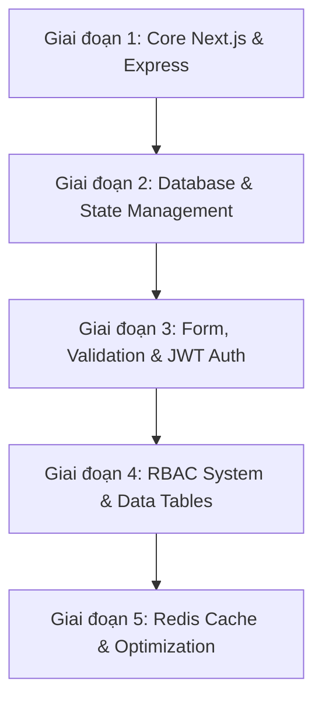

# 📚 TỔNG HỢP KIẾN THỨC CẦN HỌC ĐỂ THEO KÌP DỰ ÁN LOGIX

> **Mục đích:** Tài liệu này tổng hợp toàn bộ mảng kiến thức, công nghệ và lộ trình phát triển cần thiết để các thành viên mới nắm bắt và làm việc hiệu quả trong dự án **LogiX LMS**.  
> **Vị trí tài liệu:** `doc/03-tech-stack/LogiX_Knowledge_Roadmap.md`

---

## 🏛️ 1. TỔNG QUAN DỰ ÁN LOGIX

- **Mô hình kiến trúc**: Monorepo quản lý bởi `pnpm workspace` (`frontend/` + `backend/`).
- **Nghiệp vụ cốt lõi (Domain Knowledge)**: 
  - Hệ thống quản lý đào tạo & nhân sự F&B chuỗi cửa hàng / nhà máy (**LogiX LMS**).
  - Quản lý khóa học, bài giảng video, tài liệu SOP, bài thi trắc nghiệm (Quizzes).
  - Cây cơ cấu tổ chức (Stores, Departments, Positions).
  - Khóa học bắt buộc (An toàn thực phẩm ATTP, Onboarding, SOP).
  - Theo dõi tiến độ học tập real-time, cấp chứng chỉ PDF tự động.
  - **Hệ thống phân quyền chi tiết (RBAC - Role-Based Access Control)**.

---

## 🎨 2. MẢNG FRONTEND (NEXT.JS 16 + REACT 19 ECOSYSTEM)

Frontend của LogiX được thiết kế theo kiến trúc **Feature-Based Architecture** (`src/features/{admin, auth, hr, lms, users}`).

### 2.1 Core Framework
- **Next.js 16 (App Router)** & **React 19**: 
  - Phân biệt Server Components vs Client Components (`'use client'`).
  - File routing trong `src/app/` (`(auth)`, `(protected)`, `admin/`, `lms/`).
  - Dynamic Routes, Layouts, Middleware.
- **TypeScript**:
  - Type Safety cho Components, Custom Hooks, DTOs, API Response Types (`src/types/`).
  - Định nghĩa `interface` / `type` linh hoạt cho data tables và forms.

### 2.2 UI & Design System
- **Tailwind CSS v4**: Utility-first CSS framework thế hệ mới.
- **Radix UI & Shadcn UI**: Bộ UI components (Dialog, Sheet, Accordion, Popover, Select, Tabs, Tooltip, Avatar, Dropdown Menu).
- **Icon Set**: `lucide-react`.
- **Styling Utilities**: `clsx`, `tailwind-merge` (`cn()` helper), `class-variance-authority` (`cva`).

### 2.3 State Management & Data Fetching
- **@tanstack/react-query (v5)** *(Cực kỳ quan trọng)*:
  - Dùng để fetch, cache, revalidate server data.
  - Các khái niệm: `useQuery`, `useMutation`, `queryClient.invalidateQueries`, `queryKeys`.
- **Zustand**:
  - Quản lý Client State toàn cục (Auth token/user state trong `stores/auth.store.ts`, Theme state, Sidebar layout state).

### 2.4 Forms & Components Nâng Cao
- **React Hook Form + Zod**: Validate form phía client bằng Zod schema (`@hookform/resolvers/zod`).
- **TanStack Table (@tanstack/react-table v8)**: Quản lý bảng dữ liệu phức tạp (Phân trang, Lọc, Sắp xếp).
- **@tiptap/react**: Rich Text Editor tạo nội dung bài học.
- **@dnd-kit**: Drag & Drop kéo thả sắp xếp danh mục/bài học/gán phân quyền.
- **recharts**: Vẽ biểu đồ báo cáo tiến độ đào tạo.

---

## ⚙️ 3. MẢNG BACKEND (NODE.JS + EXPRESS + PRISMA + REDIS)

Backend của LogiX được thiết kế theo mô hình **Modular Architecture** (`src/modules/{auth, users, roles, permissions, courses, lessons, progress...}`).

### 3.1 Node.js & Express.js
- RESTful APIs (`router.get`, `router.post`, `router.put`, `router.delete`).
- Request handling: `req.params`, `req.query`, `req.body`.
- **Middleware Pattern**: 
  - Authentication Middleware (`auth.middleware.ts`).
  - Permission Checking Middleware (`permission.middleware.ts`).
  - Request Validation Middleware (`zod`).
  - Centralized Global Error Handler.

### 3.2 Database & ORM (PostgreSQL + Prisma)
- **PostgreSQL Database Design**:
  - Mối quan hệ: 1-1 (`User` - `UserAccount`), 1-N (`Course` - `CourseModule`), N-N (`Role` - `Permission` qua `RolePermission`).
  - UUID Primary Keys, Foreign Keys, Unique Indexing, Cascades.
- **Prisma ORM** *(Rất quan trọng)*:
  - File cấu hình `schema.prisma`.
  - Prisma CLI: `npx prisma migrate dev`, `npx prisma studio`, `npx prisma db seed`.
  - Prisma Client Queries: `findUnique`, `findMany`, `create`, `update`, `delete`, `include` (Join bảng), `select`.

### 3.3 Auth & Security
- **Password Hashing**: Mã hóa mật khẩu với `bcryptjs` (`bcrypt.hash`, `bcrypt.compare`).
- **JWT (JSON Web Token)**: Mechanism tạo & kiểm tra `Access Token` (thời hạn ngắn) và `Refresh Token` (lưu DB/Cookie).
- **CORS & Env**: Cấu hình `cors` và quản lý biến môi trường với `dotenv`.

### 3.4 Caching & Optimization (Redis)
- **ioredis**: Cache danh sách quyền người dùng (`permissions:{userId}`) giúp loại bỏ việc JOIN 4-5 bảng DB ở mỗi API request.
- **Cache Invalidation Strategy**: Xóa cache khi Admin cập nhật phân quyền/vai trò.
- **Fallback Mechanism**: Cơ chế ngắt mềm tự chuyển về DB nếu Redis Server tạm dừng.

---

## 🔐 4. MÔ HÌNH PHÂN QUYỀN CHI TIẾT (RBAC SYSTEM)

- **Chuỗi dữ liệu phân quyền**:
  $$\text{User} \longrightarrow \text{UserRole} \longrightarrow \text{Role} \longrightarrow \text{RolePermission} \longrightarrow \text{Permission}$$
- **Mã Quyền (Permission Code)**: Định dạng `MODULE.ACTION` (Ví dụ: `USER.READ`, `USER.CREATE`, `COURSE.WRITE`, `ATTP.VIEW`).
- **Áp dụng thực tế**:
  - **Backend**: Middleware kiểm tra `req.user` xem có chứa Permission Code tương ứng trước khi truy cập route.
  - **Frontend**: Render giao diện có điều kiện (Conditional Rendering) ẩn/hiện nút bấm, trang admin dựa trên danh sách quyền của user.

---

## 🗺️ 5. LỘ TRÌNH HỌC THEO TỪNG GIAI ĐOẠN (ROADMAP)

### 📅 Chi tiết các bước học:
- **Giai đoạn 1 (Nền tảng Core)**: TypeScript, Next.js 16 App Router, Tailwind CSS, Express Router & Middleware.
- **Giai đoạn 2 (Database & State)**: PostgreSQL, Prisma ORM queries/migrations, TanStack React Query v5, Zustand.
- **Giai đoạn 3 (Xác thực & Form)**: Mã hóa password `bcrypt`, JWT Auth tokens, React Hook Form + Zod validation.
- **Giai đoạn 4 (Phân quyền & UI Nâng cao)**: Mô hình RBAC `MODULE.ACTION`, TanStack Table, Drag & Drop (`dnd-kit`).
- **Giai đoạn 5 (Tối ưu hóa)**: Redis Caching, Cache Invalidation, Refactoring & Performance tuning.
