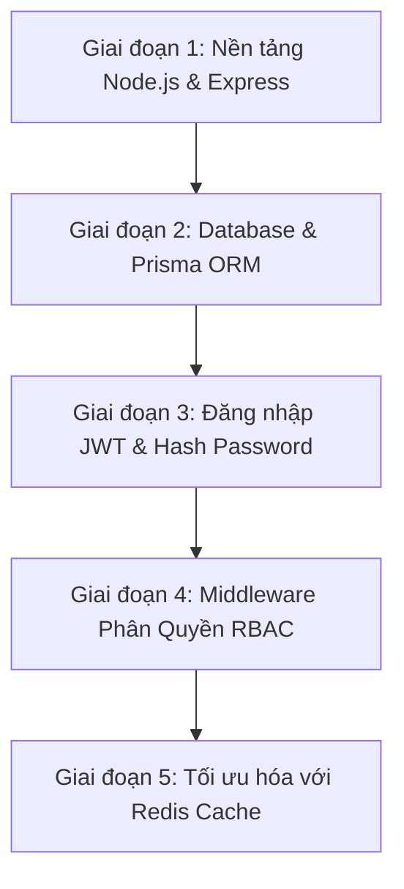

# 📚 TỔNG QUAN TECHSTACK & LỘ TRÌNH KIẾN THỨC CẦN ÔN TẬP (LOGIX BACKEND)

> **Mục đích:** Bảng tổng hợp toàn bộ các công nghệ, thư viện, khái niệm cốt lõi được sử dụng trong dự án **LogiX Backend**, giúp bạn dễ dàng tra cứu, hình dung bức tranh tổng thể và lập lộ trình học/ôn tập hiệu quả.  
> **Tham chiếu:** [[Backend_Setup_Guide]] · [[Auth_Permission_System_Design]] · [[Database_Design_Document]]

---

## ❓ 1. GIẢI THÍCH CHI TIẾT: REDIS LÀ GÌ & TẠI SAO CẦN DÙNG?

### 1.1. Redis là gì?
**Redis** (viết tắt của *Remote Dictionary Server*) là một **Cơ sở dữ liệu lưu hoàn toàn trên bộ nhớ RAM (In-Memory Data Structure Store)** dạng Key-Value (Khóa - Giá trị).

* **So sánh với Database truyền thống (PostgreSQL, SQLite, MySQL):**
  * **Database thường:** Dữ liệu ghi trên ổ cứng (HDD/SSD). Mỗi lần đọc/ghi phải thông qua đĩa cứng, tốc độ mất khoảng $10 - 50ms$.
  * **Redis:** Dữ liệu nằm trực tiếp trên thanh RAM. Tốc độ đọc/ghi đạt mức siêu tốc dưới **$1ms$ (nhanh gấp 50 - 100 lần)**.

---

### 1.2. Tại sao dự án LogiX lại đưa Redis vào sử dụng?

Trong dự án LogiX, chúng ta có bài toán **Phân quyền chi tiết (RBAC - Role Based Access Control)**:

1. **Vấn đề nếu KHÔNG có Redis:**
   * Mỗi khi người dùng bấm click trên web (VD: Xem bài học, Sửa khóa học, Nộp bài tập...), Frontend đều gửi 1 Request API tới Backend.
   * Để biết người dùng đó có quyền hay không, Backend phải truy vấn Database (JOIN 4 bảng: `User` $\rightarrow$ `UserRole` $\rightarrow$ `Role` $\rightarrow$ `RolePermission` $\rightarrow$ `Permission`).
   * Nếu có 1,000 người dùng cùng online, Database sẽ bị **quá tải và nghẽn mạng (Bottleneck)** vì phải lặp đi lặp lại việc truy vấn quyền.

2. **Giải pháp khi CÓ Redis:**
   * Khi người dùng đăng nhập hoặc gửi Request đầu tiên, Backend tra cứu DB 1 lần duy nhất để lấy danh sách quyền (VD: `["COURSE.READ", "COURSE.CREATE"]`).
   * Backend lưu ngay danh sách quyền này vào Redis RAM với key: `permissions:{userId}` và cài thời gian tự xóa (**TTL - Time To Live**) là 10 phút.
   * **Từ request thứ 2 trở đi:** Backend chỉ mất đúng **$1ms$** hỏi Redis trên RAM xem user có quyền không. Database hoàn toàn "rảnh tay" để xử lý logic khác!

3. **Nếu chưa cài Redis thì project có chạy được không?**
   * Trong code file `src/config/redis.ts` và `permission.service.ts`, chúng ta đã viết sẵn cơ chế **Fallback (Ngắt mềm)**: Nếu chưa bật Redis Server, hệ thống sẽ tự động chuyển sang truy vấn DB trực tiếp mà không gây crash app.

---

## 🧰 2. BẢNG TỔNG HỢP TECHSTACK & DANH MỤC THƯ VIỆN

Dưới đây là toàn bộ các thư viện được cài đặt trong `package.json` của Backend và lý do sử dụng:

| Tên thư viện | Loại | Chức năng chính | Độ ưu tiên cần học |
| :--- | :--- | :--- | :---: |
| **`express`** | Core | Web Framework tạo HTTP Server, Route & Middleware | ⭐⭐⭐⭐⭐ (Bắt buộc) |
| **`typescript`** | Core | Ngôn ngữ gõ kiểu tĩnh (Static Typing) tránh lỗi runtime | ⭐⭐⭐⭐⭐ (Bắt buộc) |
| **`@prisma/client` & `prisma`** | ORM | Thư viện làm việc với Database (Query, Migrate, Seed) | ⭐⭐⭐⭐⭐ (Bắt buộc) |
| **`jsonwebtoken`** | Auth | Tạo & Kiểm tra Access Token / Refresh Token (JWT) | ⭐⭐⭐⭐⭐ (Bắt buộc) |
| **`bcryptjs`** | Security | Băm (Hash) mật khẩu an toàn trước khi lưu DB | ⭐⭐⭐⭐ (Rất cần) |
| **`ioredis`** | Cache | Thư viện Node.js kết nối & thao tác với Redis Server | ⭐⭐⭐ (Nên biết) |
| **`zod`** | Utility | Validate dữ liệu đầu vào (Email, độ dài mật khẩu...) | ⭐⭐⭐ (Nên biết) |
| **`cors`** | Security | Cho phép Frontend (Port 3000) gọi API Backend (Port 5000) | ⭐⭐⭐ (Khái niệm) |
| **`dotenv`** | Utility | Nạp các biến cấu hình bí mật từ file `.env` | ⭐⭐ (Cấu hình) |
| **`ts-node-dev`** | Dev Tool | Tự động khởi động lại Server khi bạn sửa code `.ts` | ⭐⭐ (Công cụ) |

---

## 🧠 3. CHI TIẾT CÁC MẢNG KIẾN THỨC CẦN ÔN TẬP (KÈM KHÁI NIỆM CỐT LÕI)

### 🟢 Mảng 1: Node.js & TypeScript Căn Bản
1. **Nền tảng Node.js**:
   * Khái niệm **Asynchronous (Bất đồng bộ)**: `Promise`, `async/await`.
   * Cấu trúc `try...catch` xử lý ngoại lệ.
   * `process.env`: Đọc biến môi trường.
2. **TypeScript căn bản**:
   * Kiểu dữ liệu cơ bản: `string`, `number`, `boolean`, `array`, `any`.
   * `interface` & `type`: Định nghĩa cấu trúc Object (VD: Định nghĩa kiểu dữ liệu `User`, `ReqBody`).
   * Dynamic Type Extension: Mở rộng type của Express `req.user`.

---

### 🔵 Mảng 2: Express.js Framework
1. **Express Router**:
   * Đặt đường dẫn API: `router.get()`, `router.post()`, `router.put()`, `router.delete()`.
   * Lấy dữ liệu từ Request: `req.body` (JSON gửi lên), `req.params` (Tham số URL `:id`), `req.query` (`?search=abc`).
2. **Middleware Pattern (Mẫu Trung Gian - Rất quan trọng)**:
   * Khái niệm Middleware: Là một hàm nằm ở giữa Request gửi lên và Route Handler cuối cùng, nhận vào 3 tham số `(req, res, next)`.
   * Gọi `next()` để chuyển sang bước tiếp theo, hoặc `res.status().json()` để chặn lại.
   * Viết Middleware xác thực JWT (`auth.middleware.ts`).
   * Viết Middleware phân quyền (`permission.middleware.ts`).
3. **Global Error Handling**:
   * Viết Middleware hứng lỗi toàn cục `(err, req, res, next)` để server không bị nghẽn hay sập khi gặp lỗi bất ngờ.

---

### 🟣 Mảng 3: Database & Prisma ORM
1. **Cơ sở dữ liệu Quan hệ (RDBMS)**:
   * Bảng (Table), Khóa chính (Primary Key - PK), Khóa ngoại (Foreign Key - FK).
   * Các mối quan hệ: **1 - 1** (`User` - `UserAccount`), **1 - N** (`Course` - `Section`), **N - N** (`User` - `Role` qua `UserRole`).
2. **Prisma ORM**:
   * Cú pháp file `schema.prisma`: Khai báo `@id @default(uuid())`, `@relation(...)`, `@unique`.
   * Các lệnh CLI:
     * `npx prisma migrate dev`: Tạo và cập nhật bảng dưới Database.
     * `npx prisma studio`: Mở giao diện Web trực quan xem dữ liệu DB.
     * `npx prisma db seed`: Chạy file seed tạo dữ liệu mẫu ban đầu.
   * Cú pháp query Prisma Client trong code:
     * `prisma.user.findUnique({ where: { email } })`
     * `prisma.user.create({ data: { ... } })`
     * `prisma.user.findMany({ include: { userRoles: true } })` (Join bảng).

---

### 🟡 Mảng 4: Xác Thực & Bảo Mật (Authentication & Security)
1. **Mật khẩu & Băm mật khẩu (Hashing)**:
   * Tuyệt đối **không lưu mật khẩu dạng chữ rõ (Plaintext)** vào DB.
   * Dùng `bcrypt.hash(password, 10)` để mã hóa 1 chiều trước khi lưu.
   * Dùng `bcrypt.compare(password, passwordHash)` để kiểm tra mật khẩu khi đăng nhập.
2. **JSON Web Token (JWT)**:
   * **Access Token**: Chuỗi mã hóa gửi kèm Header `Authorization: Bearer <token>` ở mỗi request. Thời hạn ngắn (15 phút).
   * **Refresh Token**: Chuỗi mã hóa bí mật lưu trong DB `UserAccount` để cấp lại Access Token mới khi hết hạn mà không bắt user đăng nhập lại.
   * Cú pháp: `jwt.sign(payload, secret, { expiresIn })` và `jwt.verify(token, secret)`.

---

### 🔴 Mảng 5: Redis Cache (Mức độ Nâng cao / Mở rộng)
1. **Khái niệm Key - Value & TTL**:
   * `redis.set('key', 'value', 'EX', 600)`: Lưu giá trị và tự xóa sau 600 giây.
   * `redis.get('key')`: Lấy giá trị từ RAM.
   * `redis.del('key')`: Xóa cache.
2. **Chiến lược Invalidation (Xóa cache đúng lúc)**:
   * Khi Admin sửa quyền của Role, gọi lệnh xóa key Redis của tất cả User thuộc Role đó để nạp lại dữ liệu mới nhất.

---

## 🗺️ 4. LỘ TRÌNH GỢI Ý ĐỂ HỌC & LÀM THEO THỨ TỰ (ROADMAP)

### Chi tiết các bước học:

* **Tuần 1 (Tập trung Core BE)**: Ôn tập Express.js Router, cách nhận `req.body`, trả về `res.json()`, và cách viết một Middleware đơn giản.
* **Tuần 2 (Tập trung Database)**: Đọc file `prisma/schema.prisma`, tập chạy `prisma migrate`, viết hàm tạo User và query User với Prisma Client.
* **Tuần 3 (Tập trung Auth)**: Làm tính năng Đăng ký (`/api/auth/register`) mã hóa password bằng `bcrypt`, Đăng nhập (`/api/auth/login`) trả về `accessToken` JWT.
* **Tuần 4 (Phân quyền & Caching)**: Tạo Middleware `requirePermission('COURSE.CREATE')`, thực hành gọi DB kiểm tra quyền trước, sau đó tích hợp `ioredis` để cache kết quả.
