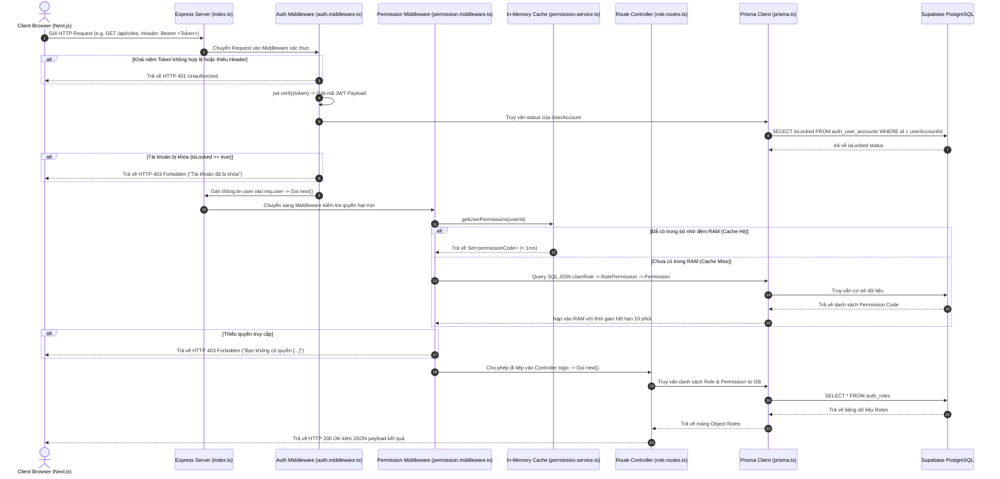

# 🛠️ KIẾN TRÚC & LUỒNG HOẠT ĐỘNG BACKEND EXPRESS.JS (EXPRESS BACKEND DEEP-DIVE)

> **Dự án:** LogiX LMS Enterprise  
> **Thư mục mã nguồn Backend:** `Practice/LogiX/backend`  
> **Tài liệu cho người mới bắt đầu (Beginner to Advanced Guide)**  
> **Ngày cập nhật:** 07/08/2026

---

## 🎯 1. TỔNG QUAN VỀ BACKEND EXPRESS.JS

Backend của **LogiX LMS** đóng vai trò là **API Server trung tâm (RESTful APIs)** xử lý toàn bộ các thao tác nghiệp vụ, bảo mật xác thực, phân quyền hạt mịn và giao tiếp trực tiếp với cơ sở dữ liệu **Supabase PostgreSQL Cloud**.

### 🧰 Công nghệ sử dụng trong Backend:
- **Express.js (v4):** Web framework siêu nhẹ, linh hoạt cho Node.js.
- **TypeScript (v5):** Đảm bảo tính chặt chẽ về kiểu dữ liệu (Type-safe), tránh lỗi runtime.
- **Prisma ORM (v5.22):** Trình truy vấn cơ sở dữ liệu hiện đại, tự động sinh TypeScript Types từ Database Schema.
- **BcryptJS:** Mã hóa một chiều (Hashing) mật khẩu người dùng trước khi lưu vào DB.
- **JSON Web Token (JWT):** Cấp phát Access Token (15 phút) và Refresh Token (7 ngày) bảo mật.
- **ts-node-dev:** Công cụ hot-reload hỗ trợ vừa code vừa chạy thử Backend không cần compile thủ công.

---

## 📂 2. CẤU TRÚC THƯ MỤC BACKEND (`backend/`)

```
backend/
├── prisma/
│   ├── schema.prisma       # Model định nghĩa 15 bảng DB (ERP Auth + Org + LMS)
│   └── seed.ts             # Script nạp dữ liệu mẫu ban đầu vào Supabase DB
├── src/
│   ├── config/
│   │   └── prisma.ts       # Singleton instance khởi tạo Prisma Client
│   ├── middlewares/
│   │   ├── auth.middleware.ts       # Middleware kiểm tra Token & Tài khoản bị khóa
│   │   └── permission.middleware.ts # Middleware phân quyền hạt mịn theo mã quyền
│   ├── routes/
│   │   ├── auth.ts                  # Controller Xử lý Đăng nhập/Refresh/Me
│   │   ├── role.routes.ts           # Controller Quản lý Vai trò (Roles) & Gán User
│   │   ├── permission.routes.ts     # Controller Danh mục Mã quyền (Permissions)
│   │   ├── department.routes.ts     # Controller Sơ đồ Tổ chức (Departments)
│   │   ├── courses.ts               # Controller Khóa học LMS
│   │   ├── lessons.ts               # Controller Bài học LMS
│   │   ├── quizzes.ts               # Controller Bài thi LMS
│   │   └── progress.ts              # Controller Tiến độ Học viên LMS
│   ├── services/
│   │   └── permission.service.ts    # Service truy vấn SQL & Bộ nhớ đệm Cache (10m)
│   └── index.ts            # Điểm khởi chạy (Entrypoint) của Express Server
├── .env                    # Biến môi trường (DATABASE_URL, JWT_SECRET, PORT)
├── package.json            # Khai báo thư viện & các lệnh npm script
└── tsconfig.json           # Cấu hình biên dịch TypeScript
```

---

## ⚡ 3. VAI TRÒ CỦA TỪNG FILE TRONG BACKEND (FILE-BY-FILE BREAKDOWN)

| File | Vai trò & Trách nhiệm trong dự án |
|---|---|
| **`src/index.ts`** | **Trái tim của Server:** Khởi tạo app Express, cấu hình CORS, JSON Body Parser, đăng ký tất cả các nhóm Routes (`/api/auth`, `/api/roles`, `/api/permissions`, `/api/departments`, `/api/courses`...) và lắng nghe cổng `PORT 5000`. |
| **`prisma/schema.prisma`** | **Bản thiết kế DB:** Định nghĩa 15 bảng theo chuẩn 1-to-1 ERP-v2 Auth (`auth_users`, `auth_user_accounts`, `auth_roles`, `auth_permissions`...) và cấu hình xuất Prisma Client vào `node_modules/.prisma/client`. |
| **`src/config/prisma.ts`** | **Kết nối DB:** Khởi tạo đối tượng `new PrismaClient()` dạng Singleton. Toàn bộ dự án sẽ dùng chung 1 kết nối này để tránh kiệt sức kết nối (Connection Pool Exhaustion) tới Supabase. |
| **`src/middlewares/auth.middleware.ts`** | **Vệ sĩ cổng vào:** Đọc Token từ HTTP Header `Authorization: Bearer <token>`, giải mã JWT, tìm `UserAccount` trong DB và **chặn ngay nếu `isLocked == true`**. Nếu hợp lệ, gán thông tin vào `req.user`. |
| **`src/middlewares/permission.middleware.ts`** | **Chốt chặn phân quyền:** Hàm `requirePermission('ROLE.MANAGE')` kiểm tra xem User hiện tại có mã quyền được yêu cầu hay không. Nếu không có, lập tức trả về `HTTP 403 Forbidden`. |
| **`src/services/permission.service.ts`** | **Bộ não tính toán quyền:** Thực hiện SQL JOIN giữa `UserRole` $\rightarrow$ `RolePermission` $\rightarrow$ `Permission`. Tích hợp bộ nhớ đệm **In-Memory Cache (TTL 10 phút)** giúp tốc độ phản hồi $< 1ms$. |
| **`src/routes/auth.ts`** | **Xử lý Authentication:** Nơi thực thi logic Đăng nhập (`/login`), Refresh Token (`/refresh`), và lấy Thông tin bản thân (`/me`). Tự động đếm sai mật khẩu 5 lần để tự khóa tài khoản. |
| **`src/routes/role.routes.ts`** | **Xử lý Admin Roles:** Các API lấy danh sách Role, tạo/sửa/xóa Role, gán danh sách Permission cho Role, và đồng bộ danh sách User thuộc Role (`PUT /api/roles/:id/users`). |
| **`src/seed.ts`** | **Script tạo dữ liệu mẫu:** Xóa sạch dữ liệu cũ và bơm mới Dữ liệu mẫu (Cửa hàng, Bộ phận, Danh mục Quyền, 2 Vai trò `ADMIN` & `STUDENT`, Super Admin `admin@bahung.com`). |

---

## 🔄 4. LUỒNG XỬ LÝ SỰ KIỆN KHI CÓ REQUEST (REQUEST LIFECYCLE FLOW)

Dưới đây là sơ đồ chi tiết luồng dữ liệu đi qua Backend từ khi Client bấm nút trên giao diện cho đến khi nhận được dữ liệu phản hồi từ DB:



---

## 💡 5. HƯỚNG DẪN CHẠY VÀ DEBUG BACKEND

1. **Khởi chạy Backend ở chế độ Development (Hot Reload):**
   ```bash
   pnpm dev:be
   # Server lắng nghe tại http://localhost:5000
   ```

2. **Cập nhật Schema DB & Sinh lại Prisma Client:**
   Mỗi khi thay đổi file `backend/prisma/schema.prisma`, bạn cần chạy:
   ```bash
   # Push trực tiếp thay đổi lên Supabase DB
   npx prisma db push
   
   # Sinh lại thư viện gõ lệnh Prisma Client
   npx prisma generate
   ```

3. **Nạp lại dữ liệu mẫu (Reset & Seed Data):**
   ```bash
   npx ts-node-dev src/seed.ts
   ```
