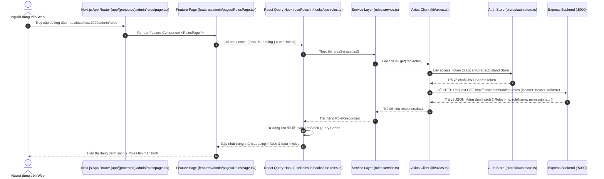

# 💻 KIẾN TRÚC & LUỒNG HOẠT ĐỘNG FRONTEND NEXT.JS (FRONTEND NEXTJS DEEP-DIVE)

> **Dự án:** LogiX LMS Enterprise  
> **Thư mục mã nguồn Frontend:** `Practice/LogiX/frontend`  
> **Tài liệu cho người mới bắt đầu (Beginner to Advanced Guide)**  
> **Ngày cập nhật:** 07/08/2026

---

## 🎯 1. TỔNG QUAN VỀ FRONTEND NEXT.JS

Frontend của **LogiX LMS** được xây dựng trên nền tảng **Next.js 16 (App Router)** kết hợp với **React 19**, mang lại giao diện hiện đại, mượt mà, tối ưu hóa SEO và hỗ trợ trải nghiệm người dùng cao cấp (Glassmorphism, Dark Mode, Micro-animations).

### 🧰 Công nghệ sử dụng trong Frontend:
- **Next.js 16 (App Router):** Framework hàng đầu cho React với định tuyến File-based Routing và Turbopack bundler siêu tốc.
- **TypeScript (v5):** Đảm bảo an toàn kiểu dữ liệu từ API DTO cho đến React Props.
- **TailwindCSS & Vanilla CSS:** Hệ thống Style linh hoạt, hỗ trợ mượt mà cả chế độ Light Mode & Dark Mode.
- **Shadcn UI & Lucide React:** Bộ thư viện Component giao diện atomic chuẩn chỉnh (Button, Input, Table, Sheet, Dialog, Avatar, Skeleton...).
- **Zustand Store:** Thư viện quản lý trạng thái toàn cục (Global State) siêu nhẹ cho Auth Token, User Info, Permissions.
- **TanStack Query (React Query v5):** Quản lý Asynchronous State, tự động Caching, Re-fetching và xử lý trạng thái Loading/Error từ API.
- **Axios:** Thư viện gửi HTTP Request với Interceptor tự động đính kèm Bearer Token và tự động Refresh Token.

---

## 📂 2. CẤU TRÚC THƯ MỤC FRONTEND (`frontend/src/`)

```
frontend/
├── src/
│   ├── app/                         # Định tuyến Next.js App Router (File-based Routing)
│   │   ├── (auth)/
│   │   │   └── login/page.tsx       # Trang Đăng nhập hệ thống (/login)
│   │   ├── (protected)/
│   │   │   ├── layout.tsx           # Layout chung bảo vệ các trang đăng nhập
│   │   │   ├── admin/               # Nhóm các trang Quản trị Admin
│   │   │   │   ├── roles/page.tsx   # Trang Quản lý Vai trò (/admin/roles)
│   │   │   │   ├── permissions/     # Trang Danh mục Quyền (/admin/permissions)
│   │   │   │   ├── departments/     # Trang Sơ đồ Tổ chức (/admin/departments)
│   │   │   │   ├── employees/       # Trang Quản lý Nhân sự (/admin/employees)
│   │   │   │   ├── job-levels/      # Trang Cấp bậc Công việc (/admin/job-levels)
│   │   │   │   ├── custom-fields/   # Trang Trường Tùy chỉnh (/admin/custom-fields)
│   │   │   │   └── role-hierarchy/  # Trang Sơ đồ Cây Phân quyền (/admin/role-hierarchy)
│   │   │   └── lms/                 # Nhóm các trang Học viên Portal (/lms/dashboard, /lms/courses...)
│   │   ├── forbidden/page.tsx       # Trang báo lỗi 403 Thiếu quyền (/forbidden)
│   │   ├── layout.tsx               # Root Layout toàn dự án (Providers, Font, Theme)
│   │   └── page.tsx                 # Trang chủ Landing Page
│   ├── components/
│   │   ├── auth/
│   │   │   └── PermissionGuard.tsx  # Component ẩn/hiện nút bấm dựa vào permissionCode
│   │   ├── shared/
│   │   │   ├── AppSidebar.tsx       # Navigation Sidebar hệ thống (LMS + Group Admin)
│   │   │   └── Header.tsx           # Topbar Header
│   │   └── ui/                      # Các Atomic UI components (Button, Input, Table, Sheet...)
│   ├── config/
│   │   ├── api-routes.ts            # Khai báo các đường dẫn API Endpoint Backend
│   │   └── route-path.ts            # Khai báo các đường dẫn URL Frontend
│   ├── features/                    # Kiến trúc Feature-Driven (Mỗi module đứng độc lập)
│   │   ├── admin/                   # Module Quản trị Admin
│   │   │   ├── components/          # Table, Sheet, Dialog UI riêng của Admin
│   │   │   ├── hooks/               # React Query hooks (useRoles, useDepartments...)
│   │   │   ├── pages/               # Feature Pages (RolesPage, PermissionsPage...)
│   │   │   ├── schemas/             # Zod form validation schemas
│   │   │   ├── services/            # API Services (roles.service, departments.service...)
│   │   │   └── types/               # TypeScript interfaces & DTOs
│   │   ├── auth/                    # Module Xác thực (Login, Auth Service, Zustand Store)
│   │   └── lms/                     # Module LMS (Courses, Lessons, Progress)
│   ├── hooks/                       # Custom React Hooks chung (useDebounce, useTheme...)
│   ├── lib/
│   │   ├── api.ts                   # Utility bọc apiCall.get, apiCall.post...
│   │   ├── axios.ts                 # Axios Instance + Token Request/Response Interceptor
│   │   ├── dnd-modifiers.ts         # Modifier kéo thả dnd-kit
│   │   └── utils.ts                 # Hàm helper Tailwind classnames (cn)
│   └── stores/
│       └── auth.store.ts            # Zustand Store lưu User, Token & Permissions
├── next.config.ts                   # Cấu hình Next.js (Proxy Rewrites trỏ về :5000)
├── package.json                     # Danh sách thư viện & scripts
└── tailwind.config.js               # Cấu hình hệ màu & thiết kế UI Tailwind
```

---

## ⚡ 3. VAI TRÒ CỦA TỪNG FILE VÀ COMPONENT TRONG FRONTEND

| File / Component | Vai trò & Trách nhiệm trong dự án |
|---|---|
| **`src/app/layout.tsx`** | **Root Layout:** Bọc toàn bộ ứng dụng bằng các Provider như `ReactQueryProvider`, `ThemeProvider` (Dark/Light Mode), `Toaster` (thông báo Toast). |
| **`src/app/(protected)/admin/roles/page.tsx`** | **App Router Route:** Đường dẫn trang `/admin/roles` kết nối từ URL của trình duyệt đến Feature Component `RolesPage` trong `features/admin`. |
| **`src/components/shared/AppSidebar.tsx`** | **Navigation Sidebar:** Thanh điều hướng dọc bên trái màn hình. Được chia làm 2 phần rõ rệt: Menu Học tập LMS và **Nhóm Quản trị Admin** (Roles, Permissions, Departments, Employees...). |
| **`src/components/auth/PermissionGuard.tsx`** | **Bảo vệ Giao diện:** Component bọc UI. Ví dụ: `<PermissionGuard permission="COURSE.CREATE"><Button>Tạo khóa học</Button></PermissionGuard>`. Nếu User không có quyền, nút bấm sẽ tự động ẩn khỏi DOM. |
| **`src/lib/axios.ts`** | **Trình gửi Request thông minh:** Cấu hình Base URL `http://localhost:5000`. Tự động gắn header `Authorization: Bearer <token>` trước khi gửi request đi. Khi nhận về lỗi 401, tự động gọi API `/api/auth/refresh` để đổi Token mới mà người dùng không bị văng ra ngoài. |
| **`src/lib/api.ts`** | **Wrapper gọi API:** Cung cấp đối tượng `apiCall.get()`, `apiCall.post()`, `apiCall.put()`, `apiCall.delete()` bóc tách sẵn dữ liệu `response.data` giúp code gọn gàng. |
| **`src/stores/auth.store.ts`** | **Kho chứa trạng thái Đăng nhập (Zustand):** Lưu thông tin `user`, `accessToken`, và mảng `permissions`. Hỗ trợ lưu trữ bền vững qua `localStorage` và hàm helper `hasPermission('ROLE.MANAGE')`. |
| **`src/features/admin/hooks/use-roles.ts`** | **React Query Hook:** Quản lý việc fetch danh sách Role, caching dữ liệu, và tự động gọi `invalidateQueries` cập nhật lại UI ngay lập tức khi Admin thêm/sửa/xóa Role. |
| **`next.config.ts`** | **File cấu hình Proxy:** Định nghĩa hàm `rewrites()` tự động điều hướng tất cả các truy vấn `/api/*` trên trình duyệt về server Backend Express `http://localhost:5000/api/*`. |

---

## 🔄 4. LUỒNG HIỂN THỊ VÀ XỬ LÝ DỮ LIỆU FRONTEND (COMPONENT & DATA FLOW)

Dưới đây là sơ đồ Mermaid mô tả luồng hoạt động từ khi người dùng nhấp chuột vào một trang Admin cho đến khi dữ liệu hiển thị lên giao diện màn hình:



---

## 💡 5. HƯỚNG DẪN CHẠY VÀ DEBUG FRONTEND

1. **Khởi chạy Frontend ở chế độ Development:**
   ```bash
   pnpm dev:fe
   # Giao diện chạy tại http://localhost:3000
   ```

2. **Kiểm tra lỗi biên dịch TypeScript (Build Check):**
   ```bash
   npx tsc --noEmit
   # Đảm bảo kết quả trả về 0 Error
   ```

3. **Lưu ý về Lỗi Hydration trong Next.js:**
   - Thẻ đoạn văn `<p>` **không được chứa** thẻ phần tử khối như `<div>` (ví dụ: `<Skeleton />` render ra `<div>`).
   - Luôn sử dụng `<div className="...">` hoặc `<span className="block ...">` khi chứa các component loading.
