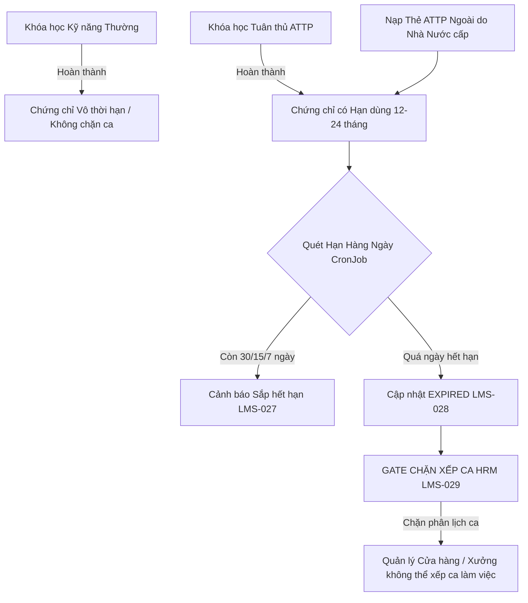

# 🛡️ PHÂN TÍCH BẢN CHẤT & HƯỚNG DẪN KIỂM THỬ (DOMAIN: AN TOÀN THỰC PHẨM & CHỨNG CHỈ) - BA HÙNG LMS

> **Mã Domain:** ATTP & Chứng chỉ Tuân thủ (Food Safety Compliance & Certification)  
> **Phạm vi chức năng:** `LMS-022` $\rightarrow$ `LMS-032`  
> **Kiến trúc áp dụng:** Monorepo LogiX (Lõi Core LMS + Module Tuân thủ Doanh nghiệp F&B)  
> **Tài liệu đối chiếu:** [BaHung-DB-Design.md](file:///c:/Projects/DigiFnb/Practice/LogiX/doc/06-database/BaHung-DB-Design.md) & [LMS-Unified-Function-and-DB-Context.md](file:///c:/Projects/DigiFnb/Practice/LogiX/doc/04-tracking-sprints/LMS-Unified-Function-and-DB-Context.md)

---

## 💡 GIẢI ĐÁP BẢN CHẤT: "KHÓA HỌC ATTP & CHỨNG CHỈ CÓ PHẢI CHỈ LÀ KHÓA HỌC & CHỨNG CHỈ BÌNH THƯỜNG?"

### 1. Về mặt Lõi Đào tạo (Core LMS) $\rightarrow$ **ĐÚNG, 100% LÀ KHÓA HỌC CHUẨN**
* Khóa học **An toàn thực phẩm (ATTP)** vẫn được cấu thành từ các thành phần tiêu chuẩn của hệ thống:
  * Được lưu trong bảng `Course` (`crs_courses`) với danh mục `categoryId = "ATTP"`.
  * Có đầy đủ Chương (`CourseModule`), Bài học Video SOP rửa tay/vệ sinh (`Lesson`), Tài liệu quy chuẩn (`PDF / RichText`).
  * Có bài kiểm tra trắc nghiệm (`Quiz`) với điều kiện đạt nghiêm ngặt (`passScore = 80%` hoặc `100%`).
  * Khi học viên hoàn thành, hệ thống sinh ra một bản ghi xác nhận tốt nghiệp (`Certificate`).

### 2. Về mặt Nghiệp vụ Doanh nghiệp Chuỗi F&B $\rightarrow$ **ĐÂY LÀ "MODULE TUÂN THỦ PHÁP LÝ & VẬN HÀNH" (COMPLIANCE LAYER)**
Sở dĩ danh sách chức năng từ **LMS-022 đến LMS-032** được tách thành nhóm nghiệp vụ riêng biệt và được xếp vào các giai đoạn mở rộng vì nó sở hữu **4 đặc tính nghiệp vụ vượt trội** so với khóa học thông thường:



1. **Vòng đời có Thời hạn (`expiry_date` & `default_valid_months`):** Chứng chỉ thông thường có giá trị vĩnh viễn, nhưng thẻ ATTP F&B bắt buộc tái đào tạo sau **12 tháng hoặc 24 tháng**.
2. **Nạp chứng chỉ ngoài (`is_external = true` - LMS-024):** Cho phép nhân sự mới nạp Giấy chứng nhận ATTP do Trung tâm Y tế cấp từ trước để vào làm ngay mà không phải chờ học lại.
3. **Cơ chế Cảnh báo tự động (Notification Engine - LMS-027, LMS-028):** Tự động gửi thông báo trước 30/15/7 ngày khi chứng chỉ sắp hết hạn để nhắc nhở nhân sự thi gia hạn.
4. **Chặn Xếp ca Lịch làm việc HRM (Shift Gate - LMS-029):** Tích hợp sâu vào hệ thống xếp ca HRM. Nếu nhân viên hết hạn ATTP $\rightarrow$ **Chặn không cho Quản lý cửa hàng xếp ca làm việc** để tránh bị đoàn kiểm tra y tế/thị trường xử phạt.

---

## 📑 MỤC LỤC CHI TIẾT CÁC CHỨC NĂNG (LMS-022 $\rightarrow$ LMS-032)

1. [LMS-022: Tạo khóa đào tạo ATTP bắt buộc](#1-lms-022-tạo-khóa-đào-tạo-attp-bắt-buộc)
2. [LMS-023: Ghi nhận hoàn thành ATTP nội bộ](#2-lms-023-ghi-nhận-hoàn-thành-attp-nội-bộ)
3. [LMS-024: Ghi nhận chứng chỉ ATTP ngoài](#3-lms-024-ghi-nhận-chứng-chỉ-attp-ngoài)
4. [LMS-025: Lưu ngày cấp chứng chỉ ATTP](#4-lms-025-lưu-ngày-cấp-chứng-chỉ-attp)
5. [LMS-026: Lưu ngày hết hạn chứng chỉ ATTP](#5-lms-026-lưu-ngày-hết-hạn-chứng-chỉ-attp)
6. [LMS-027: Cảnh báo chứng chỉ ATTP sắp hết hạn](#6-lms-027-cảnh-báo-chứng-chỉ-attp-sắp-hết-hạn)
7. [LMS-028: Cảnh báo chứng chỉ ATTP đã hết hạn](#7-lms-028-cảnh-báo-chứng-chỉ-attp-đã-hết-hạn)
8. [LMS-029: Chặn xếp ca làm việc nếu thiếu ATTP](#8-lms-029-chặn-xếp-ca-làm-việc-nếu-thiếu-attp)
9. [LMS-030: In / Xuất giấy xác nhận chứng nhận ATTP](#9-lms-030-in--xuất-giấy-xác-nhận-chứng-nhận-attp)
10. [LMS-031: Quản lý các loại chứng chỉ khác](#10-lms-031-quản-lý-các-loại-chứng-chỉ-khác)
11. [LMS-032: Gắn chứng chỉ vào hồ sơ nhân viên](#11-lms-032-gắn-chứng-chỉ-vào-hồ-sơ-nhân-viên)

---

---

## 1. LMS-022: TẠO KHÓA ĐÀO TẠO ATTP BẮT BUỘC

> **Mô tả:** Tạo khóa học đặc thù về An toàn vệ sinh thực phẩm với cờ phân loại `courseType = 'ATTP'` và `isMandatory = true`. Khóa học này là điều kiện tiên quyết bắt buộc với 100% nhân viên Cửa hàng và Xưởng sản xuất.

### 📂 1.1. Luồng mở file Backend (BE)
1. **Model Database:** [`backend/prisma/schema.prisma`](file:///c:/Projects/DigiFnb/Practice/LogiX/backend/prisma/schema.prisma) $\rightarrow$ Model `Course` (Dòng ~218-245):
   * `courseType: String @default("ATTP")` (Các giá trị: `'ATTP'`, `'ONBOARDING'`, `'STANDARD'`)
   * `isMandatory: Boolean @default(true)`
2. **DTO & Validation:** [`course.dto.ts`](file:///c:/Projects/DigiFnb/Practice/LogiX/backend/src/modules/courses/course.dto.ts) $\rightarrow$ `createCourseSchema` hỗ trợ chọn loại khóa `ATTP`.
3. **Endpoint:** `POST /api/courses` với body `{ "courseType": "ATTP", "isMandatory": true, ... }`.

### 🖥️ 1.2. Luồng mở file Frontend (FE)
* Dropdown "Loại khóa học" trên Dialog tạo khóa học tại [`CoursesAdminPage.tsx`](file:///c:/Projects/DigiFnb/Practice/LogiX/frontend/src/features/admin/pages/CoursesAdminPage.tsx).
* Badge hiển thị trên Card: `ATTP Bắt buộc` (Màu đỏ cam).

---

---

## 2. LMS-023: GHI NHẬN HOÀN THÀNH ATTP NỘI BỘ

> **Mô tả:** Khi học viên học xong 100% bài học và vượt qua bài Quiz ATTP ($\ge$ Pass Score), hệ thống tự động ghi nhận hoàn thành khóa học và kích hoạt cấp Chứng chỉ ATTP nội bộ.

### 📂 2.1. Luồng mở file Backend (BE)
1. **Model Database:** Bảng `CourseEnrollment` (`isPassed = true`, `completedAt = now()`) liên kết với bảng `cert_user_certificates`.
2. **Trigger Logic Service:** Khi submit bài Quiz thành công tại [`quiz.service.ts`](file:///c:/Projects/DigiFnb/Practice/LogiX/backend/src/modules/quizzes/quiz.service.ts) $\rightarrow$ Kiểm tra nếu `course.courseType === 'ATTP'` $\rightarrow$ Gọi hàm cấp chứng chỉ ATTP nội bộ (`isExternal = false`).

---

---

## 3. LMS-024: GHI NHẬN CHỨNG CHỈ ATTP NGOÀI

> **Mô tả:** Cho phép HR/Admin nạp thông tin chứng chỉ ATTP do các cơ quan nhà nước / trung tâm y tế cấp bên ngoài cho nhân sự mới tuyển dụng (`isExternal = true`), upload bản scan ảnh/PDF bằng chứng.

### 📂 3.1. Thiết kế Bảng Dữ liệu (DB Schema Blueprint)
* Model `UserCertificate` (`cert_user_certificates`):
  ```prisma
  model UserCertificate {
    id                  String    @id @default(uuid())
    userId              String
    user                User      @relation(fields: [userId], references: [id])
    certTypeId          String
    certificateCode     String    @unique
    issuingOrganization String?   // VD: "Trung tâm Y tế Quận 1", "Chi cục ATVSTP"
    isExternal          Boolean   @default(false)
    certificateFileUrl  String?   // Link file scan ảnh / PDF
    issueDate           DateTime
    expiryDate          DateTime
    status              String    @default("VALID") // 'VALID', 'EXPIRING_SOON', 'EXPIRED'
    createdAt           DateTime  @default(now())
  }
  ```

---

---

## 4. LMS-025 & LMS-026: LƯU NGÀY CẤP & NGÀY HẾT HẠN CHỨNG CHỈ ATTP

> **Mô tả:** Quản lý chính xác ngày cấp (`issueDate`) và ngày hết hiệu lực (`expiryDate`). 
> * Đối với khóa học nội bộ: `expiryDate = issueDate + (defaultValidMonths || 12 tháng)`.
> * Đối với chứng chỉ ngoài: Nhập theo ngày ghi trên giấy chứng nhận.

### 📂 4.1. Luồng mở file Backend (BE)
* Tự động tính toán ngày hết hạn trong `CertificateService`:
  ```typescript
  const expiryDate = new Date(issueDate);
  expiryDate.setMonth(expiryDate.getMonth() + 12); // Mặc định hiệu lực 12 tháng
  ```

---

---

## 5. LMS-027 & LMS-028: CẢNH BÁO CHỨNG CHỈ ATTP SẮP HẾT HẠN & ĐÃ HẾT HẠN

> **Mô tả:** Hệ thống chạy tiến trình quét tự động hàng ngày (Daily Cron Job) để kiểm tra hạn sử dụng của tất cả chứng chỉ:
> * **LMS-027 (Sắp hết hạn):** Khi còn 30 ngày, 15 ngày, 7 ngày trước ngày `expiryDate` $\rightarrow$ Đổi `status = 'EXPIRING_SOON'` và gửi thông báo nhắc học lại.
> * **LMS-028 (Đã hết hạn):** Khi `now() > expiryDate` $\rightarrow$ Chuyển `status = 'EXPIRED'` và kích hoạt cảnh báo đỏ.

---

---

## 6. LMS-029: CHẶN XẾP CA LÀM VIỆC NẾU THIẾU / HẾT HẠN ATTP (SHIFT GATE)

> **Mô tả:** Cung cấp API / View kiểm tra điều kiện xếp ca cho phân hệ HRM. Khi Quản lý cửa hàng hoặc Quản đốc xưởng thêm nhân viên vào lịch làm việc tuần/tháng:
> * Hệ thống gọi API Gate Check: `GET /api/compliance/attp-check/:userId`.
> * Nếu nhân viên chưa có chứng chỉ ATTP hoặc chứng chỉ ở trạng thái `EXPIRED` $\rightarrow$ **Chặn không cho xếp ca** kèm thông báo lý do vi phạm ATTP.

### 📂 6.1. Logic API Gate Check
```typescript
public async checkShiftEligibility(userId: string) {
  const validCert = await prisma.userCertificate.findFirst({
    where: {
      userId,
      certType: { code: 'ATTP' },
      status: { in: ['VALID', 'EXPIRING_SOON'] },
      expiryDate: { gt: new Date() }
    }
  });

  return {
    eligible: !!validCert,
    reason: validCert ? 'Đủ điều kiện xếp ca' : 'Chứng chỉ ATTP đã hết hạn hoặc chưa hoàn thành'
  };
}
```

---

---

## 7. LMS-030: IN / XUẤT GIẤY XÁC NHẬN CHỨNG NHẬN ATTP

> **Mô tả:** Xuất chứng chỉ điện tử dưới định dạng PDF chuẩn kích thước A4/A5 có mã định danh QR Code xác thực tính hợp lệ, tên học viên, ngày cấp và ngày hết hạn.

---

---

## 8. LMS-031 & LMS-032: QUẢN LÝ LOẠI CHỨNG CHỈ & GẮN VÀO HỒ SƠ NHÂN VIÊN

> **Mô tả:**
> * **LMS-031:** Quản lý danh mục các loại chứng chỉ khác trong chuỗi (Chứng chỉ Pha chế Barista, Chứng chỉ Bếp bánh, Chứng chỉ An toàn PCCC, Chứng chỉ Quản lý Cửa hàng trưởng).
> * **LMS-032:** Hiển thị toàn bộ bộ sưu tập chứng chỉ đã đạt được trực tiếp trong Tab **"Hồ sơ cá nhân / Bằng cấp & Chứng chỉ"** của nhân viên.

---

## 🎯 BẢNG SO SÁNH TỔNG HỢP GIỮA KHÓA HỌC THƯỜNG VS KHÓA HỌC ATTP

| Tiêu chí | Khóa học Kỹ năng Thông thường | Khóa học Tuân thủ ATTP (LMS-022..032) |
| :--- | :--- | :--- |
| **Model lưu trữ cốt lõi** | `crs_courses` (`courseType = 'STANDARD'`) | `crs_courses` (`courseType = 'ATTP'`) |
| **Cấu trúc nội dung** | Modules $\rightarrow$ Lessons $\rightarrow$ Quiz | Modules $\rightarrow$ Lessons SOP $\rightarrow$ Quiz bắt buộc |
| **Thời hạn hiệu lực** | Vĩnh viễn (Không hết hạn) | **Có thời hạn** (12 tháng hoặc 24 tháng) |
| **Nạp chứng chỉ ngoài** | Không hỗ trợ | **Hỗ trợ nạp Thẻ ATTP ngoài** (`isExternal = true`) |
| **Cảnh báo hết hạn** | Không có | **Tự động quét & gửi cảnh báo** (30/15/7 ngày) |
| **Tác động lên HRM** | Không ảnh hưởng đến xếp ca làm việc | **Chặn xếp ca làm việc nếu hết hạn (Shift Gate)** |
| **Gắn hồ sơ nhân sự** | Lưu lịch sử học tập | Hiển thị Thẻ Tuân thủ Pháp lý bắt buộc |


 Về câu hỏi của bạn: "Bản chất ATTP & chứng chỉ cũng chỉ là một khóa học thôi đúng không, và chứng chỉ cũng chỉ là chứng chỉ bình thường?"
Nhận định của bạn hoàn toàn chính xác về mặt lõi học tập (LMS Core) nhưng chưa đủ về mặt nghiệp vụ vận hành F&B (Compliance Layer):

1. Về mặt Lõi Đào tạo (Core LMS) $\rightarrow$ ĐÚNG, ĐÂY LÀ MỘT KHÓA HỌC CHUẨN
Khóa học ATTP (An toàn thực phẩm) được cấu thành từ các thành phần tiêu chuẩn như mọi khóa học khác:
Nằm trong bảng Course (crs_courses) với phân loại courseType = 'ATTP'.
Có các Chương (Modules), Bài học Video SOP vệ sinh/rửa tay (Lessons), và Bài kiểm tra trắc nghiệm (Quiz).
Khi hoàn thành và pass bài kiểm tra, hệ thống sinh ra một bản ghi xác nhận tốt nghiệp (Certificate).
2. Điểm KHÁC BIỆT & ĐẶC THÙ DOANH NGHIỆP F&B (Lý do tách thành LMS-022 $\rightarrow$ LMS-032 ở Giai đoạn 2):
Đối với chuỗi bánh / nhà hàng F&B như Ba Hùng, ATTP là rào cản pháp lý bắt buộc, do đó nó có 4 cơ chế nghiệp vụ mở rộng mà một khóa học kỹ năng thông thường không có:

┌───────────────────────────────┐
│     Khóa học Kỹ năng Thường   │  ───► Học xong cấp Chứng chỉ ───► Có giá trị Vĩnh viễn (Không ảnh hưởng xếp ca)
└───────────────────────────────┘
┌───────────────────────────────┐
│  Khóa học Tuân thủ ATTP F&B   │  ───► 1. Cấp Chứng chỉ có Hạn dùng (12 hoặc 24 tháng)
│      (LMS-022 -> LMS-032)     │  ───► 2. Cho phép nạp Thẻ ATTP ngoài do Nhà nước cấp (LMS-024)
└───────────────────────────────┘  ───► 3. Tự động quét & Cảnh báo sắp hết hạn 30/15/7 ngày (LMS-027, LMS-028)
                                   ───► 4. CHẶN XẾP CA LÀM VIỆC HRM nếu hết hạn (Shift Gate - LMS-029)
Vòng đời có hạn dùng (expiryDate = issueDate + 12 tháng): Khóa học bình thường không hết hạn, nhưng ATTP bắt buộc phải học lại / thi lại định kỳ 1 năm hoặc 2 năm/lần.
Nạp chứng chỉ ngoài (isExternal = true - LMS-024): Nhân sự mới tuyển vào đã có thẻ ATTP của Trung tâm Y tế cấp còn hạn $\rightarrow$ HR có thể nạp ngày cấp/hạn dùng và upload file bằng chứng vào hệ thống mà không bắt nhân viên phải học lại ngay.
Cơ chế Cảnh báo Hết hạn tự động (Daily CronJob - LMS-027, LMS-028): Tự động gửi thông báo cho nhân viên và quản lý trước 30/15/7 ngày khi chứng chỉ sắp hết hạn.
Cổng Chặn Xếp ca Làm việc HRM (Shift Gate - LMS-029): Tích hợp với hệ thống phân ca làm việc. Nếu nhân viên Cửa hàng hoặc Thợ bánh xưởng sản xuất bị hết hạn ATTP $\rightarrow$ Hệ thống HRM chặn không cho xếp ca làm việc để bảo đảm an toàn khi có thanh tra y tế/thị trường.