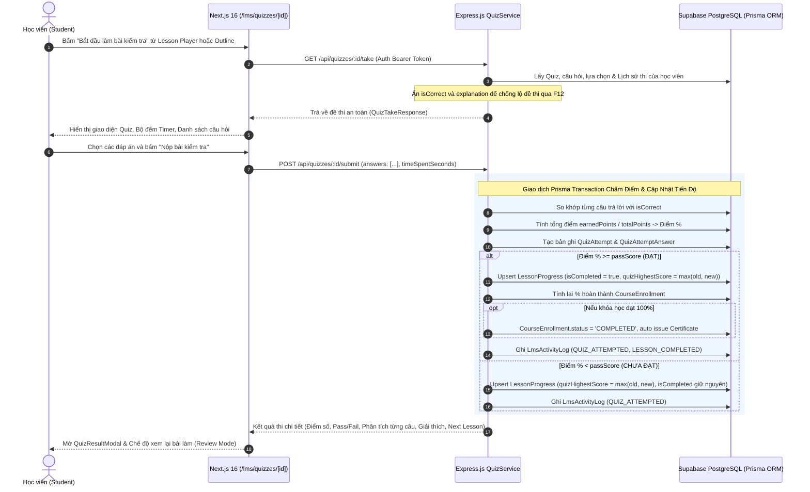

# Hướng Dẫn Kỹ Thuật: Quiz Engine Thực Tế & Tích Hợp Tiến Độ Khóa Học Ba Hưng LMS

## 1. Giới Thiệu
Tài liệu mô tả chi tiết kiến trúc, API contracts, mô hình chấm điểm tự động và quy trình tích hợp tiến độ học tập cho Module **Quiz & Assessment Engine (LMS-065 -> LMS-069)** trong hệ thống đào tạo F&B Ba Hưng.

---

## 2. Kiến Trúc & Quy Trình Chấm Điểm Tự Động



---

## 3. Danh Sách API Endpoints

### 3.1. Lấy đề thi an toàn cho học viên làm bài
- **Endpoint:** `GET /api/quizzes/:id/take`
- **Quyền hạn:** Authenticated User (`authenticateToken`)
- **Tham số `:id`:** Hỗ trợ cả `quizId` lẫn `lessonId`.
- **Đặc tính an toàn:** Toàn bộ trường `isCorrect` trong `options` và trường `explanation` trong `questions` được lọc bỏ trước khi trả về client.

### 3.2. Nộp bài kiểm tra trắc nghiệm
- **Endpoint:** `POST /api/quizzes/:id/submit`
- **Quyền hạn:** Authenticated User (`authenticateToken`)
- **Payload Request:**
```json
{
  "answers": [
    {
      "questionId": "uuid",
      "selectedOptionId": "uuid",
      "selectedOptionIds": ["uuid1", "uuid2"],
      "textAnswer": "string"
    }
  ],
  "timeSpentSeconds": 120
}
```
- **Payload Response:**
```json
{
  "attemptId": "uuid",
  "attemptNumber": 1,
  "score": 100.0,
  "passScore": 80,
  "isPassed": true,
  "totalPointsEarned": 4.0,
  "totalPointsPossible": 4.0,
  "totalQuestions": 4,
  "correctCount": 4,
  "incorrectCount": 0,
  "maxAttempts": 3,
  "remainingAttempts": 2,
  "showAnswerFeedback": true,
  "courseId": "uuid",
  "courseTitle": "Khóa học Làm Kem",
  "lessonId": "uuid",
  "lessonTitle": "Bài 4: Bài kiểm tra đánh giá kiến thức",
  "reviewQuestions": [...],
  "nextLesson": { "id": "uuid", "title": "Bài tiếp theo" },
  "isCourseCompleted": false
}
```

### 3.3. Xem lịch sử các lần thi
- **Endpoint:** `GET /api/quizzes/:id/attempts`
- **Quyền hạn:** Authenticated User (`authenticateToken`)

---

## 4. Kiểm Thử Tự Động (Automated Test Verification)

Script kiểm thử toàn diện đã được cấu hình tại `backend/src/test-quiz-submission.ts`:
```bash
npx tsx src/test-quiz-submission.ts
```

**Các kịch bản được kiểm thử 100%:**
1. ✅ Bảo mật đề thi: Không rò rỉ đáp án đúng qua DevTools.
2. ✅ Chấm điểm Không Đạt: Tính điểm chính xác, không cập nhật `isCompleted`.
3. ✅ Chấm điểm Đạt: Tính điểm chính xác, cập nhật `LessonProgress.isCompleted = true`, ghi nhận `quizHighestScore`.
4. ✅ Tự động tính toán lại % hoàn thành của `CourseEnrollment`.
5. ✅ Lưu trữ lịch sử `QuizAttempt` và `QuizAttemptAnswer`.
