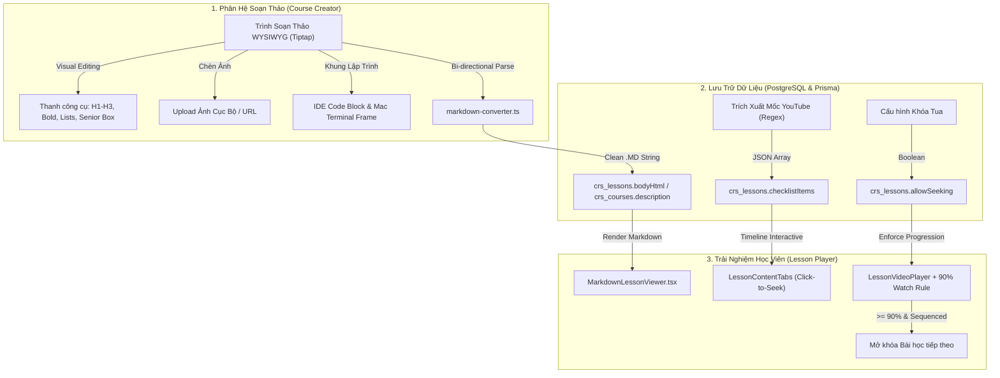

# Hướng Dẫn Vận Hành & Kiến Trúc: Soạn Thảo WYSIWYG, Transcript YouTube & Khóa Chống Tua Video LMS

> **Tài liệu thuộc hệ thống LogiX LMS - Phân hệ Đào tạo & Quản lý Khóa học**  
> **Phiên bản:** 2.0 (Cập nhật: 2026-09-09)  
> **Phạm vi:** Trình soạn thảo Word-like, Bộ chuyển đổi Markdown DOM, Đồng bộ Mốc thời gian YouTube, Kiểm soát Tua video và Quy tắc 90% hoàn thành.

---

## 1. Tổng Quan Kiến Trúc (Architecture Overview)

---

## 2. Các Tính Năng Đã Triển Khai

### 2.1. Trình Soạn Thảo Đa Năng Chuẩn Word (`UniversalRichEditor`)
- **Đối tượng sử dụng**: Giảng viên, chuyên viên đào tạo không chuyên kỹ thuật (Low-tech / Non-tech).
- **Trải nghiệm trực quan**:
  - Soạn thảo giống Microsoft Word / Google Docs / Notion, **hoàn toàn không hiển thị ký tự thô Markdown** (`###`, `**`, `*`).
  - Thanh công cụ đầy đủ: In đậm, In nghiêng, Gạch ngang, Code inline, Tiêu đề Lớn (H1), Vừa (H2), Nhỏ (H3), Danh sách đầu dòng, Danh sách số, Trích dẫn Chuyên gia (Senior Callout).
  - Nút **+ Chèn Ảnh**: Hỗ trợ tải ảnh từ máy tính (tự động chuyển đổi Base64) hoặc chèn đường dẫn ảnh (URL) kèm chú thích (caption).
  - Nút **+ Khung Code**: Chọn ngôn ngữ (TS, JS, Python, HTML, SQL...), đặt tên file (`app.component.ts`), giao diện IDE tối màu.
  - Nút **+ Terminal Mac**: Tạo khung giả lập Terminal macOS với thanh điều khiển 3 chấm (Đỏ / Vàng / Xanh), nhập nhiều dòng lệnh CLI.
  - Hỗ trợ chuyển đổi 3 chế độ xem: **Soạn thảo (Word)** $\leftrightarrow$ **Xem trước trực quan** $\leftrightarrow$ **.MD (Mã nguồn Markdown thô)**.

### 2.2. Cơ Chế Lưu Trữ Tối Ưu (.MD $\leftrightarrow$ PostgreSQL)
- Toàn bộ nội dung trực quan từ trình soạn thảo được chuyển đổi thành chuỗi Markdown (`.md`) siêu nhẹ và lưu vào cột `TEXT` trong cơ sở dữ liệu (`crs_lessons.bodyHtml` hoặc `crs_courses.description`).
- Khi tải lại, hệ thống tự động biên dịch Markdown sang định dạng HTML tương thích Tiptap để người dùng tiếp tục chỉnh sửa mà không bị mất định dạng.

### 2.3. Trích Xuất Mốc Thời Gian & Đồng Bộ Lời Thoại YouTube (`Transcript Builder`)
- Công cụ **⚡ Nhập mốc YouTube** trong trang Quản trị Khóa học (`CourseEditorPage.tsx`):
  - Cho phép dán nhanh mô tả video YouTube (ví dụ: `00:00 Giới thiệu`, `04:48 Cấu hình hệ thống`, `01:05:20 Tổng kết`).
  - Bộ phân giải tự động nhận diện cả định dạng `mm:ss` và `hh:mm:ss`, chuyển đổi chính xác sang số giây và tạo danh sách timeline.
- Tại màn hình học viên (`LessonPlayerPage.tsx` $\rightarrow$ `LessonContentTabs.tsx`):
  - Học viên nhấp chuột vào bất kỳ mốc thời gian nào, trình phát video sẽ lập tức nhảy đến đúng giây đó (`&start=sec`).

### 2.4. Khóa Tua Cóc & Bảo Mật Tiến Độ Học (`Anti-Seeking Guard`)
- Công tắc **Cho phép người học tua video (Seek)**:
  - Nếu **BẬT (True)**: Học viên có thể tự do tua tới mọi vị trí video.
  - Nếu **TẮT (False)**: Áp dụng quy chuẩn đào tạo bắt buộc:
    - Học viên chỉ được phép xem tuần tự hoặc tua lùi về phần đã xem.
    - Nếu cố tình click tua vượt quá mốc đã xem thực tế (`maxWatchedSeconds + 2s`), hệ thống sẽ tự động giật lùi về vị trí hợp lệ và hiển thị cảnh báo: *"Khóa tua cóc: Bạn cần theo dõi bài giảng tuần tự!"*.

### 2.5. Quy Tắc Hoàn Thành Bài Học 90% (`90% Watch Completion Rule`)
- Thanh hiển thị tiến độ thời gian thực: `Tiến độ theo dõi video: X% / 90% để qua bài`.
- Học viên **chỉ được phép bấm "Hoàn thành & Tiếp tục"** khi tiến độ theo dõi đạt tối thiểu **90%** thời lượng video (`watchPercentage >= 90%`).
- Nếu chưa đạt 90%, nút chuyển bài sẽ bị chặn kèm thông báo nhắc nhở số phần trăm còn lại cần xem.

---

## 3. Bản Đồ Mã Nguồn & File Liên Quan

| Phân Vùng | Đường Dẫn File | Trách Nhiệm Chính |
| :--- | :--- | :--- |
| **FE Editor** | `frontend/src/features/lms/components/editor/UniversalRichEditor.tsx` | Trình soạn thảo Word WYSIWYG Tiptap |
| **FE Converter** | `frontend/src/features/lms/components/editor/markdown-converter.ts` | Chuyển đổi hai chiều HTML $\leftrightarrow$ Markdown |
| **FE Viewer** | `frontend/src/features/lms/components/viewer/MarkdownLessonViewer.tsx` | Hiển thị bài viết, Terminal Mac, IDE Code |
| **FE Admin** | `frontend/src/features/lms/course-editor/pages/CourseEditorPage.tsx` | Quản trị khóa học, Timeline YouTube, Anti-seek |
| **FE Stepper** | `frontend/src/features/lms/course-stepper/pages/CourseCreateStepperPage.tsx` | Tạo khóa học mới tích hợp Rich Editor |
| **FE Player** | `frontend/src/features/lms/demo-ui/pages/LessonPlayerPage.tsx` | Trình phát bài học, kiểm soát 90% hoàn thành |
| **FE Video** | `frontend/src/features/lms/demo-ui/components/lesson-player/LessonVideoPlayer.tsx` | Video player hỗ trợ YouTube, MP4 và Anti-seek |
| **BE Schema** | `backend/prisma/schema.prisma` | Bổ sung `allowSeeking` vào model `Lesson` |
| **BE DTO** | `backend/src/modules/lessons/lesson.dto.ts` & `course.dto.ts` | Schema Zod xác thực `allowSeeking`, `bodyHtml` |
| **BE Service** | `backend/src/modules/courses/course.service.ts` & `lesson.service.ts` | Lưu trữ giáo trình và trạng thái bài học |

---

## 4. Hướng Dẫn Kiểm Thử (Test Cases)

1. **Soạn Thảo Bài Viết**:
   - Truy cập `/lms/admin/courses/[id]`, chọn một bài học dạng **Tài liệu/SOP**.
   - Dùng thanh công cụ định dạng chữ đậm, tạo danh sách, nhấn `+ Chèn Ảnh` tải ảnh từ máy, nhấn `+ Terminal Mac` chèn lệnh cài đặt.
   - Bấm `Lưu khóa học` và tải lại trang $\rightarrow$ Đảm bảo toàn bộ ảnh, code và định dạng giữ nguyên 100%.

2. **Nhập Mốc Thời Gian YouTube**:
   - Chọn bài học dạng **Video**, dán link YouTube.
   - Mở modal `⚡ Nhập mốc YouTube`, dán đoạn text có các dòng dạng `02:15 Hướng dẫn chi tiết`.
   - Bấm `Nhận diện & Điền danh sách` $\rightarrow$ Đảm bảo các dòng mốc thời gian xuất hiện đầy đủ trong bảng transcript.

3. **Kiểm Tra Khóa Tua & Điều Kiện 90%**:
   - Gạt tắt công tắc `Cho phép người học tua video (Seek)` và lưu lại.
   - Mở màn hình học viên `/lms/lessons/[id]`.
   - Thử bấm tua tới giữa video $\rightarrow$ Hệ thống cảnh báo và kéo lùi lại vị trí đã xem.
   - Thử bấm `Hoàn thành & Tiếp tục` khi mới xem 10% $\rightarrow$ Hệ thống báo lỗi yêu cầu xem đủ 90%.
   - Xem đến 90% $\rightarrow$ Huy hiệu chuyển sang xanh lá `✓ Đã đủ điều kiện qua bài` và cho phép chuyển bài tiếp theo.
