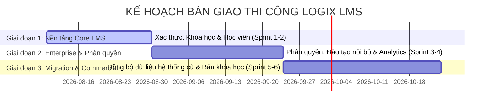

# 🎯 QUY HOẠCH GIAI ĐOẠN & CHECKLIST THI CÔNG HỆ THỐNG LOGIX LMS

> **Mục tiêu dự án:** Bàn giao hệ thống LMS hoàn chỉnh 61 chức năng, bảo đảm chuẩn Enterprise Architecture (DDD + Clean Architecture) và hoàn thành đúng hạn cam kết với doanh nghiệp.  
> **Tài liệu tham chiếu:** [[List Function]] | [[be_integration_idea]]

---

## 📌 LỘ TRÌNH TỔNG QUAN (ROADMAP)

---

## 📈 TỔNG QUAN KHỐI LƯỢNG THI CÔNG

| Giai đoạn | Mục tiêu chính | Số lượng Chức năng | Sprints dự kiến | Độ khó TB |
|:---:|---|:---:|:---:|:---:|
| **Giai đoạn 1** | Nền tảng cốt lõi, Authentication, Quản lý học viên & khóa học basic | **19 chức năng** | Sprint 1 & 2 | ⭐ 5.2/10 |
| **Giai đoạn 2** | Phân quyền vị trí/phòng ban, Đào tạo nội bộ/khách hàng & Analytics | **19 chức năng** | Sprint 3 & 4 | ⭐ 5.3/10 |
| **Giai đoạn 3** | Migration dữ liệu hệ thống cũ, Đồng bộ tiến độ & Commercial (Webinar/Pay) | **23 chức năng** | Sprint 5 & 6 | ⭐ 5.9/10 |
| **TỔNG CỘNG** | **Bàn giao hoàn chỉnh hệ thống Enterprise LMS** | **61 chức năng** | **6 Sprints** | ⭐ **5.5/10** |

---

## 🚀 GIAI ĐOẠN 1: NỀN TẢNG CỐT LÕI & VẬN HÀNH BẢN MVP (Sprint 1 - 2)

> **Mục tiêu nghiệm thu:** Xây dựng hạ tầng backend/frontend cốt lõi, luồng Đăng nhập/Đăng ký, Quản lý Khóa học, Quản lý Học viên và Theo dõi tiến độ học cơ bản.  
> **Sản phẩm bàn giao:** Học viên có thể đăng nhập, xem danh sách khóa học, xem video bài giảng và lưu tiến độ cơ bản; Admin có thể CRUD khóa học & học viên.

| Trạng thái | Mã CN       | Module                   | Tên Chức Năng                    | Mô Tả Chi Tiết                                    | Đối Tượng Sử Dụng | Độ Khó |
| :--------: | ----------- | ------------------------ | -------------------------------- | ------------------------------------------------- | ----------------- | :----: |
|   - [ ]    | **LMS-001** | Hệ thống học trực tuyến  | **Đăng nhập / Đăng ký**          | Đăng nhập, đăng ký tài khoản trên hệ thống        | `Học viên`        | ⭐ 6/10 |
|   - [ ]    | **LMS-002** | Hệ thống học trực tuyến  | **Trang chủ**                    | Giao diện trang chủ hiển thị các khóa học nổi bật | `Học viên`        | ⭐ 6/10 |
|   - [ ]    | **LMS-003** | Hệ thống học trực tuyến  | **Tìm kiếm khóa học**            | Tìm kiếm khóa học theo tên, danh mục              | `Học viên`        | ⭐ 6/10 |
|   - [ ]    | **LMS-004** | Hệ thống học trực tuyến  | **Dashboard học viên**           | Trang tổng quan cá nhân của học viên              | `Học viên`        | ⭐ 6/10 |
|   - [ ]    | **LMS-005** | Quản lý khóa học         | **Tạo mới khóa học**             | Tạo khóa học với các thông tin cơ bản             | `Admin`           | ⭐ 3/10 |
|   - [ ]    | **LMS-006** | Quản lý khóa học         | **Chỉnh sửa thông tin khóa học** | Cập nhật nội dung, hình ảnh khóa học              | `Admin`           | ⭐ 5/10 |
|   - [ ]    | **LMS-007** | Quản lý khóa học         | **Xóa / Ẩn khóa học**            | Ẩn khóa học không cho hiển thị                    | `Admin`           | ⭐ 7/10 |
|   - [ ]    | **LMS-008** | Quản lý khóa học         | **Quản lý danh mục khóa học**    | Tạo, sửa, xóa danh mục khóa học                   | `Admin`           | ⭐ 5/10 |
|   - [ ]    | **LMS-009** | Quản lý video đào tạo    | **Tải lên video**                | Upload video bài giảng trực tiếp lên server       | `Admin / Trainer` | ⭐ 4/10 |
|   - [ ]    | **LMS-010** | Quản lý video đào tạo    | **Nhúng video từ Youtube**       | Sử dụng link video từ nền tảng khác               | `Admin / Trainer` | ⭐ 5/10 |
|   - [ ]    | **LMS-027** | Theo dõi tiến độ học tập | **Thanh tiến độ khóa học**       | Hiển thị % hoàn thành khóa học                    | `Học viên`        | ⭐ 4/10 |
|   - [ ]    | **LMS-028** | Theo dõi tiến độ học tập | **Lưu vị trí học tập**           | Lưu lại bài học đang xem dở                       | `Hệ thống`        | ⭐ 4/10 |
|   - [ ]    | **LMS-030** | Theo dõi tiến độ học tập | **Báo cáo tiến độ cá nhân**      | Học viên tự xem được báo cáo tiến độ của mình     | `Học viên`        | ⭐ 7/10 |
|   - [ ]    | **LMS-031** | Theo dõi video đã xem    | **Đánh dấu video đã xem**        | Tự động đánh dấu hoàn thành khi xem hết video     | `Hệ thống`        | ⭐ 6/10 |
|   - [ ]    | **LMS-034** | Theo dõi video đã xem    | **Tiếp tục xem từ điểm dừng**    | Mở lại video đúng thời điểm đã tắt trước đó       | `Hệ thống`        | ⭐ 5/10 |
|   - [ ]    | **LMS-039** | Quản lý học viên         | **Thêm mới học viên**            | Tạo tài khoản học viên thủ công                   | `Admin`           | ⭐ 6/10 |
|   - [ ]    | **LMS-040** | Quản lý học viên         | **Import danh sách học viên**    | Thêm hàng loạt học viên từ file Excel             | `Admin`           | ⭐ 5/10 |
|   - [ ]    | **LMS-041** | Quản lý học viên         | **Khóa/Mở khóa tài khoản**       | Ngừng cấp quyền truy cập cho học viên             | `Admin`           | ⭐ 5/10 |
|   - [ ]    | **LMS-042** | Quản lý học viên         | **Xem hồ sơ và lịch sử học tập** | Xem chi tiết quá trình học của 1 user             | `Admin`           | ⭐ 4/10 |

---

## 🚀 GIAI ĐOẠN 2: PHÂN QUYỀN NÂNG CAO, BẢO MẬT & ĐÀO TẠO DOANH NGHIỆP (Sprint 3 - 4)

> **Mục tiêu nghiệm thu:** Mở rộng tính năng phân quyền học theo vị trí/phòng ban, bảo mật video chống tải xuống, luồng đào tạo Onboarding nội bộ & hệ thống báo cáo Analytics.  
> **Sản phẩm bàn giao:** Doanh nghiệp tự động gán lộ trình học theo chức danh, bảo vệ bản quyền video đào tạo và theo dõi báo cáo tỷ lệ Pass/Fail của nhân sự.

| Trạng thái | Mã CN | Module | Tên Chức Năng | Mô Tả Chi Tiết | Đối Tượng Sử Dụng | Độ Khó |
|:---:|---|---|---|---|---|:---:|
| - [ ] | **LMS-011** | Quản lý video đào tạo | **Quản lý chất lượng video** | Tự động convert nhiều độ phân giải | `Hệ thống` | ⭐ 5/10 |
| - [ ] | **LMS-012** | Quản lý video đào tạo | **Bảo mật video** | Chống tải xuống video trái phép | `Hệ thống` | ⭐ 3/10 |
| - [ ] | **LMS-015** | Học theo phân quyền | **Phân quyền theo chức danh** | Gán khóa học tự động theo chức danh | `Admin` | ⭐ 5/10 |
| - [ ] | **LMS-016** | Học theo phân quyền | **Phân quyền theo phòng ban** | Gán khóa học theo phòng ban | `Admin` | ⭐ 5/10 |
| - [ ] | **LMS-017** | Học theo phân quyền | **Lộ trình học tập theo vị trí** | Xây dựng lộ trình học tập riêng cho từng vị trí | `Admin` | ⭐ 5/10 |
| - [ ] | **LMS-018** | Học theo phân quyền | **Giới hạn truy cập nội dung** | Chỉ người có quyền mới xem được khóa học | `Hệ thống` | ⭐ 6/10 |
| - [ ] | **LMS-020** | Đào tạo nội bộ | **Khóa học onboarding** | Lộ trình đào tạo cho nhân viên mới | `Admin` | ⭐ 6/10 |
| - [ ] | **LMS-021** | Đào tạo nội bộ | **Đánh giá năng lực nhân viên** | Làm bài test đánh giá định kỳ | `Trainer` | ⭐ 6/10 |
| - [ ] | **LMS-022** | Đào tạo nội bộ | **Báo cáo kết quả đào tạo nội bộ** | Thống kê kết quả học tập của nhân viên | `Admin` | ⭐ 4/10 |
| - [ ] | **LMS-023** | Đào tạo khách hàng | **Tạo tài khoản khách hàng** | Khách hàng tự đăng ký hoặc được cấp tài khoản | `Khách hàng` | ⭐ 4/10 |
| - [ ] | **LMS-024** | Đào tạo khách hàng | **Khóa học hướng dẫn sử dụng sản phẩm** | Các khóa học public cho khách hàng | `Admin` | ⭐ 4/10 |
| - [ ] | **LMS-025** | Đào tạo khách hàng | **Cấp chứng chỉ cho khách hàng** | Cấp chứng nhận sau khi hoàn thành khóa học | `Hệ thống` | ⭐ 3/10 |
| - [ ] | **LMS-026** | Đào tạo khách hàng | **Thu thập phản hồi từ khách hàng** | Form khảo sát chất lượng khóa học | `Khách hàng` | ⭐ 5/10 |
| - [ ] | **LMS-029** | Theo dõi tiến độ học tập | **Cảnh báo học viên chậm tiến độ** | Gửi email/noti nhắc nhở học viên | `Hệ thống` | ⭐ 5/10 |
| - [ ] | **LMS-032** | Theo dõi video đã xem | **Chống tua video** | Bắt buộc học viên xem tuần tự, không được tua | `Hệ thống` | ⭐ 6/10 |
| - [ ] | **LMS-033** | Theo dõi video đã xem | **Báo cáo thời lượng xem video** | Thống kê tổng thời gian học viên xem video | `Admin` | ⭐ 7/10 |
| - [ ] | **LMS-035** | Phân tích hiệu quả nội dung đào tạo | **Thống kê tỷ lệ hoàn thành khóa học** | Báo cáo số lượng học viên pass/fail | `Admin` | ⭐ 5/10 |
| - [ ] | **LMS-036** | Phân tích hiệu quả nội dung đào tạo | **Thống kê điểm số trung bình** | Biểu đồ phân bổ điểm số của học viên | `Admin` | ⭐ 7/10 |
| - [ ] | **LMS-038** | Phân tích hiệu quả nội dung đào tạo | **Báo cáo đánh giá khóa học** | Tổng hợp rating, feedback từ học viên | `Admin` | ⭐ 7/10 |

---

## 🚀 GIAI ĐOẠN 3: ĐỒNG BỘ MIGRATION DỮ LIỆU CŨ & THƯƠNG MẠI HÓA (Sprint 5 - 6)

> **Mục tiêu nghiệm thu:** Xây dựng trục đồng bộ dữ liệu ngầm kết nối hệ thống cũ, bảo toàn tiến độ học tập của học viên cũ, portal xử lý lỗi dữ liệu cho Admin và tính năng bán khóa học/webinar.  
> **Sản phẩm bàn giao:** Chuyển đổi 100% học viên cũ sang LMS mới không bị mất tài khoản hay học lại từ đầu; Admin có Portal báo lỗi đồng bộ; Tích hợp cổng thanh toán & Webinar.

| Trạng thái | Mã CN | Module | Tên Chức Năng | Mô Tả Chi Tiết | Đối Tượng Sử Dụng | Độ Khó |
|:---:|---|---|---|---|---|:---:|
| - [ ] | **LMS-013** | Webinar | **Tạo phòng học trực tuyến** | Tạo phòng họp trực tuyến qua Zoom/Meet API | `Admin / Trainer` | ⭐ 5/10 |
| - [ ] | **LMS-014** | Webinar | **Quản lý người tham gia** | Duyệt, mời người tham gia webinar | `Trainer` | ⭐ 8/10 |
| - [ ] | **LMS-019** | Đào tạo nội bộ | **Tích hợp dữ liệu nhân sự** | Đồng bộ danh sách nhân viên từ HRM | `Hệ thống` | ⭐ 5/10 |
| - [ ] | **LMS-037** | Phân tích hiệu quả nội dung đào tạo | **Phân tích câu hỏi kiểm tra khó** | Thống kê các câu hỏi học viên hay làm sai nhất | `Trainer` | ⭐ 7/10 |
| - [ ] | **LMS-043** | Bán khóa học | **Cài đặt giá khóa học** | Cấu hình giá bán cho từng khóa | `Admin` | ⭐ 7/10 |
| - [ ] | **LMS-044** | Bán khóa học | **Tích hợp cổng thanh toán** | Thanh toán qua VNPay, Momo, Chuyển khoản | `Hệ thống` | ⭐ 6/10 |
| - [ ] | **LMS-045** | Bán khóa học | **Quản lý mã giảm giá** | Tạo coupon, voucher giảm giá | `Admin` | ⭐ 6/10 |
| - [ ] | **LMS-046** | Bán khóa học | **Báo cáo doanh thu** | Thống kê doanh thu bán khóa học theo tháng | `Admin` | ⭐ 4/10 |
| - [ ] | **LMS-047** | Kết nối & Xử lý Dữ liệu Hệ thống Cũ | **Kết nối an toàn với hệ thống cũ** | Kết nối an toàn với hệ thống cũ để bóc tách dữ liệu | `IT / Admin` | ⭐ 5/10 |
| - [ ] | **LMS-048** | Kết nối & Xử lý Dữ liệu Hệ thống Cũ | **Phân tích và làm sạch dữ liệu cũ** | Làm sạch dữ liệu cũ để tương thích với cấu trúc LMS mới | `IT / Admin` | ⭐ 8/10 |
| - [ ] | **LMS-049** | Kết nối & Xử lý Dữ liệu Hệ thống Cũ | **Nghiên cứu & Thiết lập hệ thống trục kết nối ngầm** | Thiết lập hệ thống trục kết nối ngầm | `IT / Admin` | ⭐ 6/10 |
| - [ ] | **LMS-050** | Tự động Đồng bộ Khóa học & Bài tập | **Tự động kéo toàn bộ danh mục** | Tự động kéo toàn bộ danh mục, tiêu đề bài học và cấu trúc khóa học qua hệ thống mới | `Hệ thống` | ⭐ 6/10 |
| - [ ] | **LMS-051** | Tự động Đồng bộ Khóa học & Bài tập | **Giao diện trực quan kiểm tra nội dung** | Nhân viên không cần nhập tay từng bài học, chỉ cần kiểm tra lại giao diện trực quan | `Admin` | ⭐ 6/10 |
| - [ ] | **LMS-052** | Tự động Đồng bộ Khóa học & Bài tập | **Xây dựng luồng xử lý nội dung** | Xây dựng luồng xử lý nội dung | `Hệ thống` | ⭐ 6/10 |
| - [ ] | **LMS-053** | Tự động Đồng bộ Học viên & Tài khoản | **Chuyển toàn bộ danh sách học viên cũ** | Chuyển toàn bộ danh sách học viên cũ sang LMS mới | `Hệ thống` | ⭐ 5/10 |
| - [ ] | **LMS-054** | Tự động Đồng bộ Học viên & Tài khoản | **Tự động kích hoạt đúng khóa học** | Thiết lập cơ chế tự động kích hoạt đúng khóa học họ đã mua | `Hệ thống` | ⭐ 5/10 |
| - [ ] | **LMS-055** | Tự động Đồng bộ Học viên & Tài khoản | **Cài đặt luồng đăng nhập mới bảo mật** | Cài đặt luồng đăng nhập mới bảo mật cho user cũ (không bị mất tài khoản) | `Hệ thống` | ⭐ 5/10 |
| - [ ] | **LMS-056** | Bảo toàn Tiến độ Học tập của Học viên | **Học viên cũ không phải học lại** | Học viên cũ sang hệ thống mới không phải học lại từ đầu | `Hệ thống` | ⭐ 8/10 |
| - [ ] | **LMS-057** | Bảo toàn Tiến độ Học tập của Học viên | **Tự nhận diện bài học đã hoàn thành** | Hệ thống tự nhận diện họ đã học đến bài nào, làm bài tập nào để mở khóa bài tiếp theo | `Hệ thống` | ⭐ 7/10 |
| - [ ] | **LMS-058** | Bảo toàn Tiến độ Học tập của Học viên | **Xây dựng luồng xử lý tiến độ học** | Xây dựng luồng xử lý tiến độ học | `Hệ thống` | ⭐ 5/10 |
| - [ ] | **LMS-059** | Trang Quản lý & Báo lỗi cho Admin | **Giao diện trực quan hiển thị tiến trình** | Giao diện trực quan hiển thị tiến trình đang đồng bộ (Bao nhiêu % học viên đã qua) | `Admin` | ⭐ 4/10 |
| - [ ] | **LMS-060** | Trang Quản lý & Báo lỗi cho Admin | **Tự động gom riêng các tài khoản bị lỗi** | Tự động gom riêng các tài khoản bị lỗi dữ liệu (ví dụ: sai số điện thoại, thiếu email) | `Hệ thống` | ⭐ 7/10 |
| - [ ] | **LMS-061** | Trang Quản lý & Báo lỗi cho Admin | **Xử lý nhanh tài khoản lỗi** | Admin xử lý nhanh, không làm nghẽn hệ thống | `Admin` | ⭐ 4/10 |

---

## 📋 KẾ HOẠCH CHIA SPRINT CHI TIẾT (SPRINT BACKLOG)

### 🔹 SPRINT 1: Core Auth & Student Dashboard (LMS-001 -> LMS-004, LMS-039 -> LMS-042)
- [ ] Implement Auth Context & Token Handling (LMS-001)
- [ ] Student Homepage & Course Catalog view (LMS-002, LMS-003)
- [ ] Student Dashboard Overview (LMS-004)
- [ ] Admin CRUD Student & Excel Import (LMS-039, LMS-040, LMS-041, LMS-042)

### 🔹 SPRINT 2: Course & Video Management + Progress Tracking (LMS-005 -> LMS-010, LMS-027, LMS-028, LMS-030, LMS-031, LMS-034)
- [ ] Admin Course CRUD & Category Management (LMS-005, LMS-006, LMS-007, LMS-008)
- [ ] Video Upload & YouTube Embedding (LMS-009, LMS-010)
- [ ] Progress Bar & Video Completion Tracking (LMS-027, LMS-028, LMS-030, LMS-031, LMS-034)

### 🔹 SPRINT 3: Role-Based Learning & Internal Training (LMS-015 -> LMS-018, LMS-020 -> LMS-022)
- [ ] Position & Department Role-Based Course Assignment (LMS-015, LMS-016, LMS-017, LMS-018)
- [ ] Internal Onboarding Courses & Employee Evaluation (LMS-020, LMS-021, LMS-022)

### 🔹 SPRINT 4: Video Security, Customer Training & Analytics (LMS-011, LMS-012, LMS-023 -> LMS-026, LMS-029, LMS-032, LMS-033, LMS-035, LMS-036, LMS-038)
- [ ] Video Transcoding & Anti-download Protection (LMS-011, LMS-012, LMS-032, LMS-033)
- [ ] Customer Training & Certificate Generation (LMS-023, LMS-024, LMS-025, LMS-026)
- [ ] Completion Rate & Score Distribution Analytics (LMS-029, LMS-035, LMS-036, LMS-038)

### 🔹 SPRINT 5: Data Migration Pipeline & Progress Preservation (LMS-047 -> LMS-061)
- [ ] Legacy System Connector & Data Cleaning Engine (LMS-047, LMS-048, LMS-049)
- [ ] Automated Course & Lesson Structure Sync (LMS-050, LMS-051, LMS-052)
- [ ] Automated Student Account & Enrollment Sync (LMS-053, LMS-054, LMS-055)
- [ ] Student Progress Preservation & Auto-Unlocking (LMS-056, LMS-057, LMS-058)
- [ ] Admin Migration Portal & Error Handling Portal (LMS-059, LMS-060, LMS-061)

### 🔹 SPRINT 6: Commercialization, Webinar & Final Integration (LMS-013, LMS-014, LMS-019, LMS-037, LMS-043 -> LMS-046)
- [ ] Zoom/Meet Webinar Integration & Attendee Management (LMS-013, LMS-014)
- [ ] HRM Data Integration (LMS-019)
- [ ] Course Pricing, Payment Gateway (VNPay/Momo) & Voucher Management (LMS-043, LMS-044, LMS-045, LMS-046)
- [ ] Quiz Difficulty Analysis & End-to-End System Testing (LMS-037)

---

## 📌 BƯỚC TIẾP THEO (NEXT STEPS)

1. ✅ **Đã hoàn thành:** Tạo file Checklist theo từng Giai đoạn & Sprint tại `doc/Checklist_Implementation_Phases.md`.
2. ⏳ **Bước tiếp theo theo yêu cầu của bạn:** Lập tài liệu **DDD (Domain-Driven Design) hoàn chỉnh** cho LogiX LMS (định nghĩa Bounded Contexts, Aggregates, Entities, Value Objects, Domain Events).
3. 🛠️ **Thi công thực tế:** Tiến hành code từng Sprint theo danh sách Function Checklist đã lập.
