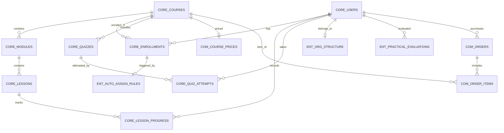

# LMS UNIFIED FUNCTION MATRIX & DATABASE DESIGN CONTEXT
> **Tài liệu Phân tích Chức năng Thống nhất & Định hướng Thiết kế Cơ sở Dữ liệu (DB Design Context)**  
> **Dự án áp dụng:** LMS-BaHung (Đào tạo nội bộ F&B) & LMS-Horeca (Đào tạo thương mại + Bán khóa học + Migration)  
> **Ngày tạo:** 2026-08-07  
> **Thư mục lưu trữ:** `Practice/LogiX/doc/04-tracking-sprints/`

---

## 1. Tổng quan & Đặt vấn đề (Context & Objective)

Hiện tại hệ thống đang triển khai 2 dự án LMS chạy song song với định hướng kinh doanh và đối tượng mục tiêu khác nhau:
1. **LMS-BaHung (111 chức năng đề xuất):** Tập trung 100% vào **Đào tạo nội bộ chuỗi F&B (Cửa hàng & Xưởng sản xuất)**. Đặc thù bao gồm: Gán khóa học tự động theo sơ đồ tổ chức (Chức danh/Cửa hàng/Bộ phận sản xuất), Thẻ tuân thủ An toàn thực phẩm (ATTP) có cảnh báo & chặn xếp ca HRM, Đánh giá thực hành tại điểm (Mentor & Quản lý cửa hàng), Ký xác nhận quy trình SOP.
2. **LMS-Horeca (61 chức năng đề xuất):** Kết hợp giữa **Đào tạo nội bộ + Đào tạo khách hàng + Bán khóa học trực tuyến (Commerce)** + **Chuyển đổi dữ liệu (Data Migration Engine)** từ hệ thống cũ sang hệ thống mới mà không làm mất tiến độ học viên cũ.

### Mục tiêu thiết kế DB & Context:
* **Tối đa hóa điểm chung (Maximum Common Core):** Xây dựng một lõi dữ liệu (Core Schema) đồng bộ hoàn toàn cho các tính năng cơ bản (Quản lý khóa học, bài học, tiến độ, kiểm tra quiz, chứng chỉ, người dùng).
* **Kiến trúc mở rộng dạng Plug-and-Play (Modular Schema):** Các tính năng thương mại (Bán hàng, Thanh toán, Voucher) hoặc các tính năng tuân thủ doanh nghiệp (ATTP, Đánh giá thực hành, Auto-gán HRM) sẽ được thiết kế dạng Module mở rộng, không làm ảnh hưởng đến Core DB.
* **Tái sử dụng tối đa mã nguồn:** Đảm bảo khi phát triển Core LMS, cả 2 dự án chỉ cần dùng chung 1 codebase / 1 schema core và bật/tắt module theo cấu hình (Feature Flags).

---

## 2. Bảng Đối sánh Module: Điểm chung vs Điểm đặc thù

| Nhóm Module | LMS-BaHung (Nội bộ F&B) | LMS-Horeca (Thương mại + Migration) | Đánh giá Khả năng Dùng chung DB Schema |
| :--- | :--- | :--- | :--- |
| **Quản lý Khóa học & Danh mục** | Khóa học theo Chương trình đào tạo F&B (Onboarding, SOP, ATTP, NV CH/SX) | Khóa học public/private, phân loại theo chủ đề thương mại | **100% Giống nhau** (Chỉ khác flag `is_commercial` / `access_level`) |
| **Quản lý Bài giảng & Học liệu** | Video, PDF/Slide, Rich text SOP, Ảnh quy trình | Video (Upload/Youtube/Convert độ phân giải), DRM chống tải | **100% Giống nhau** (Dùng chung bảng `lessons` & `media`) |
| **Ghi danh & Học viên** | Gán theo Rule HRM, Gán hàng loạt theo Store/Dept, Ghi danh thủ công | Đăng ký tự do, Mua khóa học tự động kích hoạt, Import Excel | **Lõi giống nhau** (Bảng `enrollments` thêm cột `source`: `'hrm_rule'`, `'purchase'`, `'manual'`) |
| **Theo dõi Tiến độ & Video** | Tiến độ %, Lưu vị trí xem dở, Học Web & Mobile App | Tiến độ %, Lưu vị trí xem dở, Chống tua video, Thời lượng xem | **100% Giống nhau** (Bảng `user_lesson_progress`) |
| **Kiểm tra, Quiz & Đánh giá** | Ngân hàng câu hỏi, Trắc nghiệm, Tự luận, Auto/Manual grade, Pass/Fail | Ngân hàng câu hỏi, Trắc nghiệm, Pass/Fail analytics | **100% Giống nhau** (Bảng `quizzes`, `questions`, `quiz_attempts`) |
| **Chứng chỉ (Certificates)** | Chứng chỉ nội bộ, Chứng chỉ ATTP (lưu hạn dùng, gia hạn) | Chứng chỉ hoàn thành khóa học cho khách hàng | **Lõi giống nhau** (Cấu trúc `certificates` & `user_certificates`, LMS-BaHung dùng thêm thuộc tính `expiry_date`) |
| **Khảo sát & Xác nhận SOP** | Form xác nhận SOP + Ký điện tử, Khảo sát đào tạo | Form thu thập phản hồi khách hàng | **Lõi giống nhau** (Bảng `surveys` & `survey_responses`) |
| **Gamification & Thi đua** | Leaderboard theo Cửa hàng, Thử thách tuần/tháng, Điểm thưởng | Không yêu cầu sâu phase 1 | **Module mở rộng** (LMS-BaHung sử dụng) |
| **Đánh giá Thực hành (Mentor)** | Checklist thực hành tại CH/Xưởng, Mentor chấm, QLCH duyệt | Không có | **Đặc thù LMS-BaHung** (Bảng `practical_evaluations`) |
| **ATTP & Tuân thủ Vận hành** | Quản lý hạn ATTP, Cảnh báo hết hạn, Gate chặn lịch ca HRM | Không có | **Đặc thù LMS-BaHung** (Bảng `attp_compliance`) |
| **Bán khóa học & Thanh toán** | Không có (Hoặc mở rộng ở phase sau) | Định giá, VNPay/MoMo, Mã giảm giá (Coupon), Báo cáo doanh thu | **Đặc thù LMS-Horeca** (Module `commerce`: `orders`, `payments`, `coupons`) |
| **Webinar Trực tuyến** | Không có ở phase 1 | Tạo phòng Zoom/Meet API, Quản lý người tham gia | **Đặc thù LMS-Horeca** (Module `webinars`) |
| **Migration & Chuyển đổi dữ liệu**| Không có (Dữ liệu tạo mới) | Bóc tách DB cũ, Đồng bộ tài khoản, Hydrate tiến độ học dở, Log lỗi | **Đặc thù LMS-Horeca** (Module `migration_engine`) |

---

## 3. Danh sách Chức năng Thống nhất (Unified Function List)

Dưới đây là danh sách chức năng được chuẩn hóa mã (`CORE-xxx`, `ENT-xxx`, `COM-xxx`, `MIG-xxx`) giúp đội ngũ kỹ thuật dễ dàng đối chiếu khi thiết kế Database & API Services.

### 3.1. CORE MODULES (Dùng chung 100% cho cả 2 dự án)

#### A. Quản lý Người dùng & Tài khoản (Core Auth & User)
* **CORE-001:** Đăng nhập / Đăng ký / SSO tài khoản.
* **CORE-002:** Quản lý Hồ sơ cá nhân (Profile) & Đổi mật khẩu.
* **CORE-003:** Phân quyền người dùng (Admin LMS, Trainer, Learner/Staff, Report Viewer).
* **CORE-004:** Khóa / Mở khóa tài khoản & Nhật ký thao tác (Audit log).

#### B. Quản lý Khóa học & Học liệu (Core Curriculum)
* **CORE-010:** Quản lý Danh mục khóa học (Tạo, sửa, xóa, hiển thị cây danh mục).
* **CORE-011:** Tạo mới & Cập nhật thông tin khóa học (Tên, mô tả, ảnh đại diện, đối tượng, thời hạn, điểm đạt).
* **CORE-012:** Sao chép khóa học (Clone course) & Bật/Tắt trạng thái kích hoạt khóa học.
* **CORE-013:** Tạo bài giảng dạng Video (Upload trực tiếp hoặc nhúng Youtube/Vimeo).
* **CORE-014:** Tạo bài giảng dạng Tài liệu PDF / Slide.
* **CORE-015:** Tạo bài giảng dạng Trang văn bản phong phú (Rich Text SOP / Nội dung bài viết).
* **CORE-016:** Quản lý danh mục học liệu & Sắp xếp thứ tự bài giảng trong khóa (Drag-drop ordering).
* **CORE-017:** Bật / Ẩn / Hiện bài giảng theo tiến trình học (Prerequisite lock).

#### C. Ghi danh & Tiến độ Học tập (Core Enrollment & Tracking)
* **CORE-020:** Ghi danh thủ công học viên vào khóa học.
* **CORE-021:** Hủy ghi danh học viên.
* **CORE-022:** Xem danh sách khóa học của tôi (My Courses Dashboard).
* **CORE-023:** Mở bài giảng & Lưu vị trí học dở (Resume video timestamp / last active lesson).
* **CORE-024:** Đánh dấu hoàn thành bài giảng (Tự động khi xem đạt % thời lượng hoặc bấm hoàn tất).
* **CORE-025:** Hiển thị Thanh tiến độ khóa học (% Complete).
* **CORE-026:** Chống tua video / Yêu cầu xem tuần tự (Cấu hình theo khóa học).

#### D. Ngân hàng Câu hỏi & Kiểm tra Assessment (Core Quiz Engine)
* **CORE-030:** Quản lý Ngân hàng câu hỏi (Tạo, sửa, xóa, phân loại theo chủ đề/độ khó).
* **CORE-031:** Tạo câu hỏi Trắc nghiệm 1 đáp án (Single choice).
* **CORE-032:** Tạo câu hỏi Trắc nghiệm nhiều đáp án (Multiple choice).
* **CORE-033:** Tạo câu hỏi Đúng / Sai (True/False).
* **CORE-034:** Tạo câu hỏi Tự luận ngắn (Short answer).
* **CORE-035:** Tạo bài kiểm tra (Quiz) gắn vào khóa học (Cấu hình số lần làm lại, thời hạn làm bài, điểm đạt pass score, xáo trộn câu hỏi).
* **CORE-036:** Học viên làm bài kiểm tra & Chấm điểm tự động bài trắc nghiệm.
* **CORE-037:** Trainer chấm điểm thủ công bài tự luận.
* **CORE-038:** Hiển thị kết quả bài kiểm tra, lời giải thích & Lịch sử làm bài (Attempt History).
* **CORE-039:** Xác nhận Đạt / Không đạt (Pass/Fail) khóa học theo kết quả Quiz.

#### E. Khảo sát & Chứng chỉ (Core Certificate & Survey)
* **CORE-040:** Tạo mẫu chứng chỉ (Certificate Template Builder).
* **CORE-041:** Tự động cấp chứng chỉ điện tử khi học viên hoàn thành khóa học.
* **CORE-042:** Tải xuống / In chứng chỉ (Export PDF).
* **CORE-043:** Tạo form khảo sát chất lượng khóa học & Đánh giá sao (Rating & Review).
* **CORE-044:** Thống kê & Báo cáo phản hồi khảo sát.

#### F. Báo cáo Core LMS (Core Analytics)
* **CORE-050:** Báo cáo tỷ lệ hoàn thành khóa học (% Complete, Pass/Fail rate).
* **CORE-051:** Báo cáo chi tiết tiến độ học tập của từng học viên.
* **CORE-052:** Báo cáo phân tích kết quả bài kiểm tra (Điểm trung bình, câu hỏi hay sai).
* **CORE-053:** Xuất báo cáo dữ liệu ra file Excel / CSV.

---

### 3.2. ENTERPRISE EXTENSIONS (Đặc thù LMS-BaHung - Nội bộ Chuỗi F&B)

* **ENT-001:** **Đồng bộ Sơ đồ Tổ chức HRM:** Đồng bộ danh sách Nhân sự, Cửa hàng (Store), Bộ phận Sản xuất (Factory), Chức danh (Position), Trạng thái làm việc (Học việc / Chính thức / Nghỉ việc).
* **ENT-002:** **Rule Engine Auto-Assign Khóa học:** Tự động gán khóa học/lộ trình khi nhân sự có trạng thái Học việc, nâng Chính thức, hoặc chuyển vị trí (QLCH, SX, TC).
* **ENT-003:** **Quản lý Thẻ An toàn Thực phẩm (ATTP):** Lưu trữ ngày cấp, ngày hết hạn chứng chỉ ATTP nội bộ & bên ngoài.
* **ENT-004:** **Cảnh báo Tuân thủ ATTP:** Tự động gửi cảnh báo khi chứng chỉ ATTP sắp hết hạn (30/15/7 ngày) hoặc đã hết hạn.
* **ENT-005:** **Gate Chặn Xếp ca Lịch làm việc HRM:** Tích hợp Webhook/API sang HRM để chặn xếp ca làm việc nếu nhân sự thiếu chứng chỉ ATTP còn hiệu lực.
* **ENT-006:** **Quản lý Lộ trình Onboarding theo Khối:** Lộ trình riêng cho Nhân viên Cửa hàng, Nhân viên Sản xuất, Quản lý Cửa hàng, Đội Tăng cường.
* **ENT-007:** **Đánh giá Thực hành tại Điểm (On-the-Job Evaluation):** Tạo phiếu checklist kỹ năng thực hành tại cửa hàng/xưởng.
* **ENT-008:** **Phân công Mentor & Chấm điểm Thực hành:** Mentor thực hiện chấm điểm checklist kỹ năng học việc trên Mobile App; QLCH phê duyệt xác nhận.
* **ENT-009:** **Bắn Tín hiệu Kết quả Thực hành sang HRM:** Gửi sự kiện Đạt đánh giá thực hành về HRM để làm căn cứ ký hợp đồng chính thức.
* **ENT-010:** **Xác nhận SOP & Ký Điện tử (E-Sign):** Form xác nhận đã đọc quy trình SOP vận hành/sản xuất + Học viên ký xác nhận cam kết tuân thủ.
* **ENT-011:** **Gamification Thi đua Cửa hàng:** Bảng xếp hạng điểm học tập (Leaderboard) theo từng Cửa hàng/Xưởng sản xuất, cộng điểm thưởng hoàn thành đúng hạn.

---

### 3.3. COMMERCIAL EXTENSIONS (Đặc thù LMS-Horeca - Thương mại & Bán hàng)

* **COM-001:** **Quản lý Giá & Biểu giá Khóa học:** Thiết lập giá bán gốc, giá khuyến mãi, cấu hình miễn phí / trả phí cho từng khóa học.
* **COM-002:** **Quản lý Mã giảm giá (Coupon / Voucher):** Tạo coupon giảm giá theo % hoặc số tiền cố định, giới hạn số lần sử dụng & thời gian áp dụng.
* **COM-003:** **Cổng Thanh toán Trực tuyến:** Tích hợp thanh toán VNPay, MoMo, ZaloPay, Chuyển khoản ngân hàng tự động qua VietQR.
* **COM-004:** **Quản lý Đơn hàng & Hóa đơn:** Lưu vết lịch sử đơn hàng, trạng thái thanh toán (Pending, Success, Failed, Refunded).
* **COM-005:** **Báo cáo Doanh thu Thương mại:** Báo cáo tổng doanh thu bán khóa học theo ngày/tháng/năm, doanh thu theo từng khóa học.
* **COM-006:** **Trang Public Catalog & Gian hàng Khóa học:** Giao diện trang chủ hiển thị khóa học nổi bật, tìm kiếm/lọc khóa học theo danh mục dành cho khách hàng ngoài.
* **COM-007:** **Quản lý Lớp học Trực tuyến Webinar:** Tạo phòng học trực tuyến nhúng Zoom/Google Meet API, quản lý danh sách đăng ký & duyệt người tham dự.

---

### 3.4. MIGRATION EXTENSIONS (Đặc thù LMS-Horeca - Chuyển đổi Dữ liệu Cũ)

* **MIG-001:** **Connector Kết nối Hệ thống Cũ:** Thiết lập kết nối an toàn bóc tách dữ liệu từ Database hệ thống LMS cũ.
* **MIG-002:** **Data Cleaning & Transformation Pipeline:** Phân tích, chuẩn hóa và làm sạch dữ liệu học viên/khóa học cũ sang định dạng LMS mới.
* **MIG-003:** **Sync Danh mục & Cấu trúc Khóa học:** Tự động kéo toàn bộ danh mục, tiêu đề, bài giảng từ LMS cũ sang LMS mới.
* **MIG-004:** **Migration Tài khoản Học viên & Pass Baseline:** Chuyển toàn bộ tài khoản học viên cũ, cài đặt luồng đăng nhập mới bảo mật không bắt học viên tạo lại tài khoản.
* **MIG-005:** **Kích hoạt Quyền truy cập Khóa học cũ (Entitlement Mapping):** Tự động nhận diện khóa học user cũ đã mua/được gán để kích hoạt quyền truy cập tương ứng trên hệ thống mới.
* **MIG-006:** **Hydration Tiến độ Học tập (Progress Preservation Engine):** Khôi phục chính xác bài học đã hoàn thành, bài tập đã làm để học viên tiếp tục học từ bài tiếp theo, không phải học lại từ đầu.
* **MIG-007:** **Dashboard Giám sát Migration & Báo lỗi cho Admin:** Giao diện trực quan hiển thị % tiến độ chuyển đổi dữ liệu, tự động gom nhóm các tài khoản bị lỗi (thiếu email, sai SĐT) để Admin xử lý thủ công nhanh chóng.

---

## 4. Định hướng Thiết kế Cơ sở Dữ liệu Thống nhất (Unified DB Schema Blueprint)

Để đáp ứng cả 2 dự án mà không làm rối loạn sơ đồ DB, kiến trúc bảng (Database Tables) được chia làm 4 nhóm chính:

### 4.1. Nhóm Bảng Core (Dùng chung 100% Core Schema)

1. `users`
   * `id` (UUID, Primary Key)
   * `email`, `phone`, `password_hash`, `full_name`, `avatar_url`
   * `user_type` (Enum: `'employee'`, `'customer'`, `'admin'`, `'trainer'`) -> *Hỗ trợ phân biệt NV BaHung vs Khách Horeca*
   * `status` (Enum: `'active'`, `'inactive'`, `'suspended'`)
   * `created_at`, `updated_at`

2. `courses`
   * `id` (UUID, PK)
   * `code` (VARCHAR), `title` (VARCHAR), `slug` (VARCHAR)
   * `description` (TEXT), `thumbnail_url` (VARCHAR)
   * `category_id` (FK -> `categories.id`)
   * `is_commercial` (BOOLEAN DEFAULT FALSE) -> *Flag bật tính năng bán hàng*
   * `is_internal` (BOOLEAN DEFAULT TRUE) -> *Flag thuộc khóa học nội bộ*
   * `status` (Enum: `'draft'`, `'published'`, `'archived'`)
   * `pass_score` (INT DEFAULT 80)
   * `created_at`, `updated_at`

3. `modules` & `lessons`
   * `modules`: `id`, `course_id`, `title`, `position_order`
   * `lessons`: `id`, `module_id`, `title`, `lesson_type` (`'video'`, `'pdf'`, `'richtext'`, `'quiz'`), `content_url`, `body_html`, `duration_seconds`, `is_free_preview` (BOOLEAN), `position_order`

4. `enrollments`
   * `id` (UUID, PK)
   * `user_id` (FK -> `users.id`)
   * `course_id` (FK -> `courses.id`)
   * `enrollment_source` (Enum: `'manual'`, `'auto_hrm_rule'`, `'purchase'`, `'migration'`)
   * `status` (Enum: `'enrolled'`, `'in_progress'`, `'completed'`, `'expired'`)
   * `enrolled_at`, `completed_at`, `expires_at`

5. `lesson_progress`
   * `id` (UUID, PK)
   * `user_id` (FK), `lesson_id` (FK)
   * `is_completed` (BOOLEAN)
   * `last_viewed_position_seconds` (INT) -> *Lưu timestamp xem video dở*
   * `completed_at`, `updated_at`

6. `quizzes`, `questions`, `quiz_attempts`, `quiz_answers`
   * Quản lý trắc nghiệm, tự luận, lượt làm bài, điểm số chuẩn hóa.

7. `certificates` & `user_certificates`
   * Cấp chứng chỉ tự động cho cả học viên nội bộ và khách hàng ngoài.

---

### 4.2. Nhóm Bảng Enterprise Module (Đặc thù LMS-BaHung)

1. `ent_org_structures`
   * `id`, `store_code`, `department_code`, `position_code`, `employment_status` (`'probation'`, `'official'`).
2. `ent_auto_assign_rules`
   * `id`, `rule_name`, `target_position`, `target_store`, `course_id`, `is_mandatory`.
3. `ent_attp_records`
   * `id`, `user_id`, `certificate_number`, `issue_date`, `expiry_date`, `is_external`, `status` (`'valid'`, `'expiring_soon'`, `'expired'`).
4. `ent_practical_evaluations`
   * `id`, `student_user_id`, `mentor_user_id`, `approver_user_id` (QLCH), `checklist_data` (JSONB), `score`, `result` (`'pass'`, `'fail'`), `synced_to_hrm` (BOOLEAN).
5. `ent_sop_acknowledgements`
   * `id`, `user_id`, `lesson_id`, `signature_blob` (TEXT/Image), `acknowledged_at`.

---

### 4.3. Nhóm Bảng Commercial Module (Đặc thù LMS-Horeca)

1. `com_course_prices`
   * `id`, `course_id`, `original_price` (DECIMAL), `sale_price` (DECIMAL), `currency`.
2. `com_coupons`
   * `id`, `code`, `discount_type` (`'percent'`, `'fixed'`), `discount_value`, `usage_limit`, `used_count`, `valid_from`, `valid_to`.
3. `com_orders` & `com_order_items`
   * `id`, `user_id`, `total_amount`, `payment_status` (`'pending'`, `'paid'`, `'failed'`), `payment_method` (`'vnpay'`, `'momo'`, `'bank_transfer'`), `transaction_ref`.
4. `com_webinar_sessions`
   * `id`, `course_id`, `zoom_meeting_id`, `join_url`, `start_time`, `end_time`.

---

### 4.4. Nhóm Bảng Migration Engine Module (Dành riêng cho Migration Horeca)

1. `mig_jobs`
   * `id`, `job_name`, `status`, `total_records`, `processed_records`, `error_records`.
2. `mig_legacy_id_mappings`
   * `id`, `entity_type` (`'user'`, `'course'`, `'progress'`), `legacy_id` (VARCHAR), `new_uuid` (UUID).
3. `mig_error_logs`
   * `id`, `legacy_user_id`, `error_type` (`'missing_email'`, `'invalid_phone'`), `raw_data` (JSONB), `is_resolved` (BOOLEAN).

---

## 5. Khuyến nghị Kỹ thuật cho các Sprint tiếp theo

1. **Sprint Thiết kế Cơ sở Dữ liệu (Database Design Sprint):**
   * Triển khai tạo các bảng nhóm **Core Schema** trước tiên.
   * Dùng kĩ thuật **PostgreSQL Schemas** hoặc tiền tố bảng (`core_`, `ent_`, `com_`, `mig_`) để phân tách module bạch mạch.
   * Áp dụng **Row Level Security (RLS)** hoặc phân quyền Tenant để đảm bảo tính bảo mật khi 2 hệ thống dùng chung 1 DB server.

2. **Cấu hình Feature Flags (Feature Toggle Configuration):**
   * Định nghĩa file cấu hình hệ thống:
     * `ENABLE_COMMERCE_MODULE = true/false`
     * `ENABLE_HRM_INTEGRATION = true/false`
     * `ENABLE_ATTP_GATE = true/false`
   * Nhờ đó, LMS-BaHung chỉ bật `HRM_INTEGRATION` + `ATTP_GATE`, còn LMS-Horeca chỉ bật `COMMERCE_MODULE` + `MIGRATION_ENGINE`.

3. **Tái sử dụng Frontend Component:**
   * Các UI Component như: Video Player, Quiz Engine, Course Player, Certificate Viewer sẽ dùng chung 100% giao diện và logic giữa 2 dự án.
