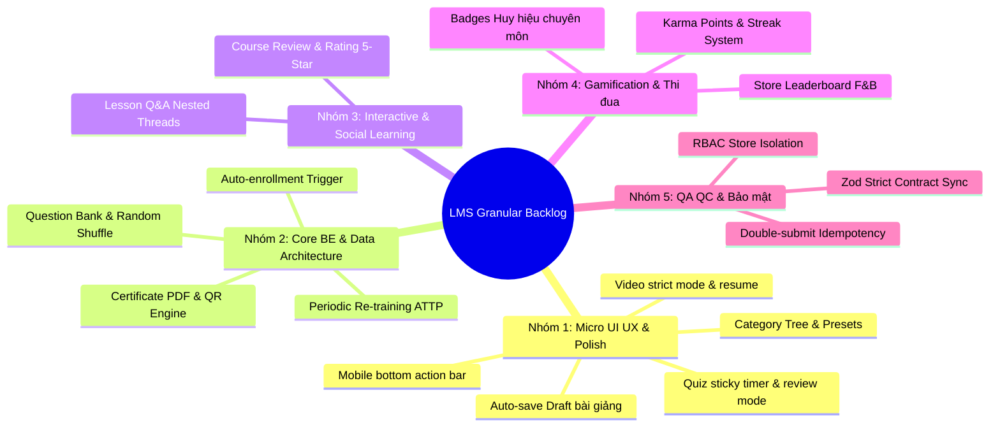
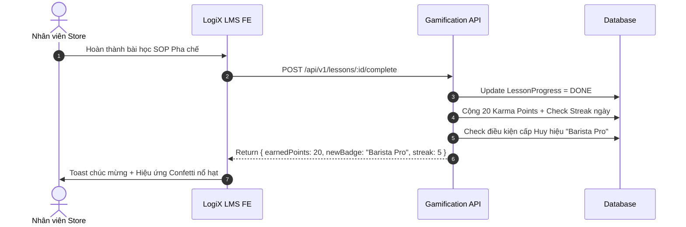

# 📋 LOGIX LMS — GRANULAR UPDATE & ENHANCEMENT BACKLOG
> **Tài liệu đặc tả chi tiết các hạng mục nâng cấp & tối ưu hóa (từ micro-task đến core features)**  
> **Author:** `[Doc-Agent]` (System Architect)  
> **Collaborators:** `[FE-Agent]`, `[BE-Agent]`, `[QA-QC-Agent]`  
> **Trạng thái:** 🟡 Active Backlog | **Cập nhật lần cuối:** 2026-09-14  
> **Tương thích:** Obsidian Markdown · Mermaid.js · LogiX Task Tracking  

---

## 🧭 TỔNG QUAN PHÂN NHÓM HẠNG MỤC

---

## 🎯 CHI TIẾT CÁC HẠNG MỤC NÂNG CẤP (GRANULAR TASKS)

---

### 🎨 NHÓM 1: MICRO-INTERACTIONS & UI/UX POLISH `[FE-Agent]`

Các tinh chỉnh vi mô giúp trải nghiệm sử dụng đạt độ mượt mà tối đa (Enterprise Taste-Skills):

#### 1.1. Quản lý Danh mục (`CourseCategoriesAdminPage.tsx`)
- [ ] **[UI-01] F&B Palette Color Picker:** Bổ sung popover chọn màu nhanh gồm 12 màu chuẩn nhận diện F&B/Brand thay vì chỉ nhập text mã màu.
- [ ] **[UI-02] Dynamic Icon Picker Preview:** Xem trước icon Lucide tức thì khi nhập tên icon vào modal thêm/sửa danh mục.
- [ ] **[UI-03] Visual Tree Connector cho Sub-categories:** Thêm đường kẻ dẫn nhánh cây (tree-line connector `border-l-2 border-dashed`) khi hiển thị danh mục cha - con.
- [ ] **[UI-04] Safe Delete Cascade Warning:** Khi bấm xóa danh mục đang có khóa học, hiển thị `<AlertDialog>` kèm option: "Chuyển toàn bộ khóa học sang danh mục khác" hoặc "Không cho phép xóa khi còn dữ liệu liên kết".
- [ ] **[UI-05] Quick Inline Search Highlight:** Đánh dấu highlight (vàng nhạt `--t-status-progress-bg`) cụm từ tìm kiếm khớp trong bảng danh mục.

#### 1.2. Trình tạo & Soạn thảo Khóa học (`course-create`, `course-editor`)
- [ ] **[UI-06] Auto-save Local Draft:** Tự động lưu nội dung bài soạn thảo vào `localStorage` mỗi 15 giây để chống mất dữ liệu khi rớt mạng hoặc đóng nhầm tab.
- [ ] **[UI-07] Drag & Drop Visual Indicator:** Hiển thị vạch kẻ xanh đậm (`border-primary`) tại vị trí thả khi kéo thả sắp xếp thứ tự Bài học/Module.
- [ ] **[UI-08] Rich-text F&B Callout Boxes:** Bổ sung các preset block vào trình soạn thảo bài viết:
  - 📌 *Lưu ý an toàn thực phẩm (Safety Tip)*
  - ⚠️ *Điểm kiểm soát tới hạn CCP (Warning Callout)*
  - 📋 *Bảng định lượng nguyên vật liệu chuẩn (Recipe Table)*
- [ ] **[UI-09] Video Strict Completion Guard:** Bổ sung nút gạt cấu hình "Khóa tua nhanh video": Không cho phép học viên kéo thanh tua qua mốc thời gian chưa xem đối với các khóa học SOP bắt buộc.
- [ ] **[UI-10] Video Resume Timestamp:** Tự động lưu giây dừng cuối cùng của video, hiển thị tooltip "Tiếp tục xem từ 02:45" khi học viên mở lại.

#### 1.3. Trình làm bài & Đánh giá (`quiz-engine`)
- [ ] **[UI-11] Sticky Countdown Bar:** Thanh đếm ngược thời gian làm bài cố định trên đỉnh màn hình, tự động đổi màu từ xanh $\rightarrow$ cam $\rightarrow$ đỏ nhấp nháy khi còn dưới 60 giây.
- [ ] **[UI-12] Question Jump Grid:** Bảng lưới số thứ tự câu hỏi (1, 2, 3... 20) ở sidebar làm bài thi:
  - ⚪ Trắng: Chưa làm
  - 🔵 Xanh: Đã trả lời
  - 🟡 Vàng: Đánh dấu cần xem lại (Flag for review)
- [ ] **[UI-13] Pre-submit Summary Modal:** Trước khi nộp bài, hiện modal tóm tắt: "Bạn đã làm 18/20 câu. Còn 2 câu chưa trả lời. Bạn có chắc muốn nộp ngay?".
- [ ] **[UI-14] Post-Quiz Review Mode:** Giao diện xem lại bài thi sau khi có kết quả: Hiển thị giải thích chi tiết nguyên nhân đúng/sai từng câu hỏi.

#### 1.4. Trải nghiệm Mobile / Tablet
- [ ] **[UI-15] Mobile Syllabus Drawer:** Thu gọn mục lục bài học vào Bottom Sheet/Drawer khi học trên điện thoại màn hình nhỏ (<768px).
- [ ] **[UI-16] Floating Bottom Action Bar:** Thanh điều hướng nổi dưới chân trang trên mobile: Nút "Bài trước", "Đã hiểu & Tiếp tục", "Hỏi giảng viên".

---

### ⚙️ NHÓM 2: BACKEND SERVICES & DATA ARCHITECTURE `[BE-Agent]`

Nâng cấp tầng nghiệp vụ, tối ưu hóa cơ sở dữ liệu và tự động hóa quy trình:

#### 2.1. Tự động hóa Giao bài học theo Chuỗi (Targeting & Auto-enrollment)
- [ ] **[BE-01] Event-driven Auto-enrollment Trigger:**
  - Viết Service lắng nghe sự kiện khi nhân viên mới được tạo trong `User` hoặc thay đổi `Position` / `Store`.
  - Tự động quét các khóa học có target phù hợp $\rightarrow$ Khởi tạo bản ghi `CourseEnrollment` với trạng thái `ENROLLED`.
- [ ] **[BE-02] Prerequisite Dependency Validator:**
  - Middleware kiểm tra điều kiện tiên quyết: Không cho phép học bài/khóa B nếu khóa A trong danh sách `prerequisites` chưa đạt `COMPLETED`.
- [ ] **[BE-03] Định kỳ Tái đào tạo (Periodic Re-training Lifecycle):**
  - Thêm field `validityMonths` vào `Course` (Ví dụ: Khóa ATTP có hiệu lực 12 tháng).
  - Cron-job quét tự động: Trước khi hết hạn 30 ngày, gửi thông báo và chuyển trạng thái về `EXPIRED_RETAKE_REQUIRED`.

#### 2.2. Nâng cấp Engine Đánh giá (Quiz & Question Bank)
- [ ] **[BE-04] Question Bank Pool Model:**
  - Xây dựng model `QuestionBank` độc lập: Cho phép tạo kho 100 câu hỏi chung, mỗi đề thi rút ngẫu nhiên 20 câu (`randomizeQuestions: true`).
- [ ] **[BE-05] Answer Options Shuffle:**
  - Thuật toán xáo trộn vị trí đáp án ngẫu nhiên trong API `/quizzes/:id/start-attempt` để chống học vẹt/gian lận chép bài.
- [ ] **[BE-06] Anti-Spam & Attempt Cool-down:**
  - Cấu hình thời gian chờ giữa các lần thi lại (ví dụ: Thi trượt phải đợi tối thiểu 30 phút mới được thi lại lần 2).

#### 2.3. Sinh Chứng chỉ PDF & Xác thực QR (Certificate Engine)
- [ ] **[BE-07] Server-side PDF Renderer:**
  - Tích hợp thư viện render PDF xuất file chứng chỉ chất lượng cao theo template SVG/HTML.
  - Tự động điền: Họ tên học viên, Tên khóa, Ngày cấp, Điểm số, Mã chứng chỉ định danh (`CERT-XXXX-YYYY`).
- [ ] **[BE-08] Public Certificate Verification Endpoint:**
  - Endpoint công khai `GET /api/v1/certificates/verify/:certCode` không yêu cầu login.
  - Quét mã QR trên chứng chỉ sẽ dẫn thẳng đến trang web xác thực tính hợp lệ.

---

### 💬 NHÓM 3: HỌC TẬP TƯƠNG TÁC & PHẢN HỒI (INTERACTIVE & SOCIAL) `[FE-Agent]` + `[BE-Agent]`

Bổ sung tính năng trao đổi thảo luận trực tiếp (học hỏi từ điểm mạnh của Odoo eLearning):

#### 3.1. Thảo luận & Hỏi đáp dưới Bài học (Lesson Q&A Thread)
- [x] **[SOC-01] Prisma Schema `LessonComment` & `LessonCommentLike`:** ✅ Đã hoàn thành (Xem [[Lesson_Discussion_And_QA_Architecture]])
  - Model lưu trữ bình luận theo từng `lessonId`, hỗ trợ `parentId` (cấu trúc phân cấp 2 tầng), `userId`, `content`, `isInstructorReply`, `isPinned`, `likesCount`.
- [x] **[SOC-02] Q&A Frontend Component (`LessonCommentsList` & `LessonCommentItem`):** ✅ Đã hoàn thành
  - Tích hợp vào thanh bên phải `LessonRightPanel` của trình phát bài học `LessonPlayerPage`.
  - Phân tầng trả lời con 2 cấp, hỗ trợ thích (optimistic toggle like), ghim thảo luận, badge giảng viên, và hộp thoại xác nhận xóa `<AlertDialog>`.

#### 3.2. Đánh giá & Khảo sát Chất lượng Khóa học (Course Review & Survey)
- [ ] **[SOC-03] Course Feedback Modal:**
  - Sau khi hoàn thành 100% khóa học, popup tự động mời đánh giá:
    - 5 sao tổng thể (Overall Rating)
    - Tiêu chí phụ: Độ dễ hiểu, Tính ứng dụng thực tế tại ca làm việc
    - Ý kiến đóng góp nội dung
- [ ] **[SOC-04] Analytics Feedback Dashboard cho Giảng viên:**
  - Biểu đồ thống kê mức độ hài lòng của nhân viên theo từng khóa học để cải tiến giáo trình SOP.

---

### 🏆 NHÓM 4: GAMIFICATION & ĐỘNG LỰC THI ĐUA `[Doc-Agent]` + `[BE-Agent]` + `[FE-Agent]`

Thúc đẩy nhân viên học tập chủ động thông qua điểm số và bảng xếp hạng:

- [ ] **[GAM-01] Karma Points Ledger Schema:**
  - Tạo model `UserKarmaPoint` ghi nhận lịch sử cộng/trừ điểm minh bạch:
    - +10 pts: Hoàn thành 1 bài học
    - +50 pts: Đạt điểm tối đa (100%) bài Quiz lần đầu tiên
    - +30 pts: Giữ chuỗi học liên tục 7 ngày (Streak)
- [ ] **[GAM-02] Badges / Huy hiệu Chuyên môn:**
  - Huy hiệu Tân binh xuất sắc (Onboarding Champion)
  - Bậc thầy Vệ sinh An toàn Thực phẩm (Food Safety Master)
  - Chiến binh Tốc độ (Hoàn thành khóa học trước hạn 3 ngày)
- [ ] **[GAM-03] Leaderboard Bảng vàng Thi đua:**
  - **Bảng cá nhân:** Top 10 nhân viên có điểm Karma cao nhất tháng.
  - **Bảng Cửa hàng (Store vs Store):** Thi đua tỷ lệ hoàn thành đào tạo giữa Chi nhánh A vs Chi nhánh B $\rightarrow$ Tạo động lực cho Quản lý cửa hàng đôn đốc nhân viên.

---

### 🛡️ NHÓM 5: QA/QC, BẢO MẬT & ĐỒNG BỘ CONTRACTS `[QA-QC-Agent]`

Đảm bảo hệ thống vận hành ổn định, không lỗi tiềm ẩn khi triển khai quy mô lớn:

- [ ] **[QA-01] Idempotency & Double-Submit Protection:**
  - Khóa nút Nộp bài thi (`disabled={isSubmitting}`) và thêm header `Idempotency-Key` để ngăn chặn gửi nhiều request chấm điểm cùng lúc khi mạng lag.
- [ ] **[QA-02] Multi-tenant Store Data Isolation:**
  - Kiểm tra middleware RBAC: Đảm bảo Quản lý Cửa hàng A không thể xem bảng điểm hoặc tiến độ học của Cửa hàng B.
- [ ] **[QA-03] Strict TypeScript & Zod Contract Synchronization:**
  - Quét toàn bộ DTOs giữa `@logix/shared`, `backend/src/modules/lms` và `frontend/src/features/lms/schemas/`. Đảm bảo **0 `any`** và 100% khớp type.
- [ ] **[QA-04] Rate Limiting cho API Làm bài thi:**
  - Giới hạn tần suất gọi API `/attempts/answer` để ngăn chặn bot spam request tự động đoán đáp án.

---

## 📅 MA TRẬN PHÂN KỲ TRIỂN KHAI (IMPLEMENTATION MATRIX)

| Giai đoạn | Trọng tâm | Các mã Task chính | Mục tiêu đầu ra |
| :--- | :--- | :--- | :--- |
| **Giai đoạn 1 (Sát sườn)** | Micro UI/UX & Tối ưu Form/Bảng | `UI-01` $\rightarrow$ `UI-16` | Trải nghiệm Admin & Học viên mượt mà, không giật lag, tự động lưu nháp. |
| **Giai đoạn 2 (Automation)** | Tự động hóa & Chứng chỉ số | `BE-01` $\rightarrow$ `BE-08` | Auto-enrollment theo Cửa hàng/Vị trí, xuất file PDF chứng chỉ chuẩn có QR Code. |
| **Giai đoạn 3 (Engagement)** | Thảo luận & Gamification | `SOC-01` $\rightarrow$ `SOC-04`, `GAM-01` $\rightarrow$ `GAM-03` | Nhân viên tương tác hỏi đáp, tích điểm Karma, bảng xếp hạng thi đua giữa các Store. |
| **Giai đoạn 4 (Hardening)** | Kiểm thử tải & Bảo mật chuỗi | `QA-01` $\rightarrow$ `QA-04` | Pass 100% kiểm thử bảo mật đa chi nhánh, sẵn sàng go-live toàn hệ thống. |

---
*Tài liệu này được lưu trữ tại `doc/04-tracking-sprints/LMS_Granular_Update_Backlog.md` và sẵn sàng làm đầu vào cho các sprint thi công tiếp theo.*
