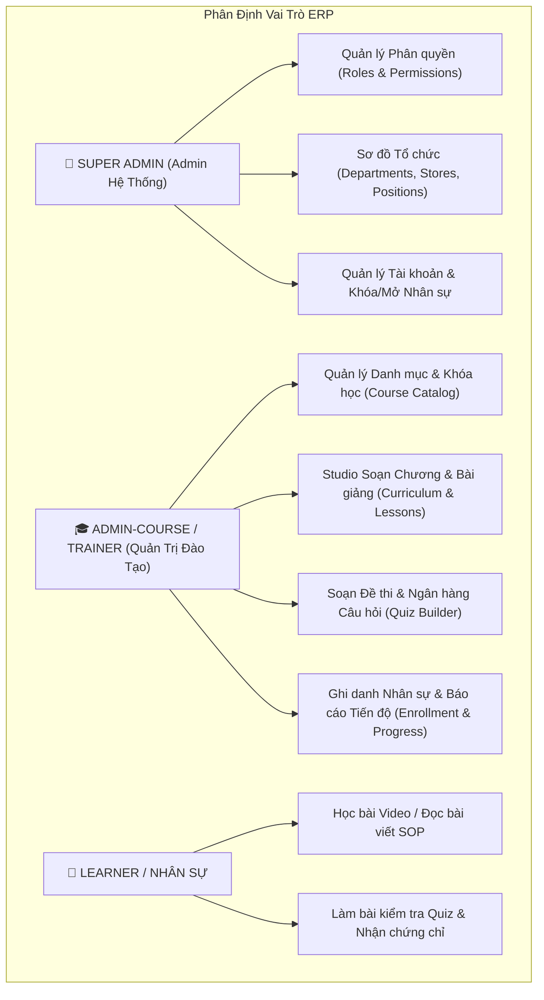
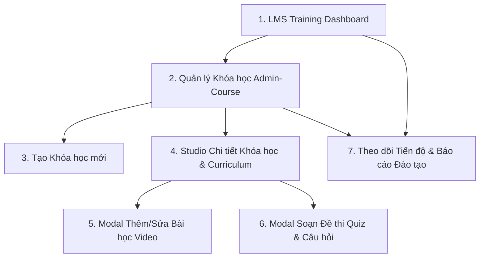

# KẾ HOẠCH MỞ RỘNG SPRINT 1: ADMIN-COURSE CURRICULUM & QUIZ BUILDER
## 04. THIẾT KẾ GIAO DIỆN PHÂN HỆ QUẢN TRỊ KHÓA HỌC (FRONTEND UI/UX PLAN)
### *(Thiết kế cho Admin-Course / Trainer trên Design System chuẩn của LogiX LMS)*

> **Mục tiêu:** Xây dựng giao diện Studio quản trị Khóa học, Soạn thảo Chương trình học (Curriculum) và Ngân hàng Đề thi (Quiz Builder) trên Next.js 16 (React 19, Tailwind CSS, Shadcn UI). Kế thừa **Format & Bố cục 7 màn hình từ Stitch UI**, nhưng áp dụng **100% Bộ nhận diện & Bảng màu Design System gốc của LogiX LMS**.  
> **Thư mục tài liệu:** `Practice/LogiX/doc/04-tracking-sprints/Sprint1_Admin_Curriculum_Quiz_Plan/`  

---

## 1. PHÂN ĐỊNH TRÁCH NHIỆM TRONG HỆ THỐNG ERP (ROLE SEPARATION)

Trong hệ thống ERP Chuỗi F&B Ba Hưng, quyền hạn và trách nhiệm được phân tách độc lập, không dồn tất cả công việc cho một Admin duy nhất:



### Bộ quyền hạn RBAC gắn liền với Admin-Course:
- **Khóa học:** `COURSE.READ`, `COURSE.CREATE`, `COURSE.UPDATE`, `COURSE.DELETE`, `CATEGORY.MANAGE`
- **Chương & Bài học:** `MODULE.MANAGE`, `LESSON.READ`, `LESSON.CREATE`, `LESSON.UPDATE`, `LESSON.DELETE`
- **Đề thi & Đánh giá:** `QUIZ.READ`, `QUIZ.MANAGE`, `QUIZ.GRADE`
- **Tiến độ & Ghi danh:** `ENROLLMENT.MANAGE`, `REPORT.VIEW`

---

## 2. DESIGN SYSTEM CHUẨN LOGIX LMS (COLOR PALETTE & TOKENS)

Giao diện sử dụng bộ Design Tokens hiện hữu trong `frontend/src/app/index.css` của dự án LogiX LMS:

- **Bảng màu Nhận diện Thương hiệu (Brand Colors):**
  - `Primary / Accent` (Terracotta Orange): `#e8784a` / `#cc785c` / `oklch(0.638 0.187 40.2)` — Nút CTA chính, Tab đang chọn, Viền Active, Điểm nhấn thương hiệu Ba Hưng.
  - `Primary Hover`: `#d96b3c`
  - `Primary Subtle`: `rgba(232, 120, 74, 0.12)` — Highlight nền cho item được chọn trong Curriculum Tree.
- **Bảng màu Trạng thái & Nghiệp vụ (Semantic Colors):**
  - `Success` (Teal / Emerald Green): `#5db8a6` / `#5db872` — Biểu thị Trạng thái Đạt (Passed), Đáp án đúng, Đã hoàn thành 100%.
  - `Warning` (Amber Gold): `#e8a55a` / `#fef6e4` — Trạng thái Bản nháp (Draft), Đang học (In Progress).
  - `Destructive / Danger`: `#c0392b` / `#fdecea` — Khóa học quá hạn, Nút Xóa câu hỏi / Xóa chương.
  - `Info / Tech`: `#3b82f6` / `#e8f4fd` — Nút Xem trước (Preview Mode), Tag Video.
- **Màu Nền & Khung (Surfaces & Borders):**
  - `Sidebar Background`: Deep Charcoal `#191919` / `#141413` với viền `rgba(255, 255, 255, 0.08)`.
  - `Canvas Canvas`: Warm Off-White `#faf9f5` / `#fafaf8`.
  - `Card / Modal Surface`: Pure White `#ffffff`.
  - `Border / Divider`: `#e8e8e6` / `#e6dfd8` (Subtle Warm Border).
- **Typography:** `Inter` (Display 36px, Headline 24px/20px, Body 16px/14px, Label 12px/14px).
- **Radius:** `rounded-lg` (8px), `rounded-xl` (12px), `rounded-[16px]` (Modal Container).

---

## 3. CHI TIẾT 7 MÀN HÌNH CHỨC NĂNG DÀNH CHO ADMIN-COURSE

*(Kế thừa cấu trúc từ Stitch UI, render hoàn toàn bằng Tone màu LogiX Terracotta & Warm Slate)*



---

### 🖥️ MÀN HÌNH 1: LMS TRAINING DASHBOARD (DESKTOP)
- **Mục tiêu:** Màn hình tổng quan dành cho Giảng viên / Admin-Course theo dõi sức khỏe hoạt động đào tạo toàn chuỗi.
- **Layout & Màu sắc LogiX:**
  - Header với avatar, Breadcrumb và Nút `+ Tạo khóa học mới` màu cam đất `#e8784a`.
  - **4 Thẻ Chỉ số KPI (KPI Cards):**
    - *Tổng khóa học:* Nền trắng `#ffffff`, viền `#e8e8e6`.
    - *Học viên đang học:* Badge xanh lá `#5db8a6`.
    - *Tỷ lệ hoàn thành TB:* Thanh tiến trình bo góc màu cam `#e8784a`.
    - *Điểm Quiz trung bình:* Điểm số TB (VD: `8.8 / 10`).
  - **Bảng Khóa học Trọng tâm & Biểu đồ Hoạt động:** Thống kê các khóa học bắt buộc theo Cửa hàng & Xưởng.

---

### 🖥️ MÀN HÌNH 2: QUẢN LÝ KHÓA HỌC (COURSE CATALOG FOR ADMIN-COURSE)
- **Mục tiêu:** Danh sách khóa học dạng Data Table / Card Grid chuyên nghiệp.
- **Layout & Thành phần:**
  - **Toolbar:** Ô tìm kiếm, Filter Dropdown theo Danh mục (`Khối Cửa Hàng`, `Khối Xưởng Kem`), Trạng thái (`Đã xuất bản`, `Bản nháp`).
  - **Nút CTA:** `+ Tạo Khóa học mới` (`bg-[#e8784a] text-white hover:bg-[#d96b3c]`).
  - **Data Table:**
    - Cột Khóa học: Thumbnail nhỏ, Mã code (`BH-SOP-01`), Tiêu đề khóa.
    - Cột Danh mục: Badge nền nhạt (`bg-[#faf3e8] text-[#e8a55a]`).
    - Cột Học viên: Số lượng nhân sự đã ghi danh.
    - Cột Trạng thái: Pill badge xanh lá `Đã xuất bản` hoặc vàng `Bản nháp`.
    - Cột Tác vụ: Menu Dropdown (`Vào Studio Giáo trình`, `Chỉnh sửa`, `Nhân bản`, `Xóa`).

---

### 🖥️ MÀN HÌNH 3: TẠO KHÓA HỌC MỚI (CREATE COURSE WIZARD)
- **Mục tiêu:** Khởi tạo khóa học mới trước khi vào Studio soạn giáo trình.
- **Layout & Thành phần:**
  - **Khối Thông tin Chung:** Nhập Mã code (`BH-SOP-02`), Tên khóa học, Mô tả tóm tắt, Tải lên Thumbnail hoặc chọn URL.
  - **Khối Phân loại & Đối tượng:** Chọn Danh mục đào tạo, Phòng ban mục tiêu (Bộ phận Bán hàng, Xưởng kem...), Checkbox `Khóa học Bắt buộc`.
  - **Khối Điều kiện:** Thiết lập Thời hạn hoàn thành (`30 ngày`), Điểm đạt khóa học (`80%`).
  - **Nút Hành động:** `Lưu bản nháp` và `Tiếp tục: Vào Studio Soạn giáo trình` (Primary Orange CTA).

---

### 🖥️ MÀN HÌNH 4: STUDIO CHI TIẾT KHÓA HỌC & CHƯƠNG HỌC (SPLIT-PANE WORKSPACE)
- **Mục tiêu:** Không gian làm việc 2 cột chuyên sâu (Coursera-style) để Admin-Course quản lý toàn bộ Cây chương trình học.

```
┌──────────────────────────────────────┬─────────────────────────────────────────────────┐
│ CỘT TRÁI (Curriculum Tree - 380px)   │ CỘT PHẢI (Studio Workspace / Item Detail)       │
│ Nền: #ffffff | Viền: #e8e8e6         │ Nền: #faf9f5                                    │
│ ──────────────────────────────────── │ ─────────────────────────────────────────────── │
│ [Curriculum]        [+ Thêm Chương]  │ [Header: Tên Khóa Học + Badge Trạng Thái]       │
│ ──────────────────────────────────── │ ─────────────────────────────────────────────── │
│ 📂 Chương 1: Quy định chung          │ ⚙️ THÔNG TIN KHÓA HỌC & CẤU HÌNH NHANH           │
│   ├── 🎥 Bài 1: Video Giới thiệu     │   - Mã code: BH-SOP-01                          │
│   ├── 📄 Bài 2: Checklist Mở CH      │   - Điểm đạt: 80% | Thời hạn: 30 ngày           │
│   └── 📝 Bài 3: Bài kiểm tra Quiz    │                                                 │
│   └── [+ Thêm Bài học] (Popover)     │ 👁️ PREVIEW / THAO TÁC NỘI DUNG                  │
│                                      │   - Chọn Bài Video -> Xem trước Player          │
│ 📂 Chương 2: Kỹ năng Phục vụ         │   - Chọn Bài Quiz -> Xem trước Đề thi & Đáp án  │
│   ├── 🎥 Video Chào khách 4 bước     │   - Nút [Chỉnh sửa Nội dung] -> Mở Modal Popup  │
│   └── [+ Thêm Bài học]               │                                                 │
└──────────────────────────────────────┴─────────────────────────────────────────────────┘
```

#### Tương tác & Trạng thái:
- Item bài học được chọn sẽ có viền cam đậm bên trái (`border-l-2 border-[#e8784a]`) và nền cam nhạt `bg-[#e8784a]/10`.
- Icon `drag_indicator` kéo thả sắp xếp thứ tự Chương (`/modules/reorder`) và Bài học (`/lessons/reorder`).
- Nút `+ Thêm Bài học` mở Menu chọn nhanh:
  - 🎥 *Video Lesson* $\rightarrow$ Mở Màn hình 5 (Video Modal).
  - 📄 *Article / PDF* $\rightarrow$ Mở Modal soạn thảo Rich Text & Upload tài liệu.
  - 📝 *Quiz / Test* $\rightarrow$ Mở Màn hình 6 (Quiz Builder Modal).

---

### 🖥️ MÀN HÌNH 5: MODAL THÊM / SỬA BÀI HỌC VIDEO (POPUP)
- **Mục tiêu:** Cấu hình nguồn Video (YouTube parser hoặc MP4 tự upload) và quy chuẩn SOP.
- **Layout & Thành phần:**
  - Header: Modal Title *"Thêm Bài học Video"* kèm icon video màu cam `#e8784a`, Nút đóng `X`.
  - `Tên bài học` & `Mô tả tóm tắt nội dung`.
  - **Nguồn Video (Segmented Switch):**
    - `[ Dán Link YouTube ]`: Ô nhập URL $\rightarrow$ Tự động parse Video ID, trích xuất Thumbnail và nhúng **Video Player Preview** trực quan ngay trong popup.
    - `[ Tự Tải lên MP4 / WebM ]`: Khung kéo thả file với thanh tiến trình upload %.
  - `Thời lượng (Phút)` & `Mã quy trình SOP` (`SOP-CH-01`).
  - Checkbox: *Yêu cầu nhân sự ký cam kết sau khi hoàn thành bài học*.
  - Nút: `Hủy` và `Lưu Bài Học` (Primary Orange Button).

---

### 🖥️ MÀN HÌNH 6: MODAL SOẠN ĐỀ THI QUIZ & CÂU HỎI (QUESTION BUILDER)
- **Mục tiêu:** Studio soạn thảo đề thi trắc nghiệm chuyên nghiệp cho Giảng viên.
- **Layout & Thành phần:**
  - **Phần 1: Cấu hình Đề thi (Quiz Settings):**
    - `Tiêu đề đề thi` (Ví dụ: *"Đề kiểm tra Nghiệp vụ Mở cửa hàng"*).
    - `Điểm đạt (%)` (Mặc định 80%).
    - `Thời gian làm bài (Phút)` (Ví dụ: 15 phút).
    - `Số lần làm lại tối đa` (3 lần).
    - `Xáo trộn câu hỏi (Shuffle)`: Switch Toggle màu cam.
  - **Phần 2: Soạn Câu hỏi (Interactive Question Builder):**
    - Thẻ câu hỏi (Question Card 1, 2, 3...):
      - Badge tròn số thứ tự `1`, `2`...
      - Ô nhập `Nội dung câu hỏi`.
      - Dropdown loại câu hỏi: *Trắc nghiệm 1 đáp án (`SINGLE_CHOICE`), Nhiều đáp án (`MULTIPLE_CHOICE`), Đúng/Sai (`TRUE_FALSE`)*.
      - **Danh sách Lựa chọn Đáp án (Options List):**
        - Lựa chọn A, B, C, D...
        - Radio/Checkbox chọn **Đáp án đúng** (Đáp án đúng được highlight viền xanh `#5db8a6` và nền `#5db8a6`/10).
        - Nút `+ Thêm đáp án` và nút icon thùng rác xóa đáp án.
      - Ô nhập **Giải thích đáp án (Explanation)**: Lời giải chi tiết sau khi học viên nộp bài.
  - **Nút Thêm Câu hỏi:** Nút nét đứt `+ Thêm Câu Hỏi Mới` toàn chiều rộng.
  - **Nút Hành động:** `👁️ Xem trước Đề thi (Preview Quiz)` và `Lưu Đề Thi (Save Quiz)`.

---

### 🖥️ MÀN HÌNH 7: THEO DÕI TIẾN ĐỘ & BÁO CÁO ĐÀO TẠO (PROGRESS & REPORTS)
- **Mục tiêu:** Giúp Admin-Course và Quản lý theo dõi tiến trình hoàn thành khóa học của nhân viên theo từng chi nhánh.
- **Layout & Thành phần:**
  - **Thanh Filter:** Lọc theo Khóa học, Cửa hàng (`Chi nhánh Quận 1`, `Xưởng Kem`), Trạng thái (`Đã hoàn thành`, `Đang học`, `Quá hạn`).
  - **Nút:** `Xuất Báo Cáo Excel / PDF`.
  - **Bảng Tiến độ Học viên:**
    - Cột Học viên: Họ tên, Chức danh, Bộ phận trực thuộc.
    - Cột Khóa học: Tên khóa học đã gán.
    - Cột Tiến độ: Thanh % màu xanh lá `#5db8a6` (nếu hoàn thành) hoặc cam `#e8784a` (nếu đang học).
    - Cột Điểm Quiz: Điểm thi cao nhất đạt được.
    - Cột Trạng thái: Badge `Đã hoàn thành`, `Đang học`, `Quá hạn (Overdue)`.
    - Cột Thao tác: Gửi nhắc nhở (`Remind`), Xem lịch sử làm bài (`Attempts`).

---

## 4. CẤU TRÚC PHÂN HỆ `features/admin-courses/` CHUẨN 6 TẦNG (REACT 19 + NEXT.JS 16)

Áp dụng chuẩn kiến trúc phần mềm **Feature-Driven Modular Architecture** (theo tài liệu [`08-FRONTEND_FEATURE_ARCHITECTURE_REFACTOR_PLAN.md`](file:///c:/Projects/DigiFnb/Practice/LogiX/doc/04-tracking-sprints/Sprint1_Admin_Curriculum_Quiz_Plan/08-FRONTEND_FEATURE_ARCHITECTURE_REFACTOR_PLAN.md)):

```
frontend/src/features/admin-courses/
├── components/                     # [Tầng 1: UI Components]
│   ├── catalog/
│   │   ├── CourseCatalogTable.tsx  # [Màn hình 2] Bảng danh sách khóa học kèm Status Badge
│   │   ├── CourseFilterToolbar.tsx # [Màn hình 2] Toolbar tìm kiếm, lọc danh mục, trạng thái
│   │   └── CourseActionMenu.tsx    # [Màn hình 2] Menu tác vụ (Studio, Sửa, Clone, Xóa)
│   ├── create/
│   │   └── CreateCourseForm.tsx    # [Màn hình 3] Form tạo khóa học mới & chọn phòng ban
│   ├── studio/
│   │   ├── CurriculumTree.tsx      # [Màn hình 4] Cây Chương học Accordion kéo thả
│   │   ├── ModuleAccordionItem.tsx # [Màn hình 4] Item từng Chương học kèm menu ...
│   │   ├── LessonRowItem.tsx       # [Màn hình 4] Từng dòng bài học [VIDEO], [ARTICLE], [QUIZ]
│   │   ├── CourseSettingsPane.tsx  # [Màn hình 4] Pane cấu hình nhanh bên phải
│   │   └── AddLessonPopover.tsx    # [Màn hình 4] Menu chọn nhanh dạng bài học
│   ├── modals/
│   │   ├── VideoLessonModal.tsx    # [Màn hình 5] Modal cấu hình Video (YouTube + Upload MP4)
│   │   ├── ArticleLessonModal.tsx  # Modal soạn thảo Rich Text & Đính kèm PDF
│   │   ├── QuizBuilderModal.tsx    # [Màn hình 6] Modal soạn đề thi & Question Builder
│   │   ├── QuestionCardEditor.tsx  # [Màn hình 6] Thẻ soạn 1 câu hỏi + options A/B/C/D
│   │   └── QuizPreviewDrawer.tsx   # [Màn hình 6] Drawer xem trước đề thi thực tế
│   └── progress/
│       ├── LearnerProgressTable.tsx# [Màn hình 7] Bảng theo dõi tiến độ nhân sự theo khóa
│       └── ProgressFilterBar.tsx   # [Màn hình 7] Thanh lọc báo cáo đào tạo theo cửa hàng
├── hooks/                          # [Tầng 2: Custom Hooks & State Logic]
│   ├── useAdminCourses.ts          # CRUD khóa học, clone, publish, filter
│   ├── useCurriculum.ts            # Quản lý Cây chương trình học & kéo thả Reorder
│   ├── useLessonEditor.ts          # Quản lý Form bài học & YouTube URL parser
│   ├── useQuizBuilder.ts           # Quản lý State danh sách câu hỏi & options
│   └── useTrainingReports.ts       # Tải báo cáo tiến độ học viên & xuất Excel
├── pages/                          # [Tầng 3: Page Views]
│   ├── CourseCatalogAdminPage.tsx  # [Trang 1 / Màn hình 2] Quản lý Danh mục Khóa học
│   ├── CreateCourseAdminPage.tsx   # [Trang 2 / Màn hình 3] Tạo mới Khóa học
│   ├── CourseStudioAdminPage.tsx   # [Trang 3 / Màn hình 4] Studio Soạn Giáo trình & Đề thi
│   └── TrainingReportsAdminPage.tsx# [Trang 4 / Màn hình 7] Báo cáo Tiến độ & Chứng nhận
├── schemas/                        # [Tầng 4: Zod Validation Schemas]
│   ├── course-form.schema.ts       # Validate Form tạo/sửa khóa học
│   ├── lesson-form.schema.ts       # Validate Form bài giảng Video / Article
│   └── quiz-builder.schema.ts      # Validate Đề thi, Câu hỏi & Options
├── services/                       # [Tầng 5: RESTful API Client Services]
│   ├── course-admin.service.ts     # Gọi /api/courses, /api/courses/modules
│   ├── lesson-admin.service.ts     # Gọi /api/lessons, /api/lessons/parse-youtube
│   ├── quiz-admin.service.ts       # Gọi /api/quizzes, /api/quizzes/questions
│   └── report-admin.service.ts     # Gọi /api/courses/:id/enrollments
└── types/                          # [Tầng 6: TypeScript Types & DTOs]
    ├── course-admin.types.ts       # Course, Category, CourseStatus
    ├── curriculum.types.ts         # CourseModule, Lesson, LessonType
    ├── quiz-builder.types.ts       # Quiz, Question, Option, QuestionType
    └── report-admin.types.ts       # EnrollmentReport, CompletionStat
```

---

## 5. MA TRẬN TÍCH HỢP REST API

| Màn hình | Component Frontend | REST API Endpoint tương ứng |
|---|---|---|
| **Màn hình 2** | `CourseCatalogTable.tsx` | `GET /api/courses` |
| **Màn hình 3** | `CreateCourseForm.tsx` | `POST /api/courses` |
| **Màn hình 4** | `CurriculumTree.tsx` | `GET /api/courses/:id/curriculum`<br>`POST /api/courses/:id/modules`<br>`PUT /api/courses/modules/:id`<br>`DELETE /api/courses/modules/:id`<br>`POST /api/courses/:id/modules/reorder` |
| **Màn hình 5** | `VideoLessonModal.tsx` | `POST /api/lessons/modules/:moduleId`<br>`PUT /api/lessons/:id`<br>`DELETE /api/lessons/:id`<br>`POST /api/lessons/parse-youtube` |
| **Màn hình 6** | `QuizBuilderModal.tsx` | `GET /api/quizzes/lessons/:lessonId`<br>`PUT /api/quizzes/:id`<br>`POST /api/quizzes/:quizId/questions`<br>`PUT /api/quizzes/questions/:questionId`<br>`DELETE /api/quizzes/questions/:questionId`<br>`GET /api/quizzes/:id/preview` |
| **Màn hình 7** | `LearnerProgressTable.tsx` | `GET /api/courses/:id/enrollments` |

---

## 6. KẾT LUẬN

Bản kế hoạch giao diện Frontend đã được điều chỉnh chuẩn xác:
1. **Phân định độc lập vai trò Admin-Course / Trainer** trong hệ thống ERP.
2. **Áp dụng 100% Bộ nhận diện & Bảng màu Design System gốc của LogiX LMS** (`Terracotta Orange #e8784a`, `Warm Slate #faf9f5`, `Dark Charcoal #191919`, `Emerald #5db8a6`).
3. **Kế thừa hoàn hảo Format & Component Breakdown từ 7 màn hình Stitch UI**.
