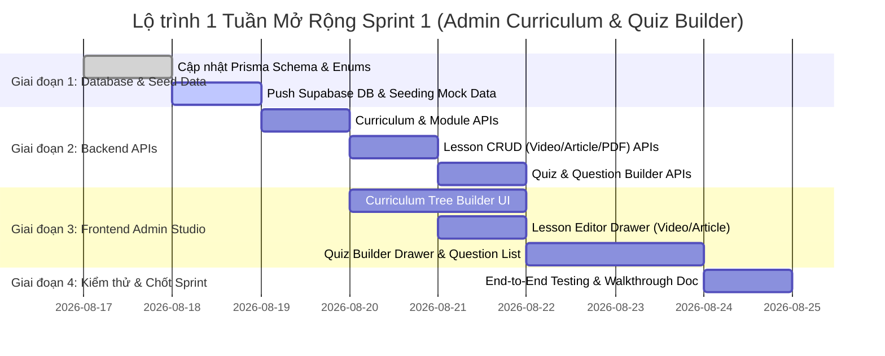

# KẾ HOẠCH MỞ RỘNG SPRINT 1: ADMIN CURRICULUM & QUIZ BUILDER
## 05. CHECKLIST THI CÔNG & LỘ TRÌNH THỰC HIỆN (CHECKLIST & TIMELINE)

> **Mục tiêu:** Phân chia công việc theo từng giai đoạn rõ ràng trong 1 tuần mở rộng của Sprint 1, đảm bảo kiểm thử kỹ lưỡng và không phát sinh lỗi.  
> **Thư mục:** `Practice/LogiX/doc/04-tracking-sprints/Sprint1_Admin_Curriculum_Quiz_Plan/`  

---

## 1. LỘ TRÌNH THỰC HIỆN 1 TUẦN MỞ RỘNG (7 NGÀY)

---

## 2. CHECKLIST CÔNG VIỆC CHI TIẾT (TASK MATRIX)

### 📌 Giai đoạn 1: Database Schema & Migration
- [ ] **[DB-01]** Cập nhật file `schema.prisma`:
  - [ ] Thêm Enums: `LessonType`, `VideoProvider`, `QuestionType`.
  - [ ] Cập nhật Model `Lesson`: thêm `description`, `videoProvider`, `videoStoragePath`, `videoDuration`, `estimatedReadTime`, relation `quiz`.
  - [ ] Thêm Models Quiz: `Quiz`, `QuizQuestion`, `QuizQuestionOption`, `QuizAttempt`, `QuizAttemptAnswer`.
  - [ ] Cập nhật Model `LessonProgress`: thêm `quizHighestScore`.
  - [ ] Bổ sung các chỉ mục hiệu năng `@@index` theo chuẩn `database-reviewer`.
- [ ] **[DB-02]** Chạy `pnpm prisma db push` lên Supabase PostgreSQL Cloud.
- [ ] **[DB-03]** Viết script seed data mẫu Khóa học chuẩn Coursera (gồm đầy đủ Video YouTube, Video Upload, Article Rich Text, và 1 bài Quiz có 5 câu hỏi).

### 📌 Giai đoạn 2: Backend REST APIs (Express + Prisma)
- [ ] **[BE-01]** Tạo `curriculum.controller.ts` & `curriculum.service.ts`:
  - [ ] API lấy cây chương trình học: `GET /api/admin/courses/:courseId/curriculum`
  - [ ] API CRUD Module & Reorder: `POST`, `PUT`, `DELETE`, `POST /reorder`
- [ ] **[BE-02]** Tạo `lesson.controller.ts` & `lesson.service.ts`:
  - [ ] API CRUD Lesson đa loại: `POST`, `GET /:id`, `PUT /:id`, `DELETE /:id`, `POST /reorder`
  - [ ] Service parse link YouTube lấy Thumbnail & Embed URL.
  - [ ] Service upload file video/PDF lên Supabase Storage / Static Folder.
- [ ] **[BE-03]** Tạo `quiz-builder.controller.ts` & `quiz-builder.service.ts`:
  - [ ] API cấu hình Quiz gắn vào Lesson: `GET`, `POST /lessons/:lessonId/quiz`
  - [ ] API CRUD Câu hỏi & Danh sách Đáp án: `POST`, `PUT`, `DELETE /questions`
  - [ ] API sắp xếp lại thứ tự câu hỏi: `POST /questions/reorder`

### 📌 Giai đoạn 3: Frontend Admin Studio (Next.js + Tailwind + shadcn/ui)
- [ ] **[FE-01]** Xây dựng trang Studio `/admin/courses/[id]/curriculum`:
  - [ ] Component `CurriculumTree`: Hiển thị danh sách Module & Lesson dạng cây accordion.
  - [ ] Thao tác Thêm/Sửa/Xóa Module nhanh chóng.
- [ ] **[FE-02]** Xây dựng `LessonFormDrawer.tsx`:
  - [ ] Tab thông tin chung: Tiêu đề, Mô tả bài học (`description`), mã SOP.
  - [ ] Tab nội dung Video: Toggle YouTube Link vs Upload Video File MP4 + Preview Player.
  - [ ] Tab nội dung Article: Rich Text Editor + Đính kèm PDF + Thời gian đọc ước tính.
- [ ] **[FE-03]** Xây dựng `QuizBuilderDrawer.tsx`:
  - [ ] Form cấu hình điểm đạt (Pass score %), Số lần làm lại, Thời gian làm bài.
  - [ ] Danh sách câu hỏi + Nút thêm câu hỏi mới.
  - [ ] Bộ chọn đáp án đúng (Radio/Checkbox) + Ô nhập giải thích đáp án.
  - [ ] Chế độ Preview đề thi trực quan cho Trainer.

### 📌 Giai đoạn 4: Kiểm thử, Tối ưu & Báo cáo nghiệm thu
- [ ] **[TEST-01]** Kiểm thử tạo trọn vẹn 1 Khóa học có đủ 3 loại bài học từ Admin.
- [ ] **[TEST-02]** Kiểm tra tính toàn vẹn dữ liệu (Cascade delete khi xóa Module/Lesson/Quiz).
- [ ] **[TEST-03]** Viết tài liệu Walkthrough & Cập nhật file `Checklist-BaHung-Sprint1.md`.
