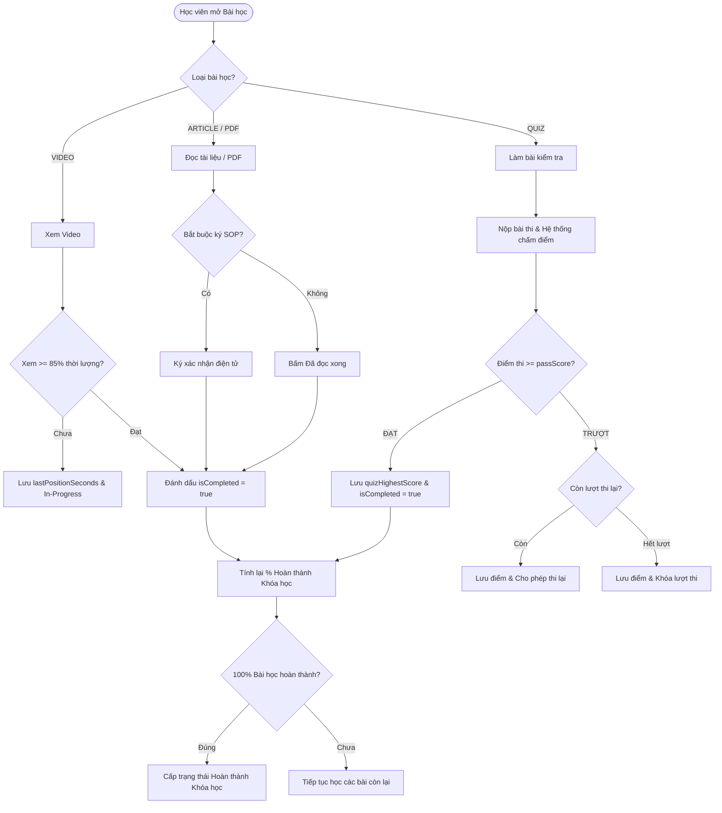

# KẾ HOẠCH MỞ RỘNG SPRINT 1: ADMIN CURRICULUM & QUIZ BUILDER
## 06. DANH SÁCH QUY TẮC NGHIỆP VỤ (BUSINESS RULES & VALIDATION MATRIX)

> **Mục tiêu:** Quy định chặt chẽ toàn bộ các Quy tắc nghiệp vụ (Business Rules - BR), Điều kiện ràng buộc dữ liệu (Validation Constraints) và Logic xử lý cho phân hệ Quản lý Chương trình học & Soạn đề thi (Curriculum & Quiz Builder).  
> **Thư mục:** `Practice/LogiX/doc/04-tracking-sprints/Sprint1_Admin_Curriculum_Quiz_Plan/`  

---

## 1. NHÓM QUY TẮC QUẢN LÝ CHƯƠNG HỌC (MODULE BUSINESS RULES)

| Mã BR | Tên Quy Tắc | Mô Tả Chi Tiết & Ràng Buộc Kỹ Thuật | Hành Vi Hệ Thống Khi Vi Phạm |
|---|---|---|---|
| **BR-MOD-001** | **Tính hợp lệ của Tiêu đề Chương** | Tiêu đề Chương (`title`) bắt buộc phải có, độ dài từ `3` đến `200` ký tự. Không được chứa ký tự rỗng hoặc toàn dấu cách. | Báo lỗi: *"Tiêu đề chương học không được để trống (3-200 ký tự)"*. HTTP 400. |
| **BR-MOD-002** | **Thứ tự sắp xếp Chương (`sortOrder`)** | Các chương trong 1 khóa học được đánh số thứ tự tăng dần ($1, 2, 3...$). Khi thêm chương mới, mặc định `sortOrder = max(sortOrder) + 1`. | Hệ thống tự động gán số thứ tự tiếp theo nếu Admin không chỉ định. |
| **BR-MOD-003** | **Đồng bộ khi Sắp xếp lại (Reorder)** | Khi Admin kéo thả đổi vị trí Chương, API `/reorder` phải cập nhật lại `sortOrder` của toàn bộ các chương trong Khóa học trong một Database Transaction duy nhất. | Đảm bảo không bị trùng lặp `sortOrder` hoặc gián đoạn thứ tự. |
| **BR-MOD-004** | **Xóa Chương (Cascade Warning)** | Nếu Chương đang chứa bài học bên trong: Hệ thống yêu cầu Admin xác nhận cảnh báo xóa liên đới (Cascade Delete). Khi đồng ý xóa Chương $\rightarrow$ Tự động xóa toàn bộ Bài học, Quiz và Tiến độ học viên thuộc Chương đó. | Hiển thị Modal Cảnh báo Đỏ: *"Chương này đang có X bài học. Bạn có chắc chắn muốn xóa toàn bộ?"*. |

---

## 2. NHÓM QUY TẮC QUẢN LÝ BÀI HỌC (LESSON BUSINESS RULES)

### 2.1. Quy tắc chung của Bài học
| Mã BR | Tên Quy Tắc | Mô Tả Chi Tiết |
|---|---|---|
| **BR-LES-001** | **Tính đa hình của Bài học (Polymorphism)** | Mỗi một `Lesson` **chỉ được phép mang 1 loại duy nhất** (`lessonType` $\in$ `['VIDEO', 'ARTICLE', 'QUIZ', 'PDF', 'CHECKLIST']`). Không cho phép 1 bài học vừa là Video vừa là Quiz. |
| **BR-LES-002** | **Tiêu đề & Mô tả bài học** | `title` bắt buộc (3-200 ký tự). `description` (tùy chọn, tối đa 2,000 ký tự) dùng để tóm tắt nội dung video, lưu ý nghiệp vụ hoặc hướng dẫn làm bài thi. |
| **BR-LES-003** | **Thứ tự bài học trong Chương** | Các bài học trong cùng 1 Chương có `sortOrder` riêng biệt ($1, 2, 3...$). Khi đổi vị trí bài học giữa các Chương, cập nhật cả `moduleId` và `sortOrder`. |
| **BR-LES-004** | **Ẩn/Hiện bài học (`isVisible`)** | Bài học có `isVisible = false` sẽ chỉ hiển thị ở màn hình Admin (gắn badge *"Bản nháp / Đang ẩn"*), học viên sẽ không nhìn thấy và không tính vào % hoàn thành khóa học. |

### 2.2. Quy tắc riêng cho Bài học Video (`lessonType = 'VIDEO'`)
| Mã BR | Tên Quy Tắc | Mô Tả Chi Tiết & Validation |
|---|---|---|
| **BR-VID-001** | **Hợp lệ nguồn YouTube (`YOUTUBE`)** | URL phải đúng định dạng YouTube (`youtube.com/watch?v=...`, `youtu.be/...`, `youtube.com/embed/...`). Hệ thống tự động trích xuất `videoId` chuẩn 11 ký tự. |
| **BR-VID-002** | **Hợp lệ nguồn Tự Upload (`DIRECT_UPLOAD`)** | Chỉ chấp nhận định dạng video: `.mp4`, `.webm`, `.mov`. Kích thước tối đa: **500 MB**. Hệ thống tự động lưu file lên Storage và trích xuất thời lượng `videoDuration` (giây). |
| **BR-VID-003** | **Điều kiện Hoàn thành Video (Learner Gate)** | Học viên được tính là hoàn thành bài học Video khi: Xem liên tục đạt tối thiểu **85% thời lượng video** (`lastPositionSeconds / videoDuration >= 0.85`) HOẶC xem hết video và bấm nút *"Đã học xong"*. |

### 2.3. Quy tắc riêng cho Bài học Đọc (`lessonType = 'ARTICLE'` / `'PDF'`)
| Mã BR | Tên Quy Tắc | Mô Tả Chi Tiết & Validation |
|---|---|---|
| **BR-ART-001** | **Nội dung bài viết Rich Text** | `bodyHtml` không được rỗng khi chọn loại `ARTICLE`. Hỗ trợ các thẻ HTML an toàn (Heading, Bold, Italic, List, Table, Image). Tự động sanitize chống XSS. |
| **BR-ART-002** | **Thời gian đọc ước tính** | `estimatedReadTime` phải là số nguyên $\ge 1$ phút. Mặc định tính theo công thức: $\text{Số từ trong bài} / 200\text{ từ/phút}$ (tối thiểu 1 phút). |
| **BR-PDF-001** | **Đính kèm tài liệu PDF** | File đính kèm phải có định dạng `.pdf`. Dung lượng tối đa: **50 MB**. |

### 2.4. Quy tắc Tiêu chuẩn SOP F&B (`sopCode`, `requiresSignature`)
| Mã BR | Tên Quy Tắc | Mô Tả Chi Tiết |
|---|---|---|
| **BR-SOP-001** | **Mã quy trình SOP** | `sopCode` phải theo format quy chuẩn doanh nghiệp: `SOP-[KHỐI]-[MÃ]` (VD: `SOP-CH-01`, `SOP-XUONG-ATTP-03`). |
| **BR-SOP-002** | **Ký xác nhận quy trình điện tử** | Nếu `requiresSignature = true`, học viên bắt buộc phải thực hiện thao tác **"Ký điện tử / Tick cam kết đã hiểu quy định"** thì hệ thống mới cho phép ghi nhận hoàn thành bài học. |

---

## 3. NHÓM QUY TẮC SOẠN BÀI KIỂM TRA (QUIZ & QUESTION BUILDER RULES)

### 3.1. Cấu hình Đề thi (`Quiz`)
| Mã BR | Tên Quy Tắc | Mô Tả Chi Tiết & Validation |
|---|---|---|
| **BR-QZ-001** | **Liên kết 1-1 với Lesson** | Mỗi bài học dạng `QUIZ` có đúng 1 bản ghi cấu hình `Quiz` tương ứng (`lessonId` là Unique). |
| **BR-QZ-002** | **Điểm đạt (`passScore`)** | Phải là số nguyên từ `1` đến `100` (tính theo %). Mặc định là `80%`. |
| **BR-QZ-003** | **Số lần làm lại (`maxAttempts`)** | Phải là số nguyên $\ge 0$. Nếu đặt `= 0` nghĩa là **Không giới hạn số lần thi lại**. Mặc định là `3` lần. |
| **BR-QZ-004** | **Thời gian làm bài (`timeLimitMinutes`)** | Phải là số nguyên $\ge 1$ (phút) hoặc `null` (nếu không giới hạn thời gian làm bài). |
| **BR-QZ-005** | **Điều kiện Kích hoạt Đề thi (Publish Ready)** | Để bài Quiz có thể làm được, đề thi bắt buộc phải có **tối thiểu 1 câu hỏi hợp lệ** (Khuyến nghị $\ge 3$ câu). |

### 3.2. Quy tắc Câu hỏi & Đáp án (`QuizQuestion` & `QuizQuestionOption`)
| Mã BR | Tên Quy Tắc | Mô Tả Chi Tiết & Validation |
|---|---|---|
| **BR-QZ-006** | **Trắc nghiệm 1 đáp án (`SINGLE_CHOICE`)** | - Tối thiểu phải có **2 lựa chọn đáp án** (Options). - **BẮT BUỘC PHẢI CÓ ĐÚNG 1 ĐÁP ÁN ĐÚNG** (`isCorrect = true`). Không được để 0 hoặc $\ge 2$ đáp án đúng. |
| **BR-QZ-007** | **Trắc nghiệm nhiều đáp án (`MULTIPLE_CHOICE`)** | - Tối thiểu phải có **2 lựa chọn đáp án**. - **BẮT BUỘC PHẢI CÓ ÍT NHẤT 1 ĐÁP ÁN ĐÚNG** (`count(isCorrect=true) >= 1`). |
| **BR-QZ-008** | **Câu hỏi Đúng / Sai (`TRUE_FALSE`)** | - Bắt buộc có đúng **2 lựa chọn cố định**: "Đúng" và "Sai". - Có chính xác **1 đáp án đúng**. |
| **BR-QZ-009** | **Trọng số điểm của câu hỏi (`points`)** | Mỗi câu hỏi có `points > 0` (mặc định 1.0 điểm). Tổng điểm của bài thi là tổng `points` của tất cả các câu hỏi. |
| **BR-QZ-010** | **Giải thích đáp án (`explanation`)** | Khuyến khích Trainer nhập giải thích vì sao đáp án đúng để học viên ôn tập kiến thức sau khi nộp bài. |

---

## 4. NHÓM QUY TẮC ĐÁNH GIÁ & TIẾN ĐỘ HỌC TẬP (LEARNING PROGRESSION RULES)

| Mã BR | Tên Quy Tắc | Mô Tả Chi Tiết |
|---|---|---|
| **BR-PROG-001** | **Tính điểm Quiz** | Điểm số lần thi (%) = $\left(\frac{\text{Tổng điểm các câu làm đúng}}{\text{Tổng điểm tối đa của đề thi}}\right) \times 100$. |
| **BR-PROG-002** | **Xác nhận Pass bài Quiz** | Nếu `score >= quiz.passScore` $\rightarrow$ Đánh dấu `QuizAttempt.isPassed = true` và `LessonProgress.isCompleted = true`. |
| **BR-PROG-003** | **Lưu điểm cao nhất (`quizHighestScore`)** | Sau mỗi lần nộp bài thi, `LessonProgress.quizHighestScore = max(quizHighestScore, currentScore)`. |
| **BR-PROG-004** | **Tính % Hoàn thành Khóa học** | $\text{Completion \%} = \left(\frac{\text{Số bài học đã hoàn thành}}{\text{Tổng số bài học trong khóa}}\right) \times 100$. |
| **BR-PROG-005** | **Điều kiện Tốt nghiệp Khóa học (`isPassed = true`)** | Khóa học chỉ được chuyển trạng thái `COMPLETED` và `isPassed = true` khi: **Tất cả các bài học bắt buộc (bao gồm bài Quiz) đều đạt `isCompleted = true`**. |

---

## 5. NHÓM QUY TẮC BẢO MẬT & PHÂN QUYỀN (SECURITY & ACCESS CONTROL)

| Mã BR | Tên Quy Tắc | Mô Tả Chi Tiết |
|---|---|---|
| **BR-SEC-001** | **Quyền Quản trị Nội dung** | Chỉ tài khoản có Role `ADMIN_LMS` hoặc `TRAINER` (mang Permission `COURSE.CREATE`, `COURSE.UPDATE`, `LESSON.MANAGE`) mới được phép thêm/sửa/xóa Module, Lesson và Quiz. |
| **BR-SEC-002** | **Bảo vệ Đáp án Đúng (Anti-Cheat Security)** | Khi Học viên gọi API lấy đề thi để làm bài (`GET /api/quiz/:quizId/start`), Backend **TUYỆT ĐỐI KHÔNG ĐƯỢC TRẢ VỀ TRƯỜNG `isCorrect` và `explanation`**. Chỉ trả về danh sách câu hỏi và các lựa chọn đáp án. |
| **BR-SEC-003** | **Bảo vệ dữ liệu khi đang có Học viên làm bài** | Không cho phép xóa câu hỏi hoặc đổi cấu trúc đề thi nếu đã có học viên nộp bài thi (trừ khi Admin chủ động reset kết quả kiểm tra). |
