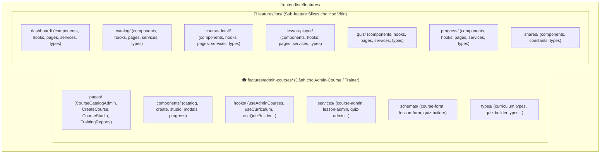

# KẾ HOẠCH MỞ RỘNG SPRINT 1: ADMIN-COURSE CURRICULUM & QUIZ BUILDER
## 09. PHÂN TÍCH KHO GIAO DIỆN HIỆN TẠI VÀ BẢN ĐỒ TÁCH PHÂN HỆ `features/lms` & `features/admin-courses`
### *(Inventory Analysis & Feature Component Separation Map)*

> **Mục tiêu:** Rà soát và phân loại toàn diện 100% các file hiện có trong `frontend/src/features/lms/` (gồm 7 Pages, 9 folders với 29 Components, 6 Types, Hooks, Services) để tách bạch triệt để thành 2 phân hệ độc lập: **Quản trị Đào tạo (`features/admin-courses/`)** và **Cổng Học tập Nhân sự (`features/lms/`)**.  
> **Thư mục:** `Practice/LogiX/doc/04-tracking-sprints/Sprint1_Admin_Curriculum_Quiz_Plan/`  

---

## 1. BẢNG KIỂM KÊ VÀ PHÂN LOẠI TOÀN BỘ KHO FILE HIỆN TẠI (CURRENT INVENTORY)

### 1.1. Phân loại 7 Pages hiện tại trong `features/lms/pages/`

| Tên File Page | Kích thước | Mục đích & Nghiệp vụ | Phân loại Đối tượng | Hướng xử lý |
|---|---|---|---|---|
| `LMSDashboardPage.tsx` | 4.3 KB | Dashboard tiến độ học tập, khóa học đang học, KPI cá nhân | 👤 **Learner** (Học viên) | Giữ tại `features/lms/pages/` |
| `CourseCatalog.tsx` | 10.5 KB | Duyệt danh mục khóa học, tìm kiếm, lọc theo phòng ban | 👤 **Learner** (Học viên) | Giữ tại `features/lms/pages/` (chuẩn hóa tên thành `CourseCatalogPage.tsx`) |
| `LMSCatalogPage.tsx` | 8.3 KB | Catalog dạng lưới / card (bản trùng lặp tính năng) | 👤 **Learner** (Học viên) | Hợp nhất vào `CourseCatalogPage.tsx` |
| `CourseDetailPage.tsx` | 3.7 KB | Xem thông tin khóa học, giảng viên, mục lục bài học | 👤 **Learner** (Học viên) | Giữ tại `features/lms/pages/` |
| `LessonPlayerPage.tsx` | 10.8 KB | Trình phát video bài giảng, nội dung đọc SOP, thảo luận | 👤 **Learner** (Học viên) | Giữ tại `features/lms/pages/` |
| `QuizPage.tsx` | 5.1 KB | Giao diện học viên làm bài trắc nghiệm đếm ngược | 👤 **Learner** (Học viên) | Giữ tại `features/lms/pages/` |
| `LearnerProgressPage.tsx` | 2.5 KB | Xem tiến độ cá nhân, chứng chỉ đã đạt, điểm số của tôi | 👤 **Learner** (Học viên) | Giữ tại `features/lms/pages/` |

---

### 1.2. Phân loại 29 Components hiện tại trong `features/lms/components/`

| Thư mục Component | File Component | Chức năng nghiệp vụ | Phân loại | Hướng xử lý |
|---|---|---|---|---|
| `catalog/` | `CatalogCards.tsx`<br>`CatalogHeader.tsx` | Card hiển thị khóa học cho học viên chọn | 👤 **Learner** | Giữ tại `features/lms/components/catalog/` |
| `course-catalog/` | `CategoryPillTabs.tsx`<br>`CourseCard.tsx` | Tab phân loại & Card khóa học | 👤 **Learner** | Giữ tại `features/lms/components/course-catalog/` |
| `course-detail/` | `CourseHero.tsx`<br>`CourseDetailTabs.tsx`<br>`CourseEnrollmentCard.tsx`<br>`CourseContentAccordion.tsx`<br>`WhatYouLearnCard.tsx` | Chi tiết khóa học học viên xem trước khi học | 👤 **Learner** | Giữ tại `features/lms/components/course-detail/` |
| `dashboard/` | `DashboardHeader.tsx`<br>`DashboardCards.tsx` | Thống kê học tập cá nhân | 👤 **Learner** | Giữ tại `features/lms/components/dashboard/` |
| `editor/` | `LessonRichEditor.tsx` | **Trình soạn thảo Rich Text & Soạn bài** | 🎓 **Admin-Course** | 🚚 **Chuyển sang `features/admin-courses/components/modals/`** |
| `lesson-player/` | `LessonVideoPlayer.tsx`<br>`LessonOutlinePanel.tsx`<br>`LessonRightPanel.tsx`<br>`LessonContentTabs.tsx`<br>`LessonBottomBar.tsx`<br>`CodePlayground.tsx` | Trình phát bài giảng video, danh mục bài bên cạnh, tab ghi chú của học viên | 👤 **Learner** | Giữ tại `features/lms/components/lesson-player/` |
| `progress/` | `StatsRow.tsx`<br>`CourseProgressList.tsx`<br>`QuizTable.tsx`<br>`CertificatesGrid.tsx`<br>`SkillsPanel.tsx`<br>`WeeklyActivityChart.tsx` | Tiến độ, kỹ năng, chứng chỉ cá nhân học viên | 👤 **Learner** | Giữ tại `features/lms/components/progress/` |
| `quiz/` | `QuizTopBar.tsx`<br>`QuizQuestionCard.tsx`<br>`QuizNavigatorPanel.tsx` | Làm bài quiz học viên (chọn đáp án A/B/C/D, nộp bài) | 👤 **Learner** | Giữ tại `features/lms/components/quiz/` |
| `shared/` | `LmsPageHeader.tsx`<br>`lms-palette.ts` | Header dùng chung & bảng màu | 🔄 **Shared** | Giữ tại `features/lms/components/shared/` |

---

## 2. BẢN ĐỒ TÁCH BIỆT 2 PHÂN HỆ ĐỘC LẬP (SEPARATION MAP)

Sau khi bóc tách, ta có 2 phân hệ rõ ràng với đầy đủ 6 tầng cấu trúc:



---

## 3. CHI TIẾT CẤU TRÚC PHÂN HỆ 1: `features/admin-courses/`

Đây là phân hệ mới chuyên biệt cho **Giảng viên / Admin-Course**, phục vụ trọn vẹn Sprint 1:

```
frontend/src/features/admin-courses/
├── components/
│   ├── catalog/
│   │   ├── CourseCatalogTable.tsx      # Bảng danh mục khóa học quản trị
│   │   ├── CourseFilterToolbar.tsx     # Toolbar tìm kiếm, lọc danh mục, trạng thái
│   │   └── CourseActionMenu.tsx        # Menu tác vụ (Studio, Sửa, Clone, Xóa)
│   ├── create/
│   │   └── CreateCourseForm.tsx        # Form tạo mới khóa học & gán phòng ban
│   ├── studio/
│   │   ├── CurriculumTree.tsx          # Cây Chương học Accordion kéo thả
│   │   ├── ModuleAccordionItem.tsx     # Item từng Chương học
│   │   ├── LessonRowItem.tsx           # Dòng bài học [VIDEO], [ARTICLE], [QUIZ]
│   │   ├── CourseSettingsPane.tsx      # Pane xem trước & cấu hình nhanh bên phải
│   │   └── AddLessonPopover.tsx        # Menu chọn nhanh dạng bài học
│   ├── modals/
│   │   ├── VideoLessonModal.tsx        # Modal cấu hình Video (YouTube URL + Upload MP4)
│   │   ├── ArticleLessonModal.tsx      # Modal soạn thảo Rich Text & Đính kèm PDF
│   │   ├── QuizBuilderModal.tsx        # Modal soạn đề thi & Question Builder
│   │   ├── QuestionCardEditor.tsx      # Thẻ soạn 1 câu hỏi + options A/B/C/D
│   │   └── QuizPreviewDrawer.tsx       # Drawer xem trước đề thi thực tế
│   └── progress/
│       ├── LearnerProgressTable.tsx    # Bảng theo dõi tiến độ nhân sự toàn chuỗi
│       └── ProgressFilterBar.tsx       # Bộ lọc báo cáo đào tạo theo Cửa hàng/Xưởng
├── hooks/
│   ├── useAdminCourses.ts              # Quản lý CRUD khóa học, clone, filter
│   ├── useCurriculum.ts                # Quản lý Cây chương trình học & Reorder
│   ├── useLessonEditor.ts              # Quản lý Form bài học & Parse YouTube
│   ├── useQuizBuilder.ts               # Quản lý State danh sách câu hỏi & options
│   └── useTrainingReports.ts           # Tải báo cáo tiến độ nhân viên & xuất Excel
├── pages/
│   ├── CourseCatalogAdminPage.tsx      # [Trang 1] Quản lý Danh mục Khóa học
│   ├── CreateCourseAdminPage.tsx       # [Trang 2] Tạo mới Khóa học
│   ├── CourseStudioAdminPage.tsx       # [Trang 3] Studio Soạn Giáo trình & Đề thi
│   └── TrainingReportsAdminPage.tsx    # [Trang 4] Báo cáo Đào tạo & Tiến độ Nhân viên
├── schemas/
│   ├── course-form.schema.ts           # Validate Form tạo/sửa khóa học
│   ├── lesson-form.schema.ts           # Validate Form bài giảng Video/Article
│   └── quiz-builder.schema.ts          # Validate Đề thi, Câu hỏi & Options
├── services/
│   ├── course-admin.service.ts         # Gọi /api/courses, /api/courses/modules
│   ├── lesson-admin.service.ts         # Gọi /api/lessons, /api/lessons/parse-youtube
│   ├── quiz-admin.service.ts           # Gọi /api/quizzes, /api/quizzes/questions
│   └── report-admin.service.ts         # Gọi /api/courses/:id/enrollments
└── types/
    ├── course-admin.types.ts           # Course, Category, CourseStatus
    ├── curriculum.types.ts             # CourseModule, Lesson, LessonType
    ├── quiz-builder.types.ts           # Quiz, Question, Option, QuestionType
    └── report-admin.types.ts           # EnrollmentReport, CompletionStat
```

---

## 4. CHI TIẾT CẤU TRÚC PHÂN HỆ 2: `features/lms/` THEO CHUẨN SUB-FEATURE SLICES

Phân hệ dành riêng cho **Học viên / Nhân sự Ba Hưng** được module hóa thành các **Feature Components độc lập (Vertical Slice Architecture)**, mỗi sub-feature sở hữu trọn vẹn `components/`, `hooks/`, `pages/`, `services/`, `types/`:

```
frontend/src/features/lms/
├── dashboard/                          # 📊 [Sub-feature 1: Dashboard Học viên]
│   ├── components/                     # DashboardHeader.tsx, DashboardCards.tsx, WeeklyActivityChart.tsx
│   ├── hooks/                          # useDashboard.ts
│   ├── pages/                          # LMSDashboardPage.tsx
│   ├── services/                       # dashboard.service.ts
│   └── types/                          # dashboard.types.ts
│
├── catalog/                            # 🔍 [Sub-feature 2: Danh mục Khám phá Khóa học]
│   ├── components/                     # CategoryPillTabs.tsx, CourseCard.tsx, CatalogCards.tsx, CatalogHeader.tsx
│   ├── hooks/                          # useCourses.ts
│   ├── pages/                          # CourseCatalogPage.tsx
│   ├── services/                       # catalog.service.ts
│   └── types/                          # catalog.types.ts
│
├── course-detail/                      # 📖 [Sub-feature 3: Chi tiết Khóa học & Đăng ký]
│   ├── components/                     # CourseHero.tsx, CourseDetailTabs.tsx, CourseEnrollmentCard.tsx, CourseContentAccordion.tsx, WhatYouLearnCard.tsx
│   ├── hooks/                          # useCourseDetail.ts
│   ├── pages/                          # CourseDetailPage.tsx
│   ├── services/                       # course-detail.service.ts
│   └── types/                          # course-detail.types.ts
│
├── lesson-player/                      # 🎥 [Sub-feature 4: Trình phát Bài học Video & SOP Reader]
│   ├── components/                     # LessonVideoPlayer.tsx, LessonOutlinePanel.tsx, LessonRightPanel.tsx, LessonContentTabs.tsx, LessonBottomBar.tsx, CodePlayground.tsx
│   ├── hooks/                          # useLessonPlayer.ts
│   ├── pages/                          # LessonPlayerPage.tsx
│   ├── services/                       # lesson-player.service.ts
│   └── types/                          # lesson-player.types.ts
│
├── quiz/                               # 📝 [Sub-feature 5: Phòng Làm Bài Kiểm Tra Trắc Nghiệm]
│   ├── components/                     # QuizTopBar.tsx, QuizQuestionCard.tsx, QuizNavigatorPanel.tsx
│   ├── hooks/                          # useQuizAttempt.ts
│   ├── pages/                          # QuizPage.tsx
│   ├── services/                       # quiz.service.ts
│   └── types/                          # quiz.types.ts
│
├── progress/                           # 🏆 [Sub-feature 6: Tiến độ Cá nhân & Chứng chỉ của Tôi]
│   ├── components/                     # StatsRow.tsx, CourseProgressList.tsx, QuizTable.tsx, CertificatesGrid.tsx, SkillsPanel.tsx
│   ├── hooks/                          # useLearnerProgress.ts
│   ├── pages/                          # LearnerProgressPage.tsx
│   ├── services/                       # progress.service.ts
│   └── types/                          # progress.types.ts
│
└── shared/                             # 🔄 [Shared UI & Utilities dùng chung toàn LMS]
    ├── components/                     # LmsPageHeader.tsx, LmsEmptyState.tsx, LmsBadge.tsx
    ├── constants/                      # lms-palette.ts, lms-constants.ts
    └── types/                          # lms-common.types.ts
```

---

## 5. BẢNG TRACKING SỐ LƯỢNG TRANG & ROUTING TOÀN DỰ ÁN

| Phân hệ | Tên Trang | File Page View | Route URL (Next.js App Router) | Đối tượng sử dụng |
|---|---|---|---|---|
| **Admin-Course** | Danh mục Khóa học Quản trị | `CourseCatalogAdminPage.tsx` | `/admin/courses` | 🎓 Admin-Course / Trainer |
| **Admin-Course** | Tạo Khóa học Mới | `CreateCourseAdminPage.tsx` | `/admin/courses/create` | 🎓 Admin-Course / Trainer |
| **Admin-Course** | Studio Giáo trình & Đề thi | `CourseStudioAdminPage.tsx` | `/admin/courses/[id]/curriculum` | 🎓 Admin-Course / Trainer |
| **Admin-Course** | Báo cáo Tiến độ Đào tạo | `TrainingReportsAdminPage.tsx`| `/admin/courses/reports` | 🎓 Admin-Course / Trainer |
| **Learner** | Dashboard Học viên | `LMSDashboardPage.tsx` | `/lms/dashboard` | 👤 Nhân sự / Học viên |
| **Learner** | Danh mục Khám phá Khóa học | `CourseCatalogPage.tsx` | `/lms/courses` | 👤 Nhân sự / Học viên |
| **Learner** | Chi tiết Khóa học | `CourseDetailPage.tsx` | `/lms/courses/[id]` | 👤 Nhân sự / Học viên |
| **Learner** | Trình phát Bài học (Player) | `LessonPlayerPage.tsx` | `/lms/lessons/[id]` | 👤 Nhân sự / Học viên |
| **Learner** | Phòng Làm Bài Kiểm Tra | `QuizPage.tsx` | `/lms/quizzes/[id]` | 👤 Nhân sự / Học viên |
| **Learner** | Tiến độ & Chứng chỉ của Tôi | `LearnerProgressPage.tsx` | `/lms/progress` | 👤 Nhân sự / Học viên |

---

## 6. LỢI ÍCH SAU KHI TÁCH PHÂN HỆ

1. **Rõ ràng 100%**: Phân định rạch ròi giữa 4 trang Admin-Course và 6 trang Học viên.
2. **Không còn Component "rác" hay chồng chéo**: Mỗi thư mục component chỉ phục vụ đúng 1 vai trò.
3. **Dễ bảo trì và mở rộng**: Khi thêm các tính năng nâng cao (AI Sinh câu hỏi, Chấm điểm tự luận, Tải chứng chỉ PDF), ta chỉ thao tác trong `features/admin-courses/` mà không gây rủi ro ảnh hưởng đến các màn hình học tập của Học viên.
