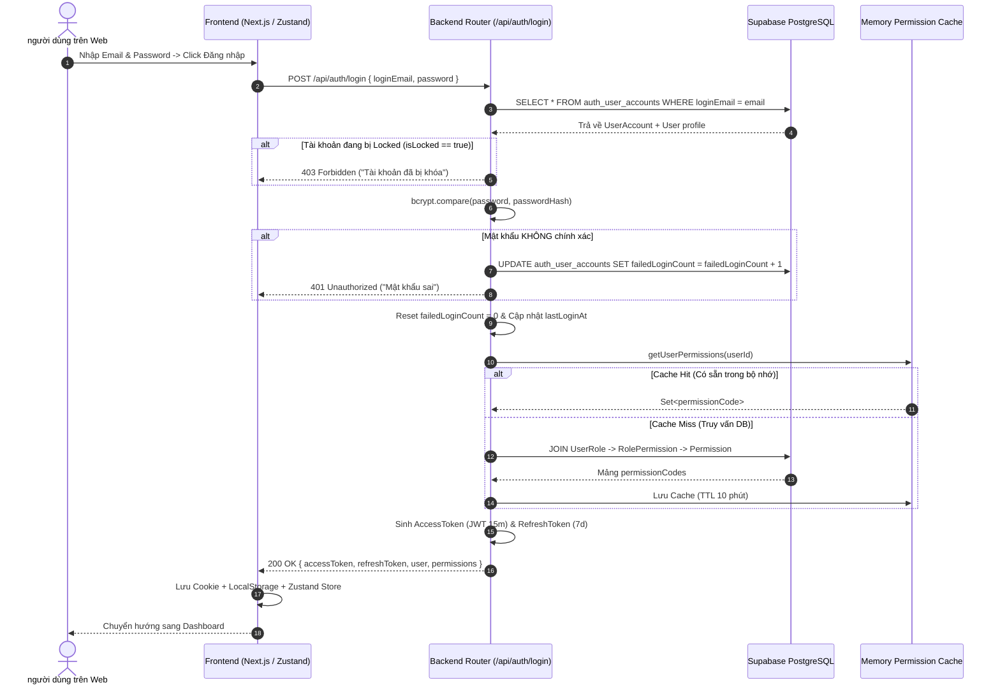
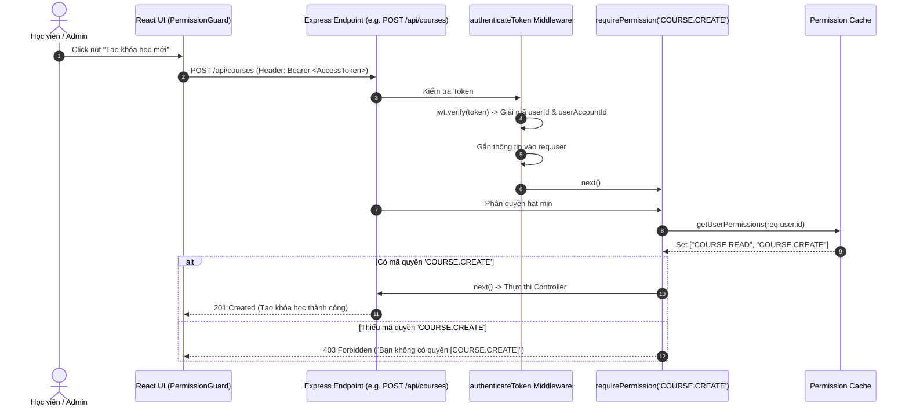

# 🧪 HƯỚNG DẪN TEST & GIẢI THÍCH CHI TIẾT LUỒNG XỬ LÝ (CODE WALKTHROUGH)
> **Dự án:** LogiX LMS — Sprint 1: Auth & Permission System (ERP-v2 1-to-1 Compatible)  
> **Tài liệu hướng dẫn:** Quy trình kiểm thử thực tế trên UI & Đánh giá luồng chạy từng dòng code (Line-by-Line Analysis)  
> **Ngày tạo:** 07/08/2026  
> **Thư mục:** `Practice/LogiX/doc/04-tracking-sprints/Auth_Sprint1_Testing_and_Code_Walkthrough.md`

---

##  PART 1: HƯỚNG DẪN TEST THỰC TẾ TRÊN GIAO DIỆN (UI & API TESTING GUIDE)

### 1. Kích hoạt Hệ thống (Start Services)
Mở Terminal tại thư mục gốc `Practice/LogiX` và chạy lệnh:
```bash
pnpm dev
```
> **Kết quả:**  
> - Frontend Next.js khởi chạy tại: `http://localhost:3000`  
> - Backend Express.js khởi chạy tại: `http://localhost:5000`  
> - Cả 2 dịch vụ kết nối trực tiếp tới Supabase Database Cloud (`aws-0-ap-southeast-1.pooler.supabase.com`).

---

### 2. Các Kịch Bản Test Thực Tế (Test Cases)

#### 🧪 Test Case 1: Đăng nhập Super Admin & Kiểm tra Phân quyền
1. Truy cập trình duyệt: `http://localhost:3000/login`
2. Nhập thông tin:
   - **Email:** `admin@bahung.com`
   - **Mật khẩu:** `password123`
3. Click nút **Đăng nhập**.
4. **Kỳ vọng:**
   - Đăng nhập thành công, hiển thị Toast thông báo: *"Chào mừng, Quản trị Ba Hưng!"*.
   - Tự động chuyển hướng sang Dashboard: `http://localhost:3000/lms/dashboard`.
   - Trình duyệt lưu `access_token` vào Cookie & LocalStorage.
   - Mảng `permissions` trong Zustand store chứa 7 quyền (`USER.READ`, `USER.CREATE`, `USER.LOCK`, `ROLE.MANAGE`, `COURSE.READ`, `COURSE.CREATE`, `ATTP.VIEW`).

#### 🧪 Test Case 2: Đăng nhập Học viên & Kiểm tra Giới hạn Quyền
1. Mở tab ẩn danh (Incognito) hoặc bấm Đăng xuất.
2. Truy cập `http://localhost:3000/login`
3. Nhập thông tin Học viên:
   - **Email:** `alex@logix.com`
   - **Mật khẩu:** `password123`
4. Click nút **Đăng nhập**.
5. **Kỳ vọng:**
   - Đăng nhập thành công với vai trò Học viên (`STUDENT`).
   - Mảng `permissions` chỉ chứa 1 quyền duy nhất: `["COURSE.READ"]`.
   - Nút hoặc menu Quản trị Admin bị ẩn đi thông qua `PermissionGuard`.

#### 🧪 Test Case 3: Thử nghiệm Cơ chế Khóa Tài Khoản Tự Động (Brute-Force Protection)
1. Tại trang Đăng nhập `http://localhost:3000/login`:
2. Nhập Email: `alex@logix.com`
3. Nhập Mật khẩu sai: `sai_mat_khau_123`
4. Bấm Đăng nhập liên tiếp **5 lần**.
5. **Kỳ vọng:**
   - Lần 1-4: Báo lỗi *"Mật khẩu không đúng. Cảnh báo: bạn còn X lần thử"*.
   - Lần 5: Báo lỗi *"Mật khẩu sai quá 5 lần. Tài khoản vừa bị tự động khóa."*
   - Trong Supabase Database, bảng `public.auth_user_accounts` dòng của user này được cập nhật `isLocked = true` và `failedLoginCount = 5`.
   - Dù nhập đúng mật khẩu ở lần thứ 6 cũng sẽ bị từ chối đăng nhập.

#### 🧪 Test Case 4: Kiểm tra Giao diện Quản trị Admin mới Tích hợp
1. Đăng nhập lại tài khoản Admin `admin@bahung.com`.
2. Truy cập các trang Quản trị:
   - **Quản lý Vai trò (Roles):** `http://localhost:3000/admin/roles`
     - Bảng hiển thị 2 Roles (`ADMIN`, `STUDENT`).
     - Click **Phân quyền** -> Mở Sheet kéo-thả phân quyền cho Role.
     - Click **Gán người dùng** -> Mở Sheet kéo-thả gán User vào Role.
   - **Danh mục Quyền (Permissions):** `http://localhost:3000/admin/permissions`
     - Tự động nhóm 7 quyền theo Module (`HRM`, `LMS`, `ATTP`, `SYSTEM`).
   - **Sơ đồ Tổ chức (Departments):** `http://localhost:3000/admin/departments`
     - Xem danh sách và chuyển sang tab Cây tổ chức (`OrgChartTree`).
   - **Quản lý Nhân sự (Employees):** `http://localhost:3000/admin/employees`
     - Hiển thị danh sách nhân viên từ Supabase (`BH-ADMIN-001`, `BH-NV-002`).

---

## 📐 PART 2: SƠ ĐỒ WORKFLOW & LUỒNG CHẠY HỆ THỐNG (WORKFLOW DIAGRAMS)

### 1. Luồng Đăng Nhập & Cấp Phát Quyền (Login & Token Flow)



---

### 2. Luồng Phân Quyền Động Đảo Bảo Mật (Middleware Permission Authorization)



---

## 🔍 PART 3: PHÂN TÍCH TỪNG FILE & CÁCH HOẠT ĐỘNG TỪNG DÒNG CODE (DEEP DIVE)

### 🔵 BẢNG 1: BACKEND CODE ANALYSIS

#### 1. File Database Schema: `backend/prisma/schema.prisma`
* **Mục đích:** Khai báo cấu trúc bảng dữ liệu khớp 1-to-1 với `erp-corporation-api-v2`.
* **Cách hoạt động:**
  - `model User` (mapped to `auth_users`): Lưu thông tin nhân sự. Các trường `employeeCode`, `fullName`, `email`, `userType` (`'EMPLOYEE'` vs `'CUSTOMER'`).
  - `model UserAccount` (mapped to `auth_user_accounts`): Khai báo quan hệ 1-1 với `User` via `userId String @unique`. Lưu `passwordHash`, `loginEmail`, `isLocked` (bảo vệ tài khoản), `failedLoginCount` (đếm số lần nhập sai), `refreshToken`.
  - `model Role` & `Permission`: Định nghĩa danh mục Vai trò và Mã quyền hệ thống.
  - `model UserRole` & `RolePermission`: Hai bảng trung gian gán quyền. `UserRole` hỗ trợ `expiresAt` (quyền có thời hạn) và `revokedAt` (quyền bị thu hồi).

#### 2. File Auth Middleware: `backend/src/middlewares/auth.middleware.ts`
* **Dòng 20-30 (`authenticateToken`):**
  ```typescript
  const authHeader = req.headers.authorization
  const token = authHeader && authHeader.split(' ')[1]
  ```
  -> Đọc chuỗi Token từ HTTP Header `Authorization: Bearer <token>`.
* **Dòng 32-40:**
  ```typescript
  const decoded = jwt.verify(token, JWT_SECRET) as any
  const userAccount = await prisma.userAccount.findUnique({
    where: { id: decoded.userAccountId || decoded.id },
    include: { user: true },
  })
  ```
  -> Giải mã JWT Token để lấy `userAccountId`, sau đó tra cứu trực tiếp trong DB để xác nhận tài khoản còn tồn tại và không bị xóa.
* **Dòng 42-45:**
  ```typescript
  if (userAccount.isLocked) {
    return res.status(403).json({ error: 'Forbidden: Account is locked' })
  }
  ```
  -> Kiểm tra tức thì: Nếu tài khoản bị khóa giữa phiên làm việc, lập tức chặn mọi request.
* **Dòng 47-55:** Gắn thông tin User đã xác thực vào `req.user` để các Controller phía sau sử dụng.

#### 3. File Permission Service: `backend/src/services/permission.service.ts`
* **Dòng 4 (`memoryCache`):**
  ```typescript
  const memoryCache = new Map<string, { permissions: Set<string>; expiresAt: number }>()
  ```
  -> Tạo bộ nhớ đệm In-Memory lưu danh sách mã quyền của từng `userId` để không phải query DB liên tục.
* **Dòng 13-16 (`Cache Check`):**
  ```typescript
  const cached = memoryCache.get(userId)
  if (cached && cached.expiresAt > now) return cached.permissions
  ```
  -> Nếu trong vòng 10 phút user đã từng gọi API, lấy ngay danh sách quyền từ RAM ($< 1ms$).
* **Dòng 22-30 (`DB Query`):**
  ```typescript
  where: {
    userId,
    isActive: true,
    revokedAt: null,
    OR: [{ expiresAt: null }, { expiresAt: { gt: nowDate } }],
  }
  ```
  -> Truy vấn SQL thông minh: Chỉ lấy các Role **đang kích hoạt**, **chưa bị thu hồi (revokedAt is null)** và **chưa hết hạn (expiresAt > now)**.
* **Dòng 50-60 (`invalidatePermissionCacheForRole`):**
  -> Khi Admin sửa quyền của 1 Role, hàm này tự động xóa Cache của tất cả User thuộc Role đó để quyền mới có hiệu lực ngay lập tức.

#### 4. File Permission Middleware: `backend/src/middlewares/permission.middleware.ts`
* **Dòng 6-12 (`requirePermission`):**
  ```typescript
  export const requirePermission = (permissionCode: string) => {
    return async (req: AuthenticatedRequest, res: Response, next: NextFunction) => {
      const userPermissions = await getUserPermissions(req.user.id)
      if (!userPermissions.has(permissionCode)) {
        return res.status(403).json({ error: `Forbidden: Bạn không có quyền [${permissionCode}]` })
      }
      next()
    }
  }
  ```
  -> kĩ thuật Higher-Order Function trong Express: Nhận vào `permissionCode` cần kiểm tra, gọi `getUserPermissions`, nếu thiếu quyền trả về HTTP 403 Forbidden.

#### 5. File Auth Routes: `backend/src/routes/auth.ts`
* **Dòng 30-50 (`/login` logic):**
  - Nhận `loginEmail` + `password`.
  - Tìm `UserAccount` trong Supabase.
  - Nếu mật khẩu sai: `failedLoginCount + 1`. Khi `failedLoginCount >= 5`, tự động set `isLocked = true` và trả về thông báo tài khoản bị khóa.
  - Nếu mật khẩu đúng: Reset `failedLoginCount = 0`, cập nhật `lastLoginAt`, sinh JWT `accessToken` & `refreshToken`.

---

### 🟢 BẢNG 2: FRONTEND CODE ANALYSIS

#### 1. File Auth Service: `frontend/src/features/auth/services/auth.service.ts`
* **Dòng 13-27 (`UserProfile` interface):** Khai báo kiểu dữ liệu nhân sự đầy đủ (`id`, `employeeCode`, `fullName`, `loginEmail`, `store`, `department`, `position`, `roles`).
* **Dòng 44-52 (`normalizeUserProfile`):** Hàm chuẩn hóa dữ liệu giúp tương thích ngược với các UI cũ đọc `user.name`, `user.role`, `user.avatar`.

#### 2. File Zustand Store: `frontend/src/stores/auth.store.ts`
* **Dòng 22-35 (`useAuthStore`):** Sử dụng Zustand Middleware `persist` để duy trì trạng thái đăng nhập qua LocalStorage.
* **Dòng 48-51 (`hasPermission` helper):**
  ```typescript
  hasPermission: (permissionCode: string) => {
    return get().permissions.includes(permissionCode)
  }
  ```
  -> Hàm kiểm tra nhanh xem User hiện tại có mã quyền `permissionCode` hay không.

#### 3. File Component Guard: `frontend/src/components/auth/PermissionGuard.tsx`
* **Dòng 12-20:**
  ```typescript
  export const PermissionGuard: React.FC<PermissionGuardProps> = ({ permission, children, fallback = null }) => {
    const { hasPermission } = useAuthStore()
    if (!hasPermission(permission)) return <>{fallback}</>
    return <>{children}</>
  }
  ```
  -> Bọc bất kỳ nút bấm hoặc phần tử UI nào. Ví dụ:
  ```tsx
  <PermissionGuard permission="COURSE.CREATE">
    <Button>Tạo khóa học mới</Button>
  </PermissionGuard>
  ```
  Nếu User là Học viên (không có quyền `COURSE.CREATE`), nút bấm sẽ tự động không được render ra màn hình.

---

## 📌 TỔNG KẾT
Tài liệu này cung cấp toàn bộ bức tranh kiến trúc từ **Cơ sở dữ liệu (Supabase)** $\rightarrow$ **Backend API (Express.js)** $\rightarrow$ **Frontend UI (Next.js/Zustand)**. Bạn có thể mở Terminal chạy `pnpm dev` và làm theo các kịch bản test trên để trực tiếp trải nghiệm hệ thống!
