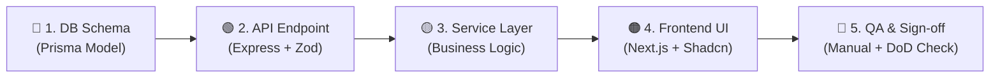

# 📊 SPRINT TRACKING BOARD — LOGIX LMS ENTERPRISE

> **Phiên bản:** v1.0.0 | **Cập nhật lần cuối:** 2026-08-06  
> **Workflow chuẩn:** DDD Schema → API Endpoint → Frontend UI → Integration → QA & Sign-off  
> **Tham chiếu:** [[List Function]] · [[Database_Design_Document]] · [[Checklist_Implementation_Phases]]

---

## 📈 DASHBOARD TIẾN ĐỘ DỰ ÁN

| Sprint | Giai đoạn | Trọng tâm | Tổng CN | ✅ Done | 🔄 In Progress | ⚪ Pending | Trạng thái |
|:---:|:---:|---|:---:|:---:|:---:|:---:|:---:|
| **Sprint 1** | Phase 1 | Core Auth, Student & Admin CRUD | 8 | 0 | 0 | 8 | 🟡 **Active** |
| **Sprint 2** | Phase 1 | Course Management & Video Catalog | 11 | 0 | 0 | 11 | ⚪ Pending |
| **Sprint 3** | Phase 2 | RBAC & Internal Training | 7 | 0 | 0 | 7 | ⚪ Pending |
| **Sprint 4** | Phase 2 | Video Security, Customer & Analytics | 12 | 0 | 0 | 12 | ⚪ Pending |
| **Sprint 5** | Phase 3 | Migration Pipeline & Progress Preservation | 15 | 0 | 0 | 15 | ⚪ Pending |
| **Sprint 6** | Phase 3 | Webinar, Commercialization & Final QA | 8 | 0 | 0 | 8 | ⚪ Pending |
| **TỔNG** | | | **61** | **0** | **0** | **61** | **0%** |

---

## 🔄 QUY TRÌNH THI CÔNG CHUẨN (DEFINITION OF WORKFLOW)

Mỗi Function LMS-xxx phải đi qua đầy đủ 5 bước sau:

| Bước | Deliverable bắt buộc | Tiêu chí hoàn thành (DoD) |
|:---:|---|---|
| **1. DB Schema** | Prisma Model đã migrate vào DB | `npx prisma migrate dev` không lỗi |
| **2. API Endpoint** | Route + Controller + Zod Validation | Postman/Thunder Client pass 100% test case |
| **3. Service Layer** | Business logic tách biệt, có error handling | TypeScript `0 type error` |
| **4. Frontend UI** | Component responsive, i18n, dark mode | `0 Hydration Error` + UI pass visual review |
| **5. QA & Sign-off** | Manual test theo AC (Acceptance Criteria) | PM/Tech Lead ký duyệt trước khi merge |

---

## 🗂️ DANH SÁCH FILE BẮT BUỘC PHẢI CÓ THEO SPRINT

### 🔑 Nhóm Config & Infrastructure (Sprint 1 - Hoàn thiện ngay)
### 🔑 Nhóm Config & Infrastructure (Sprint 1 - Đã hoàn thành 100%)
| File | Trạng thái | Vấn đề đã giải quyết |
|---|:---:|---|
| `frontend/src/config/api-routes.ts` | 🟢 **ĐÃ FIX** | Cấu hình đầy đủ endpoints LMS & Admin |
| `frontend/src/lib/axios.ts` | 🟢 **ĐÃ FIX** | Chuẩn hóa `refreshToken` và `accessToken` |
| `frontend/src/features/auth/services/auth.service.ts` | 🟢 **ĐÃ FIX** | Endpoint `/auth/refresh` và `/auth/me` đồng bộ chuẩn ERP-v2 |
| `backend/src/modules/auth/auth.service.ts` | 🟢 **ĐÃ FIX** | Tích hợp JWT payload, `isLocked`, `failedLoginCount`, Permission Cache |
| `frontend/src/features/auth/pages/LoginPages.tsx` | 🟢 **ĐÃ FIX** | Chuẩn hóa UI & branding LogiX LMS |
| `backend/prisma/schema.prisma` | 🟢 **ĐÃ FIX** | Schema 15 models chuẩn ERP-v2 & LMS Ba Hưng |
| `backend/src/seed.ts` | 🟢 **ĐÃ FIX** | Seed đầy đủ Super Admin, Student mẫu, Roles & 7 Permissions |
| `frontend/.env` | 🟢 **ĐÃ FIX** | `NEXT_PUBLIC_API_URL` trỏ đúng localhost:5000 / proxy rewrite |

### 📦 Nhóm Feature Files Sprint 1 (Đang hoàn thiện kết nối API)
| File | Hành động | Mô tả |
|---|:---:|---|
| `frontend/src/features/auth/hooks/use-auth.ts` | 🟢 Hoàn thành | Zustand store lưu token, user, permissions, `hasPermission` |
| `frontend/src/features/lms/pages/CourseCatalog.tsx` | 🟡 **Mock → Real API** | Kết nối `useQuery` gọi `GET /api/courses` từ Backend |
| `frontend/src/features/lms/pages/LMSDashboardPage.tsx` | 🟡 **Mock → Real API** | Kết nối số liệu dashboard với `GET /api/progress/dashboard` |
| `frontend/src/features/lms/pages/LessonPlayerPage.tsx` | 🟡 **Mock → Real API** | Kết nối xem bài giảng `GET /api/lessons/:id` & lưu tiến độ `POST /api/progress/lesson` |
| `frontend/src/features/admin/pages/*` | 🟢 Hoàn thành UI | Giao diện Quản trị Roles, Permissions, Depts, Employees, Job Levels, Custom Fields |

---

## 🟢 SPRINT 1 — CORE AUTH & LMS PROGRESS TRACKING

**Thời gian dự kiến:** 10 ngày làm việc (2026-08-10 → 2026-08-21)  
**Mục tiêu bàn giao:** Hạ tầng Core Auth & RBAC 1-to-1 ERP-v2, Quản lý Khóa học & Học liệu SOP, Sơ đồ tổ chức, Ghi danh & Lưu tiến độ học tập.

### 📌 ACCEPTANCE CRITERIA Sprint 1

> Toàn bộ Sprint 1 chỉ được đánh dấu **DONE** khi đạt TẤT CẢ các tiêu chí:
> - [x] Học viên test (`alex@logix.com / Password123`) đăng nhập thành công, nhận JWT, phiên tự refresh.
> - [x] Admin đăng nhập (`admin@bahung.com / Password123`) và thấy danh sách nhân sự thực từ Supabase DB.
> - [x] Phân quyền động: Admin thấy menu Quản trị, Học viên chỉ thấy khóa học.
> - [x] Khóa tài khoản tự động khi đăng nhập sai 5 lần (`isLocked = true`).
> - [ ] Trang Course Catalog hiển thị dữ liệu từ `GET /api/courses` (DB thực).
> - [ ] Học viên mở bài học và lưu tiến độ `lastPositionSeconds` vào DB.
> - [x] `pnpm build` / `npx tsc --noEmit` frontend + backend: 0 lỗi TypeScript.

---

### 🔥 PRIORITY 0: Sửa Bugs FE↔BE Mismatch (Đã hoàn thành 100%)

- [x] **[BUG-001]** Fix `axios.ts`: `refresh_token` → `refreshToken` và `data.access_token` → `data.accessToken`
- [x] **[BUG-002]** Fix `auth.service.ts`: Endpoint `/auth/refresh` và `/auth/me`
- [x] **[BUG-003]** Fix `api-routes.ts`: Bổ sung LMS & Admin endpoints
- [x] **[BUG-004]** Fix `auth.ts` backend: JWT payload chuẩn hóa `userId` và `userAccountId`
- [x] **[BUG-005]** Fix branding LoginPages: Đồng bộ LogiX LMS branding

---

### 🚀 LMS-001: Đăng nhập / Đăng ký (Đã hoàn thành)

| Layer | Task | Trạng thái |
|---|---|:---:|
| 🔵 **DB** | Schema `User` + `UserAccount` chuẩn ERP-v2 (isLocked, failedLoginCount, userType) | ✅ Done |
| 🔵 **DB** | Push Supabase Database Pooler + Seed tài khoản Admin & Student | ✅ Done |
| 🟢 **API** | `POST /api/auth/login` trả về `{ accessToken, refreshToken, user, permissions }` | ✅ Done |
| 🟢 **API** | `POST /api/auth/refresh` + `GET /api/auth/me` | ✅ Done |
| 🟡 **Service** | `use-auth.ts` lưu token vào Cookie + LocalStorage + Zustand | ✅ Done |
| 🟠 **UI** | Giao diện Đăng nhập + Toast thông báo + `PermissionGuard` | ✅ Done |
| 🔴 **QA** | Đăng nhập sai 5 lần tự khóa tài khoản; đăng nhập đúng chuyển hướng Dashboard | ✅ Done |

---

### 🚀 LMS-002 + LMS-003: Trang chủ & Tìm kiếm khóa học

| Layer | Task | Trạng thái |
|---|---|:---:|
| 🔵 **DB** | Table `courses` + `categories` đã có trong Prisma. Kiểm tra seed data | ⚪ |
| 🟢 **API** | `GET /api/courses` — trả về list với filter `?search=` & `?category=` | ⚪ |
| 🟡 **Service** | Tạo mới `course.service.ts`: `getCourses({ search, category, page })` | ⚪ |
| 🟡 **Hook** | Tạo mới `use-courses.ts`: `useCoursesQuery(params)` | ⚪ |
| 🟠 **UI** | `CourseCatalog.tsx`: Replace JS_INFO_COURSES mock → `useCoursesQuery` | ⚪ |
| 🟠 **UI** | Search bar gọi API với debounce 300ms | ⚪ |
| 🔴 **QA** | Tìm "JavaScript" hiển thị đúng khóa học từ DB | ⚪ |

---

### 🚀 LMS-004: Dashboard học viên

| Layer | Task | Trạng thái |
|---|---|:---:|
| 🟢 **API** | Tạo `GET /api/student/dashboard` → trả về enrolled courses, % progress, recent lessons | ⚪ |
| 🟡 **Service** | `student.service.ts`: `getDashboardSummary()` | ⚪ |
| 🟠 **UI** | `LMSDashboardPage.tsx`: Kết nối cards thống kê với data thực | ⚪ |
| 🔴 **QA** | Dashboard hiển thị đúng số khóa học đã đăng ký và % tiến độ | ⚪ |

---

### 🚀 LMS-039: Thêm mới học viên (Admin)

| Layer | Task | Trạng thái |
|---|---|:---:|
| 🟢 **API** | `POST /api/admin/users` với body validation Zod | ⚪ |
| 🟡 **Service** | `admin-user.service.ts`: `createUser(dto)` | ⚪ |
| 🟠 **UI** | Modal tạo mới học viên trên trang Admin User Management | ⚪ |
| 🔴 **QA** | Tạo user mới → xuất hiện trong danh sách, lưu vào DB | ⚪ |

---

### 🚀 LMS-040: Import danh sách học viên (Excel)

| Layer | Task | Trạng thái |
|---|---|:---:|
| 🔵 **DB** | Tạo bảng `user_import_batches`: lưu lịch sử import, trạng thái, số lỗi | ⚪ |
| 🟢 **API** | `POST /api/admin/users/import` — Multer parse Excel, upsert users | ⚪ |
| 🟡 **Service** | Parse .xlsx với `xlsx` library, validate từng row, batch insert | ⚪ |
| 🟠 **UI** | Drag & Drop Excel uploader + preview dữ liệu trước khi import | ⚪ |
| 🔴 **QA** | Import file 10 rows → 10 users xuất hiện trong DB | ⚪ |

---

### 🚀 LMS-041: Khóa/Mở khóa tài khoản (Admin)

| Layer | Task | Trạng thái |
|---|---|:---:|
| 🔵 **DB** | Column `users.status ENUM('ACTIVE', 'LOCKED')` — thêm vào Prisma schema | ⚪ |
| 🟢 **API** | `PATCH /api/admin/users/:id/status` với body `{ status }` | ⚪ |
| 🟡 **Service** | Check nếu user bị LOCKED → reject JWT refresh (401) | ⚪ |
| 🟠 **UI** | Toggle switch trong bảng danh sách học viên Admin | ⚪ |
| 🔴 **QA** | Khóa user → user không thể login; mở khóa → login được | ⚪ |

---

### 🚀 LMS-042: Xem hồ sơ & lịch sử học tập (Admin)

| Layer | Task | Trạng thái |
|---|---|:---:|
| 🟢 **API** | `GET /api/admin/users/:id` — trả về thông tin user + course enrollments + lesson progress | ⚪ |
| 🟠 **UI** | Student Profile Drawer/Dialog: avatar, info, learning history timeline | ⚪ |
| 🔴 **QA** | Click vào user → xem đúng thông tin và khóa học đã học | ⚪ |

---

## ⚪ SPRINT 2 — COURSE MANAGEMENT & VIDEO CATALOG (11 CN)

*(Chi tiết task sẽ được mở rộng khi Sprint 1 hoàn thành)*

| CN | Tên Chức Năng | Priority |
|---|---|:---:|
| LMS-005 | Tạo mới khóa học | P0 |
| LMS-006 | Chỉnh sửa thông tin khóa học | P0 |
| LMS-007 | Xóa / Ẩn khóa học | P1 |
| LMS-008 | Quản lý danh mục khóa học | P1 |
| LMS-009 | Tải lên video | P0 |
| LMS-010 | Nhúng video từ Youtube | P0 |
| LMS-027 | Thanh tiến độ khóa học | P1 |
| LMS-028 | Lưu vị trí học tập | P0 |
| LMS-030 | Báo cáo tiến độ cá nhân | P1 |
| LMS-031 | Đánh dấu video đã xem | P0 |
| LMS-034 | Tiếp tục xem từ điểm dừng | P1 |

---

## ⚪ SPRINT 3 — RBAC & INTERNAL TRAINING (7 CN)
*Mở rộng sau Sprint 2*

## ⚪ SPRINT 4 — VIDEO SECURITY & ANALYTICS (12 CN)
*Mở rộng sau Sprint 3*

## ⚪ SPRINT 5 — MIGRATION PIPELINE (15 CN)
*Mở rộng sau Sprint 4*

## ⚪ SPRINT 6 — WEBINAR, COMMERCIAL & FINAL QA (8 CN)
*Mở rộng sau Sprint 5*

---

## ✅ DEFINITION OF DONE (DoD) — TIÊU CHÍ NGHIỆM THU CHUNG

Một chức năng chỉ được đánh dấu **✅ DONE** khi đáp ứng **ĐẦY ĐỦ** các tiêu chí:

| # | Tiêu chí | Phương thức kiểm chứng |
|:---:|---|---|
| 1 | Prisma Migration thành công, không rollback | `npx prisma migrate status` = Applied |
| 2 | TypeScript 0 lỗi compile | `npx tsc --noEmit` ở cả FE và BE |
| 3 | API pass tất cả test case Postman | Collection export kèm PR |
| 4 | Zod validation reject input invalid đúng (400 Bad Request) | Test với invalid payload |
| 5 | 0 React Hydration Error | Reload trang, check browser console |
| 6 | UI Responsive đúng trên 1440px, 1024px, 768px | Visual review + DevTools |
| 7 | i18n hoạt động đúng (VI/EN) | Toggle ngôn ngữ, không giật text |
| 8 | Dark mode hoạt động đúng | Toggle theme, không bị flash |
| 9 | Kết nối Real DB — không dùng mock data | Check Network tab, response từ localhost:5000 |
| 10 | PM/Tech Lead review & approve | Comment Approved trên PR |
