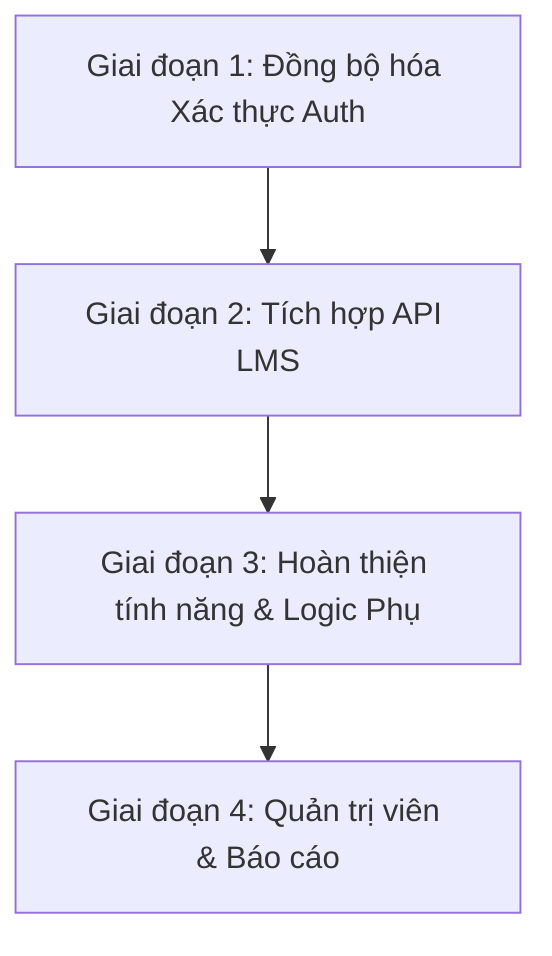

# Báo cáo Trạng thái & Checklist Dự án LogiX LMS

Tài liệu này tổng hợp toàn bộ các phần việc đã hoàn thành (Checklist), các vấn đề tồn đọng/lệch pha (Misalignments & Bugs) giữa Frontend (FE) và Backend (BE), cùng với gợi ý lộ trình tiếp theo để phát triển dự án **LogiX LMS** (Learning Management System).

---

## 1. Tổng quan Dự án
Dự án **LogiX** ban đầu được khởi tạo từ một dự án CRM (Quản lý khách hàng), hiện tại đang trong quá trình chuyển đổi (migration) sang hệ thống **LMS (Quản lý học tập nội bộ)**.
- **Backend (BE)**: Đã thiết lập cơ sở dữ liệu SQLite qua Prisma và xây dựng các API cơ bản cho LMS (Courses, Lessons, Quizzes, Progress, Auth).
- **Frontend (FE)**: Đã tạo giao diện (UI) và định tuyến (Routing) cho các trang LMS chính. Tuy nhiên, hiện tại **tất cả dữ liệu trên giao diện FE vẫn đang dùng Mock Data tĩnh**, chưa được kết nối với API thực tế của BE. Đồng thời, cấu hình API và logic xác thực (Authentication) trên FE vẫn mang tàn dư của dự án CRM cũ.

---

## 2. Checklist Trạng thái Hoàn thành

### Backend (BE)
Mã nguồn BE nằm trong thư mục [backend/](file:///c:/Projects/DigiFnb/Practice/LogiX/backend)
*   **[x] Cơ sở dữ liệu (Database Schema)**: Đã tạo và cấu hình [schema.prisma](file:///c:/Projects/DigiFnb/Practice/LogiX/backend/prisma/schema.prisma) sử dụng SQLite (`dev.db`). Các models bao gồm:
    *   `User` (Student, Instructor, Admin)
    *   `Course` (Khóa học)
    *   `Section` (Chương học)
    *   `Lesson` (Bài học)
    *   `Quiz` (Bài trắc nghiệm) & `Question` (Câu hỏi)
    *   `CourseEnrollment` (Đăng ký học & tiến độ khóa học)
    *   `UserProgress` (Tiến độ hoàn thành từng bài học)
*   **[x] Cơ sở dữ liệu mẫu (Database Seeding)**: Đã viết file [seed.ts](file:///c:/Projects/DigiFnb/Practice/LogiX/backend/src/seed.ts) để nạp dữ liệu mẫu về các khóa học (ví dụ: *Cybersecurity Awareness 2024*), bài học, chương học và câu hỏi trắc nghiệm.
*   **[x] API Routes**: Đã viết các router Express trong thư mục [backend/src/routes/](file:///c:/Projects/DigiFnb/Practice/LogiX/backend/src/routes):
    *   `GET /api/health`: Endpoint kiểm tra trạng thái hoạt động.
    *   `auth.ts` ([Chi tiết](file:///c:/Projects/DigiFnb/Practice/LogiX/backend/src/routes/auth.ts)): Đăng ký (`/register`), Đăng nhập (`/login`), Lấy thông tin user hiện tại (`/me`), Refresh Token (`/refresh`).
    *   `courses.ts` ([Chi tiết](file:///c:/Projects/DigiFnb/Practice/LogiX/backend/src/routes/courses.ts)): Lấy danh sách khóa học (`/`), Lấy chi tiết khóa học kèm bài học (`/:id`), Đăng ký học (`/:id/enroll`).
    *   `lessons.ts` ([Chi tiết](file:///c:/Projects/DigiFnb/Practice/LogiX/backend/src/routes/lessons.ts)): Lấy thông tin bài học cụ thể (`/:id`).
    *   `quizzes.ts` ([Chi tiết](file:///c:/Projects/DigiFnb/Practice/LogiX/backend/src/routes/quizzes.ts)): Lấy thông tin quiz của bài học (`/:id`), Nộp bài thi trắc nghiệm và tính điểm tự động (`/:id/submit`).
    *   `progress.ts` ([Chi tiết](file:///c:/Projects/DigiFnb/Practice/LogiX/backend/src/routes/progress.ts)): Lấy tiến độ học của user (`/:courseId`), Đánh dấu hoàn thành bài học (`/lesson/:lessonId`).

### Frontend (FE)
Mã nguồn FE nằm trong thư mục [frontend/](file:///c:/Projects/DigiFnb/Practice/LogiX/frontend)
*   **[x] Khởi tạo dự án & Shadcn UI**: Cấu hình Next.js App Router ([package.json](file:///c:/Projects/DigiFnb/Practice/LogiX/frontend/package.json)), cài đặt Tailwind CSS v4 và tích hợp hơn 50+ component UI tái sử dụng (như Accordion, Dialog, Card, Sidebar, Table, Tabs...).
*   **[x] Định tuyến (App Router Routing)**: Đã tạo và cấu hình các route trong [frontend/src/app/](file:///c:/Projects/DigiFnb/Practice/LogiX/frontend/src/app):
    *   `Landing Page`: [page.tsx](file:///c:/Projects/DigiFnb/Practice/LogiX/frontend/src/app/page.tsx) giới thiệu về hệ thống LogiX LMS.
    *   `Authentication`: [login/page.tsx](file:///c:/Projects/DigiFnb/Practice/LogiX/frontend/src/app/(auth)/login/page.tsx) trang đăng nhập.
    *   `LMS Dashboard`: [/lms/dashboard/page.tsx](file:///c:/Projects/DigiFnb/Practice/LogiX/frontend/src/app/(protected)/lms/dashboard/page.tsx).
    *   `Course Catalog`: [/lms/courses/page.tsx](file:///c:/Projects/DigiFnb/Practice/LogiX/frontend/src/app/(protected)/lms/courses/page.tsx).
    *   `Course Details`: [/lms/courses/[id]/page.tsx](file:///c:/Projects/DigiFnb/Practice/LogiX/frontend/src/app/(protected)/lms/courses/[id]/page.tsx).
    *   `Lesson Player`: [/lms/lessons/[id]/page.tsx](file:///c:/Projects/DigiFnb/Practice/LogiX/frontend/src/app/(protected)/lms/lessons/[id]/page.tsx).
    *   `Quiz Page`: [/lms/quizzes/[id]/page.tsx](file:///c:/Projects/DigiFnb/Practice/LogiX/frontend/src/app/(protected)/lms/quizzes/[id]/page.tsx).
    *   `Progress Page`: [/lms/progress/page.tsx](file:///c:/Projects/DigiFnb/Practice/LogiX/frontend/src/app/(protected)/lms/progress/page.tsx).
*   **[x] Cấu trúc UI hoàn chỉnh bằng Mock Data**: Các trang giao diện LMS đã được thiết kế rất đẹp mắt, chuẩn UX/UI của một hệ thống LMS cao cấp nhưng đang kết nối dữ liệu từ thư mục `mocks/`.

---

## 3. Các vấn đề Lệch pha & Lỗi cần sửa đổi (Bugs & Misalignments)

Khi đối chiếu giữa FE và BE, có một số điểm không khớp nhau làm hệ thống bị lỗi khi kết nối thật:

| Vấn đề / Tập tin | Mô tả chi tiết | Hướng xử lý |
| :--- | :--- | :--- |
| **Login Panel Text** ([LoginPages.tsx](file:///c:/Projects/DigiFnb/Practice/LogiX/frontend/src/features/auth/pages/LoginPages.tsx)) | Giao diện đăng nhập ở bảng bên trái vẫn ghi thông tin về "Hệ thống CRM ngành Tài chính ngân hàng - DigiFNB" thay vì "Hệ thống LMS LogiX". | Cập nhật lại nội dung văn bản cho đúng thương hiệu LogiX LMS. |
| **API Routes Config** ([api-routes.ts](file:///c:/Projects/DigiFnb/Practice/LogiX/frontend/src/config/api-routes.ts)) | File định nghĩa URL API của FE vẫn giữ các endpoint cũ của CRM như `/users`, `/customers`, `/leads`, `/reports` và hoàn toàn thiếu các endpoint của LMS. | Xóa các endpoint CRM cũ, cập nhật danh sách route API của LMS (courses, lessons, quizzes, progress). |
| **Token Refresh Key** ([axios.ts](file:///c:/Projects/DigiFnb/Practice/LogiX/frontend/src/lib/axios.ts) & BE [auth.ts](file:///c:/Projects/DigiFnb/Practice/LogiX/backend/src/routes/auth.ts)) | **FE gửi**: `{ refresh_token }` (dòng 52 in `axios.ts`).<br>**BE chờ nhận**: `{ refreshToken }` (dòng 104 in `auth.ts`). | Đồng bộ tham số gửi lên BE là `refreshToken`. |
| **Token Refresh Response** ([axios.ts](file:///c:/Projects/DigiFnb/Practice/LogiX/frontend/src/lib/axios.ts) & BE [auth.ts](file:///c:/Projects/DigiFnb/Practice/LogiX/backend/src/routes/auth.ts)) | **FE chờ nhận**: `data.access_token` (dòng 55 in `axios.ts`).<br>**BE trả về**: `{ accessToken: ... }` (dòng 117 in `auth.ts`). | Sửa FE để lấy `data.accessToken` thay vì `data.access_token`. |
| **Auth Service endpoints** ([auth.service.ts](file:///c:/Projects/DigiFnb/Practice/LogiX/frontend/src/features/auth/services/auth.service.ts)) | Các hàm trong service gọi sai API BE:<br>- `refreshToken` gọi `/auth/refresh-token` (BE là `/auth/refresh`).<br>- `getProfile` gọi `/auth/profile` (BE là `/auth/me`).<br>- `logout` gọi `/auth/logout` (BE chưa viết endpoint này). | Cập nhật lại các endpoint gọi API cho khớp hoàn toàn với Backend Router. |
| **JWT User Name** ([auth.utils.ts](file:///c:/Projects/DigiFnb/Practice/LogiX/frontend/src/features/auth/auth.utils.ts) & BE [auth.ts](file:///c:/Projects/DigiFnb/Practice/LogiX/backend/src/routes/auth.ts)) | BE ký JWT payload chỉ gồm `{ id, email, role }` (không có `name`), trong khi FE cố gắng giải mã `name` từ token để hiển thị. Điều này sẽ khiến tên hiển thị bị trống. | Sửa BE để đính thêm trường `name` vào JWT payload khi tạo token, hoặc sửa FE để lưu tên trực tiếp từ object `user` mà API Login trả về thay vì giải mã từ JWT. |

---

## 4. Lộ trình Triển khai Tiếp theo (Roadmap)

Dưới đây là các giai đoạn bạn nên bắt đầu để kết nối và vận hành hoàn thiện dự án:



### Giai đoạn 1: Đồng bộ hóa Xác thực (Auth) 🔑
*   **Mục tiêu**: Đảm bảo học viên đăng nhập, lưu token, tự động duy trì phiên (refresh token) và bảo mật các trang dashboard thành công bằng tài khoản thực tế từ DB.
*   **Các bước cần làm**:
    1.  Cập nhật [auth.service.ts](file:///c:/Projects/DigiFnb/Practice/LogiX/frontend/src/features/auth/services/auth.service.ts) các URL gọi API BE (login, refresh, me).
    2.  Đồng bộ hóa các key (`refreshToken` vs `refresh_token`, `accessToken` vs `access_token`) trong [axios.ts](file:///c:/Projects/DigiFnb/Practice/LogiX/frontend/src/lib/axios.ts).
    3.  Bổ sung thông tin `name` vào token payload khi BE ký JWT ([auth.ts](file:///c:/Projects/DigiFnb/Practice/LogiX/backend/src/routes/auth.ts)).
    4.  Sửa text CRM ở trang Login [LoginPages.tsx](file:///c:/Projects/DigiFnb/Practice/LogiX/frontend/src/features/auth/pages/LoginPages.tsx) thành LogiX LMS.
    5.  Kiểm tra đăng nhập bằng tài khoản mẫu trong Database: `alex@logix.com` / `password123`.

### Giai đoạn 2: Tích hợp API LMS (Data Integration) 📚
*   **Mục tiêu**: Chuyển đổi các trang giao diện tĩnh của LMS sang dùng dữ liệu động lấy từ API bằng cách sử dụng `@tanstack/react-query` (đã được cài đặt sẵn ở dự án).
*   **Các bước cần làm**:
    1.  **Cập nhật config API**: Khai báo các endpoint LMS trong [api-routes.ts](file:///c:/Projects/DigiFnb/Practice/LogiX/frontend/src/config/api-routes.ts).
    2.  **Trang danh sách khóa học**: Sửa [CourseCatalog.tsx](file:///c:/Projects/DigiFnb/Practice/LogiX/frontend/src/features/lms/pages/CourseCatalog.tsx) để fetch dữ liệu từ `GET /api/courses`.
    3.  **Trang chi tiết khóa học**: Sửa [CourseDetailPage.tsx](file:///c:/Projects/DigiFnb/Practice/LogiX/frontend/src/features/lms/pages/CourseDetailPage.tsx) lấy id từ URL và fetch từ `GET /api/courses/:id`. Tích hợp nút **Enroll** (Đăng ký học) gọi API `POST /api/courses/:id/enroll`.
    4.  **Trang học bài (Lesson Player)**: Sửa [LessonPlayerPage.tsx](file:///c:/Projects/DigiFnb/Practice/LogiX/frontend/src/features/lms/pages/LessonPlayerPage.tsx) để hiển thị video thực tế từ `videoUrl` của bài học, đồng thời tích hợp gọi API `POST /api/progress/lesson/:lessonId` khi học viên học xong hoặc click nút hoàn thành.
    5.  **Trang kiểm tra (Quiz Page)**: Sửa [QuizPage.tsx](file:///c:/Projects/DigiFnb/Practice/LogiX/frontend/src/features/lms/pages/QuizPage.tsx) để tải bộ câu hỏi từ `GET /api/quizzes/:id` và gửi bài nộp đến `POST /api/quizzes/:id/submit`.

### Giai đoạn 3: Hoàn thiện tính năng & Trải nghiệm Học viên 🌟
*   **Mục tiêu**: Tối ưu hóa giao diện và bổ sung các logic trải nghiệm người dùng tiện lợi.
*   **Các bước cần làm**:
    1.  **Trang tiến độ cá nhân (Progress Page)**: Sửa [LearnerProgressPage.tsx](file:///c:/Projects/DigiFnb/Practice/LogiX/frontend/src/features/lms/pages/LearnerProgressPage.tsx) hiển thị các thông tin tiến trình thực của học viên lấy từ `GET /api/progress/:courseId`.
    2.  **Dashboard**: Kết nối các số liệu trên dashboard [LMSDashboardPage.tsx](file:///c:/Projects/DigiFnb/Practice/LogiX/frontend/src/features/lms/pages/LMSDashboardPage.tsx) với dữ liệu thực tế (khóa học đang học, hạn hoàn thành sắp tới).
    3.  **Tự động chuyển bài**: Khi hoàn thành quiz hoặc click nút hoàn thành bài học, tự động chuyển sang bài tiếp theo trong danh sách chương mục.

---

## 5. Hướng dẫn khởi chạy dự án hiện tại

Hiện tại, dự án đã có sẵn lệnh chạy đồng thời cả FE và BE. Bạn chỉ cần thực hiện lệnh sau tại thư mục gốc của dự án `LogiX`:

```bash
pnpm dev
```

*   **Frontend** sẽ chạy tại: [http://localhost:3000](http://localhost:3000)
*   **Backend** sẽ chạy tại: [http://localhost:5000](http://localhost:5000) (Có thể kiểm tra API qua [http://localhost:5000/api/health](http://localhost:5000/api/health))
