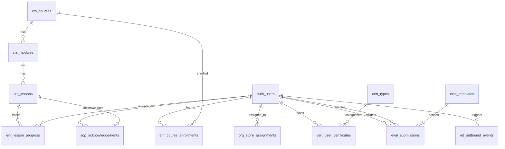

# CƠ SỞ DỮ LIỆU LMS-BAHUNG — THIẾT KẾ CHI TIẾT (DATABASE DESIGN DOCUMENT)
> **Dự án:** LMS-BaHung (Đào tạo Nội bộ F&B Chuỗi Cửa hàng & Xưởng Sản xuất)  
> **Định hướng phát triển:** Đảm bảo bao phủ **100% chức năng LMS-001 đến LMS-111**, đồng thời thiết kế mở rộng sẵn sàng cho **LMS-Horeca (Commercial Sales & Migration)** kế thừa về sau.  
> **Phiên bản:** v1.0.0  
> **Thư mục lưu trữ:** `Practice/LogiX/doc/04-tracking-sprints/BaHung-DB-Design.md`

---

## 1. NGUYÊN TẮC VÀ CHIẾN LƯỢC THIẾT KẾ (DESIGN PRINCIPLES)

### 1.1. Mục tiêu cốt lõi của LMS-BaHung
1. **Phủ 100% 111 chức năng trong `LMS-BaHung List Function.md`:** Đáp ứng đào tạo Onboarding, An toàn Thực phẩm (ATTP), Đánh giá thực hành tại điểm (Mentor & QLCH), Ký xác nhận quy trình SOP, Lớp học tập trung, Gamification và Báo cáo.
2. **Tích hợp HRM Chặt chẽ (HRM Gatekeeper):** Hỗ trợ tự động gán khóa học theo Sơ đồ tổ chức (Cửa hàng/Xưởng/Chức danh/Loại NV), bắn sự kiện trạng thái thử việc/chính thức và **chặn lịch xếp ca HRM nếu vi phạm/hết hạn ATTP**.
3. **Mở rộng linh hoạt sang LMS-Horeca (Horeca-Ready Architecture):** 
   - Mọi bảng Core đều tích hợp cờ phân loại (`is_commercial`, `is_internal`, `user_type`).
   - Mọi bảng User/Course đều sẵn sàng kết nối với Module Thương mại (Định giá, Coupon, VNPay/MoMo) và Migration Engine về sau mà không cần đập đi xây lại Schema.

### 1.2. Phân nhóm Bảng Dữ liệu (Schema Modules)
Cơ sở dữ liệu được chia làm 8 phân khu logic (Logical Schemas/Prefixes):
1. `sys_` & `auth_`: Quản trị Hệ thống, Tài khoản, Phân quyền RBAC & SSO.
2. `org_`: Sơ đồ Tổ chức (Phòng ban, Cửa hàng, Xưởng sản xuất, Chức danh).
3. `crs_`: Quản lý Khóa học, Học liệu (Video, PDF, SOP Rich Text, Versioning).
4. `enr_` & `path_`: Lộ trình Onboarding, Ghi danh & Tiến độ Học tập.
5. `quiz_` & `cert_`: Ngân hàng câu hỏi, Đánh giá Quiz, Chứng chỉ & Quản lý Tuân thủ ATTP.
6. `eval_` & `cls_`: Đánh giá Thực hành (Mentor/QLCH) & Lớp học Đào tạo Tập trung.
7. `sop_`, `srv_` & `gam_`: Ký xác nhận SOP, Khảo sát & Gamification (Điểm thưởng, Badge, Leaderboard).
8. `int_` & `aud_`: Tích hợp HRM Webhooks, Đồng bộ Nhân sự & Nhật ký Thao tác (Audit Log).

---

## 2. MA TRẬN ÁP DỤNG DATABASE CHO 111 CHỨC NĂNG (FUNCTION-TO-TABLE MATRIX)

> [!NOTE]
> Bảng dưới đây chứng minh mọi chức năng từ **LMS-001** đến **LMS-111** đều có Entity và Column tương ứng trong DB Design này.

| Mã CN | Tên Chức Năng LMS-BaHung | Thực thể / Bảng Dữ Dụng Chính (Tables & Views) |
|:---:|---|---|
| **LMS-001** | Tạo danh mục chương trình đào tạo | `crs_categories` |
| **LMS-002** | Tạo khóa học mới | `crs_courses` |
| **LMS-003** | Sao chép khóa học | `crs_courses` (Clone logic via Stored Proc/Service) |
| **LMS-004** | Ngưng / kích hoạt khóa học | `crs_courses.status` |
| **LMS-005** | Gán khóa học theo chức danh | `enr_auto_assignment_rules` (`position_id`) |
| **LMS-006** | Gán khóa học theo loại nhân sự | `enr_auto_assignment_rules` (`employment_type`) |
| **LMS-007** | Gán khóa học theo cửa hàng | `enr_auto_assignment_rules` (`store_id`) |
| **LMS-008** | Gán khóa học theo bộ phận sản xuất | `enr_auto_assignment_rules` (`factory_dept_id`) |
| **LMS-009** | Đặt khóa học bắt buộc | `crs_courses.is_mandatory`, `enr_auto_assignment_rules.is_mandatory` |
| **LMS-010** | Đặt khóa học tùy chọn | `crs_courses.is_mandatory = false` |
| **LMS-011** | Cấu hình thời hạn hoàn thành | `crs_courses.duration_days`, `enr_course_enrollments.due_date` |
| **LMS-012** | Cấu hình điểm đạt khóa học | `crs_courses.pass_score` |
| **LMS-013** | Bài giảng dạng video | `crs_lessons` (`lesson_type = 'VIDEO'`, `video_url`, `duration_seconds`) |
| **LMS-014** | Bài giảng dạng PDF | `crs_lessons` (`lesson_type = 'PDF'`, `document_url`) |
| **LMS-015** | Bài giảng dạng trang văn bản | `crs_lessons` (`lesson_type = 'RICHTEXT'`, `body_html`) |
| **LMS-016** | Bài giảng dạng hình ảnh / checklist | `crs_lessons` (`lesson_type = 'CHECKLIST'`, `checklist_items` JSONB) |
| **LMS-017** | Sắp xếp thứ tự bài giảng | `crs_modules.sort_order`, `crs_lessons.sort_order` |
| **LMS-018** | Ẩn / hiện bài giảng | `crs_lessons.is_visible` |
| **LMS-019** | Gắn tài liệu SOP vận hành cửa hàng | `crs_lessons.sop_code`, `crs_lessons.sop_type = 'STORE'` |
| **LMS-020** | Gắn tài liệu SOP sản xuất | `crs_lessons.sop_code`, `crs_lessons.sop_type = 'FACTORY'` |
| **LMS-021** | Phiên bản hóa học liệu | `crs_lesson_versions` |
| **LMS-022** | Tạo khóa đào tạo ATTP bắt buộc | `crs_courses.course_type = 'ATTP'` |
| **LMS-023** | Ghi nhận hoàn thành ATTP nội bộ | `enr_course_enrollments`, `cert_user_certificates` |
| **LMS-024** | Ghi nhận chứng chỉ ATTP ngoài | `cert_user_certificates` (`is_external = true`, `issuing_org`) |
| **LMS-025** | Lưu ngày cấp chứng chỉ ATTP | `cert_user_certificates.issue_date` |
| **LMS-026** | Lưu ngày hết hạn chứng chỉ ATTP | `cert_user_certificates.expiry_date` |
| **LMS-027** | Cảnh báo chứng chỉ sắp hết hạn | `cert_notifications`, `cert_user_certificates.status = 'EXPIRING_SOON'` |
| **LMS-028** | Cảnh báo chứng chỉ đã hết hạn | `cert_notifications`, `cert_user_certificates.status = 'EXPIRED'` |
| **LMS-029** | Chặn xếp ca nếu thiếu ATTP | View `v_attp_shift_eligibility`, API Gate check |
| **LMS-030** | In / xuất giấy xác nhận ATTP | `cert_user_certificates.certificate_code`, PDF Export Service |
| **LMS-031** | Quản lý loại chứng chỉ khác | `cert_types` (ATTP, Professional, Safety, Operations) |
| **LMS-032** | Gắn chứng chỉ vào hồ sơ học viên | `cert_user_certificates.user_id` FK → `auth_users.id` |
| **LMS-033** | Lộ trình onboarding nhân viên CH | `path_learning_paths` (`target_role = 'STORE_STAFF'`) |
| **LMS-034** | Lộ trình onboarding nhân viên SX | `path_learning_paths` (`target_role = 'FACTORY_STAFF'`) |
| **LMS-035** | Lộ trình onboarding quản lý CH | `path_learning_paths` (`target_role = 'STORE_MANAGER'`) |
| **LMS-036** | Lộ trình onboarding nhân viên TC | `path_learning_paths` (`target_role = 'REINFORCEMENT'`) |
| **LMS-037** | Lộ trình onboarding học việc | `path_learning_paths` (`target_role = 'PROBATION'`) |
| **LMS-038** | Tự gán lộ trình khi status Học việc | `path_auto_assign_rules` (`trigger_status = 'PROBATION'`) |
| **LMS-039** | Tự gán lộ trình khi chính thức | `path_auto_assign_rules` (`trigger_status = 'OFFICIAL'`) |
| **LMS-040** | Theo dõi % hoàn thành onboarding | `path_user_progress.completion_percentage` |
| **LMS-041** | Cảnh báo chậm tiến độ onboarding | `path_user_reminders` |
| **LMS-042** | Xác nhận hoàn tất onboarding | `path_user_progress.status = 'COMPLETED'`, `int_outbound_events` |
| **LMS-043** | Checklist học tập song song HR | `path_onboarding_checklists` (`type = 'LEARNING'` vs `'HR'`) |
| **LMS-044** | Ghi danh học viên thủ công | `enr_course_enrollments` (`source = 'MANUAL'`) |
| **LMS-045** | Ghi danh hàng loạt theo cửa hàng | Bulk insert `enr_course_enrollments` by `store_id` |
| **LMS-046** | Ghi danh hàng loạt theo bộ phận | Bulk insert `enr_course_enrollments` by `department_id` |
| **LMS-047** | Hủy ghi danh học viên | `enr_course_enrollments.status = 'CANCELLED'` |
| **LMS-048** | Xem danh sách khóa của tôi | Query `enr_course_enrollments` JOIN `crs_courses` |
| **LMS-049** | Mở bài giảng để học | `enr_lesson_progress` record initialization |
| **LMS-050** | Đánh dấu hoàn thành bài giảng | `enr_lesson_progress.is_completed = true` |
| **LMS-051** | Lưu tiến độ học dở | `enr_lesson_progress.last_position_seconds` |
| **LMS-052** | Học trên Web | Web API Endpoints |
| **LMS-053** | Học trên App di động | Mobile API Endpoints |
| **LMS-054** | Tải tài liệu học | `crs_lessons.allow_download = true` |
| **LMS-055** | Ghi nhận thời gian học | `enr_study_logs.time_spent_seconds` |
| **LMS-056** | Tạo ngân hàng câu hỏi | `quiz_question_categories`, `quiz_question_bank` |
| **LMS-057** | Câu hỏi trắc nghiệm 1 đáp án | `quiz_question_bank` (`type = 'SINGLE_CHOICE'`), `quiz_question_options` |
| **LMS-058** | Câu hỏi trắc nghiệm nhiều đáp án | `quiz_question_bank` (`type = 'MULTIPLE_CHOICE'`) |
| **LMS-059** | Câu hỏi đúng/sai | `quiz_question_bank` (`type = 'TRUE_FALSE'`) |
| **LMS-060** | Câu hỏi tự luận ngắn | `quiz_question_bank` (`type = 'SHORT_ANSWER'`) |
| **LMS-061** | Tạo bài kiểm tra gắn khóa học | `quiz_quizzes.course_id` FK → `crs_courses.id` |
| **LMS-062** | Cấu hình số lần làm lại | `quiz_quizzes.max_attempts` |
| **LMS-063** | Cấu hình thời gian làm bài | `quiz_quizzes.time_limit_minutes` |
| **LMS-064** | Xáo trộn câu hỏi | `quiz_quizzes.shuffle_questions` |
| **LMS-065** | Học viên làm bài kiểm tra | `quiz_attempts` |
| **LMS-066** | Chấm điểm tự động trắc nghiệm | `quiz_attempts.score`, `quiz_attempt_answers.is_correct` |
| **LMS-067** | Chấm điểm thủ công tự luận | `quiz_attempt_answers.score`, `graded_by_user_id` |
| **LMS-068** | Xem kết quả bài kiểm tra | Summary from `quiz_attempts` |
| **LMS-069** | Xem lịch sử làm bài | Query list `quiz_attempts` |
| **LMS-070** | Đạt / không đạt khóa theo điểm | `enr_course_enrollments.is_passed` |
| **LMS-071** | Bảng xếp hạng điểm học tập | `gam_user_points`, `gam_leaderboards` |
| **LMS-072** | Thử thách học tập tuần/tháng | `gam_challenges`, `gam_user_challenge_progress` |
| **LMS-073** | Cộng điểm thưởng hoàn thành đúng hạn | `gam_point_logs` (`event_type = 'ON_TIME_BONUS'`) |
| **LMS-074** | Huy hiệu hoàn thành khóa | `gam_badges`, `gam_user_badges` |
| **LMS-075** | Báo cáo người dẫn đầu theo CH | Query `gam_user_points` GROUP BY `store_id` |
| **LMS-076** | Phiếu đánh giá thực hành CH | `eval_templates` (`category = 'STORE'`) |
| **LMS-077** | Phiếu đánh giá thực hành SX | `eval_templates` (`category = 'FACTORY'`) |
| **LMS-078** | Mentor chấm đánh giá học việc | `eval_submissions`, `eval_submission_items` |
| **LMS-079** | QLCH xác nhận đánh giá thực hành | `eval_submissions.manager_approval_status`, `manager_user_id` |
| **LMS-080** | Gửi kết quả thực hành sang HRM | `int_outbound_events` (`event_type = 'PRACTICAL_EVAL_PASS'`) |
| **LMS-081** | Lưu lịch sử đánh giá thực hành | Historical rows in `eval_submissions` |
| **LMS-082** | Gán mentor (đồng bộ từ HRM) | `org_mentor_mentee_mappings` |
| **LMS-083** | Tạo lớp đào tạo tập trung | `cls_training_classes` |
| **LMS-084** | Mở điểm danh lớp đào tạo | `cls_class_sessions` |
| **LMS-085** | Ghi nhận tham dự lớp | `cls_attendances` (`status = 'PRESENT'/'ABSENT'`) |
| **LMS-086** | Gắn lớp với khóa học | `cls_training_classes.course_id` |
| **LMS-087** | Thông báo lịch học | `cls_class_notifications` |
| **LMS-088** | Đăng ký tham gia lớp học | `cls_class_registrations` |
| **LMS-089** | Giới hạn sĩ số lớp | `cls_training_classes.max_capacity` |
| **LMS-090** | Form xác nhận đã đọc SOP | `sop_acknowledgements` |
| **LMS-091** | Ký xác nhận đã hiểu quy định | `sop_acknowledgements.digital_signature_blob`, `signed_at` |
| **LMS-092** | Khảo sát mức độ hiểu bài | `srv_surveys` (`type = 'COMPREHENSION'`), `srv_responses` |
| **LMS-093** | Khảo sát chất lượng khóa học | `srv_surveys` (`type = 'COURSE_RATING'`), `srv_responses` |
| **LMS-094** | Báo cáo tỷ lệ hoàn thành theo CH | View `v_report_store_completion` |
| **LMS-095** | Báo cáo tỷ lệ hoàn thành theo SX | View `v_report_factory_completion` |
| **LMS-096** | Báo cáo chưa hoàn thành onboard | View `v_report_overdue_onboarding` |
| **LMS-097** | Báo cáo chứng chỉ ATTP | View `v_report_attp_status` |
| **LMS-098** | Báo cáo kết quả quiz theo khóa | View `v_report_quiz_analytics` |
| **LMS-099** | Báo cáo thời gian đào tạo | View `v_report_learning_duration` |
| **LMS-100** | Báo cáo mentor - số học việc đang kèm | View `v_report_mentor_workload` |
| **LMS-101** | Xuất báo cáo ra Excel | System Report Service |
| **LMS-102** | Phân quyền Admin LMS | `auth_roles`, `auth_permissions`, `auth_user_roles` |
| **LMS-103** | Phân quyền Trainer | `auth_roles` (`code = 'TRAINER'`) |
| **LMS-104** | Phân quyền xem báo cáo | `auth_roles` (`code = 'REPORT_VIEWER'`) |
| **LMS-105** | Đồng bộ danh sách nhân sự từ HRM | `int_hrm_sync_logs`, `auth_users`, `org_departments` |
| **LMS-106** | Đồng bộ trạng thái nhân sự từ HRM | `auth_users.employment_status` (`PROBATION`, `OFFICIAL`, `RESIGNED`) |
| **LMS-107** | Gửi sự kiện hoàn thành khóa sang HRM | `int_outbound_events` (`event_type = 'COURSE_COMPLETED'`) |
| **LMS-108** | Gửi sự kiện đạt đánh giá thực hành sang HRM | `int_outbound_events` (`event_type = 'PRACTICAL_PASSED'`) |
| **LMS-109** | SSO với App nhân viên | `auth_sso_credentials`, OAuth2/OIDC Token Handler |
| **LMS-110** | Nhật ký thao tác LMS (Audit log) | `aud_audit_logs` |
| **LMS-111** | Sao lưu nội dung đào tạo | `sys_backups` metadata & System Storage |

---

## 3. THIẾT KẾ CƠ SỞ DỮ LIỆU CHI TIẾT (DETAILED TABLE SPECIFICATIONS)



---

### PHÂN KHU 1: QUẢN TRỊ NGUỜI DÙNG & SƠ ĐỒ TỔ CHỨC (`auth_` & `org_`)

#### 1. `auth_users` (Hồ sơ Nhân sự & Học viên)
> **Horeca-Ready:** Trường `user_type` cho phép phân biệt Nhân viên nội bộ BaHung (`EMPLOYEE`) với Khách hàng cá nhân Horeca (`CUSTOMER`).

```sql
CREATE TABLE auth_users (
    id UUID PRIMARY KEY DEFAULT gen_random_uuid(),
    username VARCHAR(100) UNIQUE NOT NULL,
    email VARCHAR(255) UNIQUE NULLABLE,
    phone_number VARCHAR(20) UNIQUE NOT NULL,
    password_hash VARCHAR(255) NOT NULL,
    full_name VARCHAR(150) NOT NULL,
    avatar_url TEXT NULLABLE,
    
    -- Phân loại đối tượng & Trạng thái làm việc (LMS-105, LMS-106)
    user_type VARCHAR(20) NOT NULL DEFAULT 'EMPLOYEE', -- 'EMPLOYEE', 'CUSTOMER', 'SYSTEM_ADMIN'
    employment_status VARCHAR(30) NOT NULL DEFAULT 'PROBATION', -- 'PROBATION', 'OFFICIAL', 'TEMPORARY', 'RESIGNED'
    employee_code VARCHAR(50) UNIQUE NULLABLE, -- Mã nhân viên HRM
    
    -- Sơ đồ tổ chức mặc định
    primary_store_id UUID NULLABLE, -- FK -> org_stores.id (LMS-007)
    department_id UUID NULLABLE, -- FK -> org_departments.id (LMS-008)
    position_id UUID NULLABLE, -- FK -> org_positions.id (LMS-005)
    
    status VARCHAR(20) NOT NULL DEFAULT 'ACTIVE', -- 'ACTIVE', 'LOCKED', 'PENDING'
    last_login_at TIMESTAMPTZ NULLABLE,
    created_at TIMESTAMPTZ NOT NULL DEFAULT NOW(),
    updated_at TIMESTAMPTZ NOT NULL DEFAULT NOW()
);

CREATE INDEX idx_users_emp_code ON auth_users(employee_code);
CREATE INDEX idx_users_store_dept ON auth_users(primary_store_id, department_id, position_id);
CREATE INDEX idx_users_type_status ON auth_users(user_type, employment_status, status);
```

#### 2. `org_stores` & `org_departments` & `org_positions` (Sơ đồ Chuỗi CH & Xưởng)
```sql
-- Danh mục Cửa hàng / Chi nhánh (LMS-007, LMS-045, LMS-075, LMS-094)
CREATE TABLE org_stores (
    id UUID PRIMARY KEY DEFAULT gen_random_uuid(),
    store_code VARCHAR(50) UNIQUE NOT NULL, -- Ví dụ: 'CH-QUAN1', 'XUONG-KEM'
    store_name VARCHAR(150) NOT NULL,
    region VARCHAR(50) NOT NULL DEFAULT 'MIEN_NAM', -- Mắt xích phân vùng
    store_type VARCHAR(30) NOT NULL DEFAULT 'RETAIL_STORE', -- 'RETAIL_STORE', 'CENTRAL_FACTORY', 'OFFICE'
    is_active BOOLEAN NOT NULL DEFAULT TRUE,
    created_at TIMESTAMPTZ NOT NULL DEFAULT NOW()
);

-- Danh mục Bộ phận Sản xuất / Phòng ban (LMS-008, LMS-046, LMS-095)
CREATE TABLE org_departments (
    id UUID PRIMARY KEY DEFAULT gen_random_uuid(),
    dept_code VARCHAR(50) UNIQUE NOT NULL, -- Ví dụ: 'BP-KEM', 'BP-CAT-BAO', 'BP-BAN-HANG'
    dept_name VARCHAR(150) NOT NULL,
    is_factory_dept BOOLEAN NOT NULL DEFAULT FALSE, -- Cờ nhận diện khâu sản xuất xưởng
    created_at TIMESTAMPTZ NOT NULL DEFAULT NOW()
);

-- Danh mục Chức danh / Vị trí công việc (LMS-005, LMS-033..036)
CREATE TABLE org_positions (
    id UUID PRIMARY KEY DEFAULT gen_random_uuid(),
    position_code VARCHAR(50) UNIQUE NOT NULL, -- Ví dụ: 'QLCH', 'NV-BAN-HANG', 'NV-XUONG-KEM'
    position_name VARCHAR(150) NOT NULL,
    level_rank INT NOT NULL DEFAULT 1,
    created_at TIMESTAMPTZ NOT NULL DEFAULT NOW()
);

-- Bảng gán Mentor - Mentee đồng bộ từ HRM (LMS-082, LMS-100)
CREATE TABLE org_mentor_mentee_mappings (
    id UUID PRIMARY KEY DEFAULT gen_random_uuid(),
    mentor_user_id UUID NOT NULL REFERENCES auth_users(id),
    mentee_user_id UUID NOT NULL REFERENCES auth_users(id),
    assigned_date DATE NOT NULL DEFAULT CURRENT_DATE,
    is_active BOOLEAN NOT NULL DEFAULT TRUE,
    created_at TIMESTAMPTZ NOT NULL DEFAULT NOW(),
    CONSTRAINT unique_active_mentor_mentee UNIQUE(mentee_user_id, is_active)
);
```

#### 3. `auth_roles` & `auth_permissions` & `auth_user_roles` (Phân quyền RBAC - LMS-102..104)
```sql
CREATE TABLE auth_roles (
    id UUID PRIMARY KEY DEFAULT gen_random_uuid(),
    code VARCHAR(50) UNIQUE NOT NULL, -- 'ADMIN_LMS', 'TRAINER', 'REPORT_VIEWER', 'STORE_MANAGER'
    name VARCHAR(100) NOT NULL,
    description TEXT NULLABLE
);

CREATE TABLE auth_permissions (
    id UUID PRIMARY KEY DEFAULT gen_random_uuid(),
    code VARCHAR(100) UNIQUE NOT NULL, -- 'course:create', 'attp:view', 'eval:grade'
    module VARCHAR(50) NOT NULL
);

CREATE TABLE auth_role_permissions (
    role_id UUID REFERENCES auth_roles(id) ON DELETE CASCADE,
    permission_id UUID REFERENCES auth_permissions(id) ON DELETE CASCADE,
    PRIMARY KEY (role_id, permission_id)
);

CREATE TABLE auth_user_roles (
    user_id UUID REFERENCES auth_users(id) ON DELETE CASCADE,
    role_id UUID REFERENCES auth_roles(id) ON DELETE CASCADE,
    PRIMARY KEY (user_id, role_id)
);
```

---

### PHÂN KHU 2: QUẢN LÝ KHÓA HỌC & HỌC LIỆU (`crs_`)

#### 4. `crs_categories` & `crs_courses` (Danh mục & Khóa học)
> **Horeca-Ready:** Các cờ `is_commercial` (bán hàng), `allow_guest_preview` sẵn sàng cho Horeca.

```sql
CREATE TABLE crs_categories (
    id UUID PRIMARY KEY DEFAULT gen_random_uuid(),
    code VARCHAR(50) UNIQUE NOT NULL,
    name VARCHAR(150) NOT NULL, -- 'Onboarding', 'ATTP', 'Nghiệp vụ CH', 'Nghiệp vụ Xưởng'
    parent_id UUID NULLABLE REFERENCES crs_categories(id),
    sort_order INT NOT NULL DEFAULT 0
);

CREATE TABLE crs_courses (
    id UUID PRIMARY KEY DEFAULT gen_random_uuid(),
    code VARCHAR(50) UNIQUE NOT NULL, -- LMS-001, LMS-002
    title VARCHAR(255) NOT NULL,
    slug VARCHAR(255) UNIQUE NOT NULL,
    description TEXT NULLABLE,
    thumbnail_url TEXT NULLABLE,
    category_id UUID NOT NULL REFERENCES crs_categories(id),
    
    -- Phân loại đặc thù BaHung & Horeca
    course_type VARCHAR(30) NOT NULL DEFAULT 'STANDARD', -- 'ATTP', 'ONBOARDING', 'STANDARD', 'SAFETY'
    is_mandatory BOOLEAN NOT NULL DEFAULT FALSE, -- LMS-009, LMS-010
    duration_days INT NULLABLE DEFAULT 30, -- LMS-011 (Thời hạn hoàn thành)
    pass_score INT NOT NULL DEFAULT 80, -- LMS-012 (Điểm đạt %)
    
    -- Horeca Ready Flags
    is_commercial BOOLEAN NOT NULL DEFAULT FALSE, -- Nếu TRUE sẽ hiện giá bán ở Horeca
    is_internal BOOLEAN NOT NULL DEFAULT TRUE, -- Khóa học nội bộ BaHung
    
    status VARCHAR(20) NOT NULL DEFAULT 'DRAFT', -- 'DRAFT', 'PUBLISHED', 'ARCHIVED' (LMS-004)
    created_by UUID NULLABLE REFERENCES auth_users(id),
    created_at TIMESTAMPTZ NOT NULL DEFAULT NOW(),
    updated_at TIMESTAMPTZ NOT NULL DEFAULT NOW()
);
```

#### 5. `crs_modules` & `crs_lessons` & `crs_lesson_versions` (Học liệu Video, PDF, SOP)
```sql
CREATE TABLE crs_modules (
    id UUID PRIMARY KEY DEFAULT gen_random_uuid(),
    course_id UUID NOT NULL REFERENCES crs_courses(id) ON DELETE CASCADE,
    title VARCHAR(200) NOT NULL,
    sort_order INT NOT NULL DEFAULT 1 -- LMS-017
);

CREATE TABLE crs_lessons (
    id UUID PRIMARY KEY DEFAULT gen_random_uuid(),
    module_id UUID NOT NULL REFERENCES crs_modules(id) ON DELETE CASCADE,
    title VARCHAR(200) NOT NULL,
    lesson_type VARCHAR(30) NOT NULL, -- 'VIDEO' (LMS-013), 'PDF' (LMS-014), 'RICHTEXT' (LMS-015), 'CHECKLIST' (LMS-016)
    
    -- Nội dung bài giảng
    video_url TEXT NULLABLE,
    document_url TEXT NULLABLE,
    body_html TEXT NULLABLE, -- Rich text SOP
    checklist_items JSONB NULLABLE, -- Checklist ảnh quy trình SOP
    
    -- Cấu hình SOP & Quy định (LMS-019, LMS-020)
    sop_code VARCHAR(50) NULLABLE,
    sop_type VARCHAR(30) NULLABLE, -- 'STORE_SOP', 'FACTORY_SOP'
    requires_signature BOOLEAN NOT NULL DEFAULT FALSE, -- Bắt buộc ký xác nhận SOP (LMS-090, LMS-091)
    
    duration_seconds INT NOT NULL DEFAULT 0,
    allow_download BOOLEAN NOT NULL DEFAULT FALSE, -- LMS-054
    is_visible BOOLEAN NOT NULL DEFAULT TRUE, -- LMS-018
    sort_order INT NOT NULL DEFAULT 1, -- LMS-017
    created_at TIMESTAMPTZ NOT NULL DEFAULT NOW()
);

-- Phiên bản hóa học liệu audit (LMS-021)
CREATE TABLE crs_lesson_versions (
    id UUID PRIMARY KEY DEFAULT gen_random_uuid(),
    lesson_id UUID NOT NULL REFERENCES crs_lessons(id) ON DELETE CASCADE,
    version_number INT NOT NULL,
    body_html_snapshot TEXT NULLABLE,
    changed_by UUID REFERENCES auth_users(id),
    created_at TIMESTAMPTZ NOT NULL DEFAULT NOW()
);
```

---

### PHÂN KHU 3: GHI DANH, QUY TẮC AUTO-ASSIGN & TIẾN ĐỘ (`enr_` & `path_`)

#### 6. `enr_auto_assignment_rules` (Quy tắc Tự động Gán khóa học F&B - LMS-005..008)
```sql
CREATE TABLE enr_auto_assignment_rules (
    id UUID PRIMARY KEY DEFAULT gen_random_uuid(),
    rule_name VARCHAR(150) NOT NULL,
    course_id UUID NOT NULL REFERENCES crs_courses(id) ON DELETE CASCADE,
    
    -- Điều kiện khớp tự động từ HRM (LMS-005..008)
    target_position_id UUID NULLABLE REFERENCES org_positions(id), -- Gán theo Chức danh
    target_employment_type VARCHAR(30) NULLABLE, -- 'PROBATION', 'OFFICIAL' (Gán theo loại NV)
    target_store_id UUID NULLABLE REFERENCES org_stores(id), -- Gán theo Cửa hàng
    target_factory_dept_id UUID NULLABLE REFERENCES org_departments(id), -- Gán theo khâu sản xuất
    
    is_mandatory BOOLEAN NOT NULL DEFAULT TRUE, -- LMS-009
    is_active BOOLEAN NOT NULL DEFAULT TRUE,
    created_at TIMESTAMPTZ NOT NULL DEFAULT NOW()
);
```

#### 7. `enr_course_enrollments` & `enr_lesson_progress` & `enr_study_logs`
```sql
-- Ghi danh học viên (LMS-044..047)
CREATE TABLE enr_course_enrollments (
    id UUID PRIMARY KEY DEFAULT gen_random_uuid(),
    user_id UUID NOT NULL REFERENCES auth_users(id) ON DELETE CASCADE,
    course_id UUID NOT NULL REFERENCES crs_courses(id) ON DELETE CASCADE,
    
    enrollment_source VARCHAR(30) NOT NULL DEFAULT 'AUTO_RULE', -- 'AUTO_RULE', 'MANUAL', 'PURCHASE'
    status VARCHAR(30) NOT NULL DEFAULT 'ENROLLED', -- 'ENROLLED', 'IN_PROGRESS', 'COMPLETED', 'CANCELLED'
    
    due_date TIMESTAMPTZ NULLABLE, -- LMS-011 (Deadline)
    completion_percentage DECIMAL(5,2) NOT NULL DEFAULT 0.00, -- LMS-040
    is_passed BOOLEAN NOT NULL DEFAULT FALSE, -- LMS-070
    
    enrolled_at TIMESTAMPTZ NOT NULL DEFAULT NOW(),
    completed_at TIMESTAMPTZ NULLABLE,
    CONSTRAINT unique_user_course UNIQUE(user_id, course_id)
);

-- Tiến độ từng bài học (LMS-049..051)
CREATE TABLE enr_lesson_progress (
    id UUID PRIMARY KEY DEFAULT gen_random_uuid(),
    enrollment_id UUID NOT NULL REFERENCES enr_course_enrollments(id) ON DELETE CASCADE,
    user_id UUID NOT NULL REFERENCES auth_users(id),
    lesson_id UUID NOT NULL REFERENCES crs_lessons(id),
    
    is_completed BOOLEAN NOT NULL DEFAULT FALSE, -- LMS-050
    last_position_seconds INT NOT NULL DEFAULT 0, -- LMS-051 (Lưu timestamp xem video dở)
    completed_at TIMESTAMPTZ NULLABLE,
    updated_at TIMESTAMPTZ NOT NULL DEFAULT NOW(),
    CONSTRAINT unique_user_lesson UNIQUE(user_id, lesson_id)
);

-- Nhật ký thời gian học tracking duration (LMS-055)
CREATE TABLE enr_study_logs (
    id UUID PRIMARY KEY DEFAULT gen_random_uuid(),
    user_id UUID NOT NULL REFERENCES auth_users(id),
    lesson_id UUID NOT NULL REFERENCES crs_lessons(id),
    time_spent_seconds INT NOT NULL DEFAULT 0,
    logged_date DATE NOT NULL DEFAULT CURRENT_DATE
);
```

#### 8. `path_learning_paths` & `path_user_progress` (Lộ trình Onboarding - LMS-033..043)
```sql
CREATE TABLE path_learning_paths (
    id UUID PRIMARY KEY DEFAULT gen_random_uuid(),
    code VARCHAR(50) UNIQUE NOT NULL,
    title VARCHAR(200) NOT NULL, -- Onboarding CH, Onboarding SX, Onboarding QLCH
    target_role VARCHAR(50) NOT NULL, -- 'STORE_STAFF', 'FACTORY_STAFF', 'STORE_MANAGER', 'PROBATION'
    is_active BOOLEAN NOT NULL DEFAULT TRUE
);

CREATE TABLE path_learning_path_courses (
    path_id UUID REFERENCES path_learning_paths(id) ON DELETE CASCADE,
    course_id UUID REFERENCES crs_courses(id) ON DELETE CASCADE,
    step_order INT NOT NULL DEFAULT 1,
    PRIMARY KEY (path_id, course_id)
);

CREATE TABLE path_user_progress (
    id UUID PRIMARY KEY DEFAULT gen_random_uuid(),
    user_id UUID NOT NULL REFERENCES auth_users(id) ON DELETE CASCADE,
    path_id UUID NOT NULL REFERENCES path_learning_paths(id),
    status VARCHAR(30) NOT NULL DEFAULT 'IN_PROGRESS', -- 'IN_PROGRESS', 'COMPLETED', 'OVERDUE'
    completion_percentage DECIMAL(5,2) NOT NULL DEFAULT 0.00,
    started_at TIMESTAMPTZ NOT NULL DEFAULT NOW(),
    completed_at TIMESTAMPTZ NULLABLE -- LMS-042 (Kích hoạt event bắn sang HRM)
);
```

---

### PHÂN KHU 4: KIỂM TRA, ATTP & CHỨNG CHỈ (`quiz_` & `cert_`)

#### 9. `quiz_question_bank` & `quiz_quizzes` & `quiz_attempts` (Quiz Engine - LMS-056..070)
```sql
CREATE TABLE quiz_question_categories (
    id UUID PRIMARY KEY DEFAULT gen_random_uuid(),
    name VARCHAR(150) NOT NULL
);

CREATE TABLE quiz_question_bank (
    id UUID PRIMARY KEY DEFAULT gen_random_uuid(),
    category_id UUID REFERENCES quiz_question_categories(id),
    question_text TEXT NOT NULL,
    question_type VARCHAR(30) NOT NULL, -- 'SINGLE_CHOICE' (057), 'MULTIPLE_CHOICE' (058), 'TRUE_FALSE' (059), 'SHORT_ANSWER' (060)
    explanation TEXT NULLABLE,
    created_at TIMESTAMPTZ NOT NULL DEFAULT NOW()
);

CREATE TABLE quiz_question_options (
    id UUID PRIMARY KEY DEFAULT gen_random_uuid(),
    question_id UUID NOT NULL REFERENCES quiz_question_bank(id) ON DELETE CASCADE,
    option_text TEXT NOT NULL,
    is_correct BOOLEAN NOT NULL DEFAULT FALSE
);

CREATE TABLE quiz_quizzes (
    id UUID PRIMARY KEY DEFAULT gen_random_uuid(),
    course_id UUID NOT NULL REFERENCES crs_courses(id) ON DELETE CASCADE,
    title VARCHAR(200) NOT NULL,
    pass_score INT NOT NULL DEFAULT 80,
    max_attempts INT NOT NULL DEFAULT 3, -- LMS-062
    time_limit_minutes INT NULLABLE DEFAULT 30, -- LMS-063
    shuffle_questions BOOLEAN NOT NULL DEFAULT TRUE -- LMS-064
);

CREATE TABLE quiz_attempts (
    id UUID PRIMARY KEY DEFAULT gen_random_uuid(),
    quiz_id UUID NOT NULL REFERENCES quiz_quizzes(id),
    user_id UUID NOT NULL REFERENCES auth_users(id),
    score DECIMAL(5,2) NOT NULL DEFAULT 0.00,
    is_passed BOOLEAN NOT NULL DEFAULT FALSE, -- LMS-070
    started_at TIMESTAMPTZ NOT NULL DEFAULT NOW(),
    submitted_at TIMESTAMPTZ NULLABLE
);

CREATE TABLE quiz_attempt_answers (
    id UUID PRIMARY KEY DEFAULT gen_random_uuid(),
    attempt_id UUID NOT NULL REFERENCES quiz_attempts(id) ON DELETE CASCADE,
    question_id UUID NOT NULL REFERENCES quiz_question_bank(id),
    user_answer_text TEXT NULLABLE,
    is_correct BOOLEAN NULLABLE,
    graded_by_user_id UUID NULLABLE REFERENCES auth_users(id), -- LMS-067 (Trainer chấm tự luận)
    score DECIMAL(5,2) DEFAULT 0.00
);
```

#### 10. `cert_types` & `cert_user_certificates` (Quản lý Tuân thủ ATTP & Shift Gate - LMS-022..032)
```sql
CREATE TABLE cert_types (
    id UUID PRIMARY KEY DEFAULT gen_random_uuid(),
    code VARCHAR(50) UNIQUE NOT NULL, -- 'ATTP_NOI_BO', 'ATTP_NGOAI', 'NGHIEP_VU_CH'
    name VARCHAR(150) NOT NULL,
    default_valid_months INT DEFAULT 12
);

-- Quản lý Chứng chỉ Học viên (LMS-024..028, LMS-032)
CREATE TABLE cert_user_certificates (
    id UUID PRIMARY KEY DEFAULT gen_random_uuid(),
    user_id UUID NOT NULL REFERENCES auth_users(id) ON DELETE CASCADE,
    cert_type_id UUID NOT NULL REFERENCES cert_types(id),
    certificate_code VARCHAR(100) UNIQUE NOT NULL,
    
    issuing_organization VARCHAR(150) DEFAULT 'BA HUNG BAKERY',
    is_external BOOLEAN NOT NULL DEFAULT FALSE, -- LMS-024 (Học ngoài)
    certificate_file_url TEXT NULLABLE,
    
    issue_date DATE NOT NULL, -- LMS-025
    expiry_date DATE NOT NULL, -- LMS-026
    
    status VARCHAR(30) NOT NULL DEFAULT 'VALID', -- 'VALID', 'EXPIRING_SOON', 'EXPIRED' (LMS-027, LMS-028)
    created_at TIMESTAMPTZ NOT NULL DEFAULT NOW()
);

CREATE INDEX idx_cert_user_expiry ON cert_user_certificates(user_id, cert_type_id, expiry_date, status);
```

---

### PHÂN KHU 5: ĐÁNH GIÁ THỰC HÀNH, LỚP HỌC, SOP & GAMIFICATION (`eval_`, `cls_`, `sop_`, `gam_`)

#### 11. `eval_templates` & `eval_submissions` (Đánh giá Thực hành Mentor/QLCH - LMS-076..081)
```sql
CREATE TABLE eval_templates (
    id UUID PRIMARY KEY DEFAULT gen_random_uuid(),
    code VARCHAR(50) UNIQUE NOT NULL,
    title VARCHAR(200) NOT NULL, -- Checklist kỹ năng CH, Checklist kỹ năng Xưởng
    category VARCHAR(30) NOT NULL DEFAULT 'STORE', -- 'STORE' (076), 'FACTORY' (077)
    checklist_schema JSONB NOT NULL -- Danh sách tiêu chí cần Mentor chấm
);

CREATE TABLE eval_submissions (
    id UUID PRIMARY KEY DEFAULT gen_random_uuid(),
    template_id UUID NOT NULL REFERENCES eval_templates(id),
    student_user_id UUID NOT NULL REFERENCES auth_users(id),
    mentor_user_id UUID NOT NULL REFERENCES auth_users(id), -- LMS-078 (Mentor chấm)
    
    eval_data JSONB NOT NULL, -- Kết quả chấm chi tiết
    score DECIMAL(5,2) NOT NULL DEFAULT 0.00,
    result VARCHAR(20) NOT NULL DEFAULT 'PENDING', -- 'PASS', 'FAIL', 'PENDING'
    
    manager_user_id UUID NULLABLE REFERENCES auth_users(id), -- LMS-079 (QLCH duyệt)
    manager_approval_status VARCHAR(20) DEFAULT 'PENDING', -- 'APPROVED', 'REJECTED'
    manager_comment TEXT NULLABLE,
    
    submitted_at TIMESTAMPTZ NOT NULL DEFAULT NOW(),
    approved_at TIMESTAMPTZ NULLABLE -- LMS-080 (Bắn sang HRM)
);
```

#### 12. `sop_acknowledgements` (Ký Xác nhận Quy trình SOP - LMS-090, LMS-091)
```sql
CREATE TABLE sop_acknowledgements (
    id UUID PRIMARY KEY DEFAULT gen_random_uuid(),
    user_id UUID NOT NULL REFERENCES auth_users(id) ON DELETE CASCADE,
    lesson_id UUID NOT NULL REFERENCES crs_lessons(id) ON DELETE CASCADE,
    sop_code VARCHAR(50) NOT NULL,
    
    digital_signature_blob TEXT NOT NULL, -- LMS-091 (Ký điện tử/Base64/Hash)
    ip_address VARCHAR(50) NULLABLE,
    acknowledged_at TIMESTAMPTZ NOT NULL DEFAULT NOW(),
    CONSTRAINT unique_user_sop UNIQUE(user_id, lesson_id)
);
```

#### 13. `cls_training_classes` & `cls_attendances` (Lớp học Tập trung - LMS-083..089)
```sql
CREATE TABLE cls_training_classes (
    id UUID PRIMARY KEY DEFAULT gen_random_uuid(),
    course_id UUID NOT NULL REFERENCES crs_courses(id), -- LMS-086
    class_name VARCHAR(200) NOT NULL,
    trainer_user_id UUID REFERENCES auth_users(id),
    max_capacity INT NOT NULL DEFAULT 30, -- LMS-089
    location VARCHAR(255) NULLABLE,
    start_time TIMESTAMPTZ NOT NULL,
    end_time TIMESTAMPTZ NOT NULL,
    status VARCHAR(20) DEFAULT 'SCHEDULED'
);

CREATE TABLE cls_attendances (
    id UUID PRIMARY KEY DEFAULT gen_random_uuid(),
    class_id UUID NOT NULL REFERENCES cls_training_classes(id) ON DELETE CASCADE,
    user_id UUID NOT NULL REFERENCES auth_users(id),
    status VARCHAR(20) NOT NULL DEFAULT 'ABSENT', -- 'PRESENT' (085), 'ABSENT', 'LATE'
    marked_at TIMESTAMPTZ DEFAULT NOW()
);
```

#### 14. `gam_user_points` & `gam_leaderboards` (Gamification Thi đua - LMS-071..075)
```sql
CREATE TABLE gam_user_points (
    user_id UUID PRIMARY KEY REFERENCES auth_users(id) ON DELETE CASCADE,
    total_points INT NOT NULL DEFAULT 0,
    store_id UUID NULLABLE REFERENCES org_stores(id) -- LMS-075 (Leaderboard theo CH)
);

CREATE TABLE gam_point_logs (
    id UUID PRIMARY KEY DEFAULT gen_random_uuid(),
    user_id UUID NOT NULL REFERENCES auth_users(id),
    points_added INT NOT NULL,
    event_type VARCHAR(50) NOT NULL, -- 'ON_TIME_BONUS' (LMS-073), 'QUIZ_PERFECT'
    description VARCHAR(255) NULLABLE,
    created_at TIMESTAMPTZ NOT NULL DEFAULT NOW()
);
```

---

### PHÂN KHU 6: TÍCH HỢP HRM & AUDIT LOG (`int_` & `aud_`)

#### 15. `int_outbound_events` & `int_hrm_sync_logs` (Đồng bộ & Webhooks sang HRM - LMS-105..108)
```sql
-- Lịch sử Sync từ HRM sang LMS (LMS-105, LMS-106)
CREATE TABLE int_hrm_sync_logs (
    id UUID PRIMARY KEY DEFAULT gen_random_uuid(),
    sync_type VARCHAR(50) NOT NULL, -- 'USER_SYNC', 'STATUS_SYNC'
    records_processed INT NOT NULL DEFAULT 0,
    status VARCHAR(20) NOT NULL DEFAULT 'SUCCESS',
    error_message TEXT NULLABLE,
    synced_at TIMESTAMPTZ NOT NULL DEFAULT NOW()
);

-- Sự kiện bắn từ LMS sang HRM (LMS-107, LMS-108, LMS-080, LMS-042)
CREATE TABLE int_outbound_events (
    id UUID PRIMARY KEY DEFAULT gen_random_uuid(),
    event_type VARCHAR(50) NOT NULL, -- 'COURSE_COMPLETED', 'PRACTICAL_EVAL_PASS', 'ONBOARDING_DONE'
    payload JSONB NOT NULL,
    status VARCHAR(20) NOT NULL DEFAULT 'PENDING', -- 'PENDING', 'SENT', 'FAILED'
    retry_count INT NOT NULL DEFAULT 0,
    created_at TIMESTAMPTZ NOT NULL DEFAULT NOW(),
    sent_at TIMESTAMPTZ NULLABLE
);
```

#### 16. `aud_audit_logs` (Nhật ký Thao tác Quản trị - LMS-110)
```sql
CREATE TABLE aud_audit_logs (
    id UUID PRIMARY KEY DEFAULT gen_random_uuid(),
    user_id UUID NULLABLE REFERENCES auth_users(id),
    action VARCHAR(100) NOT NULL, -- 'COURSE_EDIT', 'GRADE_OVERRIDE', 'USER_LOCK'
    target_table VARCHAR(50) NULLABLE,
    target_id UUID NULLABLE,
    old_values JSONB NULLABLE,
    new_values JSONB NULLABLE,
    ip_address VARCHAR(50) NULLABLE,
    created_at TIMESTAMPTZ NOT NULL DEFAULT NOW()
);
```

---

## 4. VIEW KIỂM TRA CHẶN LỊCH CA HRM (ATTP SHIFT ELIGIBILITY GATE - LMS-029)

> [!IMPORTANT]
> Đây là tính năng then chốt đáp ứng yêu cầu vận hành chuỗi F&B Ba Hưng: **Tự động chặn xếp ca làm việc nếu nhân sự hết hạn hoặc thiếu chứng chỉ ATTP còn hiệu lực.**

```sql
CREATE OR REPLACE VIEW v_attp_shift_eligibility AS
SELECT 
    u.id AS user_id,
    u.employee_code,
    u.full_name,
    u.primary_store_id,
    s.store_name,
    c.certificate_code,
    c.expiry_date,
    c.status AS cert_status,
    CASE 
        WHEN c.id IS NULL THEN FALSE -- Thiếu chứng chỉ
        WHEN c.expiry_date < CURRENT_DATE THEN FALSE -- Hết hạn
        WHEN c.status = 'EXPIRED' THEN FALSE
        ELSE TRUE 
    END AS is_eligible_for_shift
FROM auth_users u
LEFT JOIN org_stores s ON u.primary_store_id = s.id
LEFT JOIN cert_user_certificates c ON u.id = c.user_id 
    AND c.cert_type_id = (SELECT id FROM cert_types WHERE code = 'ATTP_NOI_BO' LIMIT 1)
WHERE u.status = 'ACTIVE' AND u.user_type = 'EMPLOYEE';
```

---

## 5. THIẾT KẾ MỞ RỘNG SẴN SÀNG CHO LMS-HORECA (HORECA-READY STRATEGY)

Để đảm bảo sau này khi làm dự án **LMS-Horeca**, chúng ta có thể **kế thừa 100% DB này** mà không phải sửa đổi cấu trúc bảng cũ, các điểm neo mở rộng (Extension Hooks) đã được cài đặt sẵn:

```mermaid
graph TD
    subgraph Core Schema (LMS-BaHung Existing)
        AU[auth_users]
        AC[crs_courses]
        AE[enr_course_enrollments]
    end

    subgraph Horeca Extension Modules (Future Addition)
        HP[com_course_prices]
        HO[com_orders]
        HC[com_coupons]
        HM[mig_legacy_mappings]
    end

    AC -- "1:1 Extension" --> HP
    AU -- "1:N Orders" --> HO
    HO -- "Contains" --> AC
    AU -- "1:1 Legacy Link" --> HM
```

### Các Điểm Neo Kỹ thuật Đã Được Cài Sẵn:
1. **User Table (`auth_users`):** Trường `user_type` mặc định `'EMPLOYEE'`, khi Horeca chạy sẽ nhận thêm `'CUSTOMER'`. Cột `phone_number` làm khóa đăng nhập chính cho khách ngoài.
2. **Course Table (`crs_courses`):** 
   - `is_commercial = TRUE`: Khóa học sẽ hiển thị lên Gian hàng Public Horeca.
   - `is_internal = FALSE`: Khóa học công khai không bắt buộc nhân sự nội bộ.
3. **Bảng Bán hàng / Thương mại điện tử Horeca sau này chỉ cần JOIN:**
   - Tạo bảng mới `com_course_prices` có FK trỏ tới `crs_courses.id`.
   - Tạo bảng `com_orders` có FK trỏ tới `auth_users.id` và `crs_courses.id`.
   - Tạo bảng `mig_legacy_id_mappings` trỏ tới `auth_users.id` & `crs_courses.id` để chạy Migration Hydration Engine.

---

## 6. KHUYẾN NGHỊ BẮT ĐẦU SPRINT 1 LMS-BAHUNG

Với bản thiết kế DB hoàn chỉnh này, dự án **LMS-BaHung** đã sẵn sàng khởi chạy **Sprint 1**:
1. **Khởi tạo Database Schema:** Sử dụng file thiết kế này để viết Prisma Schema / PostgreSQL Migration script.
2. **Sprint 1 Scope:** Tập trung phân khu `auth_users`, `org_stores`, `org_departments`, `org_positions` & API Auth/User CRUD.
