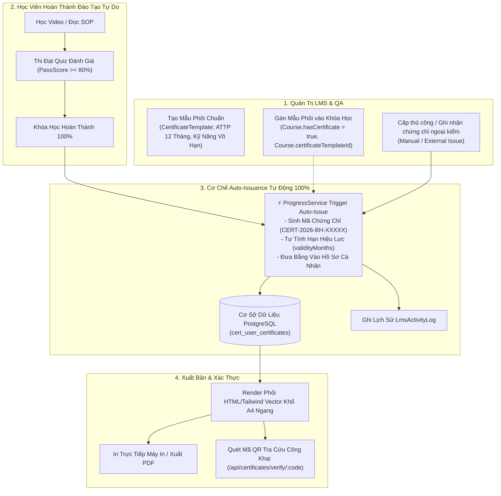
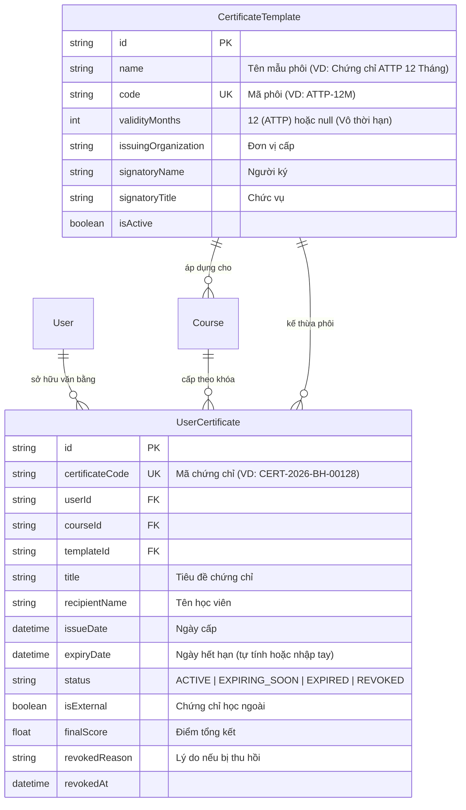

# Tài Liệu Kiến Trúc & Thiết Kế Hệ Thống: Quản Lý Chứng Chỉ & Tuân Thủ ATTP (LMS Certificate System)

> **Dự án**: LogiX Monorepo - Phân hệ Đào tạo LMS & Quản trị Tuân thủ F&B  
> **Tác giả**: LogiX Multi-Agent Orchestrator (`[Doc-Agent]`, `[BE-Agent]`, `[FE-Agent]`, `[QA-QC-Agent]`)  
> **Ngày ban hành**: 2026-09-08  
> **Trạng thái**: Đã triển khai hoàn chỉnh (Prisma PostgreSQL, Express REST API, Next.js 16 App Router)

---

## 1. Tổng Quan Nghiệp Vụ (Business Overview)

Trong chuỗi sản xuất và kinh doanh F&B (Chuỗi Bánh Ba Hưng, Nhà máy Trung tâm & Cửa hàng):
- **Chứng chỉ An Toàn Vệ Sinh Thực Phẩm (ATTP)** là điều kiện tiên quyết để nhân viên được phép vào ca sản xuất / bán hàng. Chứng chỉ này có thời hạn pháp lý (thường là **12 tháng**).
- **Chứng nhận Năng lực Nghề & Nghiệp vụ** (Làm bánh Âu, Barista, Thu ngân POS, Phục vụ) chứng minh nhân sự đã vượt qua kỳ thi đánh giá nội bộ.
- **Hệ thống Quản lý Chứng chỉ (`/lms/admin/certificates`)** cung cấp giải pháp toàn diện theo chuẩn Coursera/Udemy:
  - Tách bạch giữa **Mẫu Phôi Chuẩn (`CertificateTemplate`)** và **Bản Ghi Văn Bằng Cụ Thể (`UserCertificate`)**.
  - Tự động hóa 100% việc tính ngày hết hạn và sinh mã chứng chỉ độc nhất (`CERT-2026-BH-XXXXX`).
  - Render phôi in ấn sắc nét chuẩn khổ **A4 Ngang (Landscape)** kèm mã QR xác thực thật, không tiêu tốn tài nguyên lưu trữ PDF của máy chủ.

---

## 2. Sơ Đồ Kiến Trúc Luồng Cấp Phát & Xác Thực (Architecture Flow)

### 2.1. Cơ chế Auto-Issuance (Tự động cấp phát không cần duyệt thủ công)
- Khi học viên hoàn thành bài học cuối cùng dẫn tới `completionPercentage = 100%` trong [progress.service.ts](file:///c:/Projects/DigiFnb/Practice/LogiX/backend/src/modules/progress/progress.service.ts):
  1. Hệ thống tự động kiểm tra xem Khóa học có bật `hasCertificate = true` hoặc đã gắn `certificateTemplateId` hay chưa.
  2. Kiểm tra tránh trùng lặp: Nếu học viên chưa có chứng chỉ hợp lệ cho khóa học này, hệ thống sẽ tự động gọi `certificateService.issueCertificate()`.
  3. Tấm bằng được tạo ngay lập tức với mã số độc nhất, học viên có thể vào xem, in hoặc tải về mà **không cần bất kỳ sự can thiệp thủ công nào từ phía Admin**.

---

## 3. Cấu Trúc Database Schema (Prisma ORM)

---

## 4. Danh Sách API Endpoints (`/api/certificates`)

| Phương thức | Endpoint | Chức năng | Phân quyền |
| :--- | :--- | :--- | :--- |
| `GET` | `/api/certificates/stats` | Thống kê KPI: Tổng số, Còn hạn, Sắp hết hạn (&lt;30d), Đã thu hồi | Admin / Trainer |
| `GET` | `/api/certificates` | Danh sách chứng chỉ đã cấp (kèm tìm kiếm, phân trang, lọc status) | Admin / Trainer |
| `POST` | `/api/certificates/issue` | Cấp chứng chỉ mới (nội bộ hoặc ngoại kiểm) cho nhân sự | Admin / Trainer |
| `GET` | `/api/certificates/:id` | Chi tiết chứng chỉ để xem phôi | Admin / Trainer |
| `PATCH` | `/api/certificates/:id/revoke` | Thu hồi chứng chỉ kèm lý do | Admin / QA |
| `PATCH` | `/api/certificates/:id/renew` | Gia hạn ngày hết hạn cho chứng chỉ | Admin / Trainer |
| `DELETE` | `/api/certificates/:id` | Xóa bản ghi chứng chỉ | Admin Tổng |
| `GET` | `/api/certificates/templates` | Danh sách mẫu phôi chứng chỉ | Admin / Trainer |
| `POST` | `/api/certificates/templates` | Tạo mẫu phôi mới | Admin / Trainer |
| `PUT` | `/api/certificates/templates/:id`| Chỉnh sửa mẫu phôi | Admin / Trainer |
| `DELETE` | `/api/certificates/templates/:id`| Xóa mẫu phôi | Admin / Trainer |
| `GET` | `/api/certificates/verify/:code`| Tra cứu công khai xác thực tính thật giả qua mã QR | Public |

---

## 5. Cấu Trúc Frontend & Tuân Thủ `taste-skills`

Giao diện được xây dựng tại `frontend/src/features/lms/certificates-admin/`:
- **`CertificatesStatCards.tsx`**: 5 thẻ KPI trực quan hiển thị số liệu realtime.
- **`CertificatesToolbar.tsx`**: Thanh công cụ đầy đủ tìm kiếm (debounce 300ms), bộ lọc trạng thái, xuất dữ liệu và nút bấm mở modal.
- **`IssuedCertificatesTable.tsx`**: Data table hiển thị danh sách chứng chỉ, nút copy mã nhanh, badge trạng thái ATTP và menu hành động dropdown.
- **`CertificateTemplatesTable.tsx`**: Bảng quản lý phôi chuẩn tái sử dụng.
- **`CertificatePreviewModal.tsx`**: Khung phôi chứng chỉ vector cao cấp khổ A4 ngang (viền vàng hoàng gia, mộc bảo chứng đỏ, chữ ký số, mã QR xác thực và nút in `window.print()` chuẩn tỉ lệ).
- **`RevokeConfirmDialog.tsx`**: Dialog `<AlertDialog>` cảnh báo xác nhận trước khi thu hồi.
- **`RenewExpiryModal.tsx`**: Modal hỗ trợ gia hạn nhanh (+6 tháng, +1 năm, +2 năm).

---

## 6. Chính Sách Tối Ưu Hiệu Năng & Tài Nguyên

1. **Không lưu trữ file PDF rác trên Server**: Khung phôi được dựng bằng CSS/HTML vector và tự động xuất trực tiếp từ trình duyệt của người dùng khi cần in hoặc tải.
2. **Database Indexing**:
   - `@@index([userId])`: Xem hồ sơ chứng chỉ cá nhân của từng nhân viên.
   - `@@index([status])` & `@@index([expiryDate])`: Truy vấn nhanh danh sách nhân sự sắp hết hạn ATTP để xếp lịch đào tạo lại.
