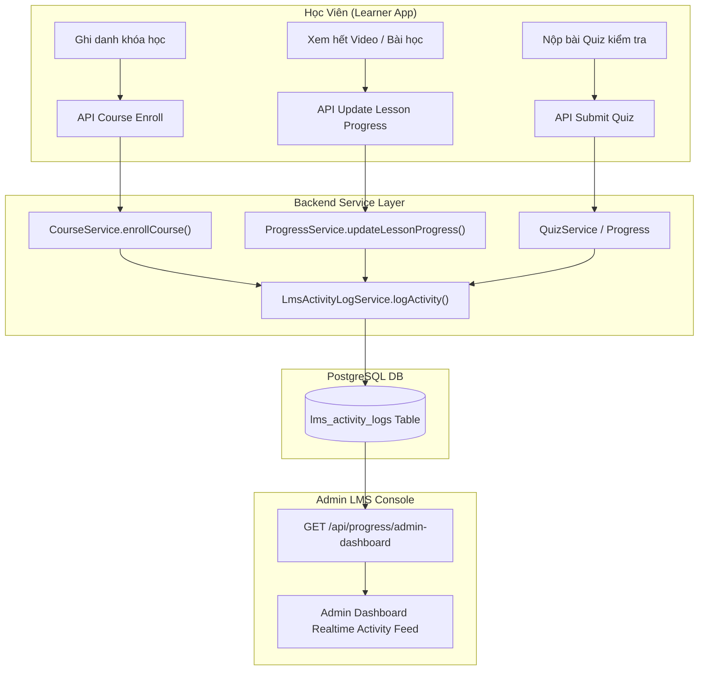

# Tài Liệu Thiết Kế & Hướng Dẫn Kỹ Thuật: LMS Activity Log (Audit System)

> **Dự án**: LogiX Monorepo - Phân hệ Đào tạo LMS  
> **Tác giả**: LogiX Multi-Agent Orchestrator (`[Doc-Agent]`, `[BE-Agent]`, `[FE-Agent]`, `[QA-QC-Agent]`)  
> **Ngày ban hành**: 2026-09-08  
> **Trạng thái**: Đã áp dụng trực tiếp vào Cơ sở dữ liệu (PostgreSQL via Supabase & Prisma ORM)

---

## 1. Tổng Quan & Động Lực (Overview & Motivation)

Trong hệ thống LMS doanh nghiệp F&B (LogiX / Ba Hưng):
- Hàng ngày có hàng trăm nhân sự ghi danh, học video, đọc tài liệu SOP, và làm bài thi đánh giá an toàn vệ sinh thực phẩm (ATTP).
- Trước đây, trang **Admin Dashboard** phải truy vấn gộp nhiều bảng (`quiz_attempts`, `enr_lesson_progress`, `enr_course_enrollments`) để tái tạo dòng sự kiện, gây tốn tài nguyên DB khi quy mô nhân sự mở rộng.
- **`LmsActivityLog`** ra đời nhằm cung cấp một hệ thống **Audit Log tập trung, phi chuẩn hóa (Denormalized Event Store)** ghi nhận mọi sự kiện đào tạo theo thời gian thực với tốc độ truy vấn cực nhanh ($O(1)$ read theo `createdAt DESC`).

---

## 2. Kiến Trúc Hoạt Động (Architecture Flow)



---

## 3. Cấu Trúc Prisma Schema & Database Design

### 3.1. Định nghĩa Enum `LmsActivityType`
```prisma
enum LmsActivityType {
  ENROLLED            // Học viên ghi danh (thủ công hoặc tự động qua Auto-Assign Rule)
  LESSON_STARTED      // Bắt đầu vào học bài
  LESSON_COMPLETED    // Hoàn thành bài học (Video / Article / Checklist)
  QUIZ_ATTEMPTED      // Nộp bài thi trắc nghiệm (Đạt / Chưa đạt kèm điểm)
  COURSE_COMPLETED    // Hoàn thành 100% tất cả bài học trong khóa
  CERTIFICATE_ISSUED  // Được cấp chứng chỉ hoàn thành
}
```

### 3.2. Bảng `lms_activity_logs`
```prisma
model LmsActivityLog {
  id           String          @id @default(uuid())
  userId       String
  user         User            @relation(fields: [userId], references: [id], onDelete: Cascade)

  courseId     String?
  course       Course?         @relation(fields: [courseId], references: [id], onDelete: SetNull)

  lessonId     String?
  lesson       Lesson?         @relation(fields: [lessonId], references: [id], onDelete: SetNull)

  activityType LmsActivityType
  actionTitle  String          // VD: "Hoàn thành bài kiểm tra", "Ghi danh khóa học"
  targetName   String          // VD: "Quy trình Sản xuất & Tiệt trùng Khâu Làm Kem"

  status       String          @default("SUCCESS") // 'SUCCESS', 'FAILED', 'ACTIVE', 'IN_PROGRESS'
  statusLabel  String?         // VD: "Đạt (92/100)", "Chưa đạt (65/80)", "Hoàn thành", "Đang học"

  metadata     Json?           // Lưu thông tin mở rộng: { score, duration, passScore, ruleSource }

  createdAt    DateTime        @default(now())

  @@index([userId])
  @@index([courseId])
  @@index([activityType, createdAt])
  @@index([createdAt])
  @@map("lms_activity_logs")
}
```

---

## 4. Đặc Tả Dữ Liệu Các Loại Sự Kiện (Event Payloads)

| Loại Sự Kiện (`activityType`) | `actionTitle` | `status` | `statusLabel` Mẫu | `metadata` Bổ Sung |
| :--- | :--- | :--- | :--- | :--- |
| `ENROLLED` | "Ghi danh khóa học" hoặc "Tự động gán khóa học" | `ACTIVE` | "Đang học" | `{ "ruleSource": "AUTO_RULE_POSITION" }` |
| `LESSON_COMPLETED` | "Hoàn thành bài học Video" / "Hoàn thành bài học" | `SUCCESS` | "Hoàn thành" | `{ "durationSeconds": 600 }` |
| `QUIZ_ATTEMPTED` | "Hoàn thành bài kiểm tra" / "Kiểm tra không đạt" | `SUCCESS` / `FAILED` | "Đạt (92/100)" / "Chưa đạt (65/80)" | `{ "score": 92, "passScore": 80, "attempt": 1 }` |
| `COURSE_COMPLETED` | "Hoàn thành toàn bộ khóa học" | `SUCCESS` | "Đạt chứng chỉ" | `{ "totalLessons": 12, "scoreAvg": 95 }` |
| `CERTIFICATE_ISSUED` | "Cấp chứng chỉ hoàn thành" | `SUCCESS` | "Xuất sắc" | `{ "certCode": "CERT-2026-001" }` |

---

## 5. Hướng Dẫn Sử Dụng Code Cho Developers

### 5.1. Ghi log sự kiện từ bất kỳ Service nào
Service `LmsActivityLogService` được thiết kế theo nguyên lý **Non-blocking Safe Execution** (lỗi ghi log không bao giờ làm crash transaction chính):

```typescript
import { lmsActivityLogService } from '../activity-logs/activity-log.service'
import { LmsActivityType } from '@prisma/client'

// Ví dụ: Ghi log khi hoàn thành bài quiz
await lmsActivityLogService.logActivity({
  userId: user.id,
  courseId: course.id,
  lessonId: lesson.id,
  activityType: LmsActivityType.QUIZ_ATTEMPTED,
  actionTitle: isPassed ? 'Hoàn thành bài kiểm tra' : 'Kiểm tra không đạt',
  targetName: `${quiz.title} (${course.title})`,
  status: isPassed ? 'SUCCESS' : 'FAILED',
  statusLabel: isPassed ? `Đạt (${score}%)` : `Chưa đạt (${score}%)`,
  metadata: {
    score,
    passScore: quiz.passScore,
    attemptNumber: attempt.attemptNumber,
  },
})
```

### 5.2. Lấy danh sách hoạt động gần đây cho Dashboard
```typescript
import { lmsActivityLogService } from '../activity-logs/activity-log.service'

// Lấy 7 hoạt động mới nhất kèm thông tin Avatar & User
const recentActivities = await lmsActivityLogService.getRecentActivities(7)
```

---

## 6. Chiến Lược Tối Ưu Hiệu Năng & Indexing

1. **Composite Indexing**: 
   - `@@index([createdAt])`: Tối ưu hóa truy vấn `ORDER BY createdAt DESC LIMIT 10` cho Admin Dashboard trong thời gian $< 5ms$.
   - `@@index([userId])`: Phục vụ xem lịch sử cá nhân học tập của từng nhân sự.
   - `@@index([activityType, createdAt])`: Lọc theo loại hoạt động đào tạo.
2. **Graceful Fallback Mode**:
   - Trong `progressService.getAdminDashboardStats()`, nếu bảng `lms_activity_logs` chưa có bản ghi (ví dụ DB ban đầu sau khi seed), hệ thống tự động fallback sang cơ chế gộp các bảng lịch sử cũ để giao diện không bao giờ bị gián đoạn.
