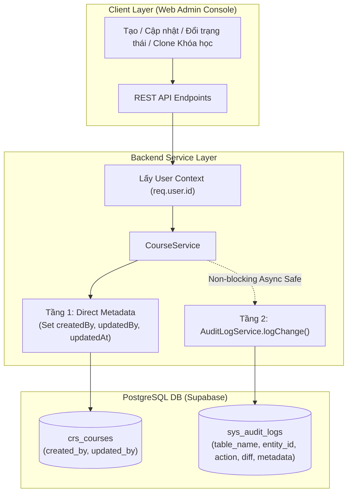

# Tài Liệu Thiết Kế Kỹ Thuật: Hệ Thống System Audit Log (Audit Trail & Change Tracking)

> **Dự án**: LogiX Monorepo - Phân hệ Quản trị & Đào tạo (LMS)  
> **Tác giả**: LogiX Multi-Agent Orchestrator (`[Doc-Agent]`, `[BE-Agent]`, `[QA-QC-Agent]`)  
> **Ngày ban hành**: 2026-09-16  
> **Trạng thái**: Đã áp dụng trực tiếp vào Cơ sở dữ liệu PostgreSQL (Supabase) và Backend Express API  
> **Độ tương thích C#**: Chuẩn hóa 100% theo kiến trúc C# .NET 8 (`erp-corporation-api-v2`)

---

## 1. Mục Đích & Bối Cảnh (Context & Motivation)

Trong hệ thống chuỗi F&B (Ba Hưng Bakery & Cafe), các nội dung đào tạo và quy trình SOP (Quy trình sản xuất, An toàn vệ sinh thực phẩm - ATTP) mang tính tuân thủ pháp lý và vận hành nghiêm ngặt.
- **Yêu cầu nghiệp vụ**: Cần nắm bắt chính xác **Ai đã tạo**, **Ai đã sửa đổi**, **Thời gian sửa đổi**, và **Chi tiết các trường thay đổi (Field-by-Field Diff: Giá trị cũ $\rightarrow$ Giá trị mới)** của từng Khóa học/Bài học/Phân quyền.
- **Định hướng chuyển giao C#**: Sau khi hoàn thiện, toàn bộ backend LogiX sẽ được refactor sang C# (.NET 8 Clean Architecture: `erp-corporation-api-v2`). Do đó, cấu trúc dữ liệu và quy ước đặt tên phải khớp 100% với `AuditableEntityBase<Guid>` và `AuditLog` trong C#.

---

## 2. Kiến Trúc Dữ Liệu 2 Tầng (Hybrid 2-Tier Architecture)



### 2.1. Tầng 1: Direct Column Metadata (Hiển thị tức thì $O(1)$)
- Bảng `crs_courses` được bổ sung:
  - `createdBy`: `UUID` (FK $\rightarrow$ `auth_users.id`, map `"created_by"`)
  - `updatedBy`: `UUID` (FK $\rightarrow$ `auth_users.id`, map `"updated_by"`)
  - `createdAt`: `DateTime` (map `"created_at"`)
  - `updatedAt`: `DateTime` (map `"updated_at"`)
- Khi query danh sách khóa học (`GET /api/courses`), API tự động populate `createdByUser` và `updatedByUser` (id, fullName, email) giúp Frontend hiển thị người tạo/người cập nhật mà không tốn thêm query vào bảng log.

### 2.2. Tầng 2: Bảng Audit Log Trung Tâm (`sys_audit_logs`)
- Mô hình Generic tập trung tương thích hoàn toàn với C# `Domain/Entities/Audit/AuditLog.cs`:

```prisma
model AuditLog {
  id        String   @id @default(uuid())
  tableName String   @map("table_name") // 'crs_courses', 'crs_lessons', 'auth_users'
  entityId  String   @map("entity_id")  // UUID bản ghi mục tiêu
  action    String   // 'CREATE', 'UPDATE', 'DELETE', 'STATUS_CHANGE', 'CLONE', 'SYNC'
  fieldName String?  @map("field_name") // Tên trường thay đổi
  oldValue  String?  @map("old_value")  // Giá trị cũ
  newValue  String?  @map("new_value")  // Giá trị mới
  diff      Json?    // Structured JSON diff: { [field]: { old, new } }
  metadata  Json?    // Dữ liệu mở rộng (IP, User Agent, reason, sourceCourseId...)

  userId    String?  @map("user_id")
  user      User?    @relation(fields: [userId], references: [id], onDelete: SetNull)

  createdAt DateTime @default(now()) @map("created_at")

  @@index([tableName, entityId])
  @@index([userId])
  @@index([createdAt])
  @@map("sys_audit_logs")
}
```

---

## 3. So Sánh Chuẩn Hóa Với C# .NET 8 (`erp-corporation-api-v2`)

| Khái niệm | C# .NET 8 (`erp-corporation-api-v2`) | LogiX Prisma / TypeScript | Ghi chú |
| :--- | :--- | :--- | :--- |
| **Base Class** | `AuditableEntityBase<Guid>` | `model Course` | C# kế thừa qua OOP, Prisma khai báo trường |
| **Người tạo** | `Guid? CreatedBy` | `createdBy String? @map("created_by")` | Khớp 100% cột DB |
| **Người sửa** | `Guid? UpdatedBy` | `updatedBy String? @map("updated_by")` | Khớp 100% cột DB |
| **Thời gian tạo** | `DateTimeOffset CreatedAt` | `createdAt DateTime @default(now())` | Khớp 100% cột DB |
| **Thời gian sửa** | `DateTimeOffset? ModifiedAt` | `updatedAt DateTime @updatedAt` | Khớp 100% cột DB |
| **Bảng Audit Log** | `AuditLog` (`TableName`, `EntityId`, `Action`, `UserId`, `Timestamp`) | `sys_audit_logs` | Đồng bộ 100% cấu trúc và kiểu dữ liệu |

---

## 4. Danh Sách API Endpoints Hỗ Trợ

| Method | Endpoint | Mô tả | Quyền truy cập |
| :--- | :--- | :--- | :--- |
| `GET` | `/api/audit-logs?tableName=crs_courses&entityId={id}` | Lấy toàn bộ dòng lịch sử thay đổi (Timeline) của một khóa học | Authenticated User |
| `GET` | `/api/courses` | Lấy danh sách khóa học (Đã kèm `createdByUser` & `updatedByUser`) | Public / Authenticated |
| `GET` | `/api/courses/{id}` | Lấy chi tiết khóa học (Đã kèm `createdByUser` & `updatedByUser`) | Public / Authenticated |
