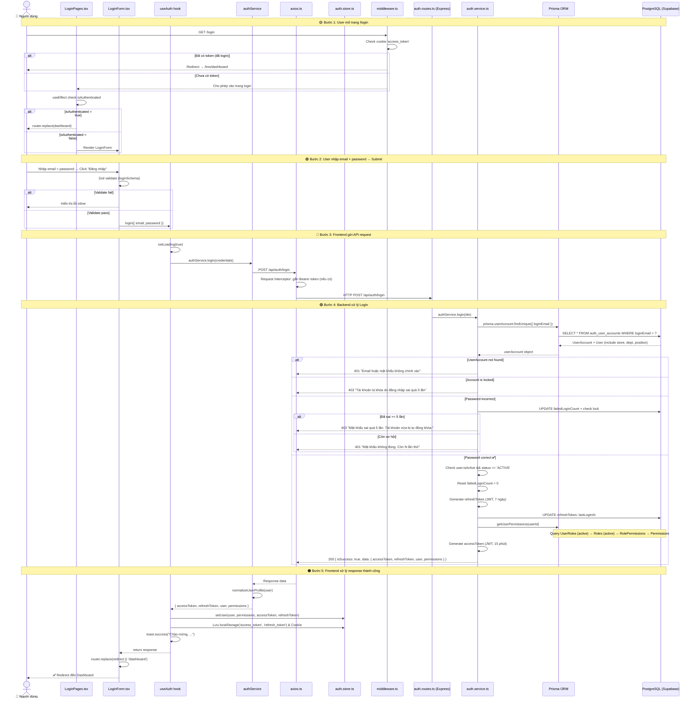
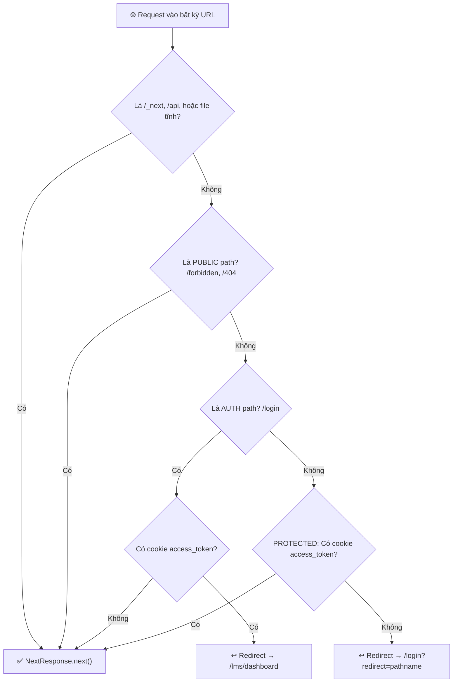
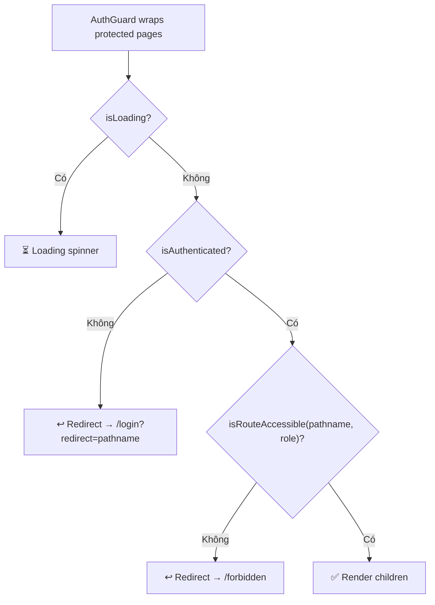
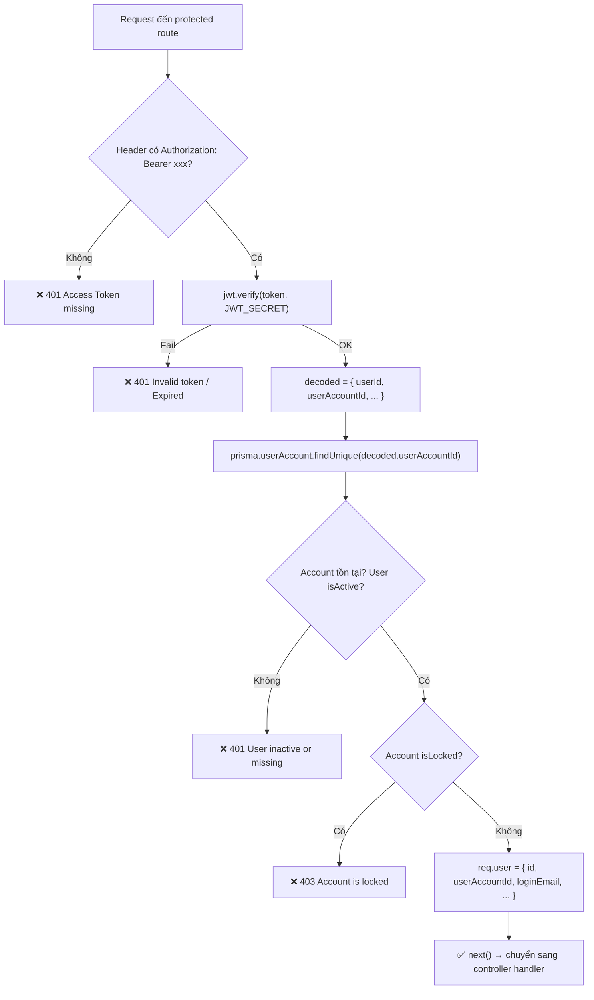
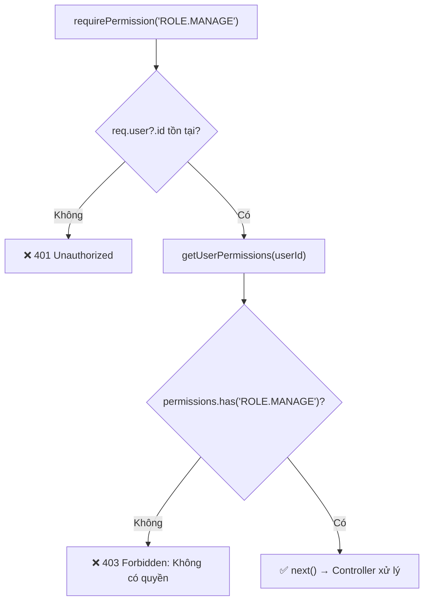
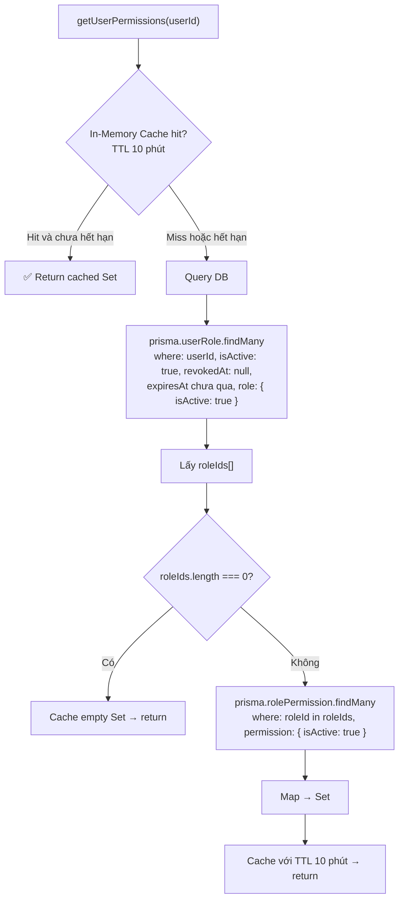
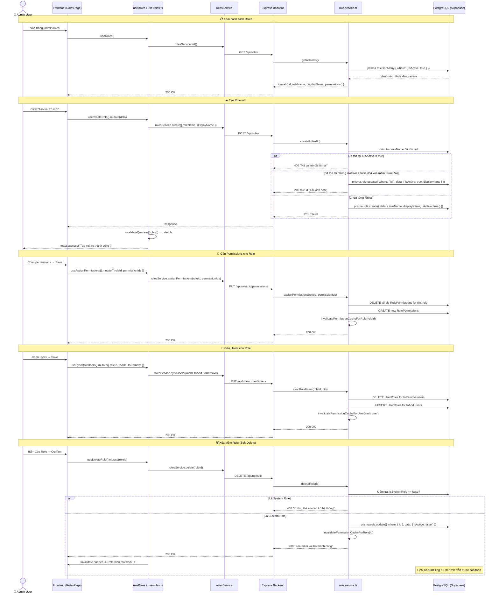
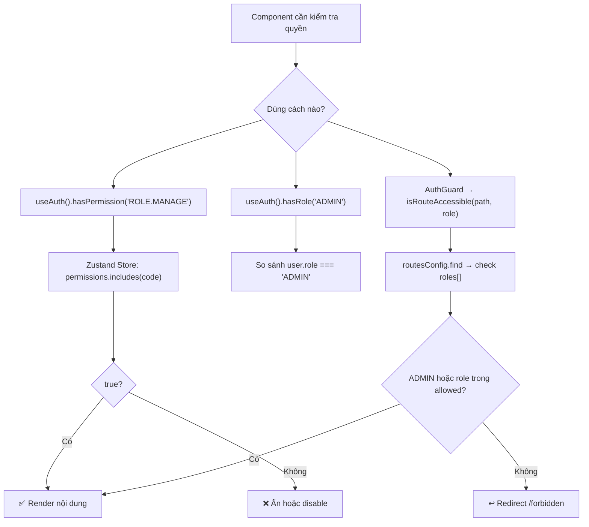
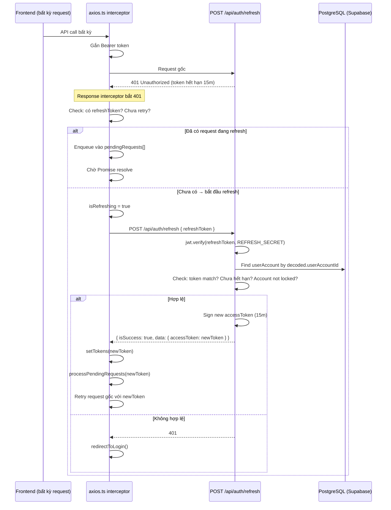

# 📚 LogiX LMS — Hướng dẫn Workflow Toàn diện cho Developer & Intern

> Tài liệu này giải thích chi tiết **toàn bộ flow** của các chức năng cốt lõi: **Authentication (Login/JWT)**, **RBAC (Roles & Permissions)**, **Cơ chế Xóa mềm (Soft Delete)**, và **Hệ thống Modular Swagger API Documentation**, kèm tổng hợp cập nhật kiến trúc mới nhất (11/08/2026).

---

## 📁 Cấu trúc Tổng quan Dự án (Modular Feature-based Architecture)

```
LogiX/
├── backend/                             # Express.js + Prisma + PostgreSQL (Supabase) + Swagger
│   ├── prisma/
│   │   ├── schema.prisma                # 🗃️ Database Schema (15 models chuẩn ERP-v2)
│   │   ├── client/                      # ⚡ Generated Type-safe Prisma Client (Local output)
│   │   └── migrations/                  # 📜 Versioned PostgreSQL Migrations cho Supabase
│   │       ├── 20260811000000_init_postgresql_schema/migration.sql
│   │       └── migration_lock.toml      # Khóa provider: postgresql
│   └── src/
│       ├── config/
│       │   ├── prisma.ts                # Prisma Client instance
│       │   └── swagger.ts               # 📘 Modular Swagger Root Config & Setup
│       ├── common/
│       │   ├── errors/app.error.ts      # Custom Error Classes (400, 401, 403, 404, 409)
│       │   ├── responses/api-response.ts # Standard API Response Format (ApiResponse)
│       │   ├── middlewares/             # Global Error Handler & Zod Validation Middleware
│       │   └── utils/async-handler.ts   # Async route wrapper
│       ├── middlewares/
│       │   ├── auth.middleware.ts       # JWT verify + gắn req.user
│       │   └── permission.middleware.ts # Kiểm tra quyền hạn RBAC (requirePermission)
│       ├── modules/                     # 📦 Feature-based Modular Architecture
│       │   ├── auth/                    # 🔐 Auth Module
│       │   │   ├── auth.controller.ts   # Xử lý request HTTP & gọi service
│       │   │   ├── auth.routes.ts       # Định nghĩa endpoints Auth
│       │   │   ├── auth.service.ts      # Logic đăng nhập, bcrypt, jwt, failedCount
│       │   │   ├── auth.dto.ts          # Zod validation schemas
│       │   │   └── auth.swagger.ts      # 📘 Swagger OpenAPI docs cho Auth
│       │   ├── roles/                   # 🎭 Role Management Module (Soft Delete)
│       │   │   ├── role.controller.ts
│       │   │   ├── role.routes.ts
│       │   │   ├── role.service.ts      # Soft Delete (isActive: false) & Cache invalidation
│       │   │   ├── role.dto.ts
│       │   │   └── role.swagger.ts      # 📘 Swagger OpenAPI docs cho Roles
│       │   ├── permissions/             # 🔑 Permissions Catalog
│       │   │   ├── permission.controller.ts
│       │   │   ├── permission.routes.ts
│       │   │   └── permission.swagger.ts
│       │   ├── departments/             # 🏢 Department Module (Soft Delete)
│       │   │   ├── department.controller.ts
│       │   │   ├── department.routes.ts
│       │   │   ├── department.service.ts
│       │   │   └── department.swagger.ts
│       │   ├── users/                   # 👥 Users & Employees Module
│       │   │   ├── user.controller.ts
│       │   │   ├── user.routes.ts
│       │   │   ├── user.service.ts
│       │   │   └── user.swagger.ts
│       │   ├── job-levels/              # 🎖️ Job Levels / Positions Module (Soft Delete)
│       │   │   ├── job-level.controller.ts
│       │   │   ├── job-level.routes.ts
│       │   │   ├── job-level.service.ts
│       │   │   └── job-level.swagger.ts
│       │   ├── custom-fields/           # 🧩 Dynamic Custom Fields
│       │   │   └── custom-field.swagger.ts
│       │   ├── courses/                 # 🎓 LMS Courses Module
│       │   │   ├── course.controller.ts
│       │   │   ├── course.routes.ts
│       │   │   ├── course.service.ts
│       │   │   └── course.swagger.ts
│       │   ├── lessons/                 # 📖 LMS Lessons Module
│       │   │   └── lesson.swagger.ts
│       │   ├── quizzes/                 # ❓ LMS Quizzes Module
│       │   │   └── quiz.swagger.ts
│       │   └── progress/                # 📊 Learning Progress Dashboard
│       │       └── progress.swagger.ts
│       ├── services/
│       │   └── permission.service.ts    # In-Memory Cache & Query User Permissions
│       ├── index.ts                     # Entry point Express app (Mount Swagger UI + Routes)
│       └── seed.ts                      # Dữ liệu mẫu ban đầu
│
├── frontend/                            # Next.js 15 + React + TailwindCSS + Zustand + TanStack Query
│   ├── middleware.ts                    # 🛡️ Next.js Edge Middleware (Cookie route guard)
│   └── src/
│       ├── config/
│       │   ├── api-routes.ts            # Map URL các API endpoints
│       │   ├── route-path.ts            # Map URL các trang frontend
│       │   └── routes/                  # Role-based route access config
│       ├── lib/
│       │   ├── axios.ts                 # Axios instance + interceptors + auto refresh
│       │   └── api.ts                   # Utility wrapper cho API calls
│       ├── stores/
│       │   └── auth.store.ts            # Zustand global auth state + persist
│       └── features/
│           ├── auth/                    # 🔐 Authentication feature module
│           │   ├── auth.utils.ts        # JWT decode utilities
│           │   ├── schemas/login.schema.ts # Zod validation
│           │   ├── types/auth.types.ts  # Role enum, User type
│           │   ├── services/auth.service.ts # API calls (login, me, logout)
│           │   ├── hooks/use-auth.ts    # React hook (login, logout, hasPermission)
│           │   ├── components/
│           │   │   ├── login/LoginForm.tsx # Form component
│           │   │   └── AuthGuard.tsx    # Client-side route guard
│           │   └── pages/LoginPages.tsx # Login page layout
│           └── admin/                   # 👑 Admin feature module
│               ├── types/admin.types.ts
│               ├── services/roles.service.ts
│               ├── services/permissions.service.ts
│               ├── hooks/use-roles.ts
│               └── hooks/use-permissions.ts
```

---

## 🏗️ PHẦN 1: DATABASE SCHEMA & MÔ HÌNH RBAC (Prisma)

### 1.1 Quan hệ giữa các bảng Auth & Cơ cấu tổ chức

```mermaid
erDiagram
    auth_users ||--o| auth_user_accounts : "1 User có 1 Account"
    auth_users ||--o{ auth_user_roles : "1 User có nhiều Role"
    auth_roles ||--o{ auth_user_roles : "1 Role gán cho nhiều User"
    auth_roles ||--o{ auth_role_permissions : "1 Role có nhiều Permission"
    auth_permissions ||--o{ auth_role_permissions : "1 Permission thuộc nhiều Role"
    org_departments ||--o{ auth_users : "1 Phòng ban có nhiều User"
    org_positions ||--o{ auth_users : "1 Cấp bậc có nhiều User"

    auth_users {
        uuid id PK
        string employeeCode UK
        string fullName
        string email UK
        string status "ACTIVE | LOCKED | PENDING"
        boolean isActive "Xóa mềm user"
        string userType "EMPLOYEE | CUSTOMER | SYSTEM_ADMIN"
        string employmentStatus "PROBATION | OFFICIAL | TEMPORARY | RESIGNED"
        uuid storeId FK
        uuid departmentId FK
        uuid positionId FK
    }

    auth_user_accounts {
        uuid id PK
        uuid userId FK_UK "1-to-1 với User"
        string loginEmail UK
        string passwordHash "bcrypt hash"
        boolean isLocked "khóa khi sai 5 lần"
        int failedLoginCount "đếm số lần sai pass"
        string refreshToken "JWT refresh token"
        datetime refreshTokenExpiresAt
        datetime lastLoginAt
    }

    auth_roles {
        uuid id PK
        string roleName UK "VD: ADMIN, STUDENT"
        string displayName "Tên hiển thị"
        boolean isSystemRole "Không thể xóa vai trò hệ thống"
        boolean bypassDataScope "Bỏ qua data scope"
        boolean isActive "Xóa mềm: false khi xóa"
    }

    auth_permissions {
        uuid id PK
        string permissionCode UK "VD: USER.READ, COURSE.CREATE"
        string permissionName
        string module "HRM, LMS, SYSTEM, ATTP"
        string action "READ, CREATE, UPDATE, MANAGE"
        string resource "USER, COURSE, ROLE"
        boolean isActive
    }

    auth_user_roles {
        uuid id PK
        uuid userId FK
        uuid roleId FK
        datetime assignedAt
        datetime expiresAt "nullable - hết hạn role"
        datetime revokedAt "nullable - bị thu hồi"
        boolean isActive
    }

    auth_role_permissions {
        uuid id PK
        uuid roleId FK
        uuid permissionId FK
        datetime assignedAt
    }

    org_departments {
        uuid id PK
        string deptCode UK
        string deptName
        boolean isFactoryDept
        boolean isActive "Xóa mềm phòng ban"
    }

    org_positions {
        uuid id PK
        string positionCode UK
        string positionName
        int levelRank
        boolean isActive "Xóa mềm cấp bậc"
    }
```

### 1.2 Giải thích thiết kế & Nguyên tắc Xóa mềm (Soft Delete)

> **1. Tại sao tách `User` và `UserAccount`?**
> - `User` = hồ sơ nhân sự (tên, email, chức vụ, phòng ban) — có thể tồn tại TRƯỚC khi có tài khoản đăng nhập.
> - `UserAccount` = thông tin đăng nhập (email login, password hash, refresh token) — tạo SAU khi cấp quyền đăng nhập.
> - Quan hệ **1-to-1** (`userId` là `@unique` trong `UserAccount`).

> **2. Mô hình RBAC (Role-Based Access Control):**
> - `User` ↔ `Role`: quan hệ **many-to-many** qua bảng trung gian `UserRole`.
> - `Role` ↔ `Permission`: quan hệ **many-to-many** qua bảng trung gian `RolePermission`.
> - Khi kiểm tra quyền: `User → UserRoles (active) → Roles (active) → RolePermissions → Permissions (active)`.

> **3. Chuẩn hóa Xóa mềm (Soft Delete):**
> - Các thực thể cốt lõi (`Role`, `Department`, `Position`, `User`) đều có cột `isActive Boolean @default(true)`.
> - Khi xóa, API chỉ cập nhật `isActive = false` thay vì xóa vĩnh viễn khỏi Database.
> - Frontend tự động ẩn các bản ghi `isActive = false` thông qua bộ lọc backend.
> - Khi tạo lại một mã đã xóa mềm, hệ thống tự động **tái kích hoạt (`isActive = true`)** mà không bị lỗi Unique Constraint.

---

## 🔐 PHẦN 2: LOGIN FLOW (Chi tiết từng bước)

### 2.1 Workflow tổng quan



---

### 2.2 Phân tích chi tiết từng file & Dòng mã thực thi

#### Bước 1: Schema Validation (Frontend)

**File:** `frontend/src/features/auth/schemas/login.schema.ts`

```typescript
// Dùng Zod để validate form trước khi gửi API
export const loginSchema = z.object({
  email: z.string().email('Email không hợp lệ'),
  password: z.string().min(6, 'Mật khẩu tối thiểu 6 ký tự'),
})
```

#### Bước 2: Form Component submit

**File:** `frontend/src/features/auth/components/login/LoginForm.tsx`

```typescript
// react-hook-form + Zod resolver → validate → gọi login()
const onSubmit = async (data: LoginFormValues) => {
  await login(data)                                    // ← gọi useAuth().login
  router.replace(redirect ?? '/dashboard')             // ← redirect sau login
}
```

#### Bước 3: useAuth Hook xử lý logic

**File:** `frontend/src/features/auth/hooks/use-auth.ts`

```typescript
const login = async (credentials) => {
  setLoading(true)
  const response = await authService.login(credentials) // ← gọi service
  setUser(normalizedUser, perms, accessToken, refreshToken) // ← lưu vào Zustand
  toast.success(`Chào mừng, ${user.fullName}!`)
}
```

#### Bước 4: Auth Service gọi API

**File:** `frontend/src/features/auth/services/auth.service.ts`

```typescript
login: async (credentials) => {
  const response = await apiCall.post('/api/auth/login', {
    loginEmail: credentials.email,
    password: credentials.password,
  })
  response.user = normalizeUserProfile(response.user) // ← chuẩn hóa
  return response
}
```

#### Bước 5: Axios Interceptors & Refresh Token Queue

**File:** `frontend/src/lib/axios.ts`

```typescript
// REQUEST INTERCEPTOR: Tự động gắn Bearer token vào mọi request
api.interceptors.request.use((config) => {
  const token = localStorage.getItem('access_token')
  if (token) config.headers.Authorization = `Bearer ${token}`
  return config
})

// RESPONSE INTERCEPTOR: Nếu gặp 401 → tự động gọi refresh token → retry request gốc
api.interceptors.response.use(
  (response) => response,
  async (error) => {
    if (error.status === 401 && !originalRequest._retry) {
      const newToken = await handleTokenRefresh()
      originalRequest.headers.Authorization = `Bearer ${newToken}`
      return api(originalRequest) // retry!
    }
  }
)
```

#### Bước 6: Backend Route & Service xử lý Login

**Files:** `backend/src/modules/auth/auth.routes.ts` & `backend/src/modules/auth/auth.service.ts`

Flow xử lý trong Backend Service:
```
1. Extract body: { loginEmail, email, password }
2. Query DB: prisma.userAccount.findUnique({ where: { loginEmail } }) + include User/Store/Dept/Position
3. Check: Account tồn tại? → Nếu không: throw UnauthorizedError('Email hoặc mật khẩu không chính xác') [401]
4. Check: isLocked? → Nếu có: throw ForbiddenError('Tài khoản bị khóa do đăng nhập sai quá 5 lần') [403]
5. Check: bcrypt.compare(password, passwordHash) → Nếu sai:
   - Tăng failedLoginCount lên 1
   - Nếu failedCount >= 5: khóa tài khoản isLocked = true → throw ForbiddenError
   - Nếu còn cơ hội: throw UnauthorizedError(`Còn ${5 - failedCount} lần thử`)
6. Check: user.isActive && status === 'ACTIVE' → Nếu không: throw ForbiddenError
7. Reset failedLoginCount = 0, update lastLoginAt
8. Generate refreshToken (7d) → lưu vào DB
9. getUserPermissions(userId) → query UserRoles (active) → Roles (active) → Permissions
10. Generate accessToken (15m) → chứa payload { userId, email, employeeCode, fullName }
11. Return: { isSuccess: true, data: { accessToken, refreshToken, user, permissions } }
```

#### Bước 7: Zustand Store lưu trữ state & Token Storage

**File:** `frontend/src/stores/auth.store.ts`

```typescript
setUser: (user, permissions, accessToken, refreshToken) => {
  localStorage.setItem('access_token', accessToken)   // cho axios interceptor
  localStorage.setItem('refresh_token', refreshToken)  // cho refresh flow
  setTokenCookie(accessToken)                          // cho Next.js middleware
  set({ user, permissions, isAuthenticated: true })    // Zustand state
}
// Zustand persist: tự động lưu { user, permissions, isAuthenticated } vào localStorage('auth-storage')
```

> **Tại sao cần lưu token ở cả 3 nơi?**
>
> | Nơi lưu trữ | Mục đích sử dụng |
> | :--- | :--- |
> | `localStorage('access_token')` | Axios interceptor đọc từ Client để gắn `Authorization: Bearer <token>` vào request. |
> | `localStorage('refresh_token')` | Dùng khi Access Token hết hạn (401) để tự động gọi `POST /api/auth/refresh`. |
> | `cookie('access_token')` | Next.js Edge Middleware đọc ở tầng Server-Side (vì SSR không thể truy cập localStorage). |
> | Zustand persist (`auth-storage`) | Rehydrate trạng thái người dùng (User profile, danh sách Permissions) khi F5/reload page. |

---

## 🛡️ PHẦN 3: MIDDLEWARE & SECURITY GUARDS

### 3.1 Next.js Edge Middleware (Server-side)

**File:** `frontend/middleware.ts`



### 3.2 AuthGuard Component (Client-side)

**File:** `frontend/src/features/auth/components/AuthGuard.tsx`



### 3.3 Backend Auth Middleware

**File:** `backend/src/middlewares/auth.middleware.ts`



### 3.4 Permission Middleware

**File:** `backend/src/middlewares/permission.middleware.ts`



---

## 👑 PHẦN 4: ROLES & RBAC FLOW (Kèm Xóa Mềm)

### 4.1 Mô hình phân quyền


### 4.2 Permission Service (In-Memory Caching Layer)

**File:** `backend/src/services/permission.service.ts`



> **Khi nào cache bị invalidate?**
> - `invalidatePermissionCacheForRole(roleId)` — gọi khi: update role, xóa mềm role, assign permissions, sync users.
> - `invalidatePermissionCacheForUser(userId)` — gọi khi: logout, user bị remove khỏi role, khóa tài khoản.

### 4.3 Role Management & Soft Delete Flow



### 4.4 Frontend kiểm tra quyền tại Client



---

## 🔄 PHẦN 5: TOKEN REFRESH FLOW



---

## 📘 PHẦN 6: HỆ THỐNG MODULAR SWAGGER & API DOCUMENTATION

### 6.1 Cấu trúc Modular OpenAPI 3.0

Hệ thống tài liệu Swagger được chia nhỏ thành từng file `*.swagger.ts` độc lập tương ứng với mỗi module trong `backend/src/modules/`:

```
backend/src/
├── config/
│   └── swagger.ts                    <-- File gốc gom hợp nhất tất cả modules
└── modules/
    ├── auth/auth.swagger.ts          <-- Endpoints Login, Refresh, Me, Logout
    ├── roles/role.swagger.ts         <-- Endpoints CRUD Roles, Assign Perms, Sync Users (Soft Delete)
    ├── permissions/permission.swagger.ts
    ├── departments/department.swagger.ts (Soft Delete)
    ├── users/user.swagger.ts
    ├── job-levels/job-level.swagger.ts (Soft Delete)
    ├── custom-fields/custom-field.swagger.ts
    ├── courses/course.swagger.ts
    ├── lessons/lesson.swagger.ts
    ├── quizzes/quiz.swagger.ts
    └── progress/progress.swagger.ts
```

### 6.2 Truy cập & Quy trình Test API trực tiếp trên Swagger UI

1. **Địa chỉ truy cập:**
   - **`http://localhost:5000`** (Tự động redirect sang Swagger UI).
   - **`http://localhost:5000/api-docs`** (Giao diện Swagger tương tác).
   - **`http://localhost:5000/api-docs.json`** (OpenAPI JSON Spec).
2. **Quy trình Authorize JWT Bearer Token:**
   - Mở `POST /api/auth/login` -> Nhập `admin@bahung.com` / `password123` -> Bấm **Execute**.
   - Copy mã `accessToken` từ kết quả JSON.
   - Bấm nút **Authorize 🔓** ở góc trên bên phải màn hình -> Dán token vào -> Bấm **Authorize**.
   - Toàn bộ các API yêu cầu quyền hạn sẽ tự động gửi kèm Token khi bạn bấm Test.

---

## 📊 PHẦN 7: TỔNG HỢP CÁC CẬP NHẬT KIẾN TRÚC MỚI (11/08/2026)

| Hạng mục cải tiến | Trạng thái | Chi tiết kỹ thuật |
| :--- | :---: | :--- |
| **Tích hợp Swagger UI** |  Hoàn thành | Cài đặt `swagger-ui-express`, `swagger-jsdoc` và render tại `/api-docs`. |
| **Modular Swagger Refactor** |  Hoàn thành | Tách 11 file `*.swagger.ts` vào từng module, rút gọn `swagger.ts` từ 600 xuống ~140 dòng. |
| **Cơ chế Xóa mềm (Soft Delete)** |  Hoàn thành | Triển khai `isActive: false` cho `Roles`, `Departments`, `Job Levels`, `Users`. |
| **Tái kích hoạt thông minh** |  Hoàn thành | Khi tạo lại mã trùng với bản ghi đã xóa mềm, tự động `isActive: true` thay vì lỗi Unique DB. |
| **Prisma Local Client Generator** |  Hoàn thành | Đổi generator client output sang `./client` để triệt tiêu lỗi khóa file DLL trên Windows. |
| **Chuẩn hóa PostgreSQL Migration** |  Hoàn thành | Khởi tạo migration PostgreSQL chính thức `20260811000000_init_postgresql_schema` đồng bộ với Supabase. |

---

## 🔑 PHẦN 8: SEED DATA, TEST ACCOUNTS & QUICK REFERENCE

### 8.1 Dữ liệu mẫu ban đầu (`backend/src/seed.ts`)

| Thứ tự | Data | Chi tiết |
|:------:|------|---------|
| 1 | **Org Structure** | 2 Stores (CH-QUAN1, XUONG-KEM), 2 Departments (Bán hàng, Làm kem), 2 Positions (QLCH, NV-BAN-HANG) |
| 2 | **Permissions** | 7 permissions: `USER.READ`, `USER.CREATE`, `USER.LOCK`, `ROLE.MANAGE`, `COURSE.READ`, `COURSE.CREATE`, `ATTP.VIEW` |
| 3 | **Roles** | `ADMIN` (all 7 permissions, system role), `STUDENT` (chỉ `COURSE.READ`) |
| 4 | **Users** | `admin@bahung.com` (ADMIN role), `alex@logix.com` (STUDENT role) — password mặc định: `password123` |
| 5 | **Sample Course** | 1 Category → 1 Course → 1 Module → 1 Lesson + enrollment cho alex |

### 8.2 Tài khoản kiểm thử mặc định:

| Email | Password | Role | Permissions |
| :--- | :--- | :--- | :--- |
| `admin@bahung.com` | `password123` | **ADMIN** | Tất cả 7 quyền (`USER.READ`, `USER.CREATE`, `USER.LOCK`, `ROLE.MANAGE`, `COURSE.READ`, `COURSE.CREATE`, `ATTP.VIEW`) |
| `alex@logix.com` | `password123` | **STUDENT** | Chỉ có `COURSE.READ` |

### 8.3 Bảo vệ Route & Kiểm tra Quyền nhanh:

```typescript
// Backend (Express Route)
router.post('/courses', authenticateToken, requirePermission('COURSE.CREATE'), courseController.createCourse)

// Frontend (Component React)
const { hasPermission } = useAuth()
{hasPermission('ROLE.MANAGE') && <Button onClick={handleOpenModal}>Tạo Vai Trò</Button>}
```

### Test accounts

| Email | Password | Role | Permissions |
|-------|----------|------|-------------|
| `admin@bahung.com` | `password123` | ADMIN | Tất cả (7) |
| `alex@logix.com` | `password123` | STUDENT | COURSE.READ |
