# 📚 LogiX LMS — Hướng dẫn Workflow Toàn diện cho Intern

> Tài liệu này giải thích chi tiết **toàn bộ flow** của 2 chức năng chính: **Login** và **Roles (RBAC)**, cùng với tổng hợp các thay đổi trong ngày 07/08/2026.

---

## 📁 Cấu trúc Tổng quan Dự án

```
LogiX/
├── backend/                  # Express.js + Prisma + PostgreSQL
│   ├── prisma/
│   │   └── schema.prisma     # 🗃️ Database Schema (nguồn sự thật)
│   └── src/
│       ├── config/prisma.ts  # Prisma Client instance
│       ├── index.ts          # Entry point Express app
│       ├── middlewares/
│       │   ├── auth.middleware.ts       # JWT verify + gắn user vào req
│       │   └── permission.middleware.ts # Kiểm tra quyền hạn
│       ├── routes/
│       │   ├── auth.ts              # Login, Refresh, Me, Logout
│       │   ├── role.routes.ts       # CRUD Roles + Assign Permissions/Users
│       │   ├── permission.routes.ts # List Permissions
│       │   ├── user.routes.ts       # List/Create Users
│       │   └── ...
│       ├── services/
│       │   └── permission.service.ts # Cache & query permissions
│       └── seed.ts           # Dữ liệu mẫu ban đầu
│
├── frontend/                 # Next.js 15 + React + TailwindCSS
│   ├── middleware.ts         # 🛡️ Next.js Edge Middleware (route guard)
│   └── src/
│       ├── config/
│       │   ├── api-routes.ts     # Map URL các API endpoints
│       │   ├── route-path.ts     # Map URL các trang frontend
│       │   └── routes/           # Role-based route access config
│       ├── lib/
│       │   ├── axios.ts          # Axios instance + interceptors
│       │   └── api.ts            # Utility wrapper cho API calls
│       ├── stores/
│       │   └── auth.store.ts     # Zustand global auth state
│       └── features/
│           ├── auth/             # 🔐 Authentication feature module
│           │   ├── auth.utils.ts       # JWT decode utilities
│           │   ├── schemas/login.schema.ts  # Zod validation
│           │   ├── types/auth.types.ts      # Role enum, User type
│           │   ├── services/auth.service.ts # API calls (login, me, logout)
│           │   ├── hooks/use-auth.ts        # React hook (login, logout, hasPermission)
│           │   ├── components/
│           │   │   ├── login/LoginForm.tsx   # Form component
│           │   │   └── AuthGuard.tsx         # Client-side route guard
│           │   └── pages/LoginPages.tsx      # Login page layout
│           └── admin/            # 👑 Admin feature module
│               ├── types/admin.types.ts
│               ├── services/roles.service.ts
│               ├── services/permissions.service.ts
│               ├── hooks/use-roles.ts
│               └── hooks/use-permissions.ts
```

---

## 🏗️ PHẦN 1: DATABASE SCHEMA (Prisma)

### 1.1 Quan hệ giữa các bảng Auth

```mermaid
erDiagram
    auth_users ||--o| auth_user_accounts : "1 User có 1 Account"
    auth_users ||--o{ auth_user_roles : "1 User có nhiều Role"
    auth_roles ||--o{ auth_user_roles : "1 Role gán cho nhiều User"
    auth_roles ||--o{ auth_role_permissions : "1 Role có nhiều Permission"
    auth_permissions ||--o{ auth_role_permissions : "1 Permission thuộc nhiều Role"

    auth_users {
        uuid id PK
        string employeeCode UK
        string fullName
        string email UK
        string status "ACTIVE | LOCKED | PENDING"
        boolean isActive
        string userType "EMPLOYEE | CUSTOMER | SYSTEM_ADMIN"
        string employmentStatus "PROBATION | OFFICIAL | TEMPORARY | RESIGNED"
        uuid storeId FK
        uuid departmentId FK
        uuid positionId FK
    }

    auth_user_accounts {
        uuid id PK
        uuid userId FK_UK "1-to-1 với User"
        string loginEmail UK
        string passwordHash "bcrypt hash"
        boolean isLocked "khóa khi sai 5 lần"
        int failedLoginCount "đếm số lần sai pass"
        string refreshToken "JWT refresh token"
        datetime refreshTokenExpiresAt
        datetime lastLoginAt
    }

    auth_roles {
        uuid id PK
        string roleName UK "VD: ADMIN, STUDENT"
        string displayName "Tên hiển thị"
        boolean isSystemRole "Không thể xóa"
        boolean bypassDataScope "Bỏ qua data scope"
        boolean isActive
    }

    auth_permissions {
        uuid id PK
        string permissionCode UK "VD: USER.READ, COURSE.CREATE"
        string permissionName
        string module "HRM, LMS, SYSTEM, ATTP"
        string action "READ, CREATE, UPDATE, MANAGE"
        string resource "USER, COURSE, ROLE"
    }

    auth_user_roles {
        uuid id PK
        uuid userId FK
        uuid roleId FK
        datetime assignedAt
        datetime expiresAt "nullable - hết hạn role"
        datetime revokedAt "nullable - bị thu hồi"
        boolean isActive
    }

    auth_role_permissions {
        uuid id PK
        uuid roleId FK
        uuid permissionId FK
    }
```

### 1.2 Giải thích thiết kế

> **Tại sao tách `User` và `UserAccount`?**
> - `User` = hồ sơ nhân sự (tên, email, chức vụ, phòng ban) — có thể tồn tại TRƯỚC khi có tài khoản đăng nhập
> - `UserAccount` = thông tin đăng nhập (email login, password hash, refresh token) — tạo SAU khi cấp quyền đăng nhập
> - Quan hệ **1-to-1** (`userId` là `@unique` trong `UserAccount`)

> **Mô hình RBAC (Role-Based Access Control):**
> - `User` ↔ `Role`: quan hệ **many-to-many** qua bảng trung gian `UserRole`
> - `Role` ↔ `Permission`: quan hệ **many-to-many** qua bảng trung gian `RolePermission`
> - Khi kiểm tra quyền: `User → UserRoles (active) → Roles → RolePermissions → Permissions`

---

## 🔐 PHẦN 2: LOGIN FLOW (Chi tiết từng bước)

### 2.1 Workflow tổng quan

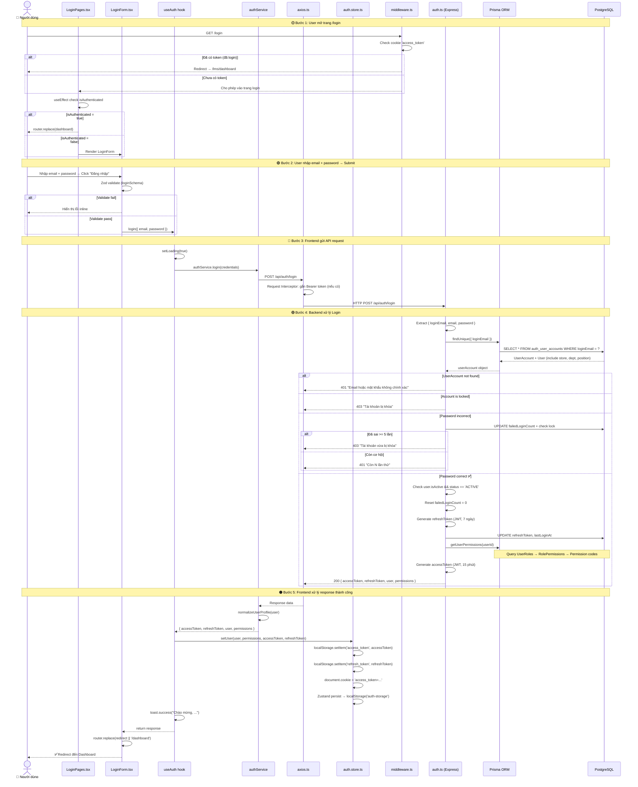

### 2.2 Giải thích chi tiết từng file

#### Bước 1: Validation (Frontend)

**File:** `frontend/src/features/auth/schemas/login.schema.ts`

```typescript
// Dùng Zod để validate form trước khi gửi API
export const loginSchema = z.object({
  email: z.string().email('Email không hợp lệ'),
  password: z.string().min(6, 'Mật khẩu tối thiểu 6 ký tự'),
})
```

#### Bước 2: Form Component submit

**File:** `frontend/src/features/auth/components/login/LoginForm.tsx`

```typescript
// react-hook-form + Zod resolver → validate → gọi login()
const onSubmit = async (data: LoginFormValues) => {
  await login(data)                                    // ← gọi useAuth().login
  router.replace(redirect ?? '/dashboard')             // ← redirect sau login
}
```

#### Bước 3: useAuth Hook xử lý logic

**File:** `frontend/src/features/auth/hooks/use-auth.ts`

```typescript
const login = async (credentials) => {
  setLoading(true)
  const response = await authService.login(credentials) // ← gọi service
  setUser(normalizedUser, perms, accessToken, refreshToken) // ← lưu vào Zustand
  toast.success(`Chào mừng, ${user.fullName}!`)
}
```

#### Bước 4: Auth Service gọi API

**File:** `frontend/src/features/auth/services/auth.service.ts`

```typescript
login: async (credentials) => {
  const response = await apiCall.post('/api/auth/login', {
    loginEmail: credentials.email,
    password: credentials.password,
  })
  response.user = normalizeUserProfile(response.user) // ← chuẩn hóa
  return response
}
```

#### Bước 5: Axios Interceptors

**File:** `frontend/src/lib/axios.ts`

```typescript
// REQUEST: Tự động gắn Bearer token vào mọi request
api.interceptors.request.use((config) => {
  const token = localStorage.getItem('access_token')
  if (token) config.headers.Authorization = `Bearer ${token}`
  return config
})

// RESPONSE: Nếu 401 → tự động refresh token → retry request gốc
api.interceptors.response.use(
  (response) => response,
  async (error) => {
    if (error.status === 401 && !originalRequest._retry) {
      const newToken = await handleTokenRefresh()
      originalRequest.headers.Authorization = `Bearer ${newToken}`
      return api(originalRequest) // retry!
    }
  }
)
```

#### Bước 6: Backend xử lý Login

**File:** `backend/src/routes/auth.ts` (dòng 16-137)

Flow xử lý trong backend:

```
1. Extract body: { loginEmail, email, password }
2. Query DB: prisma.userAccount.findUnique({ loginEmail }) + include User/Store/Dept/Position
3. Check: Account tồn tại? → 401
4. Check: isLocked? → 403
5. Check: bcrypt.compare(password, passwordHash) → nếu sai: tăng failedCount, lock nếu >= 5
6. Check: user.isActive && status === 'ACTIVE' → 403
7. Reset failedLoginCount = 0, update lastLoginAt
8. Generate refreshToken (7d) → lưu vào DB
9. getUserPermissions(userId) → query UserRoles → RolePermissions → Permission codes
10. Generate accessToken (15m) → chứa { userId, email, employeeCode, fullName }
11. Return: { accessToken, refreshToken, user, permissions }
```

#### Bước 7: Zustand Store lưu trữ state

**File:** `frontend/src/stores/auth.store.ts`

```typescript
setUser: (user, permissions, accessToken, refreshToken) => {
  localStorage.setItem('access_token', accessToken)   // cho axios interceptor
  localStorage.setItem('refresh_token', refreshToken)  // cho refresh flow
  setTokenCookie(accessToken)                          // cho Next.js middleware
  set({ user, permissions, isAuthenticated: true })    // Zustand state
}
// Zustand persist: tự động lưu { user, permissions, isAuthenticated } vào localStorage('auth-storage')
```

> **Tại sao lưu token ở cả 3 nơi?**
>
> | Nơi lưu | Mục đích |
> |---------|----------|
> | `localStorage('access_token')` | Axios interceptor đọc để gắn Authorization header |
> | `localStorage('refresh_token')` | Dùng khi access token hết hạn → gọi refresh |
> | `cookie('access_token')` | Next.js Edge Middleware đọc (SSR/server không truy cập localStorage) |
> | Zustand persist (`auth-storage`) | Rehydrate UI state khi reload page |

---

## 🛡️ PHẦN 3: MIDDLEWARE & ROUTE PROTECTION

### 3.1 Next.js Edge Middleware (Server-side)

**File:** `frontend/middleware.ts`

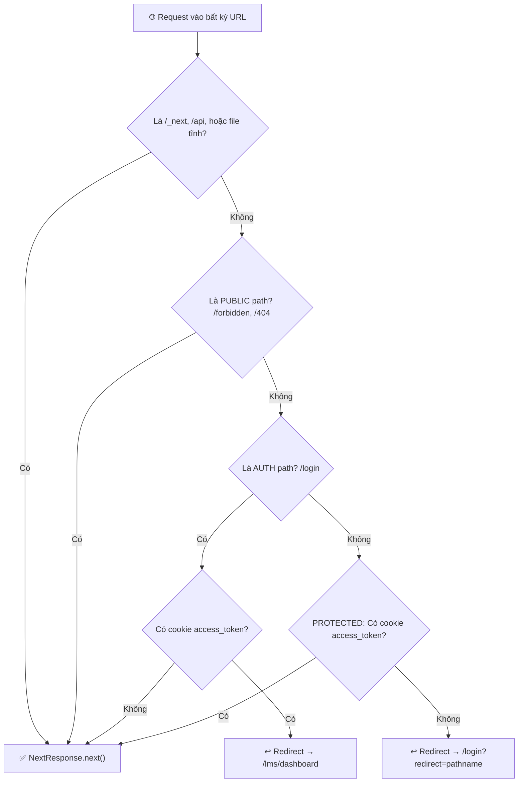

### 3.2 AuthGuard Component (Client-side)

**File:** `frontend/src/features/auth/components/AuthGuard.tsx`

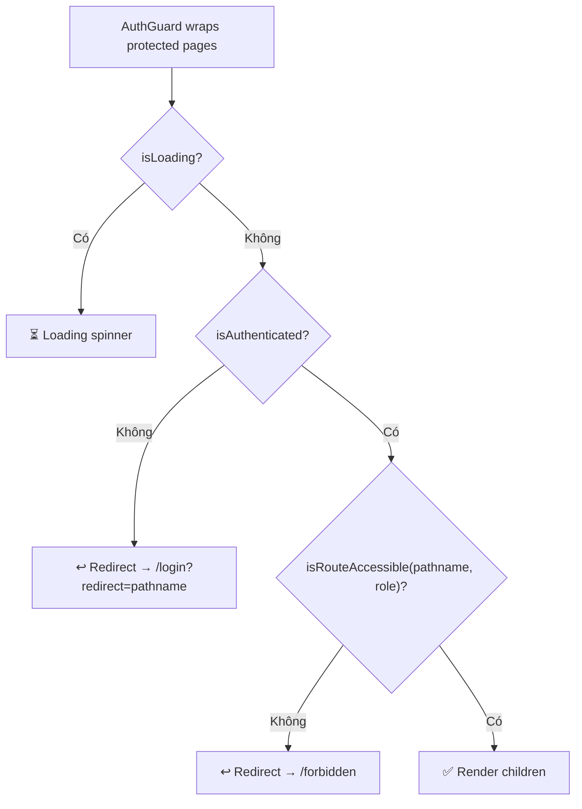

### 3.3 Backend Auth Middleware

**File:** `backend/src/middlewares/auth.middleware.ts`

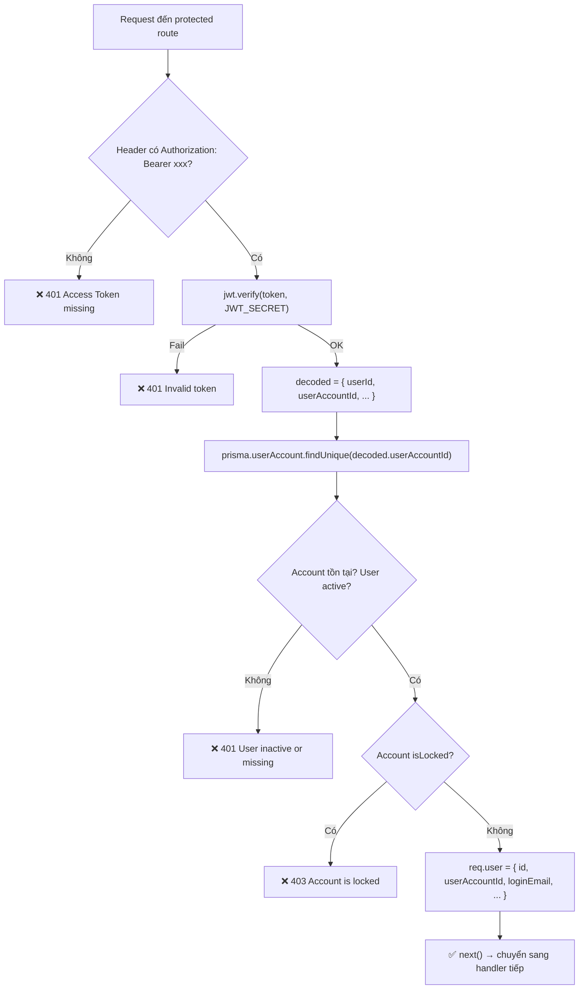

### 3.4 Permission Middleware

**File:** `backend/src/middlewares/permission.middleware.ts`

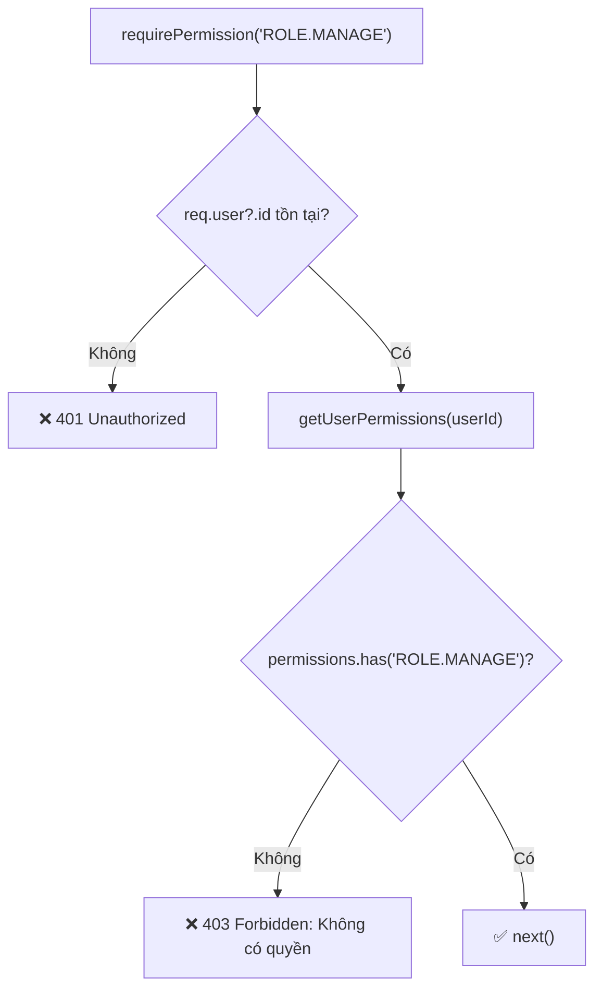

---

## 👑 PHẦN 4: ROLES & RBAC FLOW

### 4.1 Mô hình phân quyền

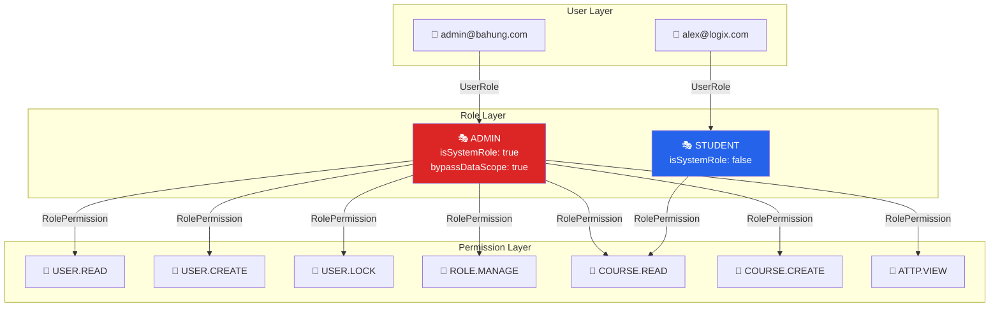

### 4.2 Permission Service (Caching Layer)

**File:** `backend/src/services/permission.service.ts`

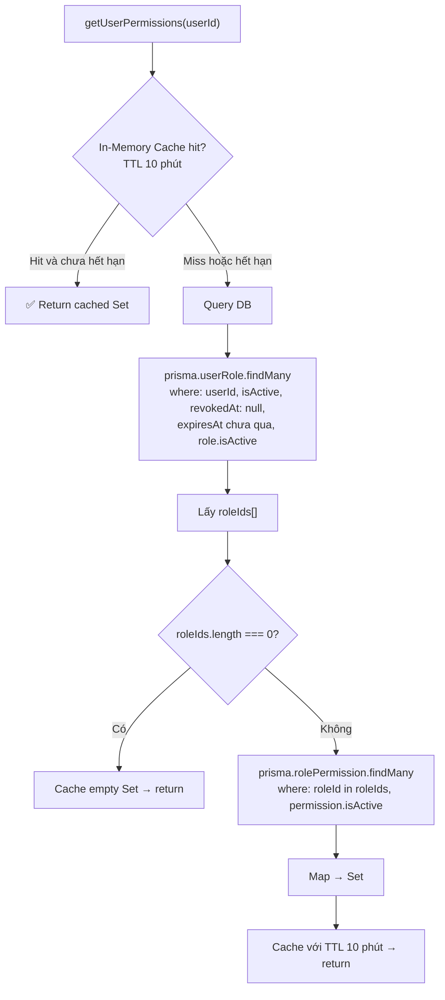

> **Khi nào cache bị invalidate?**
> - `invalidatePermissionCacheForRole(roleId)` — gọi khi: update/delete role, assign permissions, sync users
> - `invalidatePermissionCacheForUser(userId)` — gọi khi: logout, user bị remove khỏi role

### 4.3 Role Management API Flow

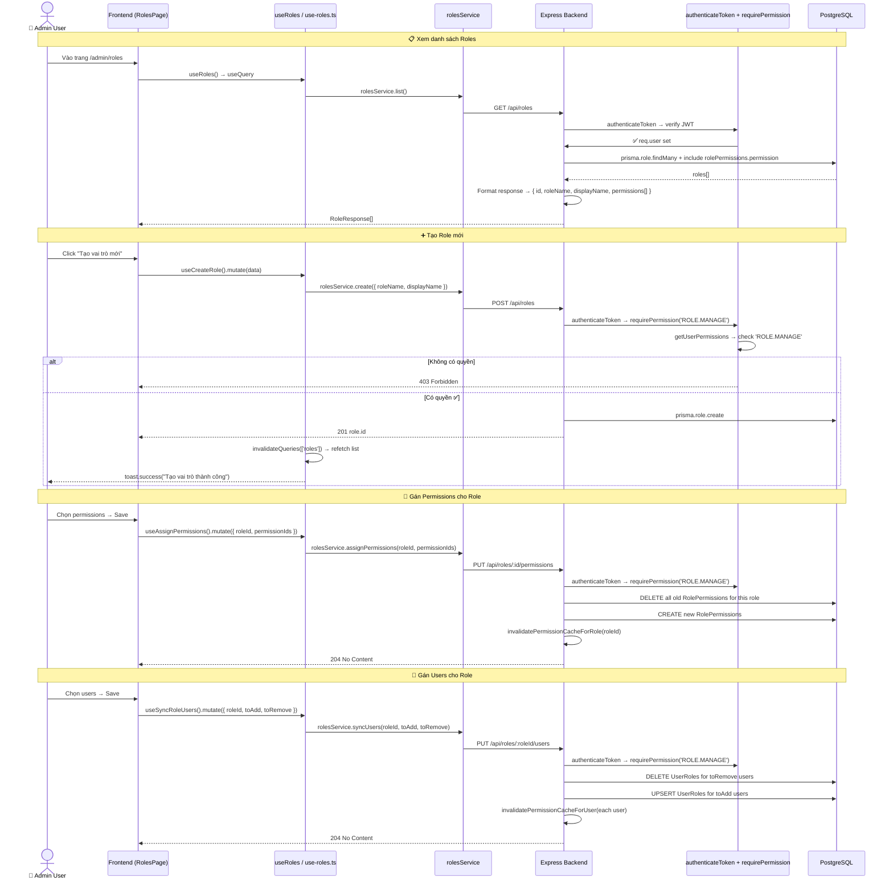

### 4.4 Frontend kiểm tra quyền tại Client

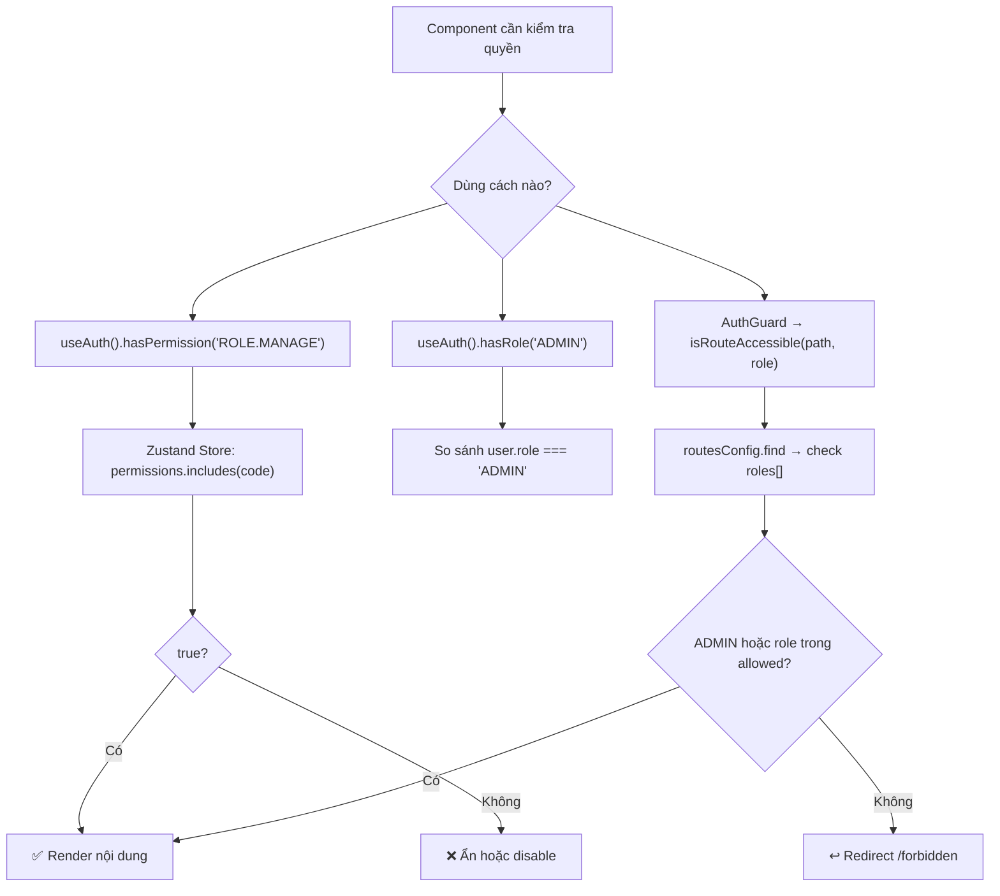

---

## 🔄 PHẦN 5: TOKEN REFRESH FLOW

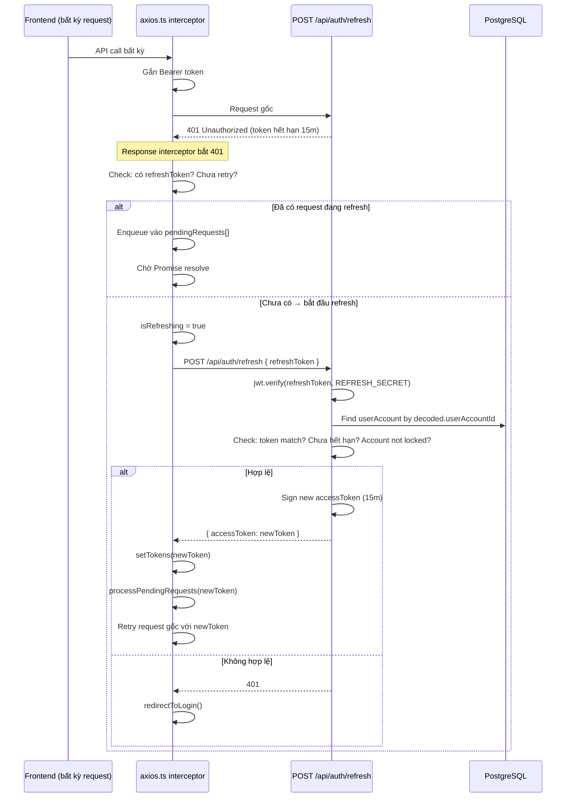

---

## 📊 PHẦN 6: TỔNG HỢP THAY ĐỔI NGÀY 07/08/2026

### 6.1 Thống kê thay đổi

| Thành phần | Files Changed | Mô tả |
|-----------|:------------:|-------|
| **Backend Schema** | 1 | Mở rộng `schema.prisma`: thêm Auth RBAC (User, UserAccount, Role, Permission, UserRole, RolePermission) + Org Structure + LMS modules |
| **Backend Routes** | 8+ | Thêm `auth.ts`, `role.routes.ts`, `permission.routes.ts`, `user.routes.ts` + mở rộng courses/lessons/progress/quizzes |
| **Backend Middleware** | 2 | Tạo mới `auth.middleware.ts` (JWT verify) + `permission.middleware.ts` (RBAC check) |
| **Backend Service** | 1 | Tạo mới `permission.service.ts` (in-memory cache + DB lookup) |
| **Backend Seed** | 1 | Viết lại hoàn toàn seed data: tạo org, permissions, roles, users, courses |
| **Frontend Middleware** | 1 | Tạo `middleware.ts`: route guard dựa trên cookie |
| **Frontend Store** | 1 | Tạo `auth.store.ts` (Zustand + persist) |
| **Frontend Auth Feature** | 7+ | `auth.service`, `use-auth`, `LoginForm`, `LoginPages`, `AuthGuard`, `auth.utils`, schemas, types |
| **Frontend Admin Feature** | 5+ | `roles.service`, `permissions.service`, `use-roles`, `use-permissions`, admin types |
| **Frontend Config** | 4 | `api-routes`, `route-path`, route configs (admin/user routes) |
| **Frontend Lib** | 2 | `axios.ts` (interceptors + refresh), `api.ts` (wrapper) |
| **Docs** | -8 files | Xóa docs cũ, chuyển sang cấu trúc mới `doc/00-overview` → `doc/workflow` |

> **Tổng cộng: ~28 files thay đổi, +11,105 dòng thêm, -2,089 dòng xóa**

### 6.2 Kiến trúc đã xây dựng

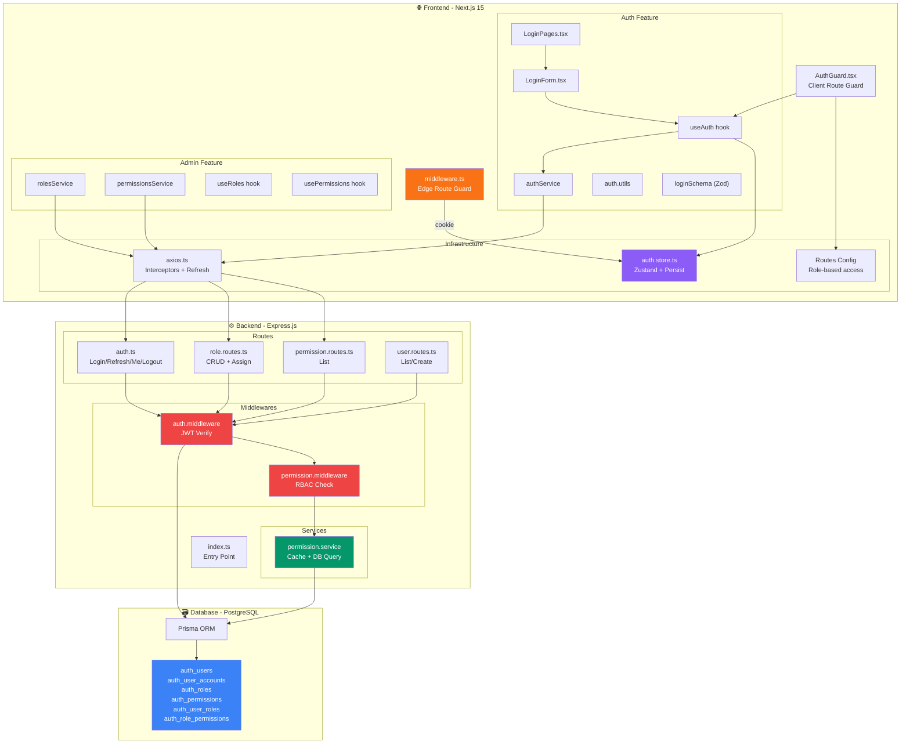

---

## 🔑 PHẦN 7: SEED DATA (Dữ liệu mẫu)

**File:** `backend/src/seed.ts`

| Thứ tự | Data | Chi tiết |
|:------:|------|---------|
| 1 | **Org Structure** | 2 Stores (CH-QUAN1, XUONG-KEM), 2 Departments (Bán hàng, Làm kem), 2 Positions (QLCH, NV-BAN-HANG) |
| 2 | **Permissions** | 7 permissions: `USER.READ`, `USER.CREATE`, `USER.LOCK`, `ROLE.MANAGE`, `COURSE.READ`, `COURSE.CREATE`, `ATTP.VIEW` |
| 3 | **Roles** | `ADMIN` (all 7 permissions, system role), `STUDENT` (chỉ `COURSE.READ`) |
| 4 | **Users** | `admin@bahung.com` (ADMIN role), `alex@logix.com` (STUDENT role) — password mặc định: `password123` |
| 5 | **Sample Course** | 1 Category → 1 Course → 1 Module → 1 Lesson + enrollment cho alex |

---

## 🎯 Quick Reference cho Intern

### Muốn thêm Permission mới?

1. Thêm vào `seed.ts` → chạy seed lại
2. Hoặc tạo qua Admin UI nếu đã có API

### Muốn protect một route mới?

```typescript
// Backend: Trong route file
router.get('/my-route', authenticateToken, requirePermission('MY.PERMISSION'), handler)

// Frontend: Trong route config
{ path: '/my-page', roles: [Role.ADMIN], label: 'My Page' }
```

### Muốn kiểm tra quyền trong component?

```tsx
const { hasPermission } = useAuth()

{hasPermission('COURSE.CREATE') && <Button>Tạo khóa học</Button>}
```

### Test accounts

| Email | Password | Role | Permissions |
|-------|----------|------|-------------|
| `admin@bahung.com` | `password123` | ADMIN | Tất cả (7) |
| `alex@logix.com` | `password123` | STUDENT | COURSE.READ |
