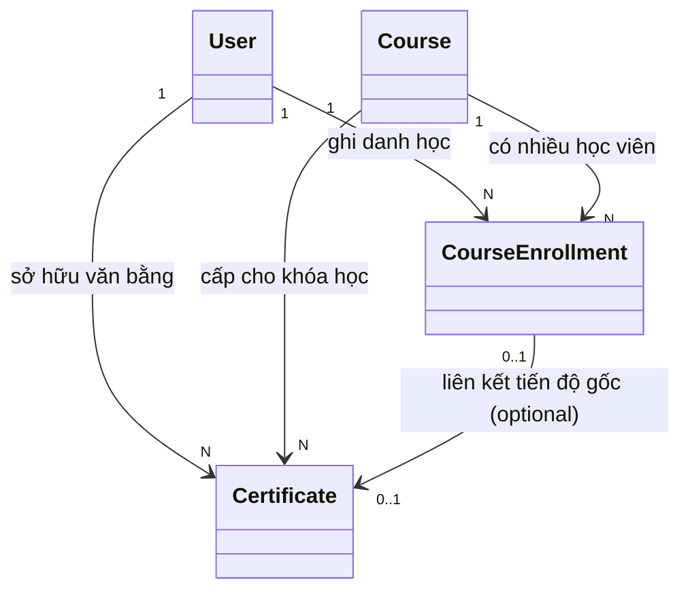
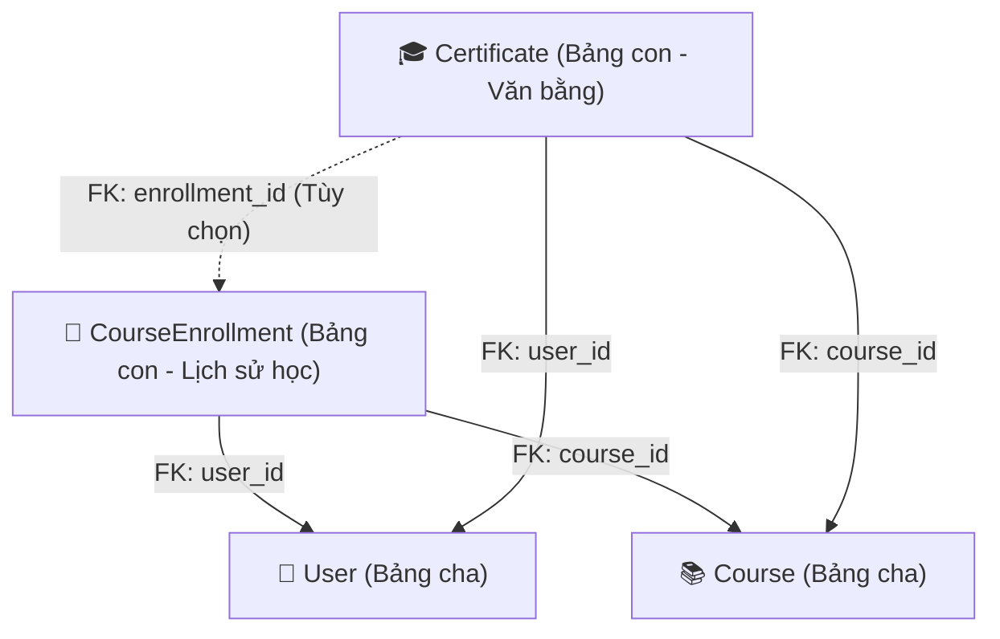
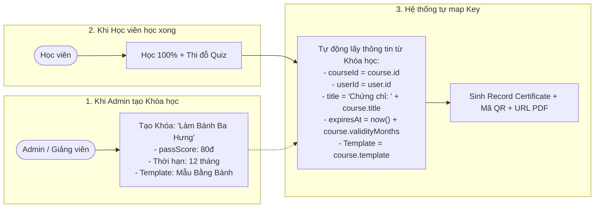
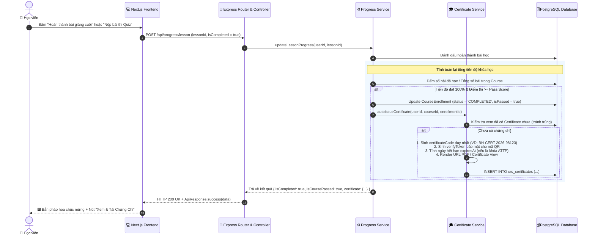

# 🧠 Tư Duy Thiết Kế Database: Giải Mã "Liên Kết Vòng" & Cơ Chế Cấp Chứng Chỉ Tự Động (LMS Certificate Workflow)

> **Tài liệu tham chiếu:** [[Database_Design_Document]] · [[Step_by_Step_Backend_Workflow]] · [[Auth_and_RBAC_Workflow]]  
> **Áp dụng cho:** Hệ thống Đào tạo & Quản trị Nhân sự F&B **LogiX LMS** (Chuỗi cửa hàng, Xưởng bánh Ba Hưng & Trung tâm Đào tạo Nghề Horeca).

---

## 📑 Mục Lục

1. [Phần 1: Bản Chất Các Mối Quan Hệ Trong Hệ Thống LMS](#phần-1-bản-chất-các-mối-quan-hệ-trong-hệ-thống-lms)
2. [Phần 2: Giải Mã — Đây Có Phải Là "Liên Kết Vòng" (Circular Dependency) Không?](#phần-2-giải-mã--đây-có-phải-là-liên-kết-vòng-circular-dependency-không)
3. [Phần 3: Tại Sao `Certificate` Cần Cả `userId` Và `courseId`? (3NF vs Thực Tế Nghiệp Vụ)](#phần-3-tại-sao-certificate-cần-cả-userid-và-courseid-3nf-vs-thực-tế-nghiệp-vụ)
4. [Phần 4: Cơ Chế Gán & Sinh Chứng Chỉ Cho Từng Khóa Học (Giống Coursera / Udemy)](#phần-4-cơ-chế-gán--sinh-chứng-chỉ-cho-từng-khóa-học-giống-coursera--udemy)
5. [Phần 5: Chi Tiết End-to-End Workflow Khi User Hoàn Thành Khóa Học](#phần-5-chi-tiết-end-to-end-workflow-khi-user-hoàn-thành-khóa-học)
6. [Phần 6: Code Mẫu Minh Họa Trigger Tự Động Cấp Chứng Chỉ](#phần-6-code-mẫu-minh-họa-trigger-tự-động-cấp-chứng-chỉ)

---

## Phần 1: Bản Chất Các Mối Quan Hệ Trong Hệ Thống LMS

Hãy cùng chuẩn hóa lại 3 mối quan hệ cốt lõi:

| Mối quan hệ | Loại quan hệ (Cardinality) | Giải thích thực tế trong vận hành | Bảng trung gian / Khóa ngoại |
| :--- | :--- | :--- | :--- |
| **User ↔ Course** | **Nhiều - Nhiều (`N - N`)** | 1 Học viên có thể học nhiều khóa học (ATTP, Bánh, Phục vụ). 1 Khóa học có hàng trăm học viên theo học. | Nối qua bảng trung gian **`CourseEnrollment`** (`user_id`, `course_id`). |
| **Course ↔ Certificate** | **Một - Nhiều (`1 - N`)** | 1 Khóa học (VD: *Khóa Làm Bánh Cơ Bản*) khi có 50 học viên hoàn thành sẽ sinh ra **50 tấm chứng chỉ thực tế** cho 50 người đó. | Bảng `Certificate` chứa khóa ngoại **`course_id`**. |
| **User ↔ Certificate** | **Một - Nhiều (`1 - N`)** | 1 Học viên theo thời gian sẽ tích lũy được nhiều chứng chỉ khác nhau trong hồ sơ năng lực của mình. | Bảng `Certificate` chứa khóa ngoại **`user_id`**. |



---

## Phần 2: Giải Mã — Đây Có Phải Là "Liên Kết Vòng" (Circular Dependency) Không?

### ❌ Câu trả lời khẳng định: **HOÀN TOÀN KHÔNG PHẢI!**

Nhiều lập trình viên khi nhìn thấy sơ đồ 4 bảng tạo thành hình tứ giác/tam giác thường lo lắng đây là **Circular Dependency**. Nhưng thực tế:



### 1. Phân biệt theo chiều Khóa Ngoại (Foreign Key):
* Cả `CourseEnrollment` và `Certificate` đều là **Bảng con (Dependent Tables)** nhận khóa ngoại từ 2 **Bảng cha (Independent Tables)** là `User` và `Course`.
* Cả `User` và `Course` **KHÔNG HỀ giữ bất kỳ khóa ngoại nào trỏ ngược lại** `Certificate` hay `Enrollment`.
* Trong lý thuyết đồ thị cơ sở dữ liệu, đây là **Đồ thị có hướng không chu trình (Directed Acyclic Graph - DAG)**. Dữ liệu chảy một chiều từ Cha ➡️ Con, không bao giờ bị lặp.

### 2. Thế nào mới là "Liên kết vòng nguy hiểm" (Circular Deadlock Dependency)?
> **Ví dụ về liên kết vòng lỗi thực sự:**  
> - Bảng `User` có trường `mandatoryCertificateId` (`NOT NULL`) trỏ sang `Certificate`.  
> - Bảng `Certificate` lại có trường `userId` (`NOT NULL`) trỏ sang `User`.  
>   
> 💥 **Hậu quả:** Bạn muốn INSERT `User` mới thì DB báo lỗi vì chưa có `Certificate`. Bạn muốn INSERT `Certificate` thì DB báo lỗi vì chưa có `User`. Hai bảng khóa chặt lẫn nhau dẫn đến **Deadlock khi khởi tạo dữ liệu**!  
>   
> 👉 Hệ thống LogiX hiện tại hoàn toàn tự do: Bạn tạo `User` và `Course` trước bất kỳ lúc nào, sau đó mới tạo `Enrollment` và `Certificate`.

---

## Phần 3: Tại Sao `Certificate` Cần Cả `userId` Và `courseId`? (3NF vs Thực Tế Nghiệp Vụ)

Một câu hỏi tư duy rất hay:  
> *"Nếu `CourseEnrollment` đã chứa `user_id` và `course_id` rồi, tại sao `Certificate` không chỉ trỏ duy nhất vào `enrollment_id` để chuẩn hóa 3NF tuyệt đối?"*

Hãy so sánh 2 cách thiết kế:

| Tiêu chí so sánh | Cách 1: Chỉ trỏ vào `enrollment_id` | Cách 2: Trỏ cả `user_id`, `course_id` (Cách LogiX chọn) |
| :--- | :--- | :--- |
| **Cấp chứng chỉ đặc cách (Manual)** | ❌ **Bế tắc:** Không thể cấp chứng chỉ danh dự/đặc cách cho Giảng viên, Chuyên gia hoặc nhân sự chuyển vùng mà họ không tham gia học online (không có bản ghi `enrollment`). | ✅ **Linh hoạt tuyệt đối:** Cấp trực tiếp cho bất kỳ ai chỉ với `userId` và `courseId`, `enrollmentId` có thể `NULL`. |
| **Tốc độ truy vấn (Query Speed)** | ❌ **Chậm:** Muốn lấy "Tất cả chứng chỉ của User A" thì câu query SQL phải `JOIN` qua bảng `CourseEnrollment`. | ✅ **Siêu nhanh:** Chạy thẳng `SELECT * FROM crs_certificates WHERE user_id = '...'` nhờ có Index `@@index([userId])`. |
| **Bảo lưu giá trị pháp lý (Fact Snapshot)** | ⚠️ **Rủi ro:** Nếu sau 3 năm hệ thống dọn dẹp (xóa lịch sử click bài học, log tiến độ trong `enrollments`), chứng chỉ có thể bị mất gốc hoặc gãy liên kết. | ✅ **Độc lập vĩnh viễn:** Chứng chỉ là một **Sự kiện pháp lý (Fact Record)**, một khi đã cấp thì tồn tại độc lập với tiến trình học hàng ngày. |

---

## Phần 4: Cơ Chế Gán & Sinh Chứng Chỉ Cho Từng Khóa Học (Giống Coursera / Udemy)

Bạn đang thắc mắc:
> *"Làm thế nào để hệ thống biết: Học khóa 'Làm bánh 10 ngày' thì ra 'Chứng chỉ Làm bánh', còn học khóa 'ATTP' thì ra 'Chứng chỉ ATTP'? Key kết nối nằm ở đâu?"*

### 🔑 Key kết nối chính là: `Course` (và Mẫu Chứng Chỉ `CertificateTemplate`)

Trong các hệ thống lớn như **Coursera, Udemy, LogiX LMS**, có 2 mô hình gán chứng chỉ:



---

### Mô hình 1: Gán trực tiếp qua thuộc tính của Khóa học (`Course`)
* Bảng `Course` đã có sẵn các trường:
  - `Course.title`: *"Chương trình Đào tạo Làm Bánh Mì Cao Cấp"*
  - `Course.code`: *"BAKE-PRO"*
  - `Course.courseType`: `'ATTP'`, `'ONBOARDING'`, `'STANDARD'`
* Khi cấp chứng chỉ, hệ thống lấy `Course.title` để in lên bằng khen:  
  `title` = `"Chứng nhận hoàn thành khóa đào tạo: " + course.title`

---

### Mô hình 2: Nâng cấp chuẩn Enterprise — Thêm bảng `CertificateTemplate` (Giống Coursera)
Nếu muốn mỗi khóa học có phôi bằng khen riêng, hình nền riêng, chữ ký giám đốc riêng, ta chỉ cần thêm bảng `CertificateTemplate`:

```prisma
// Template mẫu phôi chứng chỉ (Coursera-style)
model CertificateTemplate {
  id              String   @id @default(uuid())
  templateCode    String   @unique // 'MAU-BAHUNG-STANDARD', 'MAU-ATTP-QUOCGIA', 'MAU-HORECA-BARISTA'
  templateName    String   // Tên mẫu
  backgroundUrl   String   // Link ảnh phôi chứng chỉ (chưa điền tên)
  signatoryName   String   // Người ký: "Ông Ba Hưng" hoặc "Hội đồng Khảo thí Horeca"
  signatoryTitle  String   // Chức danh: "Tổng Giám Đốc"
  signatureUrl    String?  // Ảnh chữ ký & con dấu điện tử
  primaryColor    String   @default("#d97706") // Màu chữ chủ đạo
  courses         Course[] // 1 Template dùng chung cho nhiều Khóa học

  createdAt       DateTime @default(now())
  updatedAt       DateTime @default(now()) @updatedAt

  @@map("crs_certificate_templates")
}
```

Và trên bảng `Course`, chỉ cần thêm 1 trường duy nhất:
```prisma
model Course {
  // ... các trường hiện tại
  certificateTemplateId String?
  certificateTemplate   CertificateTemplate? @relation(fields: [certificateTemplateId], references: [id])
}
```

---

## Phần 5: Chi Tiết End-to-End Workflow Khi User Hoàn Thành Khóa Học

Dưới đây là toàn bộ chuỗi sự kiện (Event-driven / Trigger flow) từ lúc học viên click nút hoàn thành bài học đến khi nhận chứng chỉ:



---

## Phần 6: Code Mẫu Minh Họa Trigger Tự Động Cấp Chứng Chỉ

Dưới đây là đoạn code thực tế cách tầng `ProgressService` gọi sang `CertificateService`:

```typescript
// Trong file: src/modules/progress/progress.service.ts
import prisma from '../../config/prisma'
import { certificateService } from '../certificates/certificate.service'

export class ProgressService {
  public async completeLesson(userId: string, lessonId: string) {
    // 1. Cập nhật trạng thái bài giảng
    const progress = await prisma.lessonProgress.upsert({
      where: { userId_lessonId: { userId, lessonId } },
      update: { isCompleted: true, completedAt: new Date() },
      create: { userId, lessonId, isCompleted: true, completedAt: new Date() },
      include: { lesson: { include: { module: { include: { course: true } } } } },
    })

    const courseId = progress.lesson.module.course.id

    // 2. Tính tỷ lệ % hoàn thành của khóa học
    const totalLessons = await prisma.lesson.count({
      where: { module: { courseId }, isVisible: true },
    })

    const completedLessons = await prisma.lessonProgress.count({
      where: {
        userId,
        isCompleted: true,
        lesson: { module: { courseId } },
      },
    })

    const percentage = totalLessons > 0 ? (completedLessons / totalLessons) * 100 : 0

    // 3. Cập nhật bảng CourseEnrollment
    const isFinished = percentage >= 100
    const enrollment = await prisma.courseEnrollment.update({
      where: { userId_courseId: { userId, courseId } },
      data: {
        completionPercentage: percentage,
        status: isFinished ? 'COMPLETED' : 'IN_PROGRESS',
        isPassed: isFinished,
        completedAt: isFinished ? new Date() : null,
      },
    })

    // 4. 🔥 TỰ ĐỘNG CẤP CHỨNG CHỈ NẾU HOÀN THÀNH 100%
    let issuedCertificate = null
    if (isFinished) {
      // Kiểm tra nếu chưa từng cấp chứng chỉ cho khóa này
      const existingCert = await prisma.certificate.findFirst({
        where: { userId, courseId, status: 'ACTIVE' },
      })

      if (!existingCert) {
        issuedCertificate = await certificateService.issueCertificate({
          userId,
          courseId,
          score: 100, // Hoặc lấy từ điểm Quiz cao nhất
          issuerName: 'Hệ Thống Đào Tạo LogiX Ba Hưng & Horeca',
          durationMonths: progress.lesson.module.course.courseType === 'ATTP' ? 12 : undefined,
        })
      }
    }

    return {
      progress,
      percentage,
      isFinished,
      certificate: issuedCertificate,
    }
  }
}
```

---

## 🎯 Tổng Kết Ghi Nhớ Nhanh

1. **Không có liên kết vòng:** `User` và `Course` là 2 thực thể gốc. `Enrollment` và `Certificate` là 2 bảng con độc lập cùng tham chiếu tới 2 bảng gốc.
2. **Key kết nối:** `courseId` là cầu nối quyết định nội dung chứng chỉ (học khóa nào ➡️ in tên khóa đó lên bằng).
3. **Cơ chế cấp:** Cấp tự động thông qua **Hook/Event** khi `CourseEnrollment` đạt 100% tiến độ và vượt qua điểm sàn `passScore`.
4. **Mở rộng (Coursera-style):** Khi cần đa dạng phôi mẫu chứng chỉ, chỉ cần tạo bảng `CertificateTemplate` và gắn `certificateTemplateId` vào bảng `Course`.
