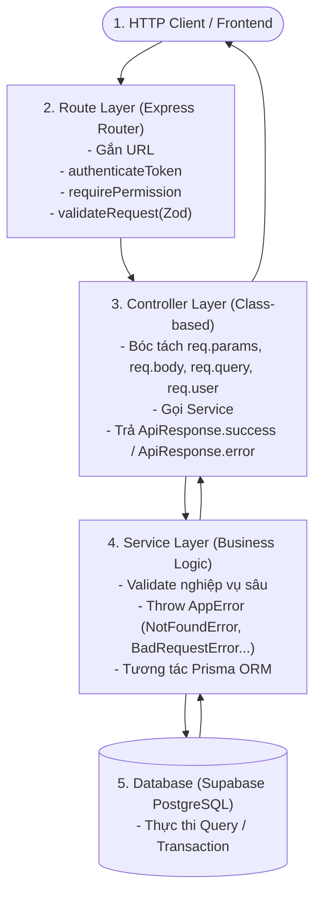

# 🚀 Hướng Dẫn Phát Triển Tính Năng Backend Từng Bước (Step-by-Step Backend Workflow)

> **Mục tiêu:** Tài liệu quy trình chuẩn (SOP) dành cho Backend Developer khi nhận một yêu cầu phát triển tính năng hoặc tạo mới một Module API trong hệ thống **LogiX LMS & ERP-v2**.  
> **Dự án áp dụng:** Hệ thống Đào tạo & Quản trị Nhân sự F&B đa mô hình (**Chuỗi cửa hàng & Xưởng sản xuất Ba Hưng** kết hợp **Mô hình Khách sạn - Nhà hàng - Đào tạo nghề Horeca**).  
> **Ví dụ thực tế xuyên suốt tài liệu:** Xây dựng module **Quản lý & Cấp Chứng chỉ Đào tạo (`certificates`)**.

---

## 📑 Mục Lục
1. [Tổng Quan Kiến Trúc & Nguyên Tắc 5 Tầng](#1-tổng-quan-kiến-trúc--nguyên-tắc-5-tầng)
2. [Phân Tích Nghiệp Vụ Module Chứng Chỉ (Ba Hưng & Horeca)](#2-phân-tích-nghiệp-vụ-module-chứng-chỉ-ba-hưng--horeca)
3. [Bước 1: Thiết Kế & Cập Nhật Database Schema (`schema.prisma`)](#bước-1-thiết-kế--cập-nhật-database-schema-schemaprisma)
4. [Bước 2: Chuẩn Hóa Cấu Trúc Thư Mục Module](#bước-2-chuẩn-hóa-cấu-trúc-thư-mục-module)
5. [Bước 3: Xây Dựng Tầng DTO & Validation (`certificate.dto.ts`)](#bước-3-xây-dựng-tầng-dto--validation-certificatedtots)
6. [Bước 4: Xây Dựng Tầng Nghiệp Vụ Service (`certificate.service.ts`)](#bước-4-xây-dựng-tầng-nghiệp-vụ-service-certificateservicets)
7. [Bước 5: Xây Dựng Tầng HTTP Controller (`certificate.controller.ts`)](#bước-5-xây-dựng-tầng-http-controller-certificatecontrollerts)
8. [Bước 6: Khai Báo Routes & Gắn Middleware (`certificate.routes.ts`)](#bước-6-khai-báo-routes--gắn-middleware-certificateroutests)
9. [Bước 7: Viết Tài Liệu OpenAPI / Swagger (`certificate.swagger.ts`)](#bước-7-viết-tài-liệu-openapi--swagger-certificateswaggerts)
10. [Bước 8: Đăng Ký Module Vào Hệ Thống (`swagger.ts` & `index.ts`)](#bước-8-đăng-ký-module-vào-hệ-thống-swaggerts--indexts)
11. [Bước 9: Khởi Tạo Quyền Hạn RBAC & Kiểm Thử](#bước-9-khởi-tạo-quyền-hạn-rbac--kiểm-thử)
12. [📋 Checklist Tự Kiểm Tra Trước Khi Mở Pull Request](#-checklist-tự-kiểm-tra-trước-khi-mở-pull-request)

---

## 1. Tổng Quan Kiến Trúc & Nguyên Tắc 5 Tầng

Mỗi yêu cầu HTTP gửi đến Backend LogiX đều phải tuân thủ nghiêm ngặt mô hình phân tầng **Layered Architecture**:



### 3 Quy tắc cốt lõi:
1. **Controller KHÔNG truy vấn Database:** Controller chỉ đóng vai trò giao tiếp HTTP (bóc tách dữ liệu và đóng gói phản hồi `ApiResponse`).
2. **Service KHÔNG đụng đến `req` và `res`:** Service nhận các dữ liệu thuần TypeScript (DTO, string, object) để có thể tái sử dụng hoặc viết Unit Test dễ dàng.
3. **Ném lỗi tập trung (Error Handling):** Trong Service, khi dữ liệu không hợp lệ chỉ cần `throw new NotFoundError(...)` hoặc `throw new BadRequestError(...)`. Middleware [globalErrorHandler](file:///c:/Projects/DigiFnb/Practice/LogiX/backend/src/common/middlewares/error-handler.middleware.ts) sẽ tự động bắt và trả mã HTTP tương ứng.

---

## 2. Phân Tích Nghiệp Vụ Module Chứng Chỉ (Ba Hưng & Horeca)

Hệ thống cần phục vụ 2 nhóm nhu cầu đặc thù của ngành F&B:

| Đặc thù nghiệp vụ | Ứng dụng cho Ba Hưng | Ứng dụng cho Horeca (Khách sạn/F&B) | Yêu cầu kỹ thuật trên Schema |
| :--- | :--- | :--- | :--- |
| **Chứng chỉ An Toàn Thực Phẩm (ATTP) / PCCC** | Bắt buộc cho nhân sự xưởng bánh & chuỗi cửa hàng; có thời hạn định kỳ 1 năm. | Bắt buộc cho nhân sự bếp, bar, phục vụ khách sạn. | Cần trường `expiresAt`, trạng thái `ACTIVE / EXPIRED / REVOKED`. |
| **Chứng chỉ Hội nhập & Tiêu chuẩn phục vụ (SOP)** | Cấp khi nhân viên thử việc hoàn thành đào tạo Onboarding. | Cấp khi hoàn thành tiêu chuẩn lễ tân, buồng phòng, bar, dining. | Hỗ trợ cấp tự động (`AUTOMATIC`) khi hoàn thành 100% khóa học. |
| **Chứng nhận tay nghề / Chuyên môn F&B** | Thợ bánh trung cấp, Quản lý cửa hàng trưởng. | Bartender chuyên nghiệp, Barista quốc tế, Bếp trưởng. | Lưu điểm số `score`, đơn vị cấp `issuerName`, mã QR tra cứu `qrCode`. |
| **Ký duyệt & Cấp thủ công** | Trưởng phòng Nhân sự / Giám đốc xưởng duyệt cấp. | Hội đồng Khảo thí / Giảng viên bộ môn cấp. | Hỗ trợ cấp thủ công (`MANUAL`) kèm người ký duyệt (`issuedById`). |

---

## 3. Bước 1: Thiết Kế & Cập Nhật Database Schema (`schema.prisma`)

* **File:** [schema.prisma](file:///c:/Projects/DigiFnb/Practice/LogiX/backend/prisma/schema.prisma)

### 3.1. Thêm Model `Certificate` và cập nhật quan hệ với `User`, `Course`, `CourseEnrollment`

Mở [schema.prisma](file:///c:/Projects/DigiFnb/Practice/LogiX/backend/prisma/schema.prisma) và bổ sung:

```prisma
// ==========================================
// 5. CERTIFICATE MODULE (Ba Hưng & Horeca)
// ==========================================

model Certificate {
  id               String    @id @default(uuid())
  certificateCode  String    @unique @map("certificate_code") // Mã tra cứu: BH-CERT-2026-0001
  title            String                                       // Tên chứng chỉ hiển thị
  
  // Quan hệ học viên & khóa học
  userId           String    @map("user_id")
  user             User      @relation(fields: [userId], references: [id], onDelete: Cascade)
  courseId         String    @map("course_id")
  course           Course    @relation(fields: [courseId], references: [id], onDelete: Cascade)
  enrollmentId     String?   @map("enrollment_id")
  enrollment       CourseEnrollment? @relation(fields: [enrollmentId], references: [id], onDelete: SetNull)

  // Thông tin cấp chứng chỉ
  issueType        String    @default("AUTOMATIC") @map("issue_type") // 'AUTOMATIC', 'MANUAL'
  status           String    @default("ACTIVE")    @map("status")     // 'ACTIVE', 'REVOKED', 'EXPIRED'
  score            Float?                                             // Điểm số tốt nghiệp (nếu có)
  issuedAt         DateTime  @default(now())       @map("issued_at")
  expiresAt        DateTime?                       @map("expires_at") // Thời hạn chứng chỉ ATTP/PCCC
  
  // Tổ chức & Người ký cấp
  issuerName       String    @default("Ban Đào Tạo LogiX") @map("issuer_name") // Tên tổ chức: 'Ba Hưng Bakery' hoặc 'Horeca Academy'
  issuedById       String?   @map("issued_by_id")                              // ID người duyệt cấp thủ công
  
  // Xuất bản & Tra cứu QR
  certificateUrl   String?   @map("certificate_url") // Link file PDF hoặc ảnh Render
  verifyToken      String    @unique @default(uuid()) @map("verify_token") // Token bảo mật quét QR tra cứu công khai
  
  // Thu hồi chứng chỉ (khi có vi phạm quy chuẩn VSATTP)
  revokedAt        DateTime? @map("revoked_at")
  revokedReason    String?   @map("revoked_reason")

  createdAt        DateTime  @default(now()) @map("created_at")
  updatedAt        DateTime  @default(now()) @updatedAt @map("updated_at")

  @@index([userId])
  @@index([courseId])
  @@index([certificateCode])
  @@index([status])
  @@map("crs_certificates")
}
```

> **Lưu ý:** Đừng quên thêm quan hệ ngược `certificates Certificate[]` trong model `User`, `Course`, và `CourseEnrollment` nếu muốn query 2 chiều.

### 3.2. Chạy lệnh cập nhật Database
Mở Terminal tại thư mục `Practice/LogiX/backend` và thực hiện:
```bash
# Đẩy schema lên database và tự sinh Prisma Client
pnpm prisma db push
```

---

## 4. Bước 2: Chuẩn Hóa Cấu Trúc Thư Mục Module

Tạo thư mục mới theo quy tắc danh từ số nhiều: `Practice/LogiX/backend/src/modules/certificates/` với 5 file:

```text
src/modules/certificates/
├── certificate.dto.ts
├── certificate.service.ts
├── certificate.controller.ts
├── certificate.routes.ts
└── certificate.swagger.ts
```

---

## 5. Bước 3: Xây Dựng Tầng DTO & Validation (`certificate.dto.ts`)

File DTO chịu trách nhiệm validate toàn bộ body, query và params với **Zod**, ngăn chặn dữ liệu bẩn xâm nhập vào hệ thống.

```typescript
// src/modules/certificates/certificate.dto.ts
import { z } from 'zod'

// 1. DTO Cấp chứng chỉ thủ công (Manual Issue)
export const issueCertificateSchema = z.object({
  body: z.object({
    userId: z.string().min(1, 'userId là bắt buộc'),
    courseId: z.string().min(1, 'courseId là bắt buộc'),
    score: z.number().min(0).max(100).optional(),
    issuerName: z.string().optional().default('Ban Đào Tạo Ba Hưng & Horeca'),
    durationMonths: z.number().min(1).optional(), // Ví dụ: 12 tháng cho chứng chỉ ATTP
  }),
})

// 2. DTO Thu hồi chứng chỉ (Revoke)
export const revokeCertificateSchema = z.object({
  body: z.object({
    reason: z.string().min(5, 'Lý do thu hồi phải có ít nhất 5 ký tự'),
  }),
})

// 3. DTO Tra cứu / Lọc danh sách
export const queryCertificateSchema = z.object({
  query: z.object({
    search: z.string().optional(),
    userId: z.string().optional(),
    courseId: z.string().optional(),
    status: z.enum(['ACTIVE', 'REVOKED', 'EXPIRED']).optional(),
  }),
})

// Export TypeScript Types suy diễn từ Schema
export type IssueCertificateDto = z.infer<typeof issueCertificateSchema>['body']
export type RevokeCertificateDto = z.infer<typeof revokeCertificateSchema>['body']
export type QueryCertificateDto = z.infer<typeof queryCertificateSchema>['query']
```

---

## 6. Bước 4: Xây Dựng Tầng Nghiệp Vụ Service (`certificate.service.ts`)

Service chứa logic nghiệp vụ, tính toán thời hạn, sinh mã chứng chỉ và thao tác cơ sở dữ liệu qua Prisma.

```typescript
// src/modules/certificates/certificate.service.ts
import prisma from '../../config/prisma'
import { NotFoundError, BadRequestError, ConflictError } from '../../common/errors/app.error'
import { IssueCertificateDto, RevokeCertificateDto, QueryCertificateDto } from './certificate.dto'

export class CertificateService {
  /**
   * Sinh mã chứng chỉ tự động: BH-CERT-YYYY-XXXXX
   */
  private generateCertificateCode(): string {
    const year = new Date().getFullYear()
    const randomSuffix = Math.floor(10000 + Math.random() * 90000)
    return `BH-CERT-${year}-${randomSuffix}`
  }

  /**
   * Lấy danh sách chứng chỉ (có filter theo người dùng, khóa học, trạng thái)
   */
  public async getCertificates(query: QueryCertificateDto) {
    const where: any = {}
    if (query.userId) where.userId = query.userId
    if (query.courseId) where.courseId = query.courseId
    if (query.status) where.status = query.status

    if (query.search) {
      where.OR = [
        { certificateCode: { contains: query.search, mode: 'insensitive' } },
        { title: { contains: query.search, mode: 'insensitive' } },
      ]
    }

    return prisma.certificate.findMany({
      where,
      include: {
        user: { select: { id: true, fullName: true, employeeCode: true, email: true } },
        course: { select: { id: true, code: true, title: true, courseType: true } },
      },
      orderBy: { issuedAt: 'desc' },
    })
  }

  /**
   * Lấy chứng chỉ của chính học viên đang đăng nhập
   */
  public async getMyCertificates(userId: string) {
    return prisma.certificate.findMany({
      where: { userId, status: 'ACTIVE' },
      include: {
        course: { select: { id: true, code: true, title: true, courseType: true, thumbnailUrl: true } },
      },
      orderBy: { issuedAt: 'desc' },
    })
  }

  /**
   * Xem chi tiết chứng chỉ theo ID
   */
  public async getCertificateById(id: string) {
    const cert = await prisma.certificate.findUnique({
      where: { id },
      include: {
        user: { select: { id: true, fullName: true, employeeCode: true } },
        course: { select: { id: true, code: true, title: true, courseType: true } },
      },
    })
    if (!cert) throw new NotFoundError('Chứng chỉ')
    return cert
  }

  /**
   * Tra cứu chứng chỉ công khai qua verifyToken (Quét mã QR trên chứng chỉ thật)
   */
  public async verifyCertificate(token: string) {
    const cert = await prisma.certificate.findUnique({
      where: { verifyToken: token },
      include: {
        user: { select: { fullName: true, employeeCode: true } },
        course: { select: { title: true, code: true } },
      },
    })
    if (!cert) throw new NotFoundError('Mã xác thực chứng chỉ không hợp lệ hoặc đã bị hủy')
    return cert
  }

  /**
   * Cấp chứng chỉ (Dành cho Admin / Giảng viên hoặc Auto-issue sau khi đậu khóa học)
   */
  public async issueCertificate(dto: IssueCertificateDto, issuedById?: string) {
    // 1. Kiểm tra User và Course
    const user = await prisma.user.findUnique({ where: { id: dto.userId } })
    if (!user) throw new NotFoundError('Học viên')

    const course = await prisma.course.findUnique({ where: { id: dto.courseId } })
    if (!course) throw new NotFoundError('Khóa học')

    // 2. Tính ngày hết hạn (nếu có quy định tháng hiệu lực)
    let expiresAt: Date | null = null
    if (dto.durationMonths) {
      expiresAt = new Date()
      expiresAt.setMonth(expiresAt.getMonth() + dto.durationMonths)
    }

    // 3. Tạo chứng chỉ
    return prisma.certificate.create({
      data: {
        certificateCode: this.generateCertificateCode(),
        title: `Chứng chỉ hoàn thành: ${course.title}`,
        userId: dto.userId,
        courseId: dto.courseId,
        score: dto.score,
        issuerName: dto.issuerName || 'Ban Đào Tạo Ba Hưng & Horeca',
        issueType: issuedById ? 'MANUAL' : 'AUTOMATIC',
        issuedById: issuedById || null,
        expiresAt,
        status: 'ACTIVE',
      },
    })
  }

  /**
   * Thu hồi chứng chỉ khi vi phạm
   */
  public async revokeCertificate(id: string, dto: RevokeCertificateDto) {
    const cert = await prisma.certificate.findUnique({ where: { id } })
    if (!cert) throw new NotFoundError('Chứng chỉ')

    if (cert.status === 'REVOKED') {
      throw new BadRequestError('Chứng chỉ này đã bị thu hồi trước đó')
    }

    return prisma.certificate.update({
      where: { id },
      data: {
        status: 'REVOKED',
        revokedAt: new Date(),
        revokedReason: dto.reason,
      },
    })
  }
}

export const certificateService = new CertificateService()
```

---

## 7. Bước 5: Xây Dựng Tầng HTTP Controller (`certificate.controller.ts`)

Controller chịu trách nhiệm nhận HTTP Request, gọi tầng Service và phản hồi JSON qua [ApiResponse](file:///c:/Projects/DigiFnb/Practice/LogiX/backend/src/common/responses/api-response.ts).

```typescript
// src/modules/certificates/certificate.controller.ts
import { Request, Response } from 'express'
import { certificateService } from './certificate.service'
import { ApiResponse } from '../../common/responses/api-response'
import { HttpStatus } from '../../common/enums/http-status.enum'
import { AuthenticatedRequest } from '../../middlewares/auth.middleware'

export class CertificateController {
  // Lấy danh sách chứng chỉ của toàn hệ thống (Admin/Manager)
  public getCertificates = async (req: Request, res: Response) => {
    const result = await certificateService.getCertificates(req.query as any)
    return res.json(ApiResponse.success(result, 'Lấy danh sách chứng chỉ thành công'))
  }

  // Lấy danh sách chứng chỉ cá nhân của học viên
  public getMyCertificates = async (req: AuthenticatedRequest, res: Response) => {
    const userId = req.user!.id
    const result = await certificateService.getMyCertificates(userId)
    return res.json(ApiResponse.success(result, 'Lấy chứng chỉ của bạn thành công'))
  }

  // Lấy chi tiết 1 chứng chỉ
  public getCertificateById = async (req: Request, res: Response) => {
    const result = await certificateService.getCertificateById(req.params.id)
    return res.json(ApiResponse.success(result, 'Lấy chi tiết chứng chỉ thành công'))
  }

  // Tra cứu công khai (Public QR verification)
  public verifyCertificate = async (req: Request, res: Response) => {
    const result = await certificateService.verifyCertificate(req.params.token)
    return res.json(ApiResponse.success(result, 'Chứng chỉ hợp lệ'))
  }

  // Cấp chứng chỉ mới
  public issueCertificate = async (req: AuthenticatedRequest, res: Response) => {
    const issuedById = req.user?.id
    const result = await certificateService.issueCertificate(req.body, issuedById)
    return res
      .status(HttpStatus.CREATED)
      .json(ApiResponse.success(result, 'Cấp chứng chỉ thành công', HttpStatus.CREATED))
  }

  // Thu hồi chứng chỉ
  public revokeCertificate = async (req: AuthenticatedRequest, res: Response) => {
    const result = await certificateService.revokeCertificate(req.params.id, req.body)
    return res.json(ApiResponse.success(result, 'Thu hồi chứng chỉ thành công'))
  }
}

export const certificateController = new CertificateController()
```

---

## 8. Bước 6: Khai Báo Routes & Gắn Middleware (`certificate.routes.ts`)

Gắn các middleware bảo vệ theo thứ tự: `authenticateToken` ➡️ `requirePermission` ➡️ `validateRequest` ➡️ `asyncHandler(controller)`.

```typescript
// src/modules/certificates/certificate.routes.ts
import { Router } from 'express'
import { certificateController } from './certificate.controller'
import {
  issueCertificateSchema,
  revokeCertificateSchema,
  queryCertificateSchema,
} from './certificate.dto'
import { validateRequest } from '../../common/middlewares/validate.middleware'
import { asyncHandler } from '../../common/utils/async-handler'
import { authenticateToken } from '../../middlewares/auth.middleware'
import { requirePermission } from '../../middlewares/permission.middleware'

const router = Router()

// 1. Endpoint tra cứu công khai (Quét QR không cần login)
router.get('/verify/:token', asyncHandler(certificateController.verifyCertificate))

// 2. Endpoint cho cá nhân học viên xem chứng chỉ
router.get('/my-certificates', authenticateToken, asyncHandler(certificateController.getMyCertificates))

// 3. Endpoint quản lý cho Admin / Quản lý đào tạo
router.get(
  '/',
  authenticateToken,
  requirePermission('CERTIFICATE.VIEW'),
  validateRequest(queryCertificateSchema),
  asyncHandler(certificateController.getCertificates)
)

router.get('/:id', authenticateToken, asyncHandler(certificateController.getCertificateById))

router.post(
  '/',
  authenticateToken,
  requirePermission('CERTIFICATE.ISSUE'),
  validateRequest(issueCertificateSchema),
  asyncHandler(certificateController.issueCertificate)
)

router.patch(
  '/:id/revoke',
  authenticateToken,
  requirePermission('CERTIFICATE.REVOKE'),
  validateRequest(revokeCertificateSchema),
  asyncHandler(certificateController.revokeCertificate)
)

export default router
```

---

## 9. Bước 7: Viết Tài Liệu OpenAPI / Swagger (`certificate.swagger.ts`)

Tạo tài liệu Swagger trực quan để test trên trình duyệt.

```typescript
// src/modules/certificates/certificate.swagger.ts
export const certificateSwagger = {
  tags: [
    { name: 'Certificates', description: 'Quản lý, Cấp phát & Xác thực Chứng chỉ đào tạo (Ba Hưng & Horeca)' },
  ],
  schemas: {
    IssueCertificateRequest: {
      type: 'object',
      required: ['userId', 'courseId'],
      properties: {
        userId: { type: 'string', example: 'uuid-user-123' },
        courseId: { type: 'string', example: 'uuid-course-456' },
        score: { type: 'number', example: 95.5 },
        issuerName: { type: 'string', example: 'Ba Hưng Bakery Training Center' },
        durationMonths: { type: 'integer', example: 12 },
      },
    },
    RevokeCertificateRequest: {
      type: 'object',
      required: ['reason'],
      properties: {
        reason: { type: 'string', example: 'Vi phạm quy chuẩn vệ sinh ATTP tại cơ sở sản xuất' },
      },
    },
  },
  paths: {
    '/api/certificates/verify/{token}': {
      get: {
        tags: ['Certificates'],
        summary: 'Tra cứu xác thực chứng chỉ thật/giả công khai qua QR code Token',
        parameters: [{ name: 'token', in: 'path', required: true, schema: { type: 'string' } }],
        responses: { 200: { description: 'Chứng chỉ hợp lệ' }, 404: { description: 'Chứng chỉ không tồn tại' } },
      },
    },
    '/api/certificates/my-certificates': {
      get: {
        tags: ['Certificates'],
        summary: 'Lấy danh sách chứng chỉ cá nhân của học viên đang đăng nhập',
        security: [{ BearerAuth: [] }],
        responses: { 200: { description: 'Thành công' } },
      },
    },
    '/api/certificates': {
      get: {
        tags: ['Certificates'],
        summary: 'Danh sách tất cả chứng chỉ (Admin)',
        security: [{ BearerAuth: [] }],
        responses: { 200: { description: 'Thành công' } },
      },
      post: {
        tags: ['Certificates'],
        summary: 'Cấp chứng chỉ thủ công cho học viên',
        security: [{ BearerAuth: [] }],
        requestBody: {
          required: true,
          content: { 'application/json': { schema: { $ref: '#/components/schemas/IssueCertificateRequest' } } },
        },
        responses: { 201: { description: 'Cấp chứng chỉ thành công' } },
      },
    },
    '/api/certificates/{id}/revoke': {
      patch: {
        tags: ['Certificates'],
        summary: 'Thu hồi chứng chỉ đã cấp',
        security: [{ BearerAuth: [] }],
        parameters: [{ name: 'id', in: 'path', required: true, schema: { type: 'string' } }],
        requestBody: {
          required: true,
          content: { 'application/json': { schema: { $ref: '#/components/schemas/RevokeCertificateRequest' } } },
        },
        responses: { 200: { description: 'Thu hồi thành công' } },
      },
    },
  },
}
```

---

## 10. Bước 8: Đăng Ký Module Vào Hệ Thống (`swagger.ts` & `index.ts`)

### 10.1. Đăng ký Swagger vào [src/config/swagger.ts](file:///c:/Projects/DigiFnb/Practice/LogiX/backend/src/config/swagger.ts)
```typescript
import { certificateSwagger } from '../modules/certificates/certificate.swagger'

export const swaggerDocument = {
  // ...
  tags: [
    // ...
    ...certificateSwagger.tags,
  ],
  paths: {
    // ...
    ...certificateSwagger.paths,
  },
}
```

### 10.2. Đăng ký Router vào [src/index.ts](file:///c:/Projects/DigiFnb/Practice/LogiX/backend/src/index.ts)
```typescript
import certificateRouter from './modules/certificates/certificate.routes'

// Feature Module Routes
app.use('/api/certificates', certificateRouter)
```

---

## 11. Bước 9: Khởi Tạo Quyền Hạn RBAC & Kiểm Thử

### 11.1. Thêm Mã Quyền vào [seed.ts](file:///c:/Projects/DigiFnb/Practice/LogiX/backend/src/seed.ts) (nếu cần)
Thêm các quyền mới:
- `CERTIFICATE.VIEW`: Xem danh sách chứng chỉ
- `CERTIFICATE.ISSUE`: Cấp chứng chỉ
- `CERTIFICATE.REVOKE`: Thu hồi chứng chỉ

Gán quyền này cho các Role tương ứng như `SYSTEM_ADMIN`, `TRAINING_MANAGER`.

### 11.2. Chạy thử nghiệm và kiểm chứng trên Swagger UI
1. Chạy server:
   ```bash
   pnpm dev
   ```
2. Truy cập `http://localhost:5000/api-docs`.
3. Đăng nhập qua `POST /api/auth/login` và bấm nút **Authorize 🔓**.
4. Test các luồng:
   - Cấp chứng chỉ (`POST /api/certificates`)
   - Xem chứng chỉ của tôi (`GET /api/certificates/my-certificates`)
   - Quét mã QR xác thực công khai (`GET /api/certificates/verify/{token}`)
   - Thu hồi chứng chỉ (`PATCH /api/certificates/{id}/revoke`)

---

## 📋 Checklist Tự Kiểm Tra Trước Khi Mở Pull Request

- [ ] **Database:** Đã khai báo model trong `schema.prisma` và chạy `pnpm prisma db push` thành công.
- [ ] **DTO:** Mọi đầu vào từ Client (`body`, `query`, `params`) đều được validate chặt chẽ qua Zod.
- [ ] **Service:** Không có biến `req` hoặc `res` trong Service; các lỗi nghiệp vụ đều dùng `throw new AppError(...)`.
- [ ] **Controller:** Bọc toàn bộ phản hồi bằng `ApiResponse.success(...)`.
- [ ] **Routes:** Mọi controller handler đều được bọc trong `asyncHandler(...)`; các route nhạy cảm đều có `authenticateToken` và `requirePermission(...)`.
- [ ] **Swagger:** Đã cập nhật tag, schema và paths vào `certificate.swagger.ts` và đăng ký trong `src/config/swagger.ts`.
- [ ] **Index:** Đã đăng ký route vào `src/index.ts`.
- [ ] **Compile:** Chạy `pnpm build` hoặc `tsc --noEmit` không có bất kỳ lỗi TypeScript nào.
