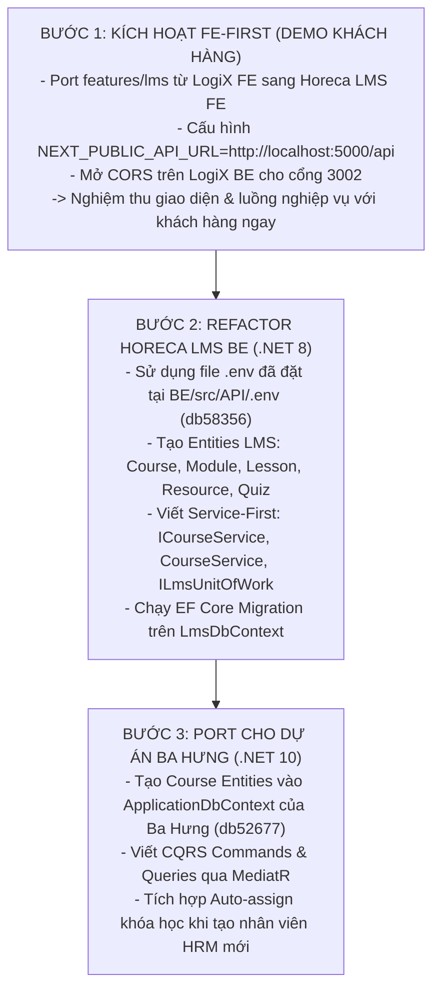

# MASTER REFACTOR STRATEGY: LOGIX TO C# (.NET)
# CHIẾN LƯỢC TỔNG THỂ CHUYỂN ĐỔI CHỨC NĂNG SANG C# (ĐÃ KHẢO SÁT SYSTEM-SOLUTION)

> **Mã tài liệu:** `PLAN-REFACTOR-2026-09-25`  
> **Chủ trì:** Multi-Agent Orchestrator (`[Doc-Agent]`, `[BE-Agent]`, `[FE-Agent]`, `[QA-QC-Agent]`)  
> **Dự án nguồn:** [[e:/Projects/DigiFnb/Practice/LogiX|LogiX Monorepo (Node.js/Prisma/Next.js 16)]]  
> **Dự án đích 1:** [[e:/Projects/DigiFnb/BAHUNG_PROJECTS/GD3/erp-corporation-api-v2|Ba Hưng ERP API]] (.NET 10, C# 14, CQRS MediatR, Unified DB `db52677`)  
> **Dự án đích 2:** [[e:/Projects/DigiFnb/Horeca/LMS-Solution|Horeca LMS-Solution]] (.NET 8, Clean Architecture, Service-First, Multi-DB `db58356`)  
> **Hệ thống điều phối:** [[e:/Projects/DigiFnb/Horeca/System-Solution|Horeca System-Solution]] (.NET 8, Single Source of Truth Auth & SSO)  

---

## 1. BỐI CẢNH & PHÂN ĐỊNH 2 NHÁNH TRIỂN KHAI

Hệ thống LMS được phát triển và kiểm thử toàn diện trên **LogiX**, sau đó chuyển giao sang nền tảng C# cho 2 khách hàng với 2 mô hình kiến trúc hoàn toàn độc lập:

```mermaid
graph TD
    subgraph LOGIX ["🚀 LogiX Monorepo (Nghiệp vụ thực tế đã hoàn thiện)"]
        LX_PRISMA["Prisma ORM (PostgreSQL)"]
        LX_BE["Express BE (:5000)"]
        LX_FE["Next.js 16 FE (:3000)"]
        LX_FE <--> LX_BE <--> LX_PRISMA
    end

    subgraph HORECA_ECOSYSTEM ["🏢 Hệ sinh thái Horeca (Cùng chung thư mục e:/Projects/DigiFnb/Horeca/)"]
        SYS_FE["System FE (:3000)"]
        SYS_BE["System BE (:7000)<br/>db58351 (Auth / Roles / Seeder)"]
        HC_FE["Horeca LMS FE (:3002)<br/>(Next.js 16 / Tailwind v4)"]
        HC_BE["Horeca LMS BE (:7002)<br/>(.NET 8 / Service-First)"]
        HC_DB[("Lms DB (SQL Server)<br/>db58356.databaseasp.net")]
        
        SYS_FE -->|SSO ?token=...| HC_FE
        HC_FE -->|Pha 1: Tạm thời demo| LX_BE
        HC_FE -.->|Pha 2: Bàn giao C#| HC_BE
        HC_BE --> HC_DB
        HC_BE -.->|Local JWT Verify (Chung JWT_KEY)| SYS_BE
    end

    subgraph BAHUNG_PROJECT ["🥖 Dự án Ba Hưng (Độc lập 100%)"]
        BH_BE["Ba Hưng API (:7000)<br/>(.NET 10 / CQRS MediatR)"]
        BH_DB[("Unified DB<br/>db52677.databaseasp.net")]
        BH_MODULES["Chỉ làm 2 phân hệ:<br/>HRM + LMS"]
        
        BH_BE --> BH_DB
        BH_BE --- BH_MODULES
    end

    LOGIX ==>|Port UI & Kết nối Demo| HC_FE
    LOGIX ==>|Port Entities & Handlers| BH_BE
```

---

## 2. NHỮNG PHÁT HIỆN THEN CHỐT TỪ `SYSTEM-SOLUTION`

Sau khi bạn kéo code `System-Solution` về thư mục `e:\Projects\DigiFnb\Horeca\System-Solution`, chúng tôi đã phân tích và làm sáng tỏ 100% các câu hỏi về luồng dữ liệu:

1. **Cơ chế SSO Liên phân hệ đã có sẵn trong FE**:
   - Khi đăng nhập tại `System FE (:3000)`, người dùng bấm chuyển sang `Digione LMS (:3002)` tại `AppSidebar.tsx`.
   - Hệ thống tự động chuyển hướng: `window.location.href = http://localhost:3002?token=<accessToken>`.
   - Hook `useAuth()` tại `LMS FE (:3002)` tự động bắt `?token=`, giải mã thông tin User, lưu vào LocalStorage/Cookie và làm sạch URL. **Không cần code lại cơ chế SSO!**

2. **Cơ chế Phân quyền Local không tốn tài nguyên mạng**:
   - `System-Solution/BE` tạo JWT token chứa toàn bộ `sub`, `roles`, `permissions`, `data_scope`.
   - `LMS-Solution/BE` dùng chung `JWT_KEY` và `JWT_ISSUER`. Khi request gọi đến LMS BE, `CurrentUserService` và `AuthorizationService` đọc thẳng claims từ token trong bộ nhớ.
   - **LMS BE không cần gọi HTTP về System BE khi kiểm tra quyền**, đảm bảo tốc độ tối đa!

3. **Mã quyền LMS đã được khai báo trong Seeder**:
   - File `SystemFoundationSeeder.cs` của System đã có sẵn: `lms_courses.view`, `lms_courses.manage`, `lms_students.manage`.
   - Được gán mặc định cho vai trò `SUPERADMIN`. Ta chỉ cần mở rộng thêm các quyền con khi cần.

---

## 3. LỘ TRÌNH THỰC THI 3 BƯỚC AN TOÀN & HIỆU QUẢ



---

## 4. HỆ THỐNG TÀI LIỆU LIÊN KẾT

- [[01-MIGRATION-SYNC-LEDGER|01. Sổ tay đối soát tính năng & Schema Drift (Sync Ledger)]]
- [[02-BE-ARCHITECTURE-COMPARISON|02. So sánh chi tiết kỹ thuật BE: Ba Hưng vs Horeca vs System]]
- [[03-FE-MIGRATION-AND-DEMO-PLAN|03. Kế hoạch Port FE Horeca & Kết nối Demo giai đoạn]]
- [[04-ENV-AND-INFRASTRUCTURE-AUDIT|04. Phân tích chi tiết ENV, Database MonsterASP & Hạ tầng tích hợp]]
