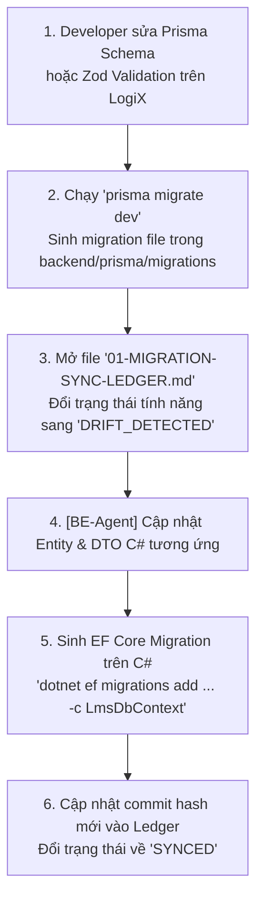

# MIGRATION SYNC LEDGER & SCHEMA DRIFT TRACKER
# SỔ TAY ĐỐI SOÁT TÍNH NĂNG & THAY ĐỔI SCHEMA (LOGIX ➔ C#)

> **Mục tiêu:** Lưu trữ vết thay đổi (Context Preservation), kiểm soát sai lệch Schema (Drift Detection) giữa LogiX (Node.js/Prisma) và C# (.NET).  
> **Cập nhật lần cuối:** 2026-09-25  

---

## 1. NGUYÊN TẮC HOẠT ĐỘNG CỦA SYNC LEDGER

Khi một lập trình viên hoặc AI Agent thực hiện chuyển đổi một tính năng từ LogiX sang C#:
1. **Lấy Snapshot từ LogiX**: Ghi lại mã commit của LogiX tại thời điểm chuyển (`Source Commit Hash`).
2. **Liệt kê Model / Schema liên quan**: Liệt kê các model trong `schema.prisma` và các field quan trọng.
3. **Đối chiếu Contract (Zod Schema ➔ DTO C#)**: Đảm bảo request body & response body khớp 100% về mặt kiểu dữ liệu và validation rules.
4. **Ghi mã commit C#**: Commit sang repo C# theo chuẩn tag `feat(lms-port): [Mã-CN] ...`.
5. **Cập nhật trạng thái**: Chuyển trạng thái từ `TODO` ➔ `IN_PROGRESS` ➔ `SYNCED`.
6. **Khi LogiX có cập nhật mới**: Đổi trạng thái thành `DRIFT_DETECTED` kèm ghi chú các trường/logic mới cần bù đắp.

---

## 2. QUY CHUẨN COMMIT MESSAGE KHI PORT SANG C#

Bắt buộc tuân thủ cú pháp sau để truy vết lịch sử:
```bash
feat(lms-port): [MÃ_TÍNH_NĂNG] Tóm tắt nội dung chuyển đổi từ LogiX@<COMMIT_HASH>

- Source Files: <Đường dẫn file bên LogiX>
- Prisma Models: <Tên các bảng DB bên LogiX>
- C# Targets: <Đường dẫn file Entity / Service / Controller bên C#>
- Schema Version: <Mã hash hoặc ghi chú field mới>
```

*Ví dụ thực tế:*
```bash
feat(lms-port): [LMS-001] Port Course Entity & Settings from LogiX@3f8a92b

- Source Files: backend/src/modules/courses/course.service.ts, frontend/src/features/lms/course-create
- Prisma Models: Course (crs_courses), Category (crs_categories)
- C# Targets: Domain/Entities/Lms/Courses/Course.cs, Application/DTOs/Courses/
- Schema Version: Added isCommercial, allowManualEnrollment, progressionMode
```

---

## 3. MA TRẬN ĐỐI SOÁT TÍNH NĂNG (FEATURE SYNC MATRIX)

| Mã CN | Tên tính năng | Nguồn LogiX (Source) | LogiX Commit | Đích C# Horeca (Service-First) | Đích C# Ba Hưng (CQRS) | Trạng thái | Ghi chú & Cảnh báo Schema |
| :--- | :--- | :--- | :--- | :--- | :--- | :--- | :--- |
| **`LMS-001`** | **Khởi tạo & Cài đặt khóa học** (Course Meta, Scope, Pricing) | `Course`, `crs_courses`, `course.schemas.ts` | `Pending` | `Entities/Lms/Courses/Course.cs`, `ICourseService.cs` | `Features/Courses/CreateCourse/`, `Course.cs` | `TODO` | Hỗ trợ 2 scope: `INTERNAL_ONLY` (Ba Hưng) & `PARTNER_GIFT / COMMERCIAL` (Horeca). |
| **`LMS-002`** | **Đề cương bài học** (Curriculum Builder: Modules, Lessons) | `CourseModule`, `Lesson`, `crs_modules`, `crs_lessons` | `Pending` | `Entities/Lms/Courses/CourseModule.cs`, `Lesson.cs` | `Features/Curriculum/` | `TODO` | Hỗ trợ các loại bài học: `VIDEO`, `ARTICLE`, `QUIZ`, `PDF`, `CHECKLIST`. |
| **`LMS-003`** | **Tài nguyên bài học** (Lesson Resources: Links & Files) | `LessonResource`, `crs_lesson_resources` | `Pending` | `Entities/Lms/Courses/LessonResource.cs` | `Features/Resources/` | `TODO` | Đã chuẩn hóa: `EXTERNAL_LINK` (link ngoài) & `DOCUMENT_FILE` (file đính kèm tải về). Miễn phí 100% cho người đã vào bài học. |
| **`LMS-004`** | **Ngân hàng câu hỏi & Khảo thí** (Question Bank & Quiz) | `QuestionBank`, `Question`, `crs_quizzes` | `Pending` | `Entities/Lms/Quizzes/` | `Features/Quizzes/` | `TODO` | Loại câu hỏi: Single Choice, Multiple Choice, True/False, Short Answer. |
| **`LMS-005`** | **Gán khóa học & Tuyển sinh** (Auto-rule & Manual B2B) | `CourseTargetStore`, `CourseEnrollment` | `Pending` | `CourseEnrollmentService.cs` | `Features/Enrollments/` | `TODO` | Ba Hưng: Auto-assign theo Store/Dept/Position từ HRM. Horeca: Thêm Manual Enrollment (LMS-005) sau khi khách CK ngoài. |
| **`LMS-006`** | **Theo dõi tiến độ & Thi sát hạch** (Progress & Attempts) | `LessonProgress`, `QuizAttempt` | `Pending` | `ILmsProgressService.cs` | `Features/Progress/` | `TODO` | Điều kiện hoàn thành: Tỷ lệ xem video >= 80% hoặc điểm Quiz >= passScore. |
| **`LMS-007`** | **Chứng chỉ đào tạo** (User Certificates & Verification) | `UserCertificate`, `CertificateTemplate` | `Pending` | `ICertificateService.cs` | `Features/Certificates/` | `TODO` | Sinh mã chứng chỉ duy nhất (Certificate Code) để quét QR xác thực trực tuyến. |

---

## 4. CHI TIẾT ĐỐI ỨNG DỮ LIỆU LOGIX ➔ C# (DATA MAPPING SPECIFICATION)

### 4.1. Entity: Khóa học (`Course` / `crs_courses`)

| Field LogiX (Prisma) | Kiểu dữ liệu Prisma | Field C# (EF Core) | Kiểu dữ liệu C# | Ghi chú chuyển đổi |
| :--- | :--- | :--- | :--- | :--- |
| `id` | `String @id @default(uuid())` | `Id` | `Guid` | C# dùng `Guid` chuẩn (thay cho text uuid). |
| `code` | `String @unique` | `Code` | `string` | Độ dài tối đa 50 ký tự, có Index Unique. |
| `title` | `String` | `Title` | `string` | Độ dài tối đa 250 ký tự. |
| `description` | `String?` | `Description` | `string?` | Văn bản mô tả tổng quan khóa học. |
| `thumbnail` | `String?` | `ThumbnailUrl` | `string?` | Đường dẫn ảnh đại diện khóa học. |
| `progressionMode` | `ProgressionMode @default(FREE)` | `ProgressionMode` | `CourseProgressionMode` | Enum: `Free`, `LinearLesson`, `LinearModule`. |
| `level` | `CourseLevel @default(BEGINNER)` | `Level` | `CourseLevel` | Enum: `Beginner`, `Intermediate`, `Advanced`. |
| `isInternal` | `Boolean @default(true)` | `IsInternal` | `bool` | Cờ khóa học nội bộ (dành riêng Ba Hưng và nội bộ Horeca). |
| `isCommercial` | `Boolean @default(false)` | `IsCommercial` | `bool` | Cờ khóa học thương mại (bán hoặc tặng kèm khách máy Horeca). |
| `originalPrice` | `Int?` | `OriginalPrice` | `decimal?` | Giá gốc niêm yết (VND). |
| `salePrice` | `Int?` | `SalePrice` | `decimal?` | Giá ưu đãi / giá bán lẻ. |
| `allowManualEnrollment`| `Boolean @default(false)` | `AllowManualEnrollment`| `bool` | Cho phép Sale/HR cấp tay khóa học sau khi khách chuyển khoản. |
| `instructorId` | `String?` | `InstructorId` | `Guid?` | **Horeca:** Chỉ lưu Guid thuần (KHÔNG Foreign Key xuyên DB sang System). Lưu thêm `InstructorNameSnapshot: string?`. |
| `status` | `String @default("DRAFT")` | `Status` | `CourseStatus` | Enum: `Draft`, `Published`, `Archived`. |
| `createdAt` | `DateTime @default(now())` | `CreatedAt` | `DateTime` | Tự động điền qua `AuditSaveChangesInterceptor`. |
| `updatedAt` | `DateTime @updatedAt` | `UpdatedAt` | `DateTime?` | Tự động điền qua `AuditSaveChangesInterceptor`. |
| `createdBy` | `String?` | `CreatedBy` | `Guid?` | Lấy từ `sub` JWT Claim của CurrentUser. |
| `updatedBy` | `String?` | `UpdatedBy` | `Guid?` | Lấy từ `sub` JWT Claim của CurrentUser. |

---

## 5. QUY TRÌNH PHÁT HIỆN & ĐỒNG BỘ CẬP NHẬT MỚI (CHANGE DETECTION WORKFLOW)

Khi LogiX có cập nhật nghiệp vụ hoặc chỉnh sửa bảng:

