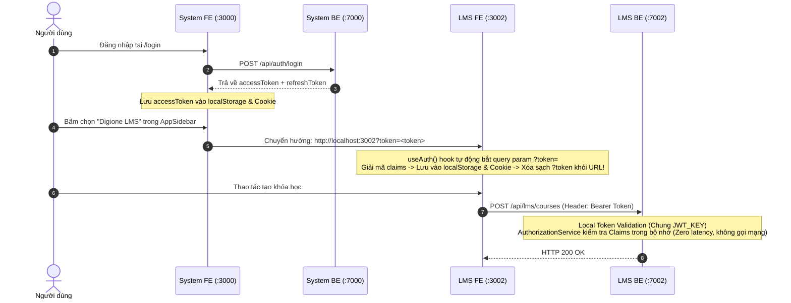

# SO SÁNH KIẾN TRÚC BACKEND & MÔ HÌNH DỮ LIỆU
# BE ARCHITECTURE COMPARISON: BAHUNG VS HORECA (ĐÃ KHẢO SÁT SYSTEM-SOLUTION)

> **Mã tài liệu:** `BE-COMP-2026-09-25`  
> **Chủ trì:** Multi-Agent Orchestrator (`[Doc-Agent]`, `[BE-Agent]`)  
> **Cập nhật:** Đã kiểm tra trực tiếp mã nguồn `System-Solution` tại [[e:/Projects/DigiFnb/Horeca/System-Solution|Horeca/System-Solution]]  

---

## 1. BẢNG MA TRẬN SO SÁNH KỸ THUẬT TOÀN DIỆN

```mermaid
graph LR
    subgraph BAHUNG_FLOW ["🥖 Luồng Ba Hưng (CQRS)"]
        BH_C["Controller"] -->|ISender.Send| BH_CMD["Command/Query"]
        BH_CMD --> BH_H["Handler"]
        BH_H --> BH_UOW["IUnitOfWork"]
        BH_UOW --> BH_DB["ApplicationDbContext<br/>(Unified DB db52677)"]
        BH_H -.->|AuditInterceptor| BH_LOG["AuditLogs Table<br/>(Diff Old/New JSON)"]
    end

    subgraph HORECA_FLOW ["🏢 Luồng Horeca (Service-First + System Auth)"]
        SYS_BE["System API (:7000)<br/>db58351"] -->|TokenService| JWT["JWT Bearer Token<br/>(Claims: sub, roles, perms, scope)"]
        JWT --> HC_C["LMS Controller (:7002)"]
        HC_C -->|[AuthorizePermission]| HC_AUTH["AuthorizationService<br/>(Local In-Memory Claims)"]
        HC_AUTH --> HC_S["ICourseService"]
        HC_S --> HC_SI["CourseService"]
        HC_SI --> HC_UOW["ILmsUnitOfWork"]
        HC_UOW --> HC_DB["LmsDbContext<br/>(Only Write LMS db58356)"]
        HC_SI -.->|Read-Only AsNoTracking| HC_SYS["SystemDbContext<br/>(db58351)"]
    end
```

| Thành phần kỹ thuật | Dự án Ba Hưng (`erp-corporation-api-v2`) | Dự án Horeca (`LMS-Solution/BE`) | Hệ thống System (`System-Solution/BE`) |
| :--- | :--- | :--- | :--- |
| **Công nghệ & Framework** | .NET 10 / C# 14 | .NET 8 / C# 12 | .NET 8 / C# 12 |
| **ORM / Data Access** | EF Core 10 | EF Core 8 + Dapper | EF Core 8 |
| **Database Host** | SQL Server: `db52677.databaseasp.net` | SQL Server: `db58356.databaseasp.net` (LMS) | SQL Server: `db58351.databaseasp.net` (System) |
| **Mô hình Database** | **1 Database duy nhất** cho toàn bộ hệ thống | **9 Databases vật lý riêng biệt** cho 9 phân hệ | Quản lý bảng gốc `System_*` |
| **Tổ chức Luồng Code** | **CQRS với MediatR** | **Service-First Clean Architecture** | **Service-First Clean Architecture** |
| **Base Entity** | `EntityBase<T>`, `AuditableEntityBase<T>` | `BaseEntity` (Guid Id) | `BaseEntity` (Guid Id) |
| **Cơ chế Audit Trail** | Bảng `AuditLog` chi tiết + `AuditInterceptor` lưu Old/New Values | `AuditSaveChangesInterceptor` (CreatedAt/By, UpdatedAt/By) | `AuditSaveChangesInterceptor` + `EnsureAuditLogTableAsync` |
| **Cơ chế Xác thực** | Bảng `Users`, `Roles` trong cùng 1 DB | **Không có bảng User**: Đọc qua JWT Token | **Gốc phát hành Token** (`TokenService.cs`) |
| **Phân quyền** | RBAC trong DB | **PBAC qua Claims**: `AuthorizationService.cs` kiểm tra in-memory từ JWT | Quản lý `System_Permissions`, `System_RolePermissions` |

---

## 2. KẾT QUẢ KHẢO SÁT TRỰC TIẾP `SYSTEM-SOLUTION`

### 2.1. Cơ chế SSO Chuyển User từ System sang LMS (Đã có sẵn 100%)
Qua phân tích mã nguồn thực tế tại `System-Solution/FE` và `LMS-Solution/FE`, cơ chế SSO liên phân hệ đã được thiết kế hoàn chỉnh:



### 2.2. Cấu trúc Claims trong JWT Token (`TokenService.cs`)
File `System-Solution/BE/src/Infrastructure/Implementations/Services/TokenService.cs` sinh token chứa đầy đủ:
- `sub`: `user.Id` (Guid người dùng).
- `name`: `user.Username`.
- `email`: `user.Email`.
- `fullname`: `user.FullName`.
- `tenant_id`: `user.TenantId`.
- `branch_id`: `user.DefaultBranchId`.
- `data_scope`: `user.DataScope` (`All`, `Branch`, `Department`, `Self`).
- `is_super_admin`: `true` / `false`.
- `roles`: Mảng các vai trò (`SUPERADMIN`, `DIRECTOR`, `HR_MANAGER`, `STORE_MANAGER`, `STAFF`...).
- `permissions`: Mảng các mã quyền (Ví dụ: `lms_courses.view`, `lms_courses.manage`, `lms_students.manage`).

### 2.3. Danh mục Quyền LMS đã có sẵn trong `SystemFoundationSeeder.cs`
Trong `System-Solution/BE/src/Infrastructure/Persistence/SystemFoundationSeeder.cs`, 3 quyền cơ sở của LMS đã được đăng ký và gán mặc định cho `SUPERADMIN`:
1. `lms_courses.view` - "Xem khóa học" (Xem danh sách khóa đào tạo).
2. `lms_courses.manage` - "Quản lý khóa học & Video" (Tạo và chỉnh sửa bài giảng).
3. `lms_students.manage` - "Quản lý học viên & Tiến độ" (Theo dõi lộ trình học tập).

> **Đề xuất bổ sung**: Khi LMS mở rộng sâu, ta có thể bổ sung vào Seeder của System các quyền chi tiết hơn:
> - `lms_curriculum.manage` (Đề cương bài học, Modules, Lessons, Resources).
> - `lms_quizzes.manage` (Ngân hàng câu hỏi & Bài thi khảo thí).
> - `lms_certificates.manage` (Cấp và quản lý chứng chỉ).

---

## 3. ĐÁNH GIÁ VỀ DỰ ÁN BA HƯNG

- Ba Hưng hoàn toàn **độc lập** với hệ thống 9 phân hệ của Horeca.
- Ba Hưng chỉ cần phát triển 2 module: **HRM** và **LMS** trong một Solution/Database duy nhất (`db52677.public.databaseasp.net`).
- Do đó, ta không cần lo lắng về System SSO hay Cross-DB cho Ba Hưng. Logic LMS sẽ được port vào theo chuẩn **CQRS MediatR** gọn gàng, kế thừa `AuditableEntityBase` và lưu audit log chi tiết.
