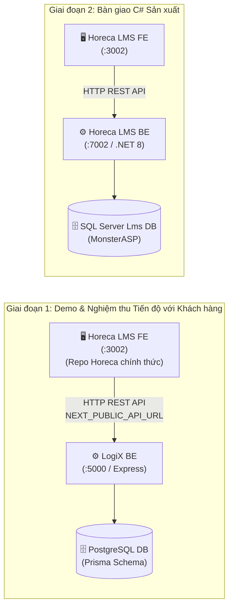

# KẾ HOẠCH PORT FRONTEND & DEMO KHÁCH HÀNG GIAI ĐOẠN 1
# FE MIGRATION & INTERIM DEMO PLAN (LOGIX ➔ HORECA LMS FE)

> **Mã tài liệu:** `FE-PLAN-2026-09-25`  
> **Chủ trì:** Multi-Agent Orchestrator (`[Doc-Agent]`, `[FE-Agent]`)  
> **Nguồn UI:** [[e:/Projects/DigiFnb/Practice/LogiX/frontend|LogiX Frontend]]  
> **Đích UI:** [[e:/Projects/DigiFnb/Horeca/LMS-Solution/FE|Horeca LMS-Solution FE]]  
> **Backend tạm thời:** [[e:/Projects/DigiFnb/Practice/LogiX/backend|LogiX Express BE (:5000)]]  

---

## 1. MỤC TIÊU & CHIẾN LƯỢC: "FE FIRST — DEMO NGAY"

Đúng như nhận định chính xác của bạn:
1. **Frontend không có rào cản kiến trúc phức tạp**: Cả hai dự án `LogiX/frontend` và `Horeca/LMS-Solution/FE` đều được xây dựng trên cùng một nền tảng:
   - **Next.js 16 (App Router)** + **React 19**
   - **Tailwind CSS v4** (CSS variable-driven)
   - **TanStack React Query v5** + **Zustand**
   - **Radix UI / shadcn/ui** + **Lucide Icons** + **Sonner Toasts**
2. **Kịp tiến độ Review nghiệm thu với Khách Hàng**:
   - Thay vì phải chờ Backend C# viết lại toàn bộ 9 DbContexts, Entities, Services, ta **đẩy toàn bộ giao diện LMS hoàn chỉnh sang Horeca LMS FE trước**.
   - Cấu hình cho `Horeca LMS FE (:3002)` gọi API sang `LogiX BE (:5000)`.
   - Khách hàng và ban giám đốc có thể mở trực tiếp URL của dự án Horeca để trải nghiệm toàn bộ luồng nghiệp vụ thực tế (Tạo khóa học, Thiết kế đề cương bài học, Xem video bài giảng, Làm bài thi Quiz, Theo dõi tiến độ học tập).



---

## 2. KIỂM TOÁN THƯ VIỆN & PHIÊN BẢN (DEPENDENCY AUDIT)

Đối chiếu giữa `LogiX/frontend/package.json` và `Horeca/LMS-Solution/FE/package.json`:

| Thư viện | LogiX FE | Horeca LMS FE | Đánh giá & Hành động |
| :--- | :--- | :--- | :--- |
| **Next.js** | `16.2.9` | `16.2.9` | ✅ Trùng khớp 100% |
| **React / React-DOM** | `19.2.4` | `19.2.4` | ✅ Trùng khớp 100% |
| **Tailwind CSS** | `^4.0` | `^4.0` | ✅ Trùng khớp 100% |
| **@tanstack/react-query** | `^5.101.0` | `^5.101.0` | ✅ Trùng khớp 100% |
| **Zustand** | `^5.0.14` | `^5.0.14` | ✅ Trùng khớp 100% |
| **Zod** | `^4.4.3` | `^4.4.3` | ✅ Trùng khớp 100% |
| **React Hook Form** | `^7.78.0` | `^7.78.0` | ✅ Trùng khớp 100% |
| **@dnd-kit (Core, Sortable)**| Có (Kéo thả bài học) | `^6.3.1` / `^10.0.0` | ✅ Đã có sẵn trong Horeca FE |
| **Sonner / Lucide** | Có | `^2.0.7` / `^1.17.0` | ✅ Đã có sẵn |

> **Kết luận**: Horeca LMS FE đã có đầy đủ 100% các thư viện cần thiết, không có xung đột phiên bản nghiêm trọng!

---

## 3. CÁC MODULE FRONTEND SẼ PORT SANG HORECA LMS FE

Từ thư mục `Practice/LogiX/frontend/src/features/lms/`, ta sẽ chuyển nguyên vẹn các module nghiệp vụ chất lượng cao sang `Horeca/LMS-Solution/FE/src/features/lms/`:

1. **`course-create/`**: Form tạo khóa học đa bước (Thông tin cơ bản, cấu hình Scope nội bộ vs thương mại, phân loại đối tượng, thiết lập giá bán/tặng).
2. **`courses-admin/`**: Bảng danh sách khóa học hoàn chỉnh (Bộ lọc Search + Debounce, Filter theo Category/Status/Level, Pagination, Inline Action buttons).
3. **`course-editor/`**: Trình soạn thảo đề cương bài học (Curriculum Builder), hỗ trợ kéo thả Dnd-Kit sắp xếp vị trí Chương (Module) và Bài học (Lesson).
4. **`course-targeting/`**: Modal gán khóa học theo Chi nhánh / Phòng ban / Chức danh (Auto-Rule) và cấp tay (Manual).
5. **`question-banks/`**: Ngân hàng câu hỏi khảo thí (Trắc nghiệm đơn, nhiều đáp án, đúng/sai, tự luận ngắn).
6. **`progress-tracking/`**: Bảng theo dõi tiến độ học viên, tỷ lệ hoàn thành video, kết quả thi sát hạch.
7. **`certificates-admin/`**: Quản lý cấp chứng chỉ và mẫu phôi chứng chỉ.

---

## 4. CẤU HÌNH KẾT NỐI HORECA FE VỚI LOGIX BE

### 4.1. File cấu hình môi trường Frontend (`Horeca/LMS-Solution/FE/.env.local`)
Tạo file `.env.local` trong thư mục `FE`:
```env
# URL trỏ tạm thời về Backend LogiX
NEXT_PUBLIC_API_URL=http://localhost:5000/api

# Cổng chạy Frontend Horeca
PORT=3002
```

### 4.2. Cấu hình CORS trên Backend LogiX (`LogiX/backend`)
Đảm bảo Backend của LogiX chấp nhận nguồn gọi từ cổng `3002` của Horeca LMS FE:
```typescript
// Trong backend/src/index.ts hoặc cors middleware
const allowedOrigins = [
  'http://localhost:3000', // LogiX FE
  'http://localhost:3002', // Horeca LMS FE
  'https://localhost:3002'
];
```

---

## 5. KẾ HOẠCH HÀNH ĐỘNG CỤ THỂ CHO TEAM

| Bước | Nội dung công việc | Thực hiện bởi | Trạng thái |
| :---: | :--- | :---: | :---: |
| **B1** | Tạo file `.env.local` cho Horeca LMS FE và mở CORS cổng 3002 trên LogiX BE | `[FE-Agent]` / `[BE-Agent]` | Sẵn sàng |
| **B2** | Copy trọn vẹn thư mục `src/features/lms/` từ LogiX FE sang Horeca LMS FE | `[FE-Agent]` | Sẵn sàng |
| **B3** | Cấu hình Route Pages dưới `src/app/(protected)/courses/...` trên Horeca FE | `[FE-Agent]` | Sẵn sàng |
| **B4** | Chạy `pnpm build` và `pnpm dev` trên Horeca FE kiểm tra không lỗi TypeScript | `[QA-QC-Agent]` | Chờ B3 |
| **B5** | Demo trực tiếp luồng tạo khóa học & học bài trên cổng 3002 cho khách hàng review | Toàn đội | Chờ B4 |
