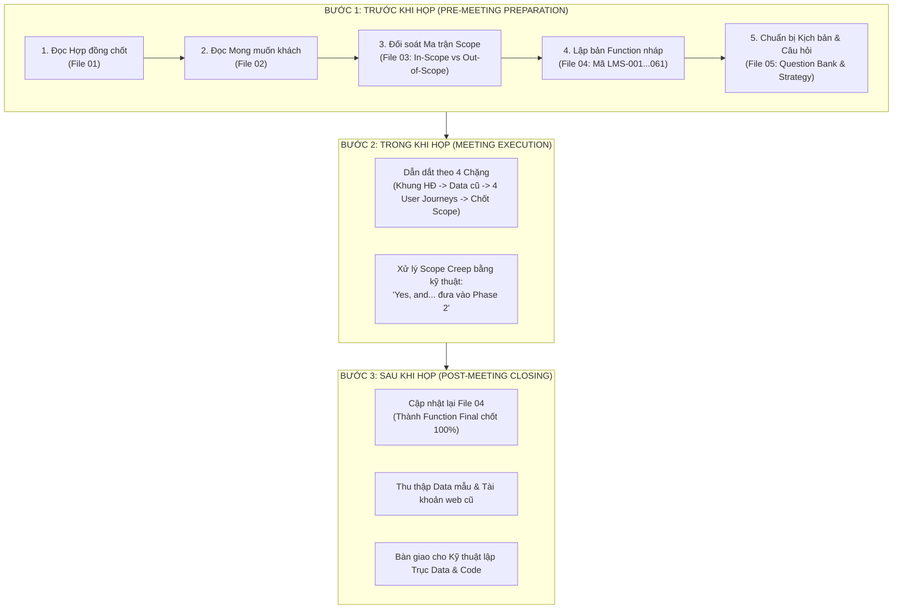

# HƯỚNG DẪN & WORKFLOW CHUẨN BỊ GẶP KHÁCH HÀNG (PILOT: MODULE LMS)

> **Mục đích:** Thiết lập quy trình BA/PM chuẩn mực để dẫn dắt cuộc họp ngày **20/08** với khách hàng Horecavn. Đảm bảo làm rõ 100% nghiệp vụ, chốt chặt phạm vi hợp đồng, kiểm soát rủi ro chuyển đổi dữ liệu và mang về danh sách tính năng sẵn sàng cho Dev triển khai.

---

## 1. TỔNG QUAN 10 MODULE HỆ THỐNG HORECAVN

| STT | Mã Module | Tên Module | Trọng tâm nghiệp vụ |
| :--- | :--- | :--- | :--- |
| 1 | **SYS** | Hệ thống nền tảng | Phân quyền, cấu hình hệ thống, Audit logs |
| 2 | **HRM** | Quản trị nhân sự | Hồ sơ, chấm công, tính lương, phòng ban |
| 3 | **LMS** | Đào tạo trực tuyến | Khóa học pha chế, video bảo mật, thi test, cấp chứng chỉ, đào tạo nội bộ *(Pilot)* |
| 4 | **CRM** | Bán hàng & Cổng đối tác | Lead, cơ hội bán hàng, hợp đồng setup quán, chăm sóc khách |
| 5 | **POS** | Bán lẻ điểm bán | Bán hàng tại cửa hàng/showroom nguyên liệu, thiết bị |
| 6 | **SCM** | Kho & Chuỗi cung ứng | Nhập xuất tồn nguyên liệu, máy pha cafe, định mức nguyên liệu |
| 7 | **FSM** | Dịch vụ kỹ thuật | Bảo hành, bảo dưỡng, sửa chữa máy móc thiết bị quán |
| 8 | **FIN** | Tài chính – Kế toán | Thu chi, công nợ nhà cung cấp/khách hàng, báo cáo P&L |
| 9 | **LOG** | Giao hàng - Vận chuyển | Điều phối đơn hàng nguyên vật liệu, tích hợp đơn vị vận chuyển |
| 10 | **MES** | Nhắn tin & Trao đổi | Chat nội bộ, thông báo thông tin đơn hàng/khóa học |

---

## 2. FLOW QUY TRÌNH CHUẨN BỊ & THU THẬP YÊU CẦU (BA WORKFLOW)

---

## 3. DANH MỤC HỒ SƠ TÀI LIỆU TRONG MODULE LMS

1. **[Thông tin doanh nghiệp.md](file:///c:/Projects/DigiFnb/Practice/LogiX/doc/Horeca/Module%20LMS/Th%C3%B4ng%20tin%20doanh%20nghi%E1%BB%87p.md)**: Tổng quan hệ sinh thái Horecavn (B2C, B2B, Academy, Consulting).
2. **[01-Chức năng đã chốt trên hợp đồng sẽ phát triển.md](file:///c:/Projects/DigiFnb/Practice/LogiX/doc/Horeca/Module%20LMS/01-Ch%E1%BB%A9c%20n%C4%83ng%20%C4%91%C3%A3%20ch%E1%BB%91t%20tr%C3%AAn%20h%E1%BB%A3p%20%C4%91%E1%BB%93ng%20s%E1%BA%BD%20ph%C3%A1t%20tri%E1%BB%83n.md)**: 25 chức năng cam kết trong hợp đồng (tập trung LMS & Data Migration web cũ).
3. **[02-Yêu cầu, mong muốn từ khách hàng (input lần 1).md](file:///c:/Projects/DigiFnb/Practice/LogiX/doc/Horeca/Module%20LMS/02-Y%C3%AAu%20c%E1%BA%A7u,%20mong%20mu%E1%BB%91n%20t%E1%BB%AB%20kh%C3%A1ch%20h%C3%A0ng%20%28input%20l%E1%BA%A7n%201%29.md)**: Nguyện vọng chi tiết của khách (Học viên, Giảng viên, Admin, AI, Video DRM...).
4. **[03-Plan phân tích nghiệp vụ dựa trên yêu cầu và chức năng.md](file:///c:/Projects/DigiFnb/Practice/LogiX/doc/Horeca/Module%20LMS/03-Plan%20ph%C3%A2n%20t%C3%ADch%20nghi%E1%BB%87p%20v%E1%BB%A5%20d%E1%BB%B1a%20tr%C3%AAn%20y%C3%AAu%20c%E1%BA%A7u%20v%C3%A0%20ch%E1%BB%A9c%20n%C4%83ng.md)**: Ma trận phân tích Scope (In-scope P1 vs Out-of-scope P2) và giải pháp bài toán di chuyển dữ liệu cũ.
5. **[04-Kế hoạch function tự vẽ (Chưa họp với khách hàng).md](file:///c:/Projects/DigiFnb/Practice/LogiX/doc/Horeca/Module%20LMS/04-K%E1%BA%BF%20ho%E1%BA%A1ch%20function%20t%E1%BB%B1%20v%E1%BA%BD%20%28Ch%C6%B0a%20h%E1%BB%8Dp%20v%E1%BB%9Bi%20kh%C3%A1ch%20h%C3%A0ng%29.md)**: Bảng đặc tả chi tiết 61 mã chức năng LMS (kèm đối tượng sử dụng, độ khó, giai đoạn).
6. **[05-Kế hoạch clear nghiệp vụ với khách hàng.md](file:///c:/Projects/DigiFnb/Practice/LogiX/doc/Horeca/Module%20LMS/05-K%E1%BA%BF%20ho%E1%BA%A1ch%20clear%20nghi%E1%BB%87p%20v%E1%BB%A5%20v%E1%BB%9Bi%20kh%C3%A1ch%20h%C3%A0ng.md)**: Kịch bản dẫn dắt cuộc họp, bộ câu hỏi phỏng vấn đào sâu 5 nhóm nghiệp vụ và checklist nghiệm thu yêu cầu.