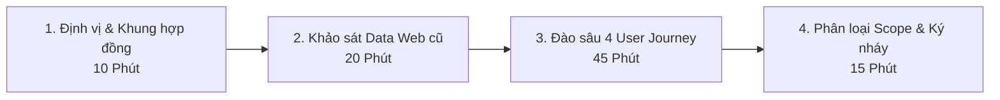

# KẾ HOẠCH & KỊCH BẢN DẪN DẮT HỌP LÀM RÕ NGHIỆP VỤ (MODULE LMS)

> **Thời gian:** 20/08 | **Đối tượng làm việc:** Ban Giám Đốc, Trưởng bộ phận Đào tạo, Phụ trách Kỹ thuật/IT bên Horecavn  
> **Mục tiêu tối thượng:** Làm chủ cuộc họp, chốt sạch các điểm mù nghiệp vụ, kiểm soát chặt phạm vi hợp đồng (không bị phình scope) và đem về bộ yêu cầu chi tiết 100% rõ ràng để Dev tiến hành code ngay.

---

## I. QUY TRÌNH HỌP 4 CHẶNG (MEETING AGENDA & TIMEBOXING)

### Chặng 1: Mở đầu & Thống nhất nguyên tắc làm việc (10 Phút)

- **Mục tiêu:** Tạo vị thế chuyên nghiệp, đưa cuộc họp đi đúng khung thời gian và định hướng theo hợp đồng 25 chức năng.
- **Câu mở đầu gợi ý:**
  > _"Chào anh/chị, buổi hôm nay mục tiêu trọng tâm của chúng ta là làm rõ toàn bộ quy trình vận hành đào tạo thực tế tại Horecavn và phương án bóc tách dữ liệu từ web cũ sang hệ thống mới. Sau buổi này, team em sẽ chuyển hóa toàn bộ thành tài liệu kỹ thuật chi tiết để hệ thống chạy chuẩn chỉ ngay từ đầu."_

### Chặng 2: Khảo sát Dữ liệu & Hệ thống cũ (Data Migration) (20 Phút)

- **Mục tiêu:** Đây là rủi ro kỹ thuật lớn nhất. Cần làm rõ cấu trúc dữ liệu hiện tại để không bị vướng mắc khi chuyển giao.

### Chặng 3: Đi sâu vào 4 Luồng Nghiệp Vụ Cốt Lõi (45 Phút)

- **Mục tiêu:** Rà soát từng bước theo trải nghiệm người dùng thực tế (User Journey) bằng bộ câu hỏi được chuẩn bị sẵn.

### Chặng 4: Tổng kết, Phân loại Scope (Phase 1 vs Phase 2) & Next Steps (15 Phút)

- **Mục tiêu:** Chốt lại những gì sẽ làm ngay ở Đợt 1 (theo hợp đồng) và ghi nhận những tính năng nâng cao (như AI, Blog chuyên sâu) vào Đợt 2. Ký xác nhận biên bản cuộc họp.

---

## II. BỘ CÂU HỎI PHỎNG VẤN ĐÀO SÂU NGHIỆP VỤ (DISCOVERY QUESTION BANK)

### 📌 Nhóm 1: Nghiệp vụ Chuyển đổi dữ liệu cũ (ƯU TIÊN SỐ 1)

1. **Hạ tầng web cũ:** Hệ thống cũ đang chạy bằng mã nguồn gì? (WordPress/WooCommerce, Laravel, custom PHP hay nền tảng LMS sẵn có như LearnPress/Moodle?)
2. **Dữ liệu Video:** Video bài giảng cũ đang lưu trữ ở đâu? (Vimeo, YouTube Unlisted, BunnyCDN, Google Drive, hay lưu trực tiếp trên Server?) Dung lượng ước tính khoảng bao nhiêu GB/TB?
3. **Chất lượng Data học viên:** Web cũ có bao nhiêu học viên? Dữ liệu tài khoản cũ bắt buộc có những trường nào (Email, SĐT, Tên)? Có trường hợp nào học viên chỉ có tài khoản đăng nhập mà không có SĐT/Email không?
4. **Tiến độ học cũ:** Web cũ có lưu chính xác % hoàn thành của từng học viên theo từng video không, hay chỉ lưu trạng thái "Đã mua / Đã kích hoạt khóa học"?
5. **Cơ chế cấp quyền truy cập:** Anh/chị có thể cấp quyền Database Read-only (hoặc xuất file SQL/CSV backup mẫu) để team kỹ thuật phân tích làm sạch dữ liệu trong tuần này được không?

---

### 📌 Nhóm 2: Nghiệp vụ Bán & Kích hoạt khóa học (Thương mại F&B)

1. **Hình thức thanh toán:** Khi khách mua khóa học online trên web mới, anh/chị muốn dùng cổng thanh toán nào chính? (Chuyển khoản quét mã VietQR tự động qua SePay/Cassie, hay VNPay, Momo?)
2. **Cơ chế kích hoạt:**
   - Khách trả tiền xong -> Hệ thống tự động kích hoạt vào học ngay lập tức đúng không?
   - Có trường hợp học viên mua trực tiếp tại trung tâm/lớp offline rồi nhân viên tạo mã kích hoạt (Voucher/Code) gửi cho khách tự nhập trên web không?
3. **Thời hạn sở hữu:** Khóa học sau khi mua có bị giới hạn thời gian học không? (Ví dụ: Sở hữu trọn đời, hay hết hạn sau 6 tháng/1 năm?)

---

### 📌 Nhóm 3: Trải nghiệm Học tập, Bài kiểm tra & Chứng chỉ

1. **Điều kiện mở bài học:** Học viên có bắt buộc phải xem hết bài 1 mới được mở bài 2 (chống tua/học tuần tự), hay được xem tự do mọi bài trong khóa?
2. **Cấu trúc bài kiểm tra (Quiz):**
   - Bài kiểm tra dạng nào? (Trắc nghiệm 1 đáp án, nhiều đáp án, hay có bài nộp tự luận/video thực hành pha chế?)
   - Điều kiện để được cấp chứng nhận là gì? (Đạt bao nhiêu % điểm thi, và phải hoàn thành 100% video bài giảng?)
3. **Mẫu chứng chỉ (Certificate):** Bên Horecavn đã có sẵn mẫu thiết kế chứng nhận (file thiết kế PDF/AI) chưa? Có cần tích hợp mã QR động để khi quét sẽ ra trang tra cứu xác thực văn bằng thật/giả không?

---

### 📌 Nhóm 4: Phân biệt Đào tạo Khách hàng (B2C/B2B) vs Đào tạo Nội bộ (HRM)

1. **Khách hàng ngoài:** Tự do đăng ký, mua khóa học nào xem khóa học đó.
2. **Nhân viên nội bộ:**
   - Nhân viên Horecavn (Barista, nhân viên setup, bán hàng, R&D) khi vào làm việc có tài khoản riêng không?
   - Khi tạo nhân viên mới bên Module HRM và gán chức danh "Barista mới", hệ thống có cần tự động gán luôn gói "Lộ trình đào tạo Onboarding Barista" cho họ không?
   - Quản lý có cần xem báo cáo: Nhân viên A đã hoàn thành bài test pha chế nào và được bao nhiêu điểm không?

---

### 📌 Nhóm 5: Bản quyền & Chống chia sẻ tài khoản (Bảo vệ nội dung F&B)

1. **Giới hạn đăng nhập:** Khi 1 học viên đăng nhập trên máy tính mới, hệ thống sẽ đá (logout) tài khoản trên máy cũ, hay cho phép tối đa 2 thiết bị?
2. **Watermark bảo mật:** Trên video phát cho học viên, anh/chị muốn hiển thị Watermark mờ gồm những thông tin gì? (Ví dụ: `Số điện thoại + Tên học viên` chạy đổi vị trí liên tục trên màn hình để chống quay lén màn hình).

---

## III. KỸ THUẬT XỬ LÝ PHÁT SINH PHẠM VI (SCOPE CREEP STRATEGY)

Trong buổi họp, khách hàng thường sẽ đề xuất thêm nhiều ý tưởng mới (như mục 5 ở file 02: _Tính năng AI trợ lý, AI sinh câu hỏi, AI tóm tắt..._).

### 💡 Công thức từ chối khéo & định hướng giai đoạn (Yes, and... Later):

- **Nguyên tắc:** Không bao giờ nói thẳng _"Hợp đồng không có nên không làm"_, mà nói: _"Tính năng này rất hay và nâng tầm hệ thống, nhưng để đảm bảo hệ thống cốt lõi và dữ liệu cũ sang chạy mượt mà đúng tiến độ khai trương, chúng ta nên chia làm 2 giai đoạn"_:
  1. **Giai đoạn 1 (Hiện tại):** Hoàn thiện 100% nền tảng LMS ổn định, bảo mật video, quản lý học viên và chuyển đổi an toàn 3000+ học viên từ web cũ sang.
  2. **Giai đoạn 2:** Kích hoạt các phân hệ AI nâng cao (AI Tutor, Auto Quiz) trên nền tảng dữ liệu đã chuẩn hóa.

---

## IV. CHECKLIST KẾT QUẢ ĐẦU RA CẦN ĐẠT SAU BUỔI HỌP (DELIVERABLES)

Khi kết thúc buổi họp, cần có trong tay:

- [ ] **Thông tin kỹ thuật web cũ:** Loại DB, nơi lưu video, thông tin liên hệ của nhân sự IT/Dev web cũ.
- [ ] **Mẫu dữ liệu thực tế (Data Dump sample):** File Excel danh sách học viên cũ, danh sách khóa học mẫu.
- [ ] **Chốt quy tắc kích hoạt & thời hạn khóa học.**
- [ ] **Chốt hình thức kiểm tra (Quiz trắc nghiệm) & Mẫu chứng chỉ PDF.**
- [ ] **Biên bản xác nhận phạm vi Phase 1 (Chốt lại danh sách ~45 sub-functions trong file 04 để Dev triển khai).**
