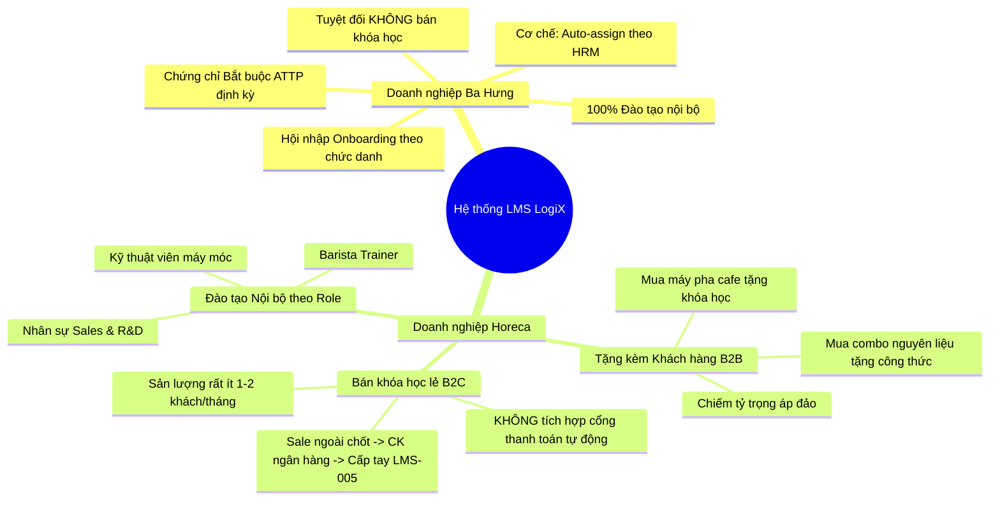
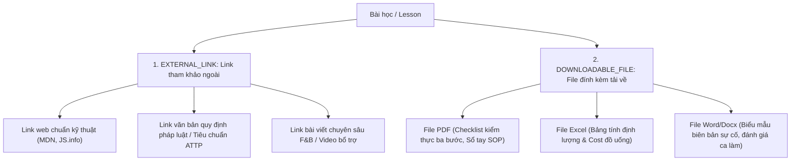
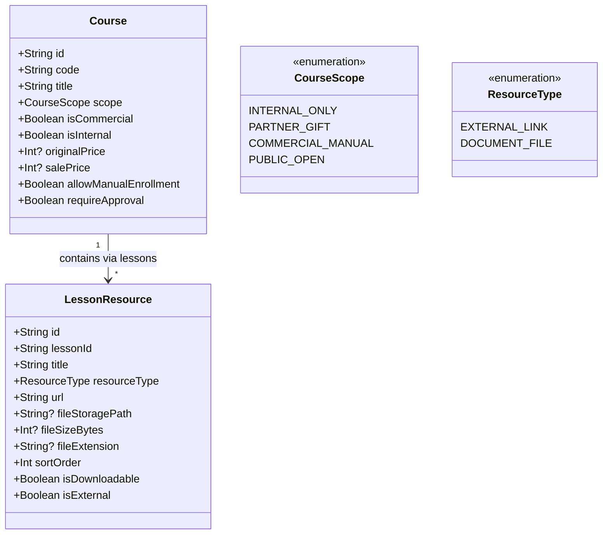

# PHÂN TÍCH NGHIỆP VỤ HORECA VS BA HƯNG & THIẾT KẾ KIẾN TRÚC TÀI NGUYÊN BÀI HỌC (LESSON RESOURCES)

> **Mã tài liệu:** `LMS-SPEC-2026-09-22`  
> **Người thực hiện:** Multi-Agent Orchestrator `[Doc-Agent]` + `[BE-Agent]` + `[FE-Agent]`  
> **Áp dụng cho:** Hệ thống LogiX Monorepo (Nền tảng đào tạo LMS dùng chung cho Chuỗi F&B Ba Hưng và Hệ sinh thái Horeca)  
> **Trạng thái:** Chốt yêu cầu sau phỏng vấn nghiệp vụ thực tế (Họp chị Thư - Horeca & Ban Giám đốc Ba Hưng)

---

## 1. SO SÁNH BẢN CHẤT NGHIỆP VỤ: HORECA VS BA HƯNG



### 1.1 Bảng so sánh ma trận nghiệp vụ chi tiết

| Tiêu chí | Doanh nghiệp Ba Hưng | Doanh nghiệp Horeca | Điểm chung & Thiết kế hệ thống LogiX |
| :--- | :--- | :--- | :--- |
| **Bản chất doanh nghiệp** | Chuỗi sản xuất & bán lẻ bánh mì, đồ uống F&B | Cung cấp trọn bộ giải pháp F&B (Máy móc + Nguyên liệu + Setup + Academy) | Đều thuộc khối ngành F&B, chú trọng chuẩn hóa quy trình SOP và công thức pha chế/chế biến. |
| **Mục tiêu đào tạo** | **100% Nội bộ**: Onboarding nhân viên mới, đào tạo SOP tay nghề và khảo thí chứng chỉ ATTP định kỳ. | **Hỗn hợp 3 đối tượng**: (1) Nội bộ theo role; (2) Tặng khóa học cho đối tác/khách mua máy; (3) Bán lẻ khóa học. | Dùng chung **User & Role Engine**: User có cờ `userType` (`EMPLOYEE` vs `CUSTOMER`). |
| **Thương mại & Bán khóa học** | **Tuyệt đối KHÔNG**: Không kinh doanh giáo dục ra ngoài. | **Có bán lẻ nhưng sản lượng cực thấp** (1–2 khách/tháng). Khóa học chủ yếu là **quà tặng kèm thiết bị/nguyên liệu**. | **KHÔNG cần tích hợp Cổng thanh toán (VNPay/Momo/Giỏ hàng)** vì chi phí duy trì cao, đối soát phức tạp, không hiệu quả ROI. |
| **Luồng cấp tài khoản & khóa học** | **Tự động (Auto-Rule)**: Gán nhân viên vào Cửa hàng/Phòng ban/Chức danh -> Hệ thống tự động kích hoạt khóa học bắt buộc. | **(1) Tự động** cho nhân viên nội bộ.<br>**(2) Thủ công (Manual - LMS-005)**: Sale chốt ngoài -> Khách CK ngân hàng -> Nhân sự xác nhận tiền -> Tạo user & cấp khóa học bằng tay. | Cả 2 đều dùng chung 2 cơ chế cấp phát: **Auto-assign rule** (theo Department + Position) và **Manual Assign Modal** (dành cho Admin/Manager). |
| **Cơ chế kiểm soát học** | Học tuần tự (`LINEAR_LESSON`), video chống tua (`allowSeeking = false`), khảo thí quiz đạt chuẩn mới cấp chứng chỉ. | Cho phép cả linh hoạt (`FREE`) và tuần tự (`LINEAR`). Cần chứng chỉ cho học viên hoàn thành khóa đào tạo nghề. | Hệ thống cung cấp cấu hình `progressionMode` linh hoạt trên từng khóa học. |

---

## 2. HIỆN TRẠNG HỆ THỐNG (CURRENT STATE AUDIT)

### 2.1 Hiện trạng các loại bài học (Lesson Types)
- **Trên Giao diện Curriculum Builder (`ModuleCard.tsx`)**: Đang có **3 nút tạo bài học trực quan 1-click**:
  1. `+ Video` (`VIDEO`): Gắn link YouTube hoặc tải video bài giảng lên hệ thống.
  2. `+ Chữ/SOP` (`ARTICLE`): Nhập văn bản hướng dẫn nghiệp vụ, tiêu chuẩn SOP, công thức hoặc tài liệu đọc.
  3. `+ Quiz` (`QUIZ`): Bài thi trắc nghiệm kiến thức, tính điểm đạt và điều kiện qua bài.
- **Trong Database (`schema.prisma` - `enum LessonType`)**:
  - Đã có định nghĩa: `VIDEO`, `ARTICLE`, `QUIZ`, `PDF`, `CHECKLIST`.
  - Trên thực tế: `PDF` hiện đang gộp vào bài học dạng tài liệu, còn `CHECKLIST` là tính năng mở rộng của SOP.

### 2.2 Hiện trạng Tài nguyên bài học (Lesson Resources)
> [!IMPORTANT]
> **Kết luận kiểm toán:** Backend **CHƯA CÓ** bất kỳ bảng/model cơ sở dữ liệu nào cho Resource/Attachment trong `schema.prisma`.  
> - Bảng `crs_lessons` hiện chỉ có duy nhất trường đơn `documentUrl String?`.  
> - Toàn bộ danh sách tài nguyên trong màn hình Player (`Phishing Red Flags Checklist.pdf`, `Sample Phishing Email Analysis.pdf`, `Incident Report Template.docx`) hiện tại là **100% MOCK DATA** (`MOCK_RESOURCES` trong `lesson-player.mock.ts`).

---

## 3. PHÂN TÍCH & THIẾT KẾ CẤU TRÚC TÀI NGUYÊN (LESSON RESOURCES)

Tài nguyên cho từng bài học được chuẩn hóa thành 2 nhóm chính phục vụ đúng bản chất F&B:



### 3.1 Phân tích chiến lược: Tài nguyên Miễn phí (Free) vs Nâng cao (Premium)
1. **Tài nguyên cốt lõi bài học (In-Lesson Resources) $\rightarrow$ BẮT BUỘC MIỄN PHÍ (Free / Included)**:
   - Học viên chỉ có thể mở màn hình bài học này khi họ **đã có quyền truy cập khóa học** (qua phân quyền nội bộ, được tặng quà B2B, hoặc được cấp quyền sau khi chuyển khoản).
   - Do đó, toàn bộ tài liệu PDF hướng dẫn, checklist, link tham khảo phục vụ bài học này **phải xem và tải được tự do 100%**, không tạo thêm rào cản thanh toán lẻ (Micro-paywall) gây ức chế và phức tạp hóa hệ thống.
2. **Khu vực "Recommended / Premium Resources" $\rightarrow$ BẢN CHẤT LÀ UPSELL & PARTNER LINK**:
   - Như ảnh mẫu tham khảo, mục Premium Resource / Khóa học đề xuất (giảm giá 20%, khóa học Pro) thực chất là **khối giới thiệu Upsell**:
     - Giới thiệu khóa học chuyên sâu tiếp theo của Horeca (VD: Đang học *Vận hành máy cơ bản* $\rightarrow$ Gợi ý khóa *Nghệ thuật Latte Art nâng cao*).
     - Giới thiệu liên kết đối tác / nguyên liệu chuyên dụng kèm mã ưu đãi.
   - Thiết kế hệ thống: Tách riêng khối **Tài nguyên bài học (Lesson Attachments)** và khối **Khóa học đề xuất liên quan (Related / Upsell Courses)**.

---

## 4. BỔ SUNG & CHUẨN HÓA CÁC CỜ (FLAGS) TRÊN KHÓA HỌC

Để đáp ứng cả bài toán nội bộ của Ba Hưng và bài toán đa dạng đối tác của Horeca mà không làm phình to hệ thống:



### 4.1 Chi tiết các cờ phân loại khóa học:
- **`isInternal` (Boolean)**: Khóa học chỉ dành cho nhân viên nội bộ (Hiển thị cho Ba Hưng và phòng ban Horeca).
- **`isCommercial` (Boolean)**: Khóa học thương mại có thể bán hoặc tặng đối tác ngoài.
- **`scope` / `distributionType` (Enum)**:
  - `INTERNAL_ONLY`: Chỉ nhân viên đáp ứng rule (Store / Dept / Position) mới thấy.
  - `PARTNER_GIFT`: Dùng làm quà tặng kèm khi khách mua máy móc, thiết bị, nguyên liệu.
  - `COMMERCIAL_MANUAL`: Khóa học bán lẻ (Sale ngoài $\rightarrow$ Chuyển khoản $\rightarrow$ Cấp tài khoản tay LMS-005).
  - `PUBLIC_OPEN`: Khóa học nhập môn mở tự do cho mọi học viên đã đăng ký tài khoản.
- **Trường hiển thị giá tham khảo (`originalPrice`, `salePrice`)**:
  - Dành cho hiển thị trên Landing page quảng bá khóa học của Horeca.
  - **Hành động mua (CTA Button)**: Không mở popup giỏ hàng, mà hiển thị nút **"Đăng ký tư vấn / Nhận ưu đãi"** (mở popup Zalo OA, Hotline hoặc Form để lại SĐT cho Sale gọi lại chốt đơn thủ công).

---

## 5. ĐỀ XUẤT DATABASE SCHEMA (PRISMA SCHEMA MIGRATION)

### 5.1 Thêm bảng `crs_lesson_resources`
```prisma
enum ResourceType {
  EXTERNAL_LINK
  DOCUMENT_FILE
}

model LessonResource {
  id              String       @id @default(uuid())
  lessonId        String       @map("lesson_id")
  lesson          Lesson       @relation(fields: [lessonId], references: [id], onDelete: Cascade)
  
  title           String
  description     String?
  resourceType    ResourceType @default(DOCUMENT_FILE) @map("resource_type")
  
  // URL trỏ ra web ngoài hoặc link file Supabase Storage / CDN
  url             String
  storagePath     String?      @map("storage_path")
  fileSizeBytes   Int?         @map("file_size_bytes")
  fileExtension   String?      @map("file_extension") // pdf, docx, xlsx, zip
  
  sortOrder       Int          @default(1) @map("sort_order")
  isDownloadable  Boolean      @default(true) @map("is_downloadable")
  downloadCount   Int          @default(0) @map("download_count")
  
  createdAt       DateTime     @default(now()) @map("created_at")
  updatedAt       DateTime     @default(now()) @updatedAt @map("updated_at")

  @@index([lessonId, sortOrder])
  @@map("crs_lesson_resources")
}
```

### 5.2 Cập nhật quan hệ trong `model Lesson`
```prisma
model Lesson {
  // ... các trường hiện có
  resources LessonResource[]
}
```

---

## 6. LỘ TRÌNH TRIỂN KHAI THEO 4 SUB-AGENTS

1. 📝 **`[Doc-Agent]`**: Đồng bộ tài liệu này vào `doc/Horeca/Module LMS/` và liên kết với hợp đồng 25 chức năng.
2. ⚙️ **`[BE-Agent]`**: 
   - Thêm model `LessonResource` vào `schema.prisma` và chạy Prisma migration.
   - Viết DTO + CRUD Service cho Lesson Resources (`GET /lessons/:id/resources`, `POST /lessons/:id/resources`, `DELETE /resources/:id`).
   - Cập nhật luồng LMS-005 (Cấp khóa học thủ công cho học viên đối tác/B2C).
3. 🎨 **`[FE-Agent]`**:
   - Cập nhật `LessonPlayerPage`: Thay thế `MOCK_RESOURCES` bằng API hook `useLessonResources(lessonId)`.
   - Phân biệt giao diện rõ ràng giữa **Tài liệu tải về** (icon PDF, size, nút Download) và **Liên kết ngoài** (icon External Link, tag bài viết, mở tab mới an toàn `rel="noopener noreferrer"`).
   - Bổ sung tab quản lý Resources trong Course Editor để giảng viên/admin thêm file PDF và link tham khảo.
4. 🛡️ **`[QA-QC-Agent]`**:
   - Kiểm tra phân quyền truy cập: Học viên chưa ghi danh khóa học không thể tải trực tiếp file đính kèm.
   - Kiểm tra tính toàn vẹn khi xóa bài học (`onDelete: Cascade`) để tự động xóa sạch tài nguyên liên kết.
